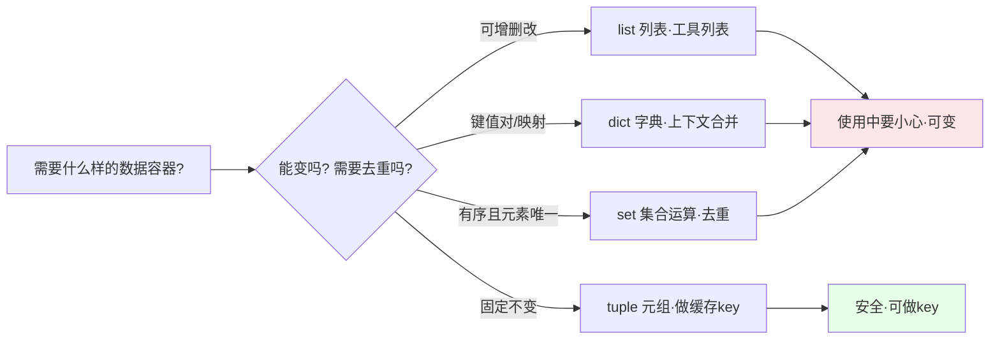
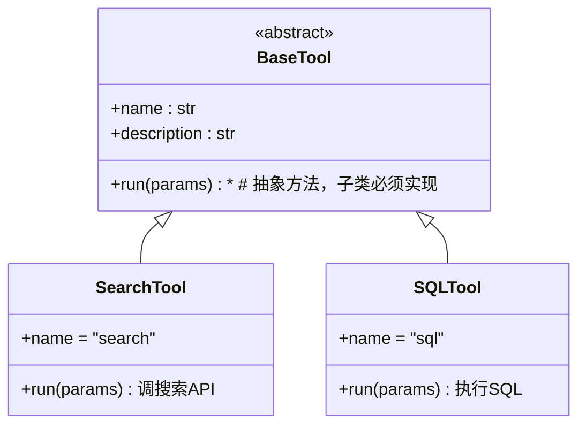

# 阶段一 · 小点 1：Python 高级编程之基础巩固

> 所属：阶段一 前置核心基础（必备打底）
> 定位：本节不教"语法怎么用"，而是教你"哪些语法坑会咬到你"。很多知识学起来简单，但只有你在 Agent 工程里踩过坑才知道为什么要这么写。

## 精简大纲

1. 核心数据结构：list / dict / set / tuple 底层特性，字典合并、集合运算、可变对象共享坑
2. 面向对象编程：类、实例、继承、多态、魔术方法
3. 异常处理：try-except-else-finally，精准捕获、因果链保留
4. 文件 IO：文本 / 二进制、大文件流式读取
5. 正则表达式：提取模型输出片段、清洗 LLM 脏输出

## 学习内容详情

### 1. 核心数据结构（Agent 高频场景）

#### 1.1 先建立一张"选型速查表"



- **字典合并**：Agent 常需把多份上下文、多个工具返回结果拼成一个大 dict，用 `{**a, **b}`（通用）或 `a | b`（Python 3.9+）。

- **集合运算**：拿"系统已注册工具名集合"和"任务需要的工具名集合"做差集，就知道还缺哪些工具。

- **可变 vs 不可变**：list/dict/set 可变（内容能改）；str/tuple/int 不可变（改一次就产生新对象）。

> ⚠️ **第一阶段最重要的一个坑（务必记住）：**
> Agent 的**状态对象**会传给很多函数。可变对象被某个函数"顺手"改掉后，其他地方根本察觉不到——这是隐性 bug 的头号来源。

```python
# ========== 反例：共享可变对象被悄悄改掉 ==========
tools = ["search", "sql"]          # 全局工具列表

def add_tool_bad(tools, new_tool):
    # 直接 append 会修改原有列表 !!
    # 调用方拿到的 tools 也被改了，连日志都查不出来是谁改的
    tools.append(new_tool)
    return tools

result = add_tool_bad(tools, "memory")
print(tools)    # ['search', 'sql', 'memory']  ← 原列表被污染了

# ========== 正例：传副本，改动不回流 ==========
def add_tool_ok(tools: list[str], new_tool: str) -> list[str]:
    # 用 list(tools) 复制一份，append 的是副本
    new_tools = list(tools)          # 副本，与原列表断开联系
    new_tools.append(new_tool)       # 只改副本
    return new_tools                 # 调用方决定要不要覆盖原变量

result = add_tool_ok(tools, "memory")
print(tools)    # ['search', 'sql']  ← 原列表毫发无损 ✅
```

- 不可变对象（tuple / str）可做 dict 的 key，常用于缓存 Agent 配置的"指纹"（如模型名+版本号组成的 key）。

```python
# 用 tuple 当 key 缓存配置计算结果
cache = {}
config_key = ("gpt-4o", "v2", 128_000)   # 元组可哈希，适合当 key
cache[config_key] = {"温度": 0.2, "max_tokens": 2048}
```

> 🔬 **深度理解 · 可变对象与不可变对象**：
> 1. **本质**：可变对象（list/dict/set）的"内容"能原地被改、内存地址（id）保持不变；不可变对象（tuple/str/int）任何"修改"都只能重新创建一个新对象，原对象绝不变化。
> 2. **机制**：不可变对象能做 dict 的 key，本质是因为它"可哈希（hashable）"——hash 值在其生命周期内恒定，dict 靠 hash 定位槽位；list 可变会导致 hash 漂移，同一个 key 会查不到，所以 Python 直接禁止它做 key（运行时抛 TypeError: unhashable type）。
> 3. **为什么重要**：Agent 的状态对象、messages、工具列表常作为入参到处传递，某函数"顺手"改动共享可变对象会造成"明明没改却变了"的隐性 bug、且难追溯。理解引用语义是把副作用控制（传副本、纯函数风格）做对的根基。
> 4. **易错点**：`a = b` 对可变对象只是拷贝"引用"而非内容，二者共享同一份数据；`tuple` 内部若嵌了可变的 list 就不可哈希，Python 不允许这种 tuple 作为 dict 的 key。

#### 1.2 推荐一个"背诵级"示例：一本书教你的字典/列表推导

```python
# 推导式 = 一行生成列表/字典，Agent 处理数据时极其常用

triples = [i * 3 for i in range(10)]     # [0, 3, 6, ...]
squares = {x: x * x for x in range(5)}   # {0:0, 1:1, 2:4, 3:9, 4:16}

# 过滤：只要偶数
evens = [x for x in range(10) if x % 2 == 0]
```

### 2. 面向对象编程（OOP）

#### 2.1 为什么 Agent 抽象层全都是"类"

框架里"工具基类 BaseTool"、"Agent 基类 BaseAgent"几乎都是同一套结构：父类写通用逻辑，子类只填差异。这就是**继承 + 多态**。



> 关键点：上层代码只依赖 `BaseTool`，不管它是 SearchTool 还是 SQLTool——这就是"多态"，让新增工具不碰老的调度逻辑。

#### 2.2 带详细注释的完整示例

```python
from typing import Any

class BaseTool:
    """所有工具的基类。定义通用接口，子类只需要补 run()。"""
    name: str = "base"               # 工具名：大模型靠它识别调用哪个工具
    description: str = ""            # 工具说明：喂给大模型，决定何时触发

    def __init__(self):
        # 《魔术方法__init__》：在对象被创建时自动执行
        print(f"[{self.name}] 工具已注册")

    def __str__(self):
        # 《魔术方法__str__》：print(对象) 时显示什么
        return f"BaseTool(name={self.name})"

    def run(self, params: dict[str, Any]) -> str:
        # 抽象逻辑：父类不实现，抛错提醒子类必须覆写
        raise NotImplementedError("子类必须实现 run()")

class SearchTool(BaseTool):
    # 继承：自动获得 name/description/__str__/run 的存在
    name = "search"
    description = "在搜索引擎中查找信息"

    def run(self, params):
        # 覆写父类的 run，实现真正的搜索逻辑
        query = params.get("query", "")
        return f"模拟搜索：{query} 返回 3 条结果"

# 多态用法：上层用基类类型接住，运行时却是子类行为
def execute_tool(tool: BaseTool, params: dict):
    # 传进来的是 BaseTool 子类，.run() 会自动分发到对应实现
    print(f"执行工具 {tool.name}")
    print(tool.run(params))  # 动态分发：搜完就查，不用在 execute 里写 if/else

execute_tool(SearchTool(), {"query": "AI Agent"})
```

> 🔬 **深度理解 · 多态与动态分发**：
> 1. **本质**：把"同一接口、不同实现"这件事做到底——上层只写一份依赖 `BaseTool.run()` 的调度逻辑，实际执行哪个子类的实现由运行时对象的真实类型决定。
> 2. **机制**：Python 没有编译期类型强约束，`execute_tool(tool: BaseTool)` 里的 `.run()` 走的是运行时方法查找（method resolution）：先在实际对象的真实类型（SearchTool）里找 run，找不到再沿继承链往父类找，找到即调用。
> 3. **为什么重要**：没有多态，新增工具就要在调度处堆 `if tool.name=="search" ... elif "sql" ...` 的分支，越加越乱；有了多态，新增工具=写一个新子类，老调度逻辑一行不改，这正是 Agent 框架里"工具即插即用"的基石。
> 4. **易错点**：多态只发生在"调用实例方法"的场景；子类若不覆写 `run()`，调用时会触发父类的 `raise NotImplementedError`，接口契约要靠自觉实现——这也是"抽象基类 + NotImplementedError"能约束子类的原理。

### 3. 异常处理

写 Agent 最常遇到三类错误：**业务错误**（参数不合法）、**网络错误**（API 超时）、**模型错误**（输出不符合预期）。笼统一把抓会让排查变成大海捞针。

```python
import requests

try:
    resp = requests.get("https://api.example.com/chat", timeout=10)
    resp.raise_for_status()                 # 状态码非 2xx 就抛 HTTPError
    data = resp.json()
except requests.exceptions.Timeout as e:
    # 精准捕获：明确是超时 → 走重试策略
    print(f"[网络错误] 请求超时: {e}")
except requests.exceptions.ConnectionError as e:
    # 精准捕获：连接失败 → 检查网络/代理
    print(f"[网络错误] 连接失败: {e}")
except requests.exceptions.HTTPError as e:
    # 精准捕获：4xx/5xx → 根据状态码给不同处理
    print(f"[HTTP错误] 状态码: {e.response.status_code}")
except ValueError as e:
    # JSON 解析失败：返回的不是合法 JSON
    print(f"[解析错误] 无法解析响应: {e}")
except Exception as e:
    # 兜底捕获：能不放就不放，但至少留日志定位
    print(f"[未知错误] 需排查: {e}")
else:
    # 没抛异常才执行：到这里才确信数据是好的
    print(f"正常拿到数据: {str(data)[:100]}")
finally:
    # 无论成功失败都执行：释放连接/资源
    print("请求结束，清理资源")
```

> **转抛的进阶写法**：内部包一层再抛上去时用 `raise ... from e`，保留完整因果链，日志里能追到最底层原因。

```python
def load_data(source: str):
    try:
        raw = open(source, "r").read()
    except FileNotFoundError as e:
        # 把"原文件没找到"这个原因带到上层，而不是吞掉
        raise RuntimeError(f"加载数据源 {source} 失败") from e
```

### 4. 文件 IO

一个大模型跑出来的"上下文文档"可能 100MB。如果一次 `read()` 全读进内存，轻则内存暴涨，重则 OOM 崩溃。**流式读取**是必须掌握的。

```python
# ========== 反例：一次全读进内存 ==========
with open("big_doc.txt", "r", encoding="utf-8") as f:
    content = f.read()          # 100MB 全进内存，危险！

# ========== 正例：每 8192 字节一块，逐块处理 ==========
CHUNK_SIZE = 8192               # 8KB 一块，够用且不爆内存
total_chars = 0
with open("big_doc.txt", "r", encoding="utf-8") as f:
    while True:
        chunk = f.read(CHUNK_SIZE)      # 每次最多读 8KB
        if not chunk:                    # 读到结尾返回空串，退出循环
            break
        total_chars += len(chunk)        # 对 chunk 做处理（分块喂给模型/统计）
        # 这里可以: 统计词频 / 分块做 embedding / 检查敏感词
print(f"共读取 {total_chars} 字符")
```

> **补充**：`with open(...)` 就是"上下文管理器"（下一节会细讲），保证无论是否异常都自动关闭文件句柄。配置文件用 `.json/.yaml/.toml` 加载时，同样建议逐字段解析而非全部 `json.load` 后无脑用。

> ⏳ **短期可不深究**：针对 `.json/.yaml/.toml` 多种配置格式的逐字段解析属于"锦上添花"，第一遍把 `with open` 流式读取握牢就够用，真接到多格式配置再补不迟。

### 5. 正则表达式

大模型返回的内容往往是"带着小尾巴的文本"，比如外面包了一层 markdown 代码块。要用正则把它清洗成能直接 `json.loads` 的纯净内容。

````python
import re
import json

raw_model_output = '''```json
{"city": "北京", "weather": "晴", "temp": 26}
```'''

# 场景1：剥掉外面的 ```json ``` 包裹（最常见）
cleaned = re.sub(r"^```json\s*|\s*```$", "", raw_model_output)
#  ^```json\s*  → 匹配开头的 ```json 和换行
#  \s*```$      → 匹配结尾的 ``` 和前面空白
#  |            → 二者任选其一替换成空
print(repr(cleaned))
# '{"city": "北京", "weather": "晴", "temp": 26}'

# 场景2：从任意文本里提取第一个 {...} 匹配的 JSON 对象
text_embedded = "模型说：天气不错，数据如下 {"city":"北京","temp":26} 请查收"
match = re.search(r"\{.*?\}", text_embedded)   # \{\} 匹配花括号，.*? 非贪婪
if match:
    data = json.loads(match.group(0))          # 解析成 python dict
    print(data["city"], data["temp"])          # 北京 26
````

> ⚠️ **贪婪 vs 非贪婪是这个坑的重灾区：**
> `.*`（贪婪）会尽可能吞更多，遇到两段无关文本会把中间全吃掉；`.*?`（非贪婪）在遇到第一个 `}` 就停下，适合提取单个 JSON 对象。包含嵌套花括号的复杂 JSON 仍会误判，更稳的做法见小点 4 的 pydantic 脏 JSON 兜底。

> ⏳ **短期可不深究**：手写正则去"剥嵌套花括号的复杂 JSON"属于偏 hacky 的冷门技巧，第一遍会用 pydantic 兜底链路即可，别在手写正则钻牛角尖。

## 本节自检

- [ ] 能说明可变 / 不可变对象对共享状态的坑，并写出"传副本"写法

- [ ] 能画出 BaseTool → SearchTool/SQLTool 的继承关系并说明多态好处

- [ ] 能写出"超时 / 连接 / HTTP / 解析 / 兜底"五段式异常处理

- [ ] 能用手写正则从带 \`\`\`json 包裹的模型输出中提取 JSON，并说清贪婪 vs 非贪婪

- [ ] 能按 8KB 分块流式读取大文件

## 本节配套思考题（快速入门的检验）

1. 你手头有个全局 `user_profile: dict`，多个工具函数都要读取并"顺手更新"，你会怎么防止污染？
2. 为什么 `tuple` 能当 dict 的 key，而 `list` 不能？提示：可哈希与可变性。
3. 模型返回 `{"request_id":"abc","answer":"...","cost":{"total":0.5}}` 里嵌套了一个字典，用一行正则提取并 `json.loads` 手写在下面，验证是否成功。

## 本节常见面试题（深度解析）

> 针对本节核心知识的面试高频点，配合"本质+机制"式理解，能让你答得既有深度又有广度。

### 面试题 1：讲一讲可变对象与不可变对象的区别，以及它们为什么会在 Agent 场景下引发共享状态 bug？
- **面试官想考察**：是真的理解引用语义，还是只会背"list 可变、tuple 不可变"；能否联系到工程里传参副作用的隐患。
- **专业作答（含深度）**：
  1. **区别的本质**：可变对象允许原地改内容（id 不变），不可变对象任何"修改"都产生新对象。关键在于 `a = b` 对可变对象拷贝的是"引用"而非"内容"。
  2. **能否做 dict key 的本质**：可哈希且 hash 不漂移才行；不可变对象 hash 稳定，可变对象 hash 会变，故被禁。
  3. **Agent 场景陷阱**：状态对象、messages、工具列表传给多个函数时，某函数直接 `append/update` 会悄悄污染所有持有该引用的调用方，且无报错难追溯。**对策**：函数内传副本（`list(tools)` / `{**d}`）或写成"不改入参、返回新值"的纯函数风格。
  4. **进阶联想**：这也是 `frozenset` 等不可变数据结构，以及函数式不可变风格在 Agent 框架里受欢迎的原因。
- **加分亮点 / 深度追问**：可主动提 `tuple` 内嵌 `list` 仍不可哈希，以及"浅拷贝 vs 深拷贝（`list(tools)` 只拷第一层）"的边界——这是很常见的追问点。

### 面试题 2：异常处理中 try / except / else / finally 各什么时候执行？转抛时为什么要用 `raise ... from e`？
- **面试官想考察**：是否只知道 try/except，能否准确说清 else/finally 语义，并在意"因果链"这类工程细节。
- **专业作答（含深度）**：
  1. **时序**：try 先执行；抛异常且被 except 命中则执行 except；**else 仅当 try 无异常时执行**（往往用于"确认拿到干净数据"后续处理）；**finally 无论成败必执行**（释放资源）。两者的差别正好是触发条件的"有/无异常"。
  2. **精准捕获优先**：分别捕获 Timeout/ConnectionError/HTTPError/ValueError，再留兜底 `except Exception`，避免"一网打尽"难排查。
  3. **因果链的意义**：直接包一层再抛会丢掉最底层原因；`raise RuntimeError(...) from e` 把原异常挂为 `__cause__`，日志里能一路追到根因。
- **加分亮点 / 深度追问**：可提 except 里裸 `raise`（不带表达式）会"原样继续抛出、不覆盖栈"，以及业务层只该抛出对调用方有意义的异常层级，这些能体现工程思维。

### 面试题 3：Agent 的 Tool 层为什么适合用"继承 + 多态"来组织？不这么做的坏处是什么？
- **面试官想考察**：是否理解抽象/多态对扩展性的价值，而非只会写类的语法。
- **专业作答（含深度）**：
  1. **统一契约**：父类 BaseTool 定义一致的 `name/description/run()` 接口，让调度层、大模型触发层都只依赖抽象接口。
  2. **扩展不碰旧码（开闭原则）**：新增工具只是新增子类，老调度逻辑无需改动——这正是"多态让 if/else 消失"的意义。
  3. **与 Agent 的衔接**：工具的 `description` 会喂给大模型决定触发时机，统一接口也便于统一注入 JSON Schema。
  4. **反面**：不用多态，调度处会堆 `if name=="search"... elif "sql"...`，加工具就要改调度函数，代码易腐化、易漏分支。
- **加分亮点 / 深度追问**：可提"组合优于继承"的讨论——统一接口不一定要靠类继承，用 Protocol/接口协议同样能实现，被追问时可说明两者的权衡。

