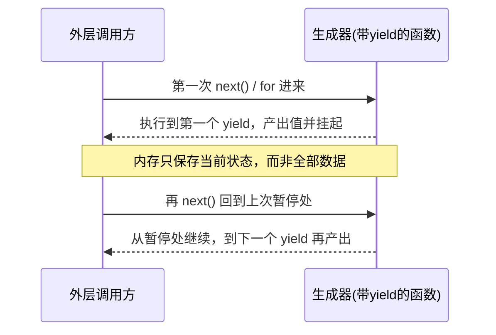
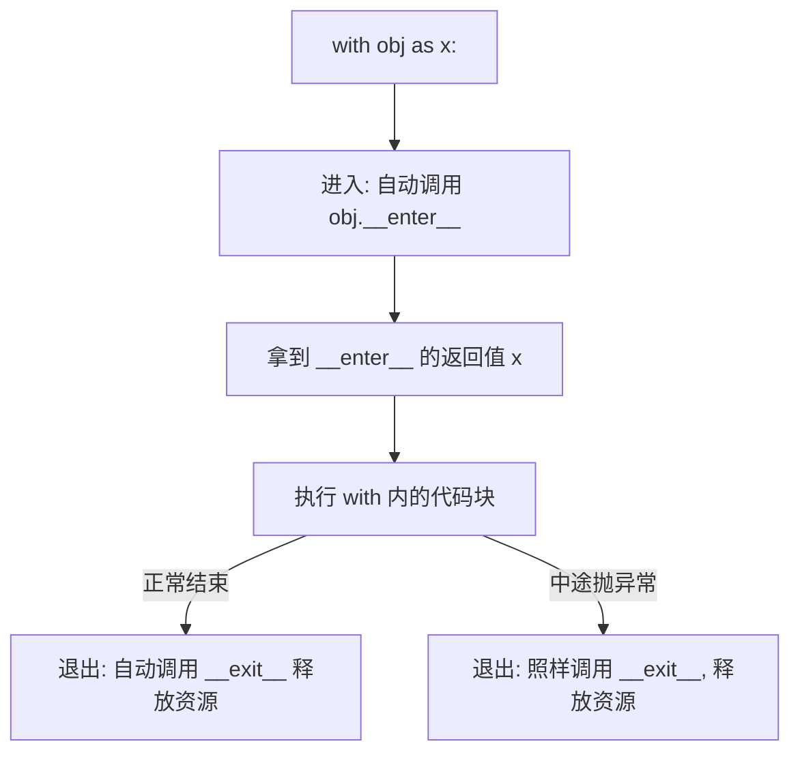
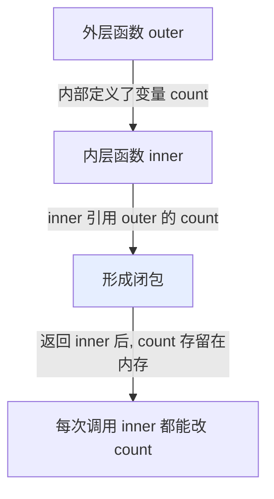

# 阶段一 · 小点 2：Python 高级编程之进阶语法

> 所属：阶段一 前置核心基础（必备打底）
> 定位：这里的语法不是"可选加分项"，而是你读懂框架源码的钥匙。LangChain 的 `@tool`、tenacity 的 `@retry`、asyncio 的流式生成——全都建立在这五样东西上。

## 精简大纲

1. 装饰器：重试、日志埋点、权限校验、函数计时
2. 生成器 / 迭代器：节省内存、流式返回、适配 SSE
3. 上下文管理器：with 语法、资源自动释放
4. 类型注解：TypedDict / Optional / Union / Literal
5. 闭包：作用域、状态保存、回调底层原理

## 学习内容详情

### 1. 装饰器（@ 语法糖）

#### 1.1 一张图看懂本质


> 一句话：`@xxx` 就是 `func = xxx(func)`。装饰器不动原函数代码，只在外面包一层"横切逻辑"。
> 为什么 Agent 里离不开它？tenacity 的 `@retry`、LangChain 的 `@tool` 全是装饰器。**看不懂装饰器就看不懂框架**。

> 🔬 **深度理解 · 装饰器（函数是一等对象）**：
> 1. **本质**：装饰器不是语法魔法，`@timer` 就是 `func = timer(func)` 的简写——函数本身是可被当参数传、可被返回的"一等对象"，装饰器做的只是"用新函数替换旧名字"。
> 2. **机制**：`timer` 接收 `func`、返回 `wrapper`；`wrapper` 内部用 `*args/**kwargs` 收集所有参数再透传给 `func`，从而在调用前后"埋点（计时 / 日志 / 重试）"而不改 `func` 源码。`functools.wraps(func)` 会把 `func` 的 `__name__/__doc__` 复制给 wrapper，否则被装饰后函数名全变 wrapper，影响日志与调试。
> 3. **为什么重要**：横切逻辑（鉴权 / 重试 / 日志）天然适合装饰器——一次声明全局生效，无需侵入每个业务函数。LangChain 的 `@tool`、tenacity 的 `@retry` 全建筑其上。
> 4. **易错点**：若省略 `functools.wraps`，stacktrace 里清一色是 `wrapper`，排查真函数极难；带参数的装饰器（`@retry(max=3)`）本质是多套一层"返回装饰器的函数"，第一遍能理解"有这层关系"即可。

```python
import time
import functools

def timer(func):
    """计时装饰器：帮任何函数统计耗时，不改原函数一行代码。"""
    @functools.wraps(func)              # 关键！保留原函数的 __name__/docstring
    def wrapper(*args, **kwargs):       # *args 收所有位置参数，**kwargs 收所有关键字参数
        start = time.perf_counter()
        result = func(*args, **kwargs)  # 调用原函数，把参数原样传进去
        elapsed = time.perf_counter() - start
        print(f"{func.__name__} 耗时 {elapsed*1000:.2f} ms")
        return result                   # 把原函数的结果原样返回
    return wrapper

# 用法一：@ 语法糖（等价于 process_data = timer(process_data)）
@timer
def process_data(n: int) -> int:
    # 这里假装做了点耗时的计算
    time.sleep(0.05)
    return n * 2

# 用法二：显式调用（二者完全等价，理解 @ 的真相）
# process_data = timer(process_data)

print(process_data(10))   # 输出: process_data 耗时约 50 ms，然后 20
```

> **带参数的装饰器（进阶）**：当装饰器本身需要参数（如 `@retry(max_attempts=3)`）时，外面要多包一层函数。不理解可以先用着，能用是目标。

```python
def retry(max_attempts: int = 3):
    """生产：给 LLM 调用加一个简易重试的装饰器。"""
    def decorator(func):
        @functools.wraps(func)
        def wrapper(*args, **kwargs):
            for attempt in range(1, max_attempts + 1):
                try:
                    return func(*args, **kwargs)   # 成功就直接返回
                except Exception as e:
                    print(f"第 {attempt} 次失败: {e}")
                    if attempt == max_attempts:    # 最后一次失败就抛出
                        raise
        return wrapper
    return decorator

@retry(max_attempts=3)
def call_llm(messages):
    # 模拟一个偶尔超时的模型调用
    import random
    if random.random() < 0.5:
        raise ConnectionError("网络抖动")
    return "模型回答成功"
```

> ⏳ **短期可不深究**：装饰器"多层包裹 + 带参数"的写法（`def retry(max_attempts)` → `def decorator(func)` → `def wrapper(...)` 这样套三层）第一遍只需看出"有这层包外层的关系"，真需要时直接用框架现成的 tenacity / LangChain 装饰器，不必自己凭空搭。

### 2. 生成器 / 迭代器（流式输出关键）

#### 2.1 yield 到底发生了什么



- 带 `yield` 的函数是**惰性求值**：不一次性全部算出，而要一个才吐一个。内存只占当前元素。
- **Agent 里的直接收益**：模型分片输出、大文档分块处理、逐条流式返回给前端。

> 🔬 **深度理解 · 生成器与惰性求值**：
> 1. **本质**：普通函数是"急迫求值"——一次算完返回；生成器是"惰性求值"——每次 `next()` 只算到下一个 `yield` 然后挂起，不把结果一次性全存内存。
> 2. **机制**：带 `yield` 的函数被调用时并不立即执行函数体，而是返回一个生成器对象；执行到 `yield` 时保存当前整个执行现场（局部变量、指令位置），`next()` 再把它恢复并继续。所以"一次性耗尽"是必然的——它记录了已算到哪，没有"重头再算"。
> 3. **为什么重要**：Agent 要处理超大文档、SSE 流式输出，若一次读全内存会 OOM；生成器把"逐个产生"与"逐个消费"解耦，让内存常驻 O(1)，这也是流式返回前端的底层依赖。
> 4. **易错点**：生成器只能用一次（耗尽后要重新创建）；`for x in gen` 结束后 gen 已空；别想在生成器里 `return` 返回值当结果返回，用 `yield from` 或迭代才对。

```python
def read_chunks(path: str, size: int = 8192):
    """生成器：逐块读取文件，一块都不浪费内存。"""
    with open(path, "r", encoding="utf-8") as f:
        while True:
            chunk = f.read(size)
            if not chunk:        # 读到末尾
                break
            yield chunk          # 产出当前块，暂停；下次从这继续

# 用法：for 循环就是反复 next() 的过程
for i, block in enumerate(read_chunks("big.txt")):
    print(f"第 {i} 块: 前10字符={block[:10]}")
    # 可以在这把 block 分块喂给模型做 embedding
    if i > 2:                   # 演示只要前 3 块
        break
```

```python
def stream_answer(text):
    """生成器：模拟模型分片输出，Agent 的 SSE 流式就长这样。"""
    words = text.split(" ")
    for w in words:
        yield w + " "          # 每次 yield 一个词，前端逐词打字机渲染

for piece in stream_answer("你好 我是 AI 助手 正在 流式 输出"):
    print(piece, end="")       # 每来一块打一个词，无换行
print()
```

> **生成器表达式**：把方括号换成圆括号就是惰性的，如 `(x*x for x in range(10))`，多用于大数据量遍历。

> ⏳ **短期可不深究**：生成器表达式的"惰性"与列表推导的"立即求值"差异第一遍只需get到方向即可，真遇到超大 range 遍历时才需要深入它省内存的细节，不用刻意背。

### 3. 上下文管理器（with）

#### 3.1 原理图



- 保证资源被释放，**即使中途抛异常也一样**。文件、数据库连接、HTTP 客户端都靠它自动关闭。
- 自定义场景用 `@contextmanager` 装饰器最简洁。

```python
from contextlib import contextmanager

@contextmanager
def open_db_conn(dsn: str):
    # 进入 with 块时执行（拿资源）
    conn = connect(dsn)                     # 假设有 connect 函数
    print("数据库连接已建立")
    try:
        yield conn                          # with xx as c 里的 c 就是它
    finally:
        # 退出 with 块（无论成败）必执行（释放资源）
        conn.close()                        # 保证连接一定被关，防泄漏
        print("数据库连接已关闭")

# 用法
with open_db_conn("postgres://...") as db:
    db.execute("SELECT 1")                  # 用连接干活，用完自动关
```

> **进阶**：`__exit__` 可以返回 True 表示"吞掉这个异常"。但 Agent 里别乱吞（连同小点1的裸 except 一样），留因果链才好排查。

> ⏳ **短期可不深究**：`__exit__` 返回 True"主动吞异常"属于偏冷门边缘能力，第一遍能说出"它有这选项、但生产别乱用"就够了，日常 `@contextmanager` + `finally` 已覆盖绝大多数释放资源的场景。

### 4. 类型注解

类型注解让你 / IDE / 静态检查工具（mypy）三者共用一套"数据形状"契约。**注意：它只做提示，运行时默认不强制**；要运行时必校验，请配合小点 4 的 pydantic。

```python
from typing import TypedDict, Optional, Union, Literal

# TypedDict：给"形状已知的 dict"结构化提示
class ToolResult(TypedDict):
    tool_name: str          # 必填字段：工具名
    output: str             # 必填字段：工具输出
    cost: Optional[float]   # 可选字段：成本，可能为 None

def run_tool(tool: str) -> ToolResult:
    # 返回字典时，IDE 会帮你检查 key 是否拼错
    return {"tool_name": tool, "output": "搜到3条", "cost": 0.01}

# Literal：把所有合法取值写死，参数只准传这些
def load_config(env: Literal["dev", "test", "prod"]) -> dict:
    # env 只准是 dev/test/prod，传其他 IDE 立刻标红
    return {"env": env}

# Union / Optional：参数类型可以是多个
def merge(a: Union[int, str], b: Optional[int] = None) -> str:
    # a 是 int 或 str；b 可为 None
    return str(a) + (str(b) if b is not None else "")
```

> **和 Agent 的关系**：LangGraph 的 `State` 定义、pydantic 的模型字段，全以这套注解为语法基础。看懂它，后面阶段三的阶段状态机就顺了。

### 5. 闭包（Closure）

#### 5.1 作用域捕获图



- 内层函数捕获外层变量并"随身携带"，即使外层函数已经返回，这份私有状态依然存在。
- **Agent 场景**：为每个会话独立计数（尝试次数、轮次）、回调绑定底层原理。

> 🔬 **深度理解 · 闭包（Closure）**：
> 1. **本质**：一个"绑定并随身携带外层自由变量"的内层函数。外层函数返回后，被捕获的变量并不会销毁，而是随内层函数继续存活。
> 2. **机制**：函数对象的 `__closure__` 里存着被捕获变量的 cells；内层读外层变量可直接读；若要**修改**必须写 `nonlocal`（声明"我改的是外层那个变量"），否则 Python 认为你在内层新建同名局部变量→触发 `UnboundLocalError`。
> 3. **为什么重要**：为每个会话/Action 维护独立私有状态（计数、轮次）而不污染全局，正是闭包典型用法；它也是装饰器、回调、事件驱动的底层原理。
> 4. **易错点**：闭包捕获的是变量"本身"（cell）而非"值快照"——若在循环里造闭包并期待它们分别记住每一次的 `i`，会因为都引用同一个 cell 而全部指向最终值；要修正可用默认参数绑定或工厂函数。

```python
def make_counter():
    """闭包工厂：给每个会话生成一个独立的计数器。"""
    count = 0                       # 外层私有变量
    def inc():
        nonlocal count              # 关键！声明"我要改外层变量"，否则 UnboundLocalError
        count += 1
        return count
    return inc                      # 返回内层函数，count 被它带走

sessionA_counter = make_counter()   # 会话A的独立计数
sessionB_counter = make_counter()   # 会话B的独立计数(与A互不影响)

print(sessionA_counter())           # 1
print(sessionA_counter())           # 2
print(sessionB_counter())           # 1  ← B 从自己的 0 开始，不受 A 影响
```

> ⚠️ **最常见的报错**：内层函数直接 `count += 1` 而不写 `nonlocal count`，会报 `UnboundLocalError: local variable 'count' referenced before assignment`。因为 Python 认为你在内层局部新建了一个同名变量。记住：**要改外层就得 `nonlocal`**。

## 本节自检

- [ ] 能手写一个计时装饰器（含 `functools.wraps`），并解释 `@tool` 大致在做什么
- [ ] 能写一个 yield 生成器逐块读取大文件，并说清它为何省内存
- [ ] 会用 `@contextmanager` 保证资源被释放，即使抛异常
- [ ] 能说出 TypedDict / Literal / Optional 各自解决什么问题
- [ ] 能解释闭包为何能"携带"私有状态，并知道何时要写 `nonlocal`

## 本节配套思考题（快速入门的检验）

1. 去掉代码里的 `@functools.wraps(func)`，观察被装饰函数的 `__name__` 变成了什么，为什么框架里几乎都保留它？
2. `next(gen)` 和 `for x in gen` 都怎么推进生成器？生成器"用一次就耗尽"，你该如何理解？
3. 写一个闭包：让多次调用依次返回 0,1,1,2,3,5...（斐波那契），并说明它如何"记住"上一步状态。

## 本节常见面试题（深度解析）

> 针对本节核心知识的面试高频点，配合"本质+机制"式理解，能让你答得既有深度又有广度。

### 面试题 1：装饰器的本质是什么？为什么 `@functools.wraps(func)` 几乎不可或缺？
- **面试官想考察**：是否真正看透 `@` 只是语法糖、装饰器=函数一等对象的复用，而不是背模板。
- **专业作答（含深度）**：
  1. **本质**：`@timer` 等价于 `func = timer(func)`——函数是可传参、可返回的一等对象，装饰器用"新函数替换旧名字"，不动原函数源码地注入横切逻辑。
  2. **机制**：`timer(func)` 返回 wrapper；wrapper 用 `*args/**kwargs` 透传参数并在前后埋点；`return result` 保证调用方拿到原结果。
  3. **wraps 的必要性**：不写 `functools.wraps`，被装饰函数的 `__name__/__doc__` 会变成 wrapper 的，导致日志、堆栈、文档全部失真，极难排查。
  4. **Agent 联系**：tenacity `@retry`、LangChain `@tool` 都是它，理解了装饰器才看得懂框架。
- **加分亮点 / 深度追问**：可主动提"带参数装饰器 = 再包一层"的写法，以及装饰器执行时机发生在"定义时而非调用时"，这两个点常被继续追问。

### 面试题 2：为什么生成器能省内存？"生成器用一次就耗尽"该如何理解？
- **面试官想考察**：是否理解惰性求值与执行现场保存，而非只会用 `yield`。
- **专业作答（含深度）**：
  1. **省内存的本质**：惰性求值，每次 `next()` 只算到下一个 `yield`，内存常驻 O(1)，不像列表一次全装。
  2. **耗尽的原因**：生成器保存"已执行到哪"的执行现场（局部变量+指令位置），单向向前推进，不能回头，故只能消费一次。
  3. **场景**：大文档分块、SSE 流式推送、逐 token 渲染——都是"产生"与"消费"解耦的体现。
  4. **权衡**：省内存的代价是"不可随机访问、只能顺序、用过即废"；需要多次遍历就重新创建。
- **加分亮点 / 深度追问**：可提 `yield from`、`send`/`close` 等进阶能力，并说明"迭代器协议（__iter__/__next__）"是生成器背后的统一抽象。

### 面试题 3：闭包里为什么有时要用 `nonlocal`？不写会怎样？
- **面试官想考察**：是否真正理解 LEGB 作用域规则与闭包捕获机制，而不是背 UnboundLocalError。
- **专业作答（含深度）**：
  1. **捕获机制**：内层引用外层变量会被包进 `__closure__` 的 cell，成为"自由变量"，外部函数都返回了它还能存活。
  2. **nonlocal 的必要性**：读外层变量可直接读；但一旦在内存函数里对它做赋值（`count += 1`），Python 默认把它当作"新建局部变量"，与 cell 中的外层变量冲突→`UnboundLocalError`。写 `nonlocal count` 明确声明"我改的就是那层变量"，才允许修改被捕获的 cell。
  3. **为何不用 global**：global 改的是模块级全局，闭包强调的是"随函数实例独立携带的私有状态"——用 nonlocal 才能让每个会话/计数各自独立。
  4. **联系**：装饰器的状态保持、回调绑定、会话计数器、流式游标，都可借闭包实现。
- **加分亮点 / 深度追问**：可提"闭包捕获的是引用而非快照"这个陷阱——循环中造闭包共享同一 cell 会全部指向最终值，可引导讨论默认参数绑定等解法。