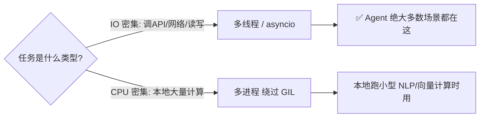
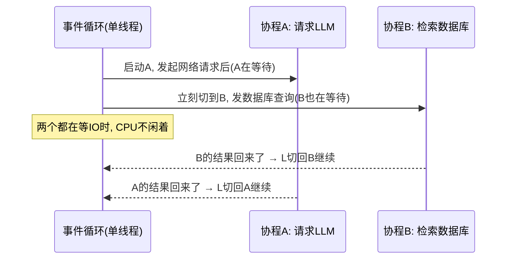
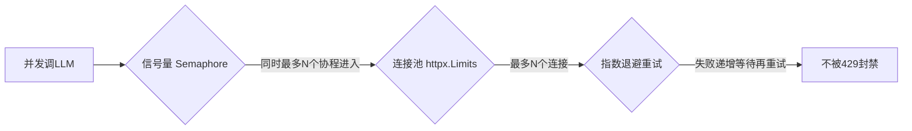

# 阶段一 · 小点 3：Python 高级编程之并发与异步

> 所属：阶段一 前置核心基础（Agent 高频痛点）
> 定位：Agent 的本质工作就是"大量地调大模型 API / 检索数据库"。串行一个个来会慢得没法看，但并发一上来又会被服务商 429 限流封禁。这一节教你如何在"快"与"别被封"之间取平衡。

## 精简大纲

1. 多线程 / 多进程适用场景：IO 密集 vs CPU 密集
2. asyncio 异步编程：事件循环、协程、任务、await
3. aiohttp / httpx：异步 HTTP 请求、超时、连接池、重试
4. Agent 实战痛点：限流、超时、SSE 流式解析、断流处理

## 学习内容详情

### 1. 线程 / 进程选型

#### 1.1 一张图看懂选型



- **IO 密集**（大模型 API 调用、网络请求、数据库查询）→ 多线程 / asyncio。因为等待 IO 时 CPU 是空闲的，可以让别的任务插空跑。
- **CPU 密集**（本地跑小型 NLP 计算、密集矩阵运算）→ 才用多进程去利用多核。
- **GIL**：CPython 的全局解释器锁，同一时刻只允许一个线程执行 Python 字节码，所以多线程**无法**并行利用多核。但 IO 等待时会释放 GIL，多线程仍能提速。

> 🔬 **深度理解 · GIL（全局解释器锁）**：
> 1. **本质**：CPython 解释器内部的一把互斥锁，保证**同一时刻只有一条 Python 字节码被执行**。它是为保护解释器的内存管理（引用计数）设计的，属于解释器实现层面的约束，而非 Python 语言本身必备。
> 2. **机制**：线程在执行 Python 代码前必须先抢到 GIL；一旦遇到 IO 阻塞（等网络/等磁盘）或解释器做了固定时间片轮转，就释放 GIL 让别人跑。因此多线程能"并发"，但真·并行（同时用两个核）做不到。
> 3. **为什么重要**：这直接决定了 Agent 用线程/asyncio 做 IO 密集是对的选择——等待 API 响应时 GIL 空闲别人能插空；但 CPU 密集（本地矩阵计算）用线程会互相抢锁无收益，得用多进程绕开。
> 4. **易错点**：别以为"起了 N 个线程 = 快 N 倍"——纯 CPU 计算时 GIL 让多线程反而有切换开销；也别把 GIL 当成"线程安全"的挡箭牌，跨线程共享可变对象依然要上锁。

> **结论**：Agent 日常场景（调 API / 检索 / 写库）优先线程与 asyncio，别上进程池——进程开销大、通信麻烦，性价比低。

> ⏳ **短期可不深究**：多进程绕过 GIL 的细节与进程间通信（IPC/队列/共享内存）成本第一遍只需知道"Agent 主线走线程/asyncio、进程留给 CPU 密集计算"即可，真遇到并行矩阵计算再深挖。

### 2. asyncio 核心概念

#### 2.1 事件循环在做什么



- **事件循环**：单线程里不断轮询"谁就绪了就执行谁"，`asyncio.run()` 启动。
- **协程**：`async def` 定义的函数，在等待 IO 时**主动让出**执行权。
- **await**：暂停当前协程等结果，期间事件循环去跑别的协程。
- **并发 vs 并行**：并发是"交替处理"（单核也能做，asyncio 就是这个）；并行是"同一时刻多核真同时做"。

> 🔬 **深度理解 · 事件循环与并发（Event Loop）**：
> 1. **本质**：单线程里靠"就绪调度"把多个协程交替执行——谁在等 IO 就挂起谁，谁的结果回来了就继续谁。核心是**把"等 IO"这种本就空闲的时光拿去做别的**。
> 2. **机制**：一个事件循环维护"待执行协程队列 + IO 完成后回调触发"的调度表；协程遇到 `await` 就把控制权交还循环，循环去跑其他就绪协程，IO 完成再把它塞回可执行区。全程只有一条线程，无需内核级上下文切换，开销极小。
> 3. **为什么重要**：Agent 要同时发起大量 LLM/检索/写库调用，串行会慢到不能看；事件循环让"等待中的并发"几乎零成本，是异步 Agent 高吞吐的引擎。
> 4. **易错点**：`await asyncio.gather(...)` 里只要有一个协程里同步阻塞（如 `time.sleep` 或 CPU 密集计算），整个事件循环就卡住、其他所有协程一起停——异步不是"并行"，本质仍是单线程的协作式调度。

> ⚠️ 别混淆：并发说的是"能同时进行多个任务"（依赖交替），并行说的是"同一时刻物理上同时做"（依赖多核）。asyncio 是并发式，不是并行式。

```python
import asyncio

async def fetch(llm: str, delay: float):
    """模拟一个需要等待的模型调用。async def = 这是一个协程。"""
    print(f"开始请求 {llm}")
    await asyncio.sleep(delay)        # 模拟网络耗时; await 期间让出CPU
    print(f"{llm} 返回了")
    return f"{llm} 的答案"

async def main():
    # asyncio.gather: 把多个协程并发地跑，谁快谁先完成
    results = await asyncio.gather(
        fetch("GPT-4o", 0.3),     # 发3个请求
        fetch("Claude", 0.2),
        fetch("DeepSeek", 0.1),
    )
    print("全部完成:", results)

asyncio.run(main())   # 入口: 只能在这启动一次事件循环
```

> 输出顺序会看到 "GPT-4o 开始 / Claude 开始 / DeepSeek 开始 / DeepSeek 返回 / Claude 返回 / GPT-4o 返回"，证明它们是并发而非一个个排队。

### 3. 并发控制与限流（Agent 必考）

#### 3.1 三道限流闸



- **信号量（Semaphore）**：并发"许可证"，同时最多 N 个协程进入。这是第一道限流闸——并发太高服务商会 429 封你。
- **连接池**：`httpx.Limits(max_connections=N)` 控制池大小，第二道闸。
- **指数退避**：重试间隔按 1s→2s→4s 翻倍，避免"全体同时重试"造成重试风暴。tenacity 是它的声明式写法（见小点 4）。

```python
import asyncio
import httpx

async def call_llm(client, sem, prompt: str):
    """带信号量保护的模型调用。"""
    async with sem:                      # 进门前先抢"许可证"，抢不到就等
        resp = await client.post(
            url="https://api.example.com/chat",
            json={"messages": [{"role": "user", "content": prompt}]},
            timeout=30.0,                # 单请求超时30秒
        )
        resp.raise_for_status()          # 非2xx 抛异常走重试
        return resp.json()

async def main():
    # 信号量: 同一时刻最多 5 个协程在跑
    sem = asyncio.Semaphore(5)
    # 连接池: 最多同时 5 个连接
    limits = httpx.Limits(max_connections=5, max_keepalive_connections=5)
    prompts = [f"第{i}个问题" for i in range(20)]

    async with httpx.AsyncClient(limits=limits, timeout=30.0) as client:
        tasks = [call_llm(client, sem, p) for p in prompts]
        results = await asyncio.gather(*tasks, return_exceptions=True)

    # return_exceptions=True → 单个失败不会拖垮整批
    ok = [r for r in results if not isinstance(r, Exception)]
    print(f"成功 {len(ok)} / 总数 {len(results)}")

asyncio.run(main())
```

### 4. 坑点提醒

- **异步函数里不能直接 `time.sleep`**，它会阻塞整个事件循环，别的协程全卡住。用 `await asyncio.sleep()`。
- **异步调同步（阻塞）代码会卡死事件循环** → 用 `await loop.run_in_executor(None, sync_func, args)` 甩到线程池。

> ⏳ **短期可不深究**：`run_in_executor` 把同步阻塞代码甩到线程池这类"异步与同步桥接"的冷门写法，第一遍知道"有它就别让阻塞代码堵住事件循环"即可，实际项目里优先让库提供原生异步接口（如 `httpx.AsyncClient`）更省心。
- **同步调异步** → 用 `asyncio.run(coroutine)` 包一层。
- 并发过高触发服务商限流 → 信号量 + 指数退避重试组合使用（见上）。

### 5. Agent 场景实战痛点

#### 5.1 流式 SSE 解析 + 断流处理

```python
import httpx

async def stream_chat(client, messages):
    """
    流式调用: 逐块接收模型输出, 实时转给前端。
    SSE(Server-Sent Events) 是服务端→客户端单向的流式协议。
    """
    try:
        async with client.stream(
            "POST", "https://api.example.com/chat",
            json={"messages": messages, "stream": True},
            timeout=httpx.Timeout(60.0, connect=10.0),  # 总超时60s
        ) as resp:
            async for line in resp.aiter_lines():       # 逐行读SSE
                if not line.startswith("data:"):
                    continue                            # 跳过心跳/注释
                payload = line[5:].strip()              # 去掉 "data: " 前缀
                if payload == "[DONE]":
                    break                               # 结束标记
                # 这里把 payload 解析后逐块 yield 给前端 (打字机效果)
                yield payload
    except httpx.ReadTimeout as e:
        # 断流兜底: 20s 没数据 = 服务端卡住 → 提示重试
        yield "抱歉, 响应超时, 请重试 " + str(e)

async def main():
    async with httpx.AsyncClient() as client:
        async for chunk in stream_chat(client, [{"role": "user", "content": "讲个故事"}]):
            print(chunk, end="")        # 前端在这里实时渲染
        print()

asyncio.run(main())
```

#### 5.2 单一函数完整串联

```python
async def run_all():
    sem = asyncio.Semaphore(5)          # ① 信号量限并发
    limits = httpx.Limits(max_connections=5)  # ② 连接池
    async with httpx.AsyncClient(limits=limits) as client:
        # ③ 用 asyncio.wait_for 给单个任务设硬超时
        try:
            result = await asyncio.wait_for(
                call_llm(client, sem, "你好"),
                timeout=60,
            )
            print(result)
        except asyncio.TimeoutError:
            print("该次调用超时, 已放弃此请求")
```

## 本节自检

- [ ] 能说清信号量 + 连接池 + 退避重试三道限流闸
- [ ] 能用 httpx 异步并发调用 LLM 并处理超时与限流
- [ ] 能写出带 `asyncio.wait_for` 硬超时的异步调用
- [ ] 能说清并发 vs 并行、以及异步里为什么不许用 `time.sleep`

## 本节配套思考题（快速入门的检验）

1. 如果 20 个请求并发调一个"每秒只准 5 个请求"的服务，不控并发会发生什么？加信号量后呢？
2. `asyncio.gather(*tasks, return_exceptions=True)` 里的 `return_exceptions=True` 是干什么的？去掉会有什么风险？
3. 前端看到"打字机流式输出"，后端用的哪一种技术（流式读取 / SSE）？说说两者区别。

## 本节常见面试题（深度解析）

> 针对本节核心知识的面试高频点，配合"本质+机制"式理解，能让你答得既有深度又有广度。

### 面试题 1：并发和并行有什么区别？asyncio 属于哪一种，为什么？
- **面试官想考察**：能否区分"并发/并行"两个概念，且理解 asyncio 单线程协作式调度的本质。
- **专业作答（含深度）**：
  1. **定义区别**：并发是"能同时推进多个任务"，靠交替完成（单核可做）；并行是"同一时刻多个核真同时做"，靠物理多核。
  2. **asyncio 属并发**：事件循环单线程跑多个协程，靠 `await` 让出/恢复控制权，是"逻辑上的并发、物理上的串行"。
  3. **为何适合 Agent**：LLM/检索/写库都是 IO 等待型，等待时光本被浪费，事件循环把它用来跑别的协程，近乎零开销地显著提吞吐。
  4. **边界**：纯 CPU 计算放在 asyncio 里没有收益反而卡死循环，此类才需多进程并行。
- **加分亮点 / 深度追问**：可补充"协作式调度 vs 抢占式调度"之分——协程是自己主动 `await` 让出（协作式），线程依赖操作系统的抢占；并点明 IO 如何被注册回调。

### 面试题 2：Python 多线程为什么不能加速 CPU 密集计算？GIL 到底是解决什么问题？
- **面试官想考察**：是否透过"GIL 让多线程白搭"的结论，理解 GIL 的成因与适用边界。
- **专业作答（含深度）**：
  1. **GIL 是什么**：CPython 解释器的一把互斥锁，同一时刻只允许一条 Python 字节码运行，为保护解释器内存的引用计数安全而设。
  2. **对线程的影响**：CPU 密集时多线程互相抢锁、频繁切换，不仅不加速甚至更慢；IO 密集时线程在等待中释放 GIL，多线程才有收益。
  3. **破解方式**：用多进程（每个进程独立解释器各有 GIL）或 C 扩展（如 numpy）在底层释放 GIL 并行。
  4. **Agent 启示**：调 API/写库属 IO 密集，用线程/asyncio 是对的；本地小规模矩阵/分词若吃 CPU，应交给带 GIL 释放的库或进程池。
- **加分亮点 / 深度追问**：可提 Python 3.13 的可选自由线程（no-GIL）构建与 GIL 调度切换（每若干指令 tick 或遇到 IO），体现对新动态的关注。

### 面试题 3：要给"秒级并发调用 LLM 不漏不掉"设计保护，你会怎么做？为什么三层都要有？
- **面试官想考察**：能否把信号量、连接池、指数退避组合成一个完整方案，并说清各自管哪一层。
- **专业作答（含深度）**：
  1. **信号量（Semaphore）**：控制同时进入的协程数，防止并发一哄而上触发服务商 429 封禁——管"应用层并发量"。
  2. **连接池（httpx.Limits）**：限制客户端同时建立的连接数，避免连接风暴打爆本机/服务端——管"传输层连接数"。
  3. **指数退避重试（tenacity/wait_exponential）**：失败后按 1s→2s→4s 递增等待再试，打散重试时刻，避免"全体同时重试"造成重试风暴——管"失败后的节奏"。
  4. **正确性**：只重试网络/限流类异常，参数错误重试一万次也是错；单请求用 `asyncio.wait_for` 设硬超时，拒绝无限等待。
- **加分亮点 / 深度追问**：可提"漏桶/令牌桶"等通用限流算法、分布式限流（多实例共享配额需 Redis 计数），以及 429 响应头里的 `Retry-After` 优先级的处理。