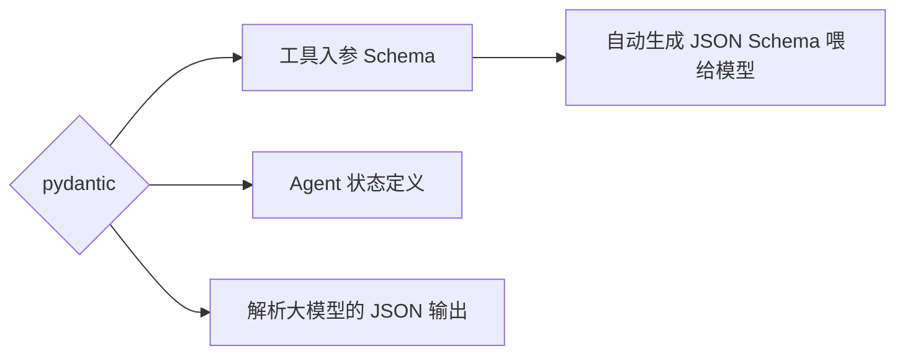
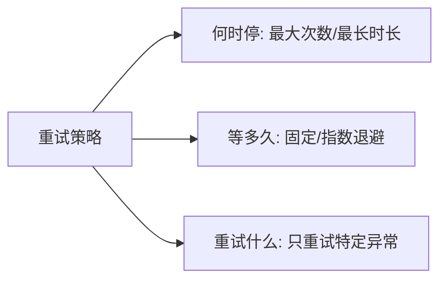
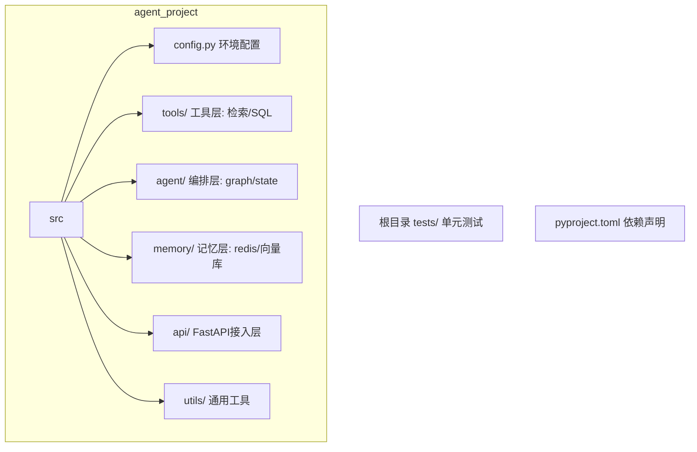

# 阶段一 · 小点 4：Python 高级编程之核心工具库

> 所属：阶段一 前置核心基础（必备打底）
> 定位：理论的尽头是"能稳定地干活"。这一节教你四件几乎每个 Agent 项目都用的工具：pydantic（数据校验）、loguru（日志）、tenacity（重试）、python-dotenv（配置）。它们是后面所有阶段的地基。

## 精简大纲

1. pydantic v2：数据校验、JSON Schema、脏 JSON 兜底
2. loguru：结构化日志，全链路输入输出追踪
3. tenacity：LLM 网络抖动重试策略
4. python-dotenv：环境变量管理
5. pandas / numpy：数据分析 Agent 基础
6. 工程规范：分层结构、pytest / ruff / mypy、依赖管理

## 学习内容详情

### 1. pydantic v2（重点）

#### 1.1 它在 Agent 里的三个用处



- `BaseModel`：声明一个类 = 数据结构 + 校验规则 + JSON Schema 三合一。
- 三件套动词：
  - `model_validate(...)`：校验并转换输入（把脏数据规整成合法模型）。
  - `model_dump_json()`：序列化为 JSON 字符串输出。
  - `model_json_schema()`：导出 JSON Schema，直接喂给大模型参考。
- 场景：工具入参 Schema、Agent 状态定义、解析大模型 JSON 输出。

> 🔬 **深度理解 · pydantic 声明式校验（BaseModel）**：
> 1. **本质**：把"数据结构 + 校验规则 + 文档"在一个类声明里搞定，构造/校验时自动强制校验，替代手写的一长串 `if not isinstance(...)` 手工校验。
> 2. **机制**：pydantic 基于类型声明在 `model_validate`/实例化时按字段类型与 `Field` 约束逐个强校验，不符即抛 `ValidationError`，并支持类型强制（coercion，如把字符串 `"26"` 转成 int）；底层用 Rust 实现（Pydantic Core）保证性能。
> 3. **为什么重要**：大模型输出永远"可疑"，工具入参、Agent 状态都需要强契约；`model_json_schema()` 还能自动导出 JSON Schema 喂给大模型，做到"程序校验 + 模型参考"双用、一份定义。
> 4. **易错点**：`Field(..., min_length=1)` 里的省略号表示"必填、无默认值"，与 `default=...` 二选一不是一回事；v2 用 `model_validate`/`model_dump_json`，别再用已废弃的 `parse_obj`/`.dict()` 写法。

```python
from pydantic import BaseModel, Field, ValidationError

class ToolCall(BaseModel):
    """
    声明一个"合法工具调用"该长什么样。
    声明即校验：字段类型 + 范围 + 描述一步到位。
    """
    tool_name: str = Field(..., min_length=1, max_length=50,
                           description="要调用的工具名")
    arguments: dict = Field(default_factory=dict,
                            description="传给工具的参数")
    request_id: str | None = Field(default=None,
                            description="可选的追踪ID, 可为空")

# 1. model_validate → 校验并转成模型
call = ToolCall.model_validate({
    "tool_name": "search",         # 合法
    "arguments": {"query": "AI"},  # 合法
})
print(call.tool_name)              # search

# 2. 出错的输入直接抛 ValidationError
try:
    ToolCall.model_validate({"tool_name": "", "arguments": {}})
except ValidationError as e:
    print("校验失败:", e.errors()[0]["loc"], e.errors()[0]["msg"])

# 3. model_dump_json → 序列化回 JSON
print(call.model_dump_json())

# 4. model_json_schema → 生成 JSON Schema, 可直接喂给大模型
# print(call.model_json_schema())
```

#### 1.2 脏 JSON 兜底（模型输出永远可疑）

大模型输出的 JSON 常常带着 ```json 包裹 / 注释 / 截断。直接 `json.loads` 很容易崩，正确姿势是"先恢复、再校验、失败让模型重写"。

```python
import json, re
from pydantic import BaseModel, ValidationError

def extract_json(text: str) -> str:
    """把模型输出里的脏 JSON 恢复成纯净 JSON 字符串。"""
    text = text.strip()
    # 1) 剥掉 ```json ... ``` 包裹
    text = re.sub(r"^```[a-zA-Z]*\s*", "", text)
    text = re.sub(r"\s*```$", "", text)
    # 2) 去掉注释行 //... 或 /*...*/（模型常自己加注释）
    text = re.sub(r"//[^\n]*", "", text)
    text = re.sub(r"/\*[\s\S]*?\*/", "", text)
    # 3) 只取第一个 {...} 到最外层闭合（简化版）
    start, end = text.find("{"), text.rfind("}")
    if start != -1 and end != -1:
        return text[start:end + 1]
    return text

class Weather(BaseModel):
    city: str
    temp: float

def safe_parse(text: str):
    """安全解析: 先恢复再校验, 失败就交给上层"让模型重写"兜底。"""
    cleaned = extract_json(text)
    try:
        return Weather.model_validate(json.loads(cleaned))
    except (json.JSONDecodeError, ValidationError) as e:
        print(f"解析失败: {e} → 走'让模型重写'兜底链路")
        return None   # 上层捕获 None 后让模型重新输出

# 模拟一段"脏"模型输出: 带注释 + 代码块包裹
raw = '''```json
// 天气查询结果
{"city": "北京", "temp": 26}   # 温度单位是摄氏度
```'''
w = safe_parse(raw)
print(w.city, w.temp)  # 北京 26.0
```

> ⏳ **短期可不深究**：手写 `extract_json` 里"剥注释 / 剥代码块 / 取首尾花括号"这类正则恢复细节属于锦上添花，第一遍掌握"extract → pydantic 校验 → 失败让模型重写"这条链路即可，正则部分贴模板用，不必背。

### 2. loguru（结构化日志）

调试 Agent 最痛苦的是"这条消息它到底怎么答的？那一步返回了什么？"。logging 要配半天，loguru 一行搞定。

```python
from loguru import logger

# 按级别打点: 全链路输入输出都可追踪
logger.debug("进入工具 search")
logger.info("开始调用模型, prompt=%s", "你好")
logger.warning("模型返回超时, 将重试")          # 警告
logger.error("调用失败: %s", "429 Too Many Requests")  # 错误

# 结构化日志: 每个关键环节都留痕, 便于脚本/日志平台检索
try:
    result = call_business()          # 假设是业务逻辑
    logger.info("业务完成 result={}", result)
except Exception as e:
    logger.exception("业务异常")      # 自动带上堆栈, 排查神器
```

> **一条经验**：给 Agent 的每个工具入口、每次模型调用、每次工具返回都打一条 INFO 日志，出问题时先看日志时间线，90% 能定位。

### 3. tenacity（重试）

#### 3.1 重试三要素



- 三要素一个都不能少：**何时停**（最大次数）、**等多久**（退避策略）、**重试什么**（只针对网络类异常——业务参数错误重试一万次也不会成功）。

> 🔬 **深度理解 · 重试三要素与指数退避**：
> 1. **本质**：重试不是"失败就再来一次"这么简单，而是一套"何时停 / 等多久 / 重试什么"的策略决策，缺一个都会踩坑。
> 2. **机制**：`stop` 控制终止条件（次数/总时长封顶）；`wait` 控制两次间的等待，`wait_exponential` 按 1→2→4 翻倍并封顶，从而打散重试时刻避免"重试风暴"；`retry` 用异常类型/谓词决定"哪些异常值得重试"——网络类瞬时错误值得，参数类必败错误不值得。
> 3. **为什么重要**：LLM 调用最常见的失败是瞬时网络抖动与 429 限流，指数退避让重试恰当地绕过抖动又能快速止血；不设停更上限会无限重试耗尽配额与连接。
> 4. **易错点**：只设次数不设等待会"立即风暴式重试"，反而加剧服务商封禁；把所有异常都重试，会把"参数错误"这类必败请求白试 N 次还拖慢主线。

```python
import httpx
from tenacity import (
    retry, stop_after_attempt, wait_exponential,
    retry_if_exception_type,
)

class RateLimitError(Exception):   # 自定义: 服务商限流
    pass

@retry(
    stop=stop_after_attempt(3),               # 总共最多尝试3次(含首次, 即最多重试2次)
    wait=wait_exponential(multiplier=1, max=8), # 等待 2s→4s→8s 指数退避(max=8封顶)
    retry=retry_if_exception_type((httpx.TimeoutException,
                                   httpx.ConnectError,
                                   RateLimitError)),
    # ↑ 只重试"网络类 + 限流"异常; 参数错误(ValueError等)不重试
)
def call_llm(messages):
    resp = httpx.post(
        "https://api.example.com/chat",
        json={"messages": messages},
        timeout=30,
    )
    if resp.status_code == 429:
        raise RateLimitError("限流了")       # 会退避重试
    resp.raise_for_status()
    return resp.json()
```

### 4. python-dotenv（环境变量）

密钥 / 模型地址不能硬编码进代码，必须靠环境变量区分开发 / 生产环境。

```python
# .env 文件内容示例（不进 git）:
#   OPENAI_API_KEY=sk-xxxx
#   BASE_URL=https://api.openai.com

import os
from dotenv import load_dotenv

load_dotenv()                        # 读取项目根目录的 .env

API_KEY = os.getenv("OPENAI_API_KEY")       # 读不到会返回 None
assert API_KEY, "请先配置 OPENAI_API_KEY"   # 启动即检测, 缺配置立刻报错
BASE_URL = os.getenv("BASE_URL", "https://api.openai.com")

print(f"模型地址: {BASE_URL}")
```

> 硬性规范：密钥宁愿不写进代码；`.env` 必须加入 `.gitignore`，防止密钥泄露到仓库。

### 5. pandas / numpy（数据分析 Agent 基础）

当 Agent 要做数据分析（"帮我看看这些销售数据"），pandas 是把自然语言查询翻译成结构化过滤/聚合的主力。

```python
import pandas as pd

df = pd.read_csv("sales.csv")

# 数据筛选: 把用户"看看销量大于100的"翻译成语义过滤
filtered = df[df["sales"] > 100]

# 聚合: 按区域分组求销量总和
by_region = df.groupby("region")["sales"].sum().reset_index()

# 关键注意: 别把整个 DataFrame 塞给大模型!
# 只返回摘要 {shape, 列名, 采样行, 聚合结果} → 控制 token 成本
summary = {
    "shape": df.shape,
    "columns": list(df.columns),
    "sample": df.head(3).to_dict("records"),
    "total_sales": int(df["sales"].sum()),
}
print(summary)
```

> ⚠️ **token 成本警示**：`print(df)` 会输出数千行。正确姿势是只把摘要喂给模型，需要明细时再让模型用工具精准查询小窗口。

> ⏳ **短期可不深究**：pandas/numpy 的完整 API 属于"数据分析 Agent"的补充方向，与主线 Agent 核心弱相关，第一遍只需掌握"选列 / groupby 聚合 / 只喂摘要控 token"三个点，不打算转型数据分析可先跳过深挖。

### 6. 项目分层结构（工程化第一步）

#### 6.1 一张图看懂分层



```text
agent_project/
├── pyproject.toml      # 依赖管理（现代替代 requirements.txt）
├── src/
│   ├── config.py       # 环境变量与配置
│   ├── tools/          # 工具层（retrieval.py / sql_run.py ...）
│   ├── agent/          # Agent 编排层（graph.py / state.py ...）
│   ├── memory/         # 记忆层（redis_store.py / vector_store.py ...）
│   ├── api/            # FastAPI 接入层
│   └── utils/          # 通用工具（logger.py / parser.py ...）
└── tests/              # 单元测试
```

- **质量门禁**：`pytest tests/ -v` + `ruff check src/` + `mypy src/` 三步到位。
- **依赖声明**：用 pyproject.toml（langgraph / openai / pydantic / python-dotenv / loguru / tenacity / fastapi）。

## 本节自检

- [ ] 能用 pydantic 校验模型输出的脏 JSON（含 ```json 包裹 / 注释 / 截断）
- [ ] 能说清 tenacity 重试三要素并用在 LLM 调用上
- [ ] 已搭好分层项目骨架 + 虚拟环境 + 单测 + ruff

## 本节配套思考题（快速入门的检验）

1. `Field(..., min_length=1)` 里省略号 `...` 表示什么？和 `default=None` 有何区别？
2. tenacity 的 `retry` 装饰器如果不指定 `retry=`，默认会重试所有异常。为什么说"只重试网络类异常"更稳妥？
3. 为什么建议把 pandas 的 DataFrame 只喂摘要而非整个表给模型？大概权衡了哪两个因素？

## 本节常见面试题（深度解析）

> 针对本节核心知识的面试高频点，配合"本质+机制"式理解，能让你答得既有深度又有广度。

### 面试题 1：pydantic 相比手写 if-else 校验，到底强在哪？它在 Agent 里的定位是什么？
- **面试官想考察**：是否理解"声明式校验"的价值，而不只是听过 pydantic 这个名字。
- **专业作答（含深度）**：
  1. **声明式 vs 命令式**：pydantic 用类型+Field 声明"应该长什么样"，框架自动生成校验与类型强制；手写一堆 `if not isinstance` 冗余且易漏分支。
  2. **三合一**：一个 `BaseModel` = 数据结构 + 校验规则 + JSON Schema，三份用途一份定义。
  3. **与 Agent 的衔接**：工具入参 Schema（喂给模型）、Agent 状态强类型、解析模型输出的脏 JSON——三处高危点都靠它兜底。
  4. **校验失败策略**：抛 `ValidationError`（结构错）与 JSON 解析失败并走"让模型重写"链路。
- **加分亮点 / 深度追问**：可提 pydantic v2 的 Rust 底层性能、`model_json_schema` 与 function calling tools 定义的关系，以及自定义 `@field_validator` 的合法性校验。

### 面试题 2：给 LLM 调用配置重试时，为什么"只重试网络类异常"比"重试所有异常"更稳妥？
- **面试官想考察**：是否真正理解重试三要素，能否区分"值得重试"与"必败"两类异常。
- **专业作答（含深度）**：
  1. **三要素**：何时停（stop）、等多久（wait/指数退避）、重试什么（retry 条件）——三要素缺一不可。
  2. **分类判断**：超时/连接错误/429 属瞬时系统问题，重试大概率成功；参数错误（如格式不对、模型名写错）属确定性失败，重试一万次也白费，反而浪费配额、拖延主线。
  3. **指数退避的作用**：按 1s→2s→4s 翻倍并封顶，打散所有实例的重试时刻，规避"重试风暴"加剧服务商限流。
  4. **兜底**：设置次数/总时长上限，配合超时硬保护，防止无限挂起。
- **加分亮点 / 深度追问**：可延伸"重试幂等性"——重试前要确认接口是否幂等（写入类操作重复执行会否重复入库），以及 429 的 `Retry-After` 响应头可用来校准退避时长。

### 面试题 3：为什么 Agent 项目要做分层？"工具层 / 编排层 / 记忆层"分层的收益是什么？
- **面试官想考察**：是否具备工程化意识，能否说清"分层"解决的具体问题而非空喊架构。
- **专业作答（含深度）**：
  1. **关注点分离**：配置、工具、编排、记忆、接入、通用工具各管各的职责，改动互不牵连，避免单文件无人敢动。
  2. **可测试性**：分层让每层可单独 mock/单测（如把真实 LLM client 替换成 mock），配合 pytest + ruff + mypy 形成质量门禁。
  3. **可演进性**：新增一个工具/换一种记忆后端，只需改动对应层，不碰上层编排逻辑。
  4. **Agent 落地**：是把"模型会答"变成"工程可维护、可 review、可长期跑"的前提。
- **加分亮点 / 深度追问**：可延伸依赖反转（上层依赖接口而非具体实现）、依赖注入在 Agent 服务里的作用，以及分层过度带来的样板代码（YAGNI 权衡）。