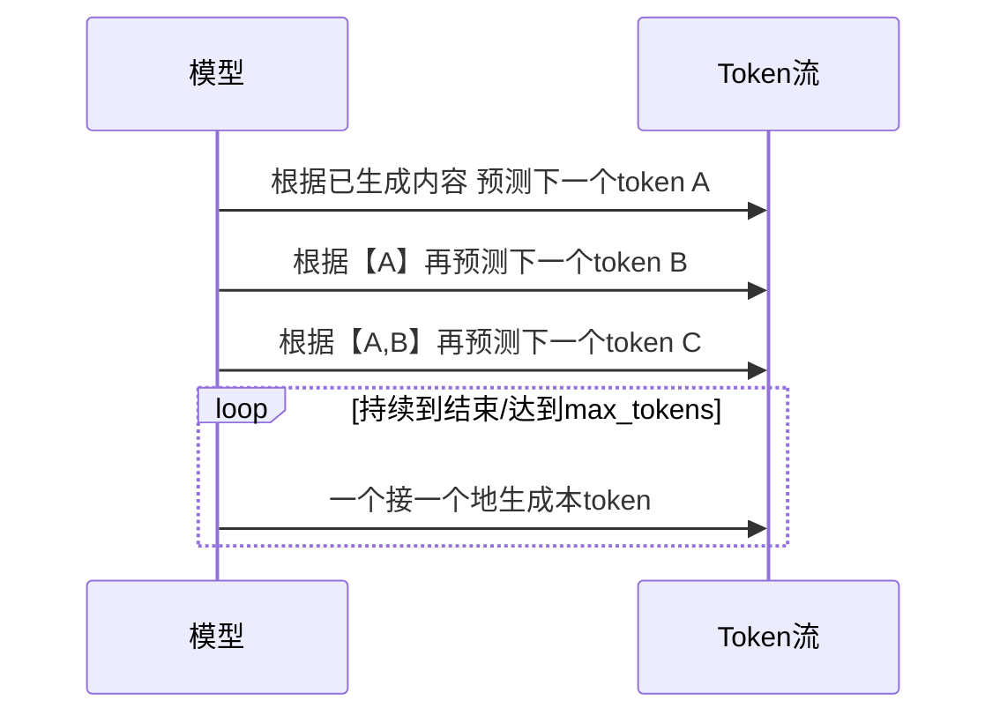
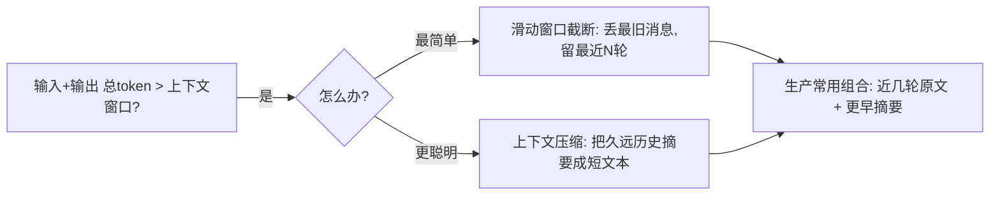

# 阶段一 · 小点 5：大模型基础原理

> 所属：阶段一 大模型基础与 Prompt 工程（Agent 核心根基）
> 定位：做 Agent 不要求你手推反向传播，但你必须理解"模型为什么会这么表现"——为什么流式输出是一块块的、为什么上下文会超限、为什么调参会影响答案。理解了这几条，你写的 Agent 才不是瞎碰。

## 精简大纲

1. Transformer 核心思想：注意力机制通俗理解、自回归生成
2. Token 计算方式、上下文窗口、截断 / 压缩策略
3. 采样参数：temperature / top-p / top-k / max_tokens 与生产调优

## 学习内容详情

> **新一代模型现状（2025-2026）**：闭源侧 GPT-5 家族（2025 年 8 月发布：GPT-5 / GPT-5 mini / GPT-5 nano；API 定价输入 $1.25/百万 token、输出 $10/百万 token，mini 为 $0.25/$2）、Anthropic Claude 4 / 4.5 系列；开源侧 DeepSeek-V3/R1、Qwen3 等。⚠️ 模型迭代很快（截至 2026 已有 Claude 4.5、DeepSeek-V3.1、Qwen3-Max 等更新版本），具体型号与价格以官方最新为准；但本节学的是**原理层不变量**（上下文窗口 / 采样参数 / token 计费），它稳定不变，学习重点不受影响。

> ⏳ **短期可不深究**：具体哪个模型叫什么名、怎么定价、看哪些型号的细节第一遍不必背——模型迭代快、随时会过时，需要时查官方最新文档即可，别把时间花在记型号/价格上。

### 1. Transformer 与生成原理

#### 1.1 注意力机制在做什么

一句话版本：模型让每个词去计算"我该重点看句子里的哪些词"。比如读"它跑到河边喝水"，模型要知道"它"指的是谁。注意力就是让"它"关联到正确的指代词。


- 这解释了模型**理解上下文**的能力来源。应用层不用深挖数学，但要清楚它带来的约束（上下文长度受限、对长文本处理有压力、指令遵循有波动）。

> 🔬 **深度理解 · 注意力机制（Attention）**：
> 1. **本质**：让每个 token 为"预测自己"而给句子里其他 token 分配"关注权重"，从而把**远距离相关**的信息拉近——解决"距离越远、语义关联越弱"的天然缺陷。
> 2. **机制**：每个 token 被编码成 Query（我要找什么）/ Key（我是谁）/ Value（我携带什么信息）；它拿自己的 Query 去和所有 token 的 Key 做点积打分，经 softmax 归一化成权重，再按权重加权求和所有 Value，得到融合上下文的表示；多头注意力=同时学多套这种"关注关系"。
> 3. **为什么重要**：它是 Transformer 能整句并行处理（而非像 RNN 逐个串行）的关键，也是理解指代、推理逻辑的能力来源；注意力开销随文本长度平方式增长，这正是上下文窗口受限的深层原因。
> 4. **易错点**：注意力是"加权平均"，本身不含绝对位置（靠额外位置编码注入）；应用层不必推数学，但要理解它带来的约束——长文本开销大、窗口有限，所以才有截断/压缩策略。

#### 1.2 自回归生成（流式输出的根本原因）



- 模型**一次只预测一个 token**，拿"已生成内容"当条件去猜下一个。这就是为什么流式输出能一块块推给前端——它本来就是一个字一个字蹦出来的。

> 🔬 **深度理解 · 自回归生成**：
> 1. **本质**：把"生成任意长文本"降维成"反复执行同一个条件概率预测"——`P(下一个token | 已生成的tokens + 输入上下文)`，一次只决定一个 token。
> 2. **机制**：每个新 token 会拼回输入做"下一轮条件"，所以它是严格从左到右、逐 token 推进的自回归结构；这正是流式输出"天生一字一字蹦"的根本原因（不是网络特意分片，而是生成就是逐 token 的）。
> 3. **为什么重要**：理解这一点就能解释三个现象——为什么流式能低延迟输出（首 token 到得快）、为什么输出够长时会撞 `max_tokens` 截断、为什么截断会得到"残句"。Agent 里组织流式/控制输出长度都源于此。
> 4. **易错点**：模型输出长度受 `max_tokens`（输出侧上限）约束，而上下文窗口是"输入+输出"总上限；"复读/提前断"常是 max_tokens 过小或触发保护所致，不是模型"坏"了。

> **应用层启示**：既然是一次吐一个，那"输出质量"和"max_tokens 给多少"就直接挂钩。输出太长被截断，答案可能残缺；太短提前断，则属于复读机触发保护。

### 2. Token 与上下文窗口

#### 2.1 Token 是什么

- **Token**：模型理解文本的最小单位。英文 1 词约 1.3 个 token；中文 1 字约 1~2 token；标点、空格也算。
- **分词器**（如 OpenAI 的 tiktoken）：把文本切成 token 的代码工具。要精准估算用量与成本，必须先过它。

```python
# 估算 token 成本 (以 OpenAI tiktoken 为例)
import tiktoken

enc = tiktoken.encoding_for_model("gpt-4o")
text = "你好，我想开发一个 AI Agent。"
tokens = enc.encode(text)
print("token 列表:", tokens)
print("token 数量:", len(tokens))     # 一句话中文可能十几甚至几十个token
```

> ⚠️ 不能按"字数"估算，中文尤其要命。上线前用分词器实测，比你拍脑袋准得多。

> ⏳ **短期可不深究**：分词器内部的具体编码算法（BPE 合并规则、词表是怎么构建的）属于底层实现细节，第一遍会用官方 `tiktoken`/`tokenizers` 做估算即可，不必背规则，用到再深入。

#### 2.2 上下文窗口与两种应对策略



- **上下文窗口**：单次请求"输入 + 输出"最大 token 数（如 128k）。超限必须主动处理，否则请求直接报错。
- **滑动窗口截断**：把最旧消息丢掉、保留最近 N 轮。最简单，但会失去早期记忆。
- **上下文压缩**：让 LLM 把久远的历史总结成一段短摘要，用它替代原文。**生产标配是"近几轮原文 + 更早摘要"混合**，兼顾记忆与成本。

```python
# 滑动窗口截断: 保留最近 N 条消息
def trim_history(history: list[dict], keep: int = 10) -> list[dict]:
    """超限时丢最旧的, 保留最近 keep 条(不含 system 系统消息)。"""
    system_msgs = [m for m in history if m["role"] == "system"]  # 系统消息要保留
    rest = [m for m in history if m["role"] != "system"]
    return system_msgs + rest[-keep:]   # 系统 + 最近 keep 条

history = [
    {"role": "system", "content": "你是助手"},
    {"role": "user", "content": "第1问"}, {"role": "assistant", "content": "第1答"},
    {"role": "user", "content": "第2问"}, {"role": "assistant", "content": "第2答"},
    {"role": "user", "content": "第3问"}, {"role": "assistant", "content": "第3答"},
]
print(trim_history(history, keep=2))
# 保留 system + 最近2条(第3轮), 前两轮被丢弃
```

#### 2.3 上下文压缩示例

```python
def compress_old(history: list[dict], llm, age: int = 6):
    """
    把超过 age 条的早期历史让 LLM 压成一段摘要, 再拼接最新几轮原文。
    这样既保留早期记忆, 又不撑爆上下文。
    """
    if len(history) <= age:
        return history                     # 不够长, 不压缩
    old = history[:-age]                   # 早期这段
    recent = history[-age:]                # 最近这段原文
    summary = llm(f"请把这段对话压缩成三句话摘要:{old}")
    return [{"role": "system", "content": f"早期对话摘要:{summary}"}] + recent
```

### 3. 采样参数（生产经验值）

| 参数 | 用途 | 经验值 |
|-|-|-|
| temperature | 随机度（越高越"发散"） | 工具调用/结构化 0~0.3；创意文案 0.7+ |
| top-p | 累计概率前 p 的候选词采样 | 与 temperature 二选一调优，别同时乱叠 |
| top-k | 只在前 k 名里采样 | 一般不叠加调整 |
| max_tokens | 限制输出长度 | 成本闸门 + 防模型复读 |

> **关键原则**：结构化输出（抽 JSON / 工具调用）要把 temperature 调低（0~0.3），保证稳定可复现；创意类内容才调高。别真以为 temperature=1 就"锦上添花"。

> 🔬 **深度理解 · 采样参数（temperature / top-p / top-k）**：
> 1. **本质**：语言模型输出的其实是一个"每个候选 token 的概率分布"；采样参数决定"从这份分布里怎么挑下一个 token"，是控制"确定性 vs 随机性"的旋钮。
> 2. **机制**：temperature 通过重缩放 `softmax(logits / temperature)` 实现——越低分布越尖（高概率项更突出→更确定），越高越平（低概率项出货机会↑→更发散）；top-p 取累计概率刚过 p 的最小候选集合再在其中采；top-k 只在前 k 名之间采。
> 3. **为什么重要**：工具调用/JSON 结构化必须高确定性（temperature≈0），否则抽出的动作或参数飘忽导致程序解析崩溃；创意文案则需要温度放宽以增加多样性。合理调参就是在那条"稳定可复现 ↔ 发散有创意"的轴上取平衡。
> 4. **易错点**：temperature 与 top-p 都在影响随机性，同时乱叠会双重缩放难以预期，通常二选一调优；temperature=0 近似 greedy 贪心取最高概率，但不是"绝对唯一"，极端情况下仍有平局的取舍。

```python
def build_llm_kwargs(task: str) -> dict:
    """按任务返回合理的采样参数。"""
    if task == "structured":      # 工具调用 / JSON 输出
        return {"temperature": 0.1, "max_tokens": 1024}
    if task == "coding":          # 代码生成
        return {"temperature": 0.2, "max_tokens": 2048}
    return {"temperature": 0.8, "max_tokens": 512}  # 创意文案
```

## 本节自检

- [ ] 能估算一段中文文本的 token 量，并知道上下文超限的三种处理策略
- [ ] 能针对不同任务（工具调用 vs 创意）设置合理采样参数
- [ ] 能说出流式输出为什么"天生是一个 token 一个 token 蹦出来的"

## 本节配套思考题（快速入门的检验）

1. 为什么工具调用场景要把 temperature 调到接近 0？如果调到 1 会发生什么？
2. 中文 100 字的对话，用 tiktoken 估算它大概多少 token？能不能直接用"字数"当 token 数？
3. "滑动窗口截断"和"上下文压缩"各自的代价是什么？什么时候该用哪种？

## 本节常见面试题（深度解析）

> 针对本节核心知识的面试高频点，配合"本质+机制"式理解，能让你答得既有深度又有广度。

### 面试题 1：为什么模型是"一次只预测一个 token"的？它对流式输出和 max_tokens 有什么影响？
- **面试官想考察**：是否理解自回归生成的本质，以及由此推导出流式、截断等现象，而非背结论。
- **专业作答（含深度）**：
  1. **自回归本质**：生成文本被降维成反复执行条件概率 `P(下一个token | 已生成内容+输入)`，一次决定一个 token，新 token 再拼回输入继续。
  2. **流式的根本原因**：正因为逐 token 生成，服务端才能"生成一块回传一块"，实现首字低延迟、前端打字机效果。
  3. **对 max_tokens 的影响**：输出是逐 token 累加的，输出侧有长度上限；超上限会被截断成"残句"，提前断常是保护/上限过小所致。
  4. **工程启示**：Agent 组织流式输出、控制响应长度都要顺着"逐 token"这个事实来设。
- **加分亮点 / 深度追问**：可提 KV Cache（已算过的上下文缓存以加速后续 token）、以及"输出 token 也占上下文窗口配额"这个常见误解。

### 面试题 2：temperature 和 top-p 都是控制随机性的，它们有何区别？为什么工具调用要把 temperature 调低？
- **面试官想考察**：能否说清两者的作用层级与适用场景，理解"确定性高"对结构化输出的价值。
- **专业作答（含深度）**：
  1. **temperature 的机制**：通过重缩放 logits 改变概率分布的"尖锐度"——低则更确定、高则更发散，属"全局重塑分布"。
  2. **top-p 的机制**：截取累计概率到 p 的最小候选集再采样，属"裁掉尾部低概率项"，属于局部的候选集裁剪。
  3. **区别**：temperature 改变相对概率大小，top-p 决定"从哪些候选里挑"；强行双占用会导致难以预期的叠加，一般二选一。
  4. **工具调用要低温**：工具名/参数必须稳，若温度高导致动作或参数飘忽，下游程序解析会崩；JSON 结构化同理。创意文案才需放宽温度增加多样性。
- **加分亮点 / 深度追问**：可提 top-k 与两者的关系（同时卡 top-k 更激进）、固定输出场景的服务端默认参数（如 temperature 默认值因模型而异），以及 temperature=0 与 greedy 的细微区别。

### 面试题 3：上下文窗口有限，你的 Agent 会如何应对超长对话？截断和压缩各自的取舍是什么？
- **面试官想考察**：是否理解"窗口是硬约束"，能对两种主流策略做成本权衡。
- **专业作答（含深度）**：
  1. **问题本质**：单次请求"输入+输出"总 token 不能超窗口，超限要么报错要么失真。
  2. **滑动窗口截断**：丢最旧消息留最近 N 轮。实现简单、省成本，但**丢失早期记忆**，上下文越长失真越明显。
  3. **上下文压缩**：把久远历史让 LLM 压成短摘要，较完整保留语义，"更聪明"却**每次压缩有延迟与成本**，且压缩本身也有精度损失。
  4. **生产标配**：近几轮原文 + 更早摘要的混合策略，兼顾记忆完整度与成本/延迟；对超长且高度相关的早期上下文（如代码现场）可能仍需摘要或外部记忆。
- **加分亮点 / 深度追问**：可提上下文之外的外挂记忆（向量检索/摘要存档）作为"无限上下文"的折中，以及"分段/分页"、"只回传工具结果摘要而非原文"等 token 治理手法。