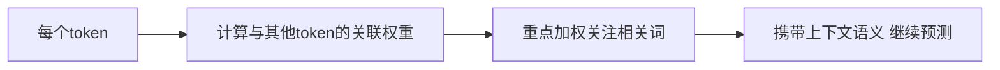
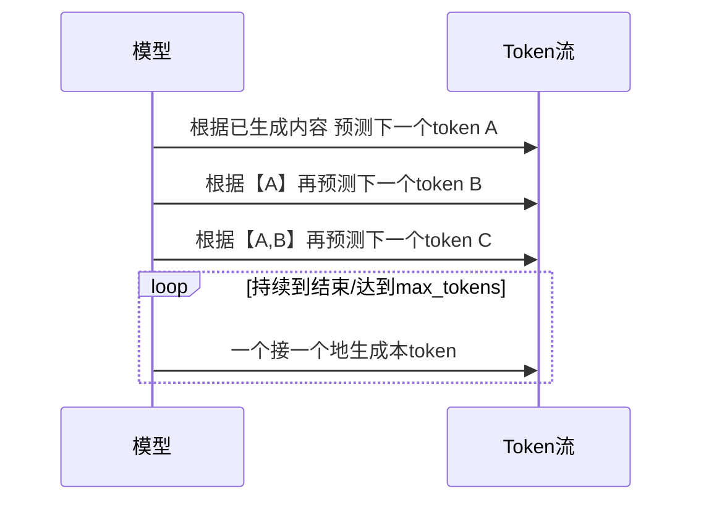
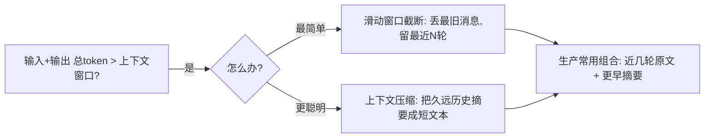

# 阶段一 · 小点 5：大模型基础原理

> 所属：阶段一 大模型基础与 Prompt 工程（Agent 核心根基）
> 定位：做 Agent 不要求你手推反向传播，但你必须理解"模型为什么会这么表现"——为什么流式输出是一块块的、为什么上下文会超限、为什么调参会影响答案。理解了这几条，你写的 Agent 才不是瞎碰。

## 精简大纲

1. Transformer 核心思想：注意力机制通俗理解、自回归生成
2. Token 计算方式、上下文窗口、截断 / 压缩策略
3. 采样参数：temperature / top-p / top-k / max_tokens 与生产调优

## 学习内容详情

> **新一代模型现状（2025-2026）**：闭源侧 GPT-5 家族（2025 年 8 月发布：GPT-5 / GPT-5 mini / GPT-5 nano；API 定价输入 $1.25/百万 token、输出 $10/百万 token，mini 为 $0.25/$2）、Anthropic Claude 4 系列；开源侧 DeepSeek-V3/R1、Qwen3 等。
>
> 模型迭代很快，但「上下文窗口 / 采样参数 / token 计费」这些**原理层不变**——本节讲的正是这些不变量，学习重点不变。

### 1. Transformer 与生成原理

#### 1.1 注意力机制在做什么

一句话版本：模型让每个词去计算"我该重点看句子里的哪些词"。比如读"它跑到河边喝水"，模型要知道"它"指的是谁。注意力就是让"它"关联到正确的指代词。



- 这解释了模型**理解上下文**的能力来源。应用层不用深挖数学，但要清楚它带来的约束（上下文长度受限、对长文本处理有压力、指令遵循有波动）。

#### 1.2 自回归生成（流式输出的根本原因）



- 模型**一次只预测一个 token**，拿"已生成内容"当条件去猜下一个。这就是为什么流式输出能一块块推给前端——它本来就是一个字一个字蹦出来的。

> 应用层启示：既然是一次吐一个，那"输出质量"和"max_tokens 给多少"就直接挂钩。输出太长被截断，答案可能残缺；太短提前断，则属于复读机触发保护。

### 2. Token 与上下文窗口

#### 2.1 Token 是什么

- **Token**：模型理解文本的最小单位。英文 1 词约 1.3 个 token；中文 1 字约 1~2 token；标点、空格也算。
- **分词器**（如 OpenAI 的 tiktoken）：把文本切成 token 的代码工具。要精准估算用量与成本，必须先过它。

```python
# 估算 token 成本 (以 OpenAI tiktoken 为例)
import tiktoken

enc = tiktoken.encoding_for_model("gpt-4o")
text = "你好，我想开发一个 AI Agent。"
tokens = enc.encode(text)
print("token 列表:", tokens)
print("token 数量:", len(tokens))     # 一句话中文可能十几甚至几十个token
```

> ⚠️ 不能按"字数"估算，中文尤其要命。上线前用分词器实测，比你拍脑袋准得多。

#### 2.2 上下文窗口与两种应对策略



- **上下文窗口**：单次请求"输入 + 输出"最大 token 数（如 128k）。超限必须主动处理，否则请求直接报错。
- **滑动窗口截断**：把最旧消息丢掉、保留最近 N 轮。最简单，但会失去早期记忆。
- **上下文压缩**：让 LLM 把久远的历史总结成一段短摘要，用它替代原文。**生产标配是"近几轮原文 + 更早摘要"混合**，兼顾记忆与成本。

```python
# 滑动窗口截断: 保留最近 N 条消息
def trim_history(history: list[dict], keep: int = 10) -> list[dict]:
    """超限时丢最旧的, 保留最近 keep 条(不含 system 系统消息)。"""
    system_msgs = [m for m in history if m["role"] == "system"]  # 系统消息要保留
    rest = [m for m in history if m["role"] != "system"]
    return system_msgs + rest[-keep:]   # 系统 + 最近 keep 条

history = [
    {"role": "system", "content": "你是助手"},
    {"role": "user", "content": "第1问"}, {"role": "assistant", "content": "第1答"},
    {"role": "user", "content": "第2问"}, {"role": "assistant", "content": "第2答"},
    {"role": "user", "content": "第3问"}, {"role": "assistant", "content": "第3答"},
]
print(trim_history(history, keep=2))
# 保留 system + 最近2条(第3轮), 前两轮被丢弃
```

#### 2.3 上下文压缩示例

```python
def compress_old(history: list[dict], llm, age: int = 6):
    """
    把超过 age 条的早期历史让 LLM 压成一段摘要, 再拼接最新几轮原文。
    这样既保留早期记忆, 又不撑爆上下文。
    """
    if len(history) <= age:
        return history                     # 不够长, 不压缩
    old = history[:-age]                   # 早期这段
    recent = history[-age:]                # 最近这段原文
    summary = llm(f"请把这段对话压缩成三句话摘要:{old}")
    return [{"role": "system", "content": f"早期对话摘要:{summary}"}] + recent
```

### 3. 采样参数（生产经验值）

| 参数 | 用途 | 经验值 |
|-|-|-|
| temperature | 随机度（越高越"发散"） | 工具调用/结构化 0~0.3；创意文案 0.7+ |
| top-p | 累计概率前 p 的候选词采样 | 与 temperature 二选一调优，别同时乱叠 |
| top-k | 只在前 k 名里采样 | 一般不叠加调整 |
| max_tokens | 限制输出长度 | 成本闸门 + 防模型复读 |

> **关键原则**：结构化输出（抽 JSON / 工具调用）要把 temperature 调低（0~0.3），保证稳定可复现；创意类内容才调高。别真以为 temperature=1 就"锦上添花"。

```python
def build_llm_kwargs(task: str) -> dict:
    """按任务返回合理的采样参数。"""
    if task == "structured":      # 工具调用 / JSON 输出
        return {"temperature": 0.1, "max_tokens": 1024}
    if task == "coding":          # 代码生成
        return {"temperature": 0.2, "max_tokens": 2048}
    return {"temperature": 0.8, "max_tokens": 512}  # 创意文案
```

## 本节自检

- [ ] 能估算一段中文文本的 token 量，并知道上下文超限的三种处理策略
- [ ] 能针对不同任务（工具调用 vs 创意）设置合理采样参数
- [ ] 能说出流式输出为什么"天生是一个 token 一个 token 蹦出来的"

## 本节配套思考题（快速入门的检验）

1. 为什么工具调用场景要把 temperature 调到接近 0？如果调到 1 会发生什么？
2. 中文 100 字的对话，用 tiktoken 估算它大概多少 token？能不能直接用"字数"当 token 数？
3. "滑动窗口截断"和"上下文压缩"各自的代价是什么？什么时候该用哪种？