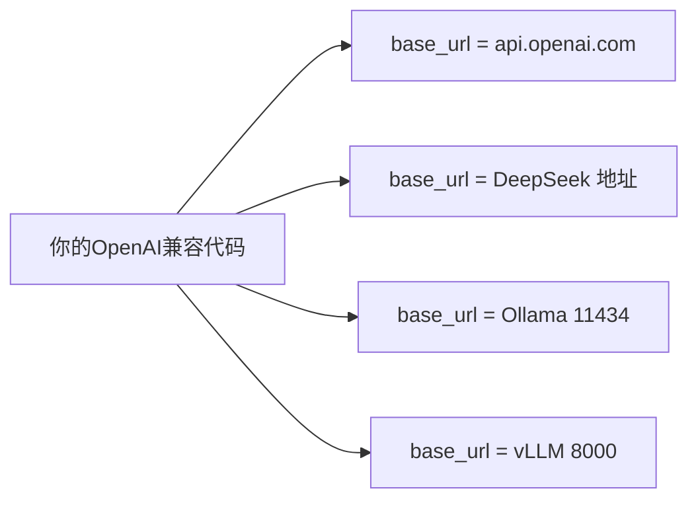
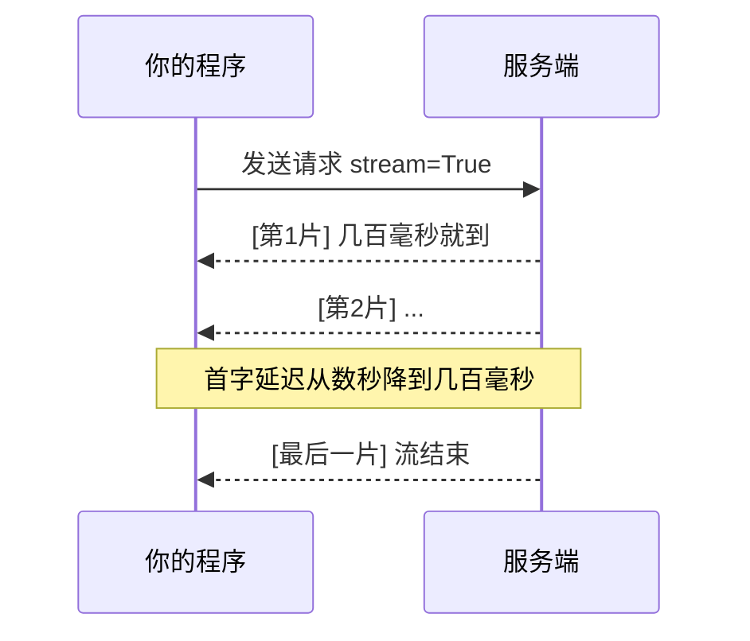

# 阶段一 · 小点 6：主流模型 API 实战

> 所属：阶段一 大模型基础与 Prompt 工程（Agent 核心根基）
> 定位：看懂 API 文档不算本事，能"一套代码换来换去对接不同模型、还能稳得住限流和流式"才是。这一节把"换模型只需改 base_url"和"流式 + 错误处理"这两件事彻底讲透。

## 精简大纲

1. 国际模型：OpenAI / Claude API 调用、流式、错误码、限流
2. 国内模型：DeepSeek / 通义千问 / 智谱，OpenAI 兼容接口
3. 本地大模型部署：Ollama 调试、vLLM 生产推理
4. 本地模型做 Agent 的局限与对策

## 学习内容详情

### 1. OpenAI 兼容生态（base_url 是钥匙）

#### 1.1 核心：替换 base_url 就完成换模型



- OpenAI SDK 开放 `base_url` 参数：换成 DeepSeek / Ollama / vLLM 的地址即完成模型切换，代码几乎不动。
- ⚠️ **兼容 ≠ 等同**：国内模型兼容的是"请求 / 响应格式"，能力并不等同。尤其小模型的 function calling 稳定性、JSON 输出质量差异大。**换模型后必须重跑评测**，不能想当然。

> 🔬 **深度理解 · OpenAI 兼容接口（base_url）**：
> 1. **本质**：各家服务遵循 OpenAI SDK 定义的"HTTP 协议 + JSON 消息结构"这套接口契约，你只需把 `base_url` 指到别家，就复用几乎同一套调用代码——兼容的是"协议/格式"，不是"能力大小"。
> 2. **机制**：`OpenAI(api_key=..., base_url=...)` 之后所有请求都发往该 base_url 下的 `/v1/chat/completions` 等端点；DeepSeek / Ollama / vLLM 实现了同构端点，故可无缝替换；而 Claude 走的是另一套 anthropic 协议，得用官方 SDK。
> 3. **为什么重要**：它让 Agent 的模型接入层"可插拔"——用环境变量换 base_url+model，即可在云端/本地/不同厂商间横跳，降低绑定成本，也是做模型评测对比的工程基础。
> 4. **易错点**：协议兼容 ≠ 能力对齐——小模型的 function calling 稳定性、JSON 输出质量差异大；"能出字"不等于"能力到位"，换模型必须重跑评测，不能想当然。

```python
import os
from openai import OpenAI

client = OpenAI(
    api_key=os.getenv("OPENAI_API_KEY"),      # 密钥走环境变量
    base_url=os.getenv("BASE_URL", "https://api.openai.com/v1"),
    # ↑ 想切到 DeepSeek 就把它换成 "https://api.deepseek.com/v1"
)

resp = client.chat.completions.create(
    model="gpt-4o",                            # 换成 DeepSeek 要换成其模型名
    messages=[{"role": "user", "content": "你好"}],
    temperature=0.2,                           # 结构化场景调低
)
print(resp.choices[0].message.content)
```

#### 1.2 Claude 原生 SDK 对照

海外直连 Claude 不走 OpenAI 兼容格式，而是用官方 `anthropic` SDK——整体写法高度相似，但有三处结构差异要记牢。

```bash
pip install anthropic
```

```python
import os
from anthropic import Anthropic

client = Anthropic(api_key=os.environ["ANTHROPIC_API_KEY"])

resp = client.messages.create(
    model="claude-sonnet-4-20250514",           # 如需最新可替换为 Claude Sonnet 4.5 系列 ID（见官方 docs）
    max_tokens=1024,                              # 必传: 限制输出长度
    system="你是一位严谨的技术助手。",               # 差异1: system 是顶层参数, 不塞进 messages
    messages=[{"role": "user", "content": "用一句话介绍 Agent"}],
)

# 差异2: 响应是 content blocks 列表, 文本要取每个块的 .text
print("".join(b.text for b in resp.content if b.type == "text"))
```

流式则换成 `client.messages.stream(...)`（上下文管理器，逐事件消费）：

```python
with client.messages.stream(
    model="claude-sonnet-4-20250514",
    max_tokens=1024,
    system="你是一位严谨的技术助手。",
    messages=[{"role": "user", "content": "写一段300字介绍AI Agent"}],
) as stream:
    for text in stream.text_stream:     # text_stream 只吐文本增量, 相当于 delta.content
        print(text, end="")
```

与 OpenAI 格式的三个差异点：

| 差异点 | OpenAI 兼容写法 | Claude 原生写法 |
|-|-|-|
| system 位置 | messages 首条 `{"role": "system", ...}` | 顶层参数 `system="..."` |
| 响应结构 | `resp.choices[0].message.content`（字符串） | `resp.content` 是 content blocks 列表，文本块要取 `.text` |
| 工具调用 | `tools` / `tool_choice` | 参数同名、无独立命名差异，照常支持 function calling |

> ⚠️ 国内生产环境常用 DeepSeek / Qwen 的 OpenAI 兼容接口，Claude 原生 SDK 主要用于海外模型直连；两者切换成本就集中在「system 位置」与「content 结构」这两处，改对它们基本就完成了平移。

### 2. 流式调用（stream=True）

#### 2.1 为什么流式重要



- 服务端边生成边返回分片，**首字延迟从数秒降到几百毫秒**。Agent 的 SSE 输出、前端打字机效果全建立在它之上。

> 🔬 **深度理解 · 流式调用（stream=True / SSE）**：
> 1. **本质**：把"等服务端出完整答复"改成"服务端生成一个 token 就回传一个分片"，客户端边收边用，把首字延迟从秒级降到接近模型第一 token 的耗时。
> 2. **机制**：服务端返回一段 SSE 事件流（`data: {...}\n\n` 逐块发送），客户端 `for chunk in stream` 逐块消费；每个 chunk 的 `choices[0].delta.content` 只含本步增量，多数 chunk 是空的元数据，需过滤后拼接成完整文本。
> 3. **为什么重要**：Agent 要边推理边把结果实时推给用户，"打字机"体验依赖它；也避免一次性等全场而拉高延迟与超时风险。
> 4. **易错点**：delta 为 null/空是"结束或元数据"信号而非 bug；流式下超时判定应看"多久没数据"（ReadTimeout）而不是总时长；要先把分片拼进 buffer 再处理，别把单块当完整结果。

```python
from openai import OpenAI

client = OpenAI(api_key=os.environ["OPENAI_API_KEY"])

# stream=True: 用 for 循环逐块接收; 每块都是一个增量片段
stream = client.chat.completions.create(
    model="gpt-4o",
    messages=[{"role": "user", "content": "写一段300字介绍AI Agent"}],
    stream=True,               # 关键开关: 开启流式
)

buffer: list[str] = []
for chunk in stream:
    # 每个 chunk 里才真正有增量文本; 有的 chunk 是空的/元数据
    delta = chunk.choices[0].delta.content
    if delta:                  # 为空说明是结束或元数据, 跳过
        buffer.append(delta)
        print(delta, end="")   # 前端在这里实时渲染 (打字机)
print()                        # 换行
print("完整回答:", "".join(buffer))
```

### 3. 错误码与限流处理

| 错误码 | 含义 | 处理 |
|-|-|-|
| 429 | 触发限流 | 等待退避后重试 |
| 401 | 密钥无效 | 检查 Key |
| 404 | 模型名写错 | 检查模型名 |
| 5xx | 服务商故障 | 重试或降级兜底 |

- 防御组合拳：信号量控并发 + 退避重试（tenacity）+ 必要时申请提额。

```python
import os
import time
from openai import OpenAI

client = OpenAI(api_key=os.environ["OPENAI_API_KEY"])

def call_with_retry(messages, max_attempts: int = 3):
    """对 429/5xx 做指数退避重试, 401/404 直接失败不重试。"""
    wait = 1
    for attempt in range(1, max_attempts + 1):
        try:
            resp = client.chat.completions.create(model="gpt-4o", messages=messages)
            return resp.choices[0].message.content
        except Exception as e:
            code = getattr(e, "status_code", None)   # 拿到HTTP状态码
            if code in (401, 404):                   # 密钥/模型名错误, 重试没用
                raise
            print(f"第{attempt}次失败({code}), {wait}s后重试: {e}")
            time.sleep(wait)
            wait *= 2          # 1s→2s→4s 指数退避
            if attempt == max_attempts:
                raise          # 最后也失败就抛出去给上层兜底
```

### 4. 本地模型部署

| 工具 | 用途 | 特点 |
|-|-|-|
| Ollama | 本地调试 | 一键 `ollama pull` + `ollama serve`，自带 OpenAI 兼容端点 |
| vLLM | 生产吞吐 | 连续批处理 + PagedAttention 拉满 GPU 利用率 |

```bash
# Ollama: 拉一个 7B 小模型并启动 (默认端口 11434)
ollama pull qwen2.5:7b
ollama serve                     # 启动服务, 自带 OpenAI 兼容端点

# vLLM: 生产用, 端口 8000
vllm serve Qwen/Qwen2.5-7B-Instruct --port 8000
```

> ⏳ **短期可不深究**：vLLM 的 PagedAttention、连续批处理等内核级优化属于"生产规模化推理"的专业话题，第一遍会用 `ollama pull` + `ollama serve` 起本地模型做开发验证即可；真要到卡上规模部署时再研究 vLLM。

```python
# 本地模型调用: 只需换 base_url 和 model, 其他代码完全一致
from openai import OpenAI

local = OpenAI(
    api_key="EMPTY",                                   # 本地服务一般不需要真实key
    base_url="http://localhost:11434/v1",              # Ollama 的 OpenAI 兼容端点
)
resp = local.chat.completions.create(
    model="qwen2.5:7b",
    messages=[{"role": "user", "content": "1+1等于几"}],
)
print(resp.choices[0].message.content)
```

### 5. 本地模型做 Agent 的局限与对策

| 局限 | 现象 | 对策 |
|-|-|-|
| function calling 不稳 | 常漏参 / 传错参 | 工具 Function 描述写细 + Few-shot 给足示范 |
| JSON 输出不稳 | 结构错 / 被截断 | pydantic 强校验 + 「让模型重新输出」兜底 |
| 能力天花板 | 复杂推理差 | 关键业务场景直接切换云端大模型 |

```python
# 本地模型 JSON 兜底: 解析失败就让模型重新输出一次
def ask_llm_structured(prompt: str, max_try: int = 3):
    import json
    for i in range(max_try):
        out = local.chat.completions.create(   # local 为上文定义的本地 OpenAI 客户端(跨节依赖, 需先定义)
            model="qwen2.5:7b",
            messages=[{"role": "user", "content": prompt}],
            temperature=0.1,       # 结构化输出调低
        ).choices[0].message.content
        try:
            return json.loads(out)          # 成功解析就返回
        except json.JSONDecodeError:
            prompt += f"\n上次输出不是合法JSON: {out}\n请重新只输出JSON。"  # 反馈重试
    raise RuntimeError("多次重试仍无法得到合法JSON，建议切换云端大模型")
```

## 本节自检

- [ ] 至少实操一家国内 + 一家国际模型 API（含流式调用）
- [ ] 能用 Ollama 本地部署并完成一次工具调用全流程
- [ ] 能为 429/5xx 写退避重试，对 401/404 直接 fail-fast

## 本节配套思考题（快速入门的检验）

1. 如果把 `base_url` 从 OpenAI 换成 DeepSeek，代码需要改哪几处？"兼容"到底兼容什么，不兼容什么？
2. 流式调用里 `chunk.choices[0].delta.content` 为空说明什么？你在 `for chunk in stream` 里如何过滤无用分片？
3. 本地小模型做 function calling 老出错，你会有哪三步具体对策（描述、示范、校验/兜底）？

## 本节常见面试题（深度解析）

> 针对本节核心知识的面试高频点，配合"本质+机制"式理解，能让你答得既有深度又有广度。

### 面试题 1：把模型的 `base_url` 从 OpenAI 换成 DeepSeek 就能"无缝换模型"，这句话对在哪里、错在哪里？
- **面试官想考察**：能否分清"协议兼容"与"能力对等"，理解 OpenAI 兼容生态的真相。
- **专业作答（含深度）**：
  1. **对的地方**：OpenAI SDK 把请求发往 `base_url` 指定的 `/v1/chat/completions` 等端点，DeepSeek/Ollama/vLLM 实现了同构协议，所以聊天/补全这类基础的调用确实几乎零改动。
  2. **要改的地方**：`model` 名要换成目标模型（模型名不通用）；若有流式、工具调用、JSON 模式等高级特性，各家支持度并不一致，可能仍需微调。
  3. **错/风险的地方**：兼容的是"协议格式"不是"能力"——小模型的 function calling 稳定性、JSON 输出质量差异大；**换模型后必须重跑评测**，"能出字"≠"能力到位"。
  4. **例外**：Claude 原生走另一套 anthropic 协议（system/content blocks 结构不同），需要另一套 SDK，不是 base_url 能直接覆盖。
- **加分亮点 / 深度追问**：可提"通用兼容层"（如 LiteLLM）把各家协议统一成一套 API 的业界实践，以及 base_url+model 由环境变量注入以便无侵入切换。

### 面试题 2：流式调用里 `for chunk in stream` 收到的 chunk，为什么 `choices[0].delta.content` 经常是空？
- **面试官想考察**：是否真正理解 SSE 事件流与增量文本的结构，而不是只会抄样例。
- **专业作答（含深度）**：
  1. **流式结构**：服务端把响应拆成多个 chunk 通过 SSE 逐块推送，真正的文本增量放在 `choices[0].delta.content` 里。
  2. **空的含义**：非首块的很多 chunk 是"用法统计/结束标记/角色切换"等元数据，`delta.content` 为 None，不是 bug 是该跳过。
  3. **正确做法**：迭代时判断 `if delta:` 才 append，最后用 `"".join(buffer)` 拼完整文本；不能把单个 chunk 当完整结果用。
  4. **超时注意**：流式下要按"多久没有新数据"判定（ReadTimeout）而非总时长，因为流可能持续。
- **加分亮点 / 深度追问**：可提 SSE 协议本身（`data:` 前缀、`[DONE]` 结束标记）、以及"一个分片可能是半个 token/半个字"的定位问题——增量按 token 边界切，中文可能需要 buffer 后再裁切完整语义。

### 面试题 3：面对 429 / 401 / 404 / 5xx 四类错误码，你会怎么处理？为什么不能一刀切地重试？
- **面试官想考察**：是否掌握"按错误语义分类处置"的工程思维，理解重试的前提。
- **专业作答（含深度）**：
  1. **429 限流**：等待退避（含 `Retry-After` 响应头优先）后重试，同时配合信号量控并发，从源头减少触发。
  2. **401 密钥 / 404 模型名**：属于配置性错误，重试必败，应 fail-fast——立即排查 Key/模型名，而不是空耗重试。
  3. **5xx 服务商故障**：属瞬时系统错误，可重试或降级兜底（换备用模型/提示用户），配合指数退避避免重试风暴。
  4. **为什么不一刀切重试**：确定性错误（401/404、参数非法）重试一万次也无效，还浪费配额、拖延主线；只有"瞬时/可自愈"的错误才值得重试，故要先按状态码分类。
- **加分亮点 / 深度追问**：可延伸"幂等性"——重试在写入类接口上的风险、以及把错误分类下沉到 SDK 层的"可重试异常"抽象，让重试策略集中维护。