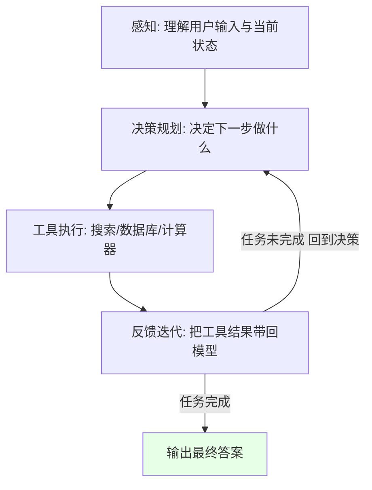
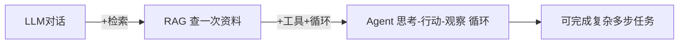
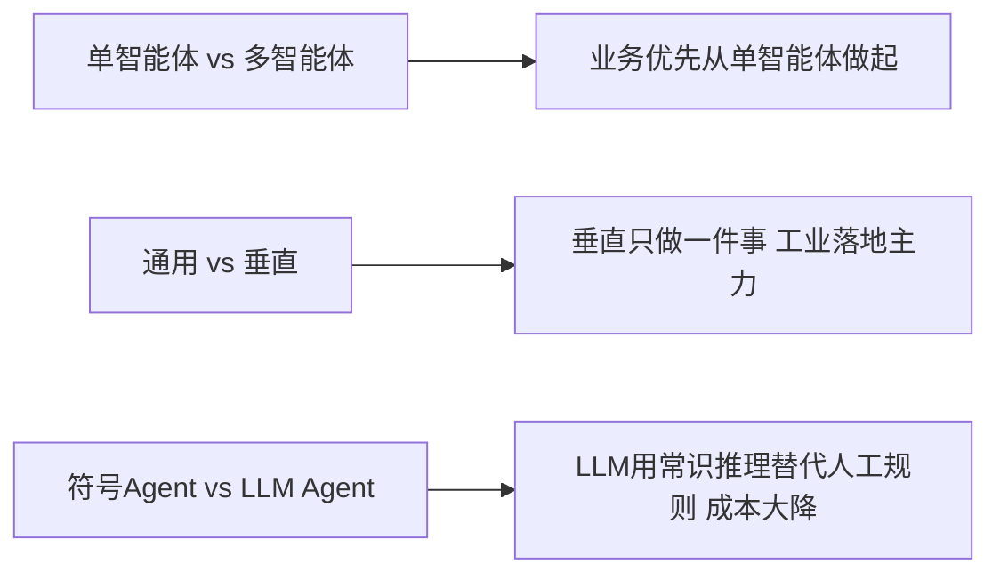

# 阶段二 · 小点 1：Agent 基础认知

> 所属：阶段二 AI Agent 核心理论与基础范式
> 定位：这是整个学习计划最关键的"打地基"一讲。先建立 Agent 的心智模型：它不是一个"更聪明的聊天框"，而是一个**自己会循环工作的小型系统**。理解了这个闭环，后面框架、组件、范式才都有落点。

## 精简大纲

1. Agent 的定义与运行闭环
2. Agent 形态演进：LLM 对话 → RAG → Agent
3. Agent 五大能力维度：规划 / 记忆 / 工具 / 反思 / 协作
4. 关键区分：单智能体 vs 多智能体、通用 vs 垂直

## 学习内容详情

### 1. Agent 的定义

一句话版：**Agent = 循环的 LLM 调用 + 工具执行 + 历史累积**。

- **感知** = 理解用户输入与当前状态
- **决策规划** = 决定下一步做什么
- **工具执行** = 调用外部能力（搜索 / 数据库 / 计算器）
- **反馈迭代** = 把工具结果带回模型再次推理，循环直到任务完成

> 理解关键：普通对话是"问一句答一句"就结束；Agent 是**在循环里跑**——模型推理一次 → 执行一个工具 → 把结果喂回去再推理，直到它认为任务完成。这个"循环"是贯穿整个学习计划的主线。

> 🔬 **深度理解 · Agent 运行闭环**：
> 1. **本质**：Agent 不是一个"更聪明的模型"，而是一个"由模型当决策大脑、工具当手脚、上下文当短期记忆"的**循环执行系统**。只有先建立这个心智模型，后面看框架（LangGraph 的 Node/Edge）、看范式（ReAct）才都有落点。
> 2. **机制**：每一轮都走"感知 → 决策规划 → 工具执行 → 反馈迭代"。感知把用户输入与当前状态注入上下文；模型以此输出"下一步动作"——可能是"选工具 + 掏参数"，也可能是"直接给最终答案"；执行工具得到结构化结果；反馈把该结果当作新的"观察"追加回上下文，供下一轮决策。循环终止只有两种情况：模型判断任务已完成给出终态，或触发最大轮次熔断。
> 3. **为什么重要**：它把"一次性指令解码"升级为"多步自主求解"。代价是每一步都调一次模型、都花 token、都可能出错，因此后面强调的熔断、错误封装成消息、记忆修剪，全都是在为这个循环托底。
> 4. **易错点/常见误解**：新手常把"Agent 对话"当成"更长的一次性生成"。真正的区别不在长短，而在**是否在循环里调用工具并把结果喂回模型**。没有工具、没有反馈回路的"多轮聊天"不是 Agent。

### 2. 形态演进（三种形态）

| 形态 | 特征 | 对比 | 生产定位 |
|-|-|-|-|
| 普通 LLM 对话 | 只有 输入 → 输出，一步完成 | 单次问答 | 简单问答 |
| RAG | 输出前先查资料，但只查一次 | 检索增强 | 知识问答（阶段四细讲） |
| Agent | 思考 + 行动 + 观察，循环直到完成 | 自主闭环 | 复杂任务主力 |

### 3. 五大能力维度

| 能力 | 大白话 | 类比 |
|-|-|-|
| 规划 Planning | 把大目标拆成小步骤并动态调整 | 大脑指挥层 |
| 记忆 Memory | 保存历史/状态/偏好，跨轮次连续工作 | 笔记本 |
| 工具使用 Tool Use | 调用外部函数获得模型没有的能力 | 手脚 |
| 反思 Reflection | 失败后复盘原因并修正后续策略 | 复盘教练 |
| 协作 Collaboration | 多个 Agent 分工配合 | 团队分工 |

> 这五个词后面会反复出现。建议现在记一个口诀："**规忆具反协**"（规划-记忆-工具-反思-协作）。阶段二第 2 讲会逐个展开，框架选型（第 4 讲）本质也是围绕它们做取舍。

### 4. 关键区分

- **单智能体 vs 多智能体（MAS）**：多智能体是"多个 Agent 各管一摊、互相协作"，复杂度成倍上升。**业务优先从单智能体做起**，把单个做稳再考虑拆分。
- **通用 Agent vs 垂直领域 Agent**：通用想什么都做（落地难、不可控）；垂直只做一件事（客服 / 数据分析 / 办公自动化），是工业落地主力。
- **传统符号 Agent / 专家系统**：靠人工 if-then 规则，规则一多就组合爆炸；LLM 原生 Agent 用常识与推理替代人工规则，成本大幅降低。

> 🔬 **深度理解 · 单智能体 vs 多智能体（MAS）**：
> 1. **本质**：单智能体是"在一个循环里塞进所有上下文自己干"，多智能体是"把能力拆到多个独立循环，再用一套通信协议把它们接起来"。复杂度不是加法，是乘法。
> 2. **机制**：MAS 里每个 Agent 仍是"感知-决策-执行-反馈"循环，只是感知里额外包含其他 Agent 的输出。它会新增三类经典问题：**通信**（消息格式、答完谁发言）、**冲突**（两个 Agent 结论矛盾时谁来裁决）、**一致性**（共享事实/状态如何对齐，避免各说各话）。通常需要调度器（Orchestrator）负责分工，汇总器/仲裁负责收拢与判优。
> 3. **为什么重要**：业务上"先单后多"是铁律。单智能体做不稳时，暴露的往往是记忆、上下文、工具等单点问题，而不是协作问题；过早拆分会让原本可控的 bug 扩散成组合性爆炸。
> 4. **易错点/常见误解**：新手以为"多智能体 = 更强的智能"。它真正换来的主要是**模块化、并发、角色隔离**，而非更强的推理能力；一个单 Agent 做不好的任务拆成 5 个并不会自动变好，反而可能因通信损耗变得更差。

> ⏳ **短期可不深究**：传统符号 Agent / 专家系统（人工写 if-then 规则）是第一遍可以不学的历史对照物——你只需记住"LLM 用常识与推理替代了人工规则、成本大降"即可。它的推理库、前向/反向链等规则引擎细节跟本学习主线关系不大，见过即可，不必深入。

## 本节自检

- [ ] 能不看资料说清 Agent 与普通 LLM 对话、RAG 的本质区别
- [ ] 能画出"感知→决策→执行→反馈"闭环，并说出循环终止条件
- [ ] 能背出五大能力口诀并各举一个业务例子

## 本节配套思考题（快速入门的检验）

1. 普通 LLM 对话和 Agent 之间，真正多出来的那一步"循环"里，最核心的动作是什么？
2. 为什么说"多智能体"比"单智能体"复杂得多？从一个"拆分工"的场景想象它会引入哪些新问题（通信、冲突、一致性）？
3. 如果你要给老板解释"Agent 和 ChatGPT 有什么区别"，你会用哪个例子最直观？

## 本节常见面试题（深度解析）

> 针对本节核心知识的面试高频点，配合"本质+机制"式理解，能让你答得既有深度又有广度。

### 面试题 1：Agent 和普通 LLM 对话 / RAG 的本质区别到底在哪？判断某系统是不是 Agent 的关键特征是什么？
- **面试官想考察**：是否真的理解"循环 + 工具 + 反馈"，而不是浮于"Agent 就是聊天框升级版"的表象。
- **专业作答（含深度）**：
  1. **普通 LLM 对话**：输入 → 输出，一步完成，模型只能基于自己学到的知识作答。
  2. **RAG**：输出前先做一次检索、把资料注入上下文再回答——"查一次"，但仍是一次性生成，没有自主决策和循环。
  3. **Agent**：在循环里运行，核心是"思考 → 行动（调工具）→ 观察（看结果）→ 再思考"，直到任务完成。
  4. **关键特征**：①存在一个带终止条件的循环；②能主动选择并调用外部工具/能力；③工具结果被反馈回模型供下一轮决策。缺了③就退化成多轮聊天，缺了②就只是带检索的问答。
- **加分亮点 / 深度追问**：可主动补充"判断标准"——看它**是否在推理中产生了状态（上下文累积）并据此改变后续动作**；追问：RAG 也可以多次检索，边界在哪？答：判断依据不是"检了几次"，而是"检索结果是否驱动模型主动改变下一步决策"。

### 面试题 2：五大能力（规划/记忆/工具/反思/协作）里，为什么"反思"最难做好？它和"重试"有什么区别？
- **面试官想考察**：对能力维度的理解深度，是否分清"复盘"和"瞎试"的本质差异。
- **专业作答（含深度）**：
  1. 五大能力是 Agent 涉及的设计维度，各自解决不同问题：规划拆目标、记忆存状态、工具补能力、反思纠方向、协作做分工。
  2. **重试（retry）**：失败后原封不动再来一次，不产生新的认知，只赌概率。
  3. **反思（Reflection）**：失败后让模型显式回答"错在哪、为什么、下次怎么改"，把**结论写回上下文/记忆**，下一轮带着这个教训执行——它改变的是"下一步策略"而非"重跑的次数"。
  4. **难的原因**：反思依赖模型发现真因的能力，容易反思错方向（自圆其说）；结论累积又占上下文、且可能污染后续推理，需要压缩与甄别。
- **加分亮点 / 深度追问**：可补一句"Reflexion 范式（阶段二第 3 讲）就是把反思显式做成一个环节"；追问：反思结论会不会误导后续？答：会，所以许多实现给反思结论加来源/置信度，并限制保留数量。

### 面试题 3：多智能体听起来很强大，为什么工业界常说"优先从单智能体做起"？
- **面试官想考察**：是否有工程头脑，能否理性评估架构复杂度的成本，而不是跟风堆概念。
- **专业作答（含深度）**：
  1. 单智能体是把所有能力放进一个循环的 Agent，多智能体是多个 Agent 通过通信/编排协作的系统。
  2. 单智能体失效时，根因多半集中在**记忆溢出、上下文混乱、规划分不清主次、工具不可靠**——这些是单点问题，单靠加多个 Agent 解决不了，反而被掩盖。
  3. 多智能体引入的新成本：**通信协议、冲突裁决、状态一致性**，加上更复杂的可观测性与调试难度，复杂度呈组合式上升。
  4. 正确路径：先把单个 Agent 在真实数据上做稳，量化确认瓶颈再决定拆不拆；"一个 Agent 做不好"不是拆分的充要条件，"单点确实被某个子模块卡住、且拆分收益明确"才是。
- **加分亮点 / 深度追问**：可补充业界实践"先并联独立 Agent / 显式编排再谈自治协作"；追问：什么时候多智能体真的更有性价比？答：子任务天然并行、角色/权限需要隔离（如安全边界）、或单个上下文已装不下完整任务时。