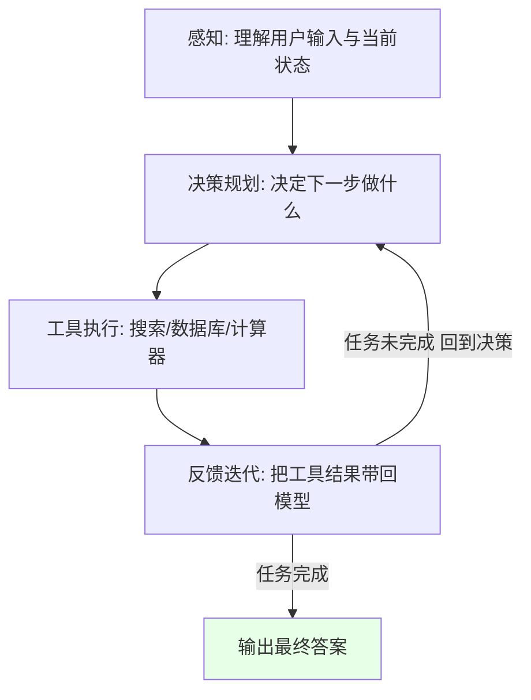
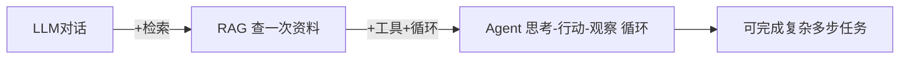
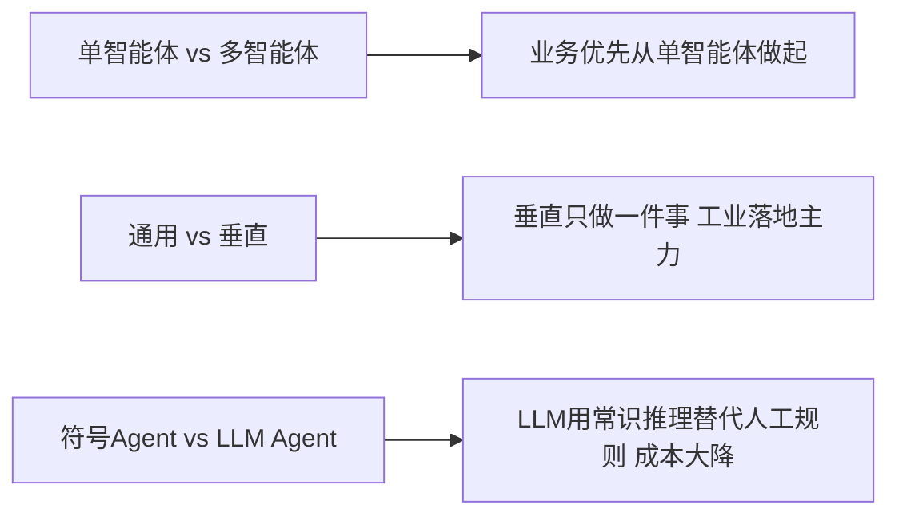

# 阶段二 · 小点 1：Agent 基础认知

> 所属：阶段二 AI Agent 核心理论与基础范式
> 定位：这是整个学习计划最关键的"打地基"一讲。先建立 Agent 的心智模型：它不是一个"更聪明的聊天框"，而是一个**自己会循环工作的小型系统**。理解了这个闭环，后面框架、组件、范式才都有落点。

## 精简大纲

1. Agent 的定义与运行闭环
2. Agent 形态演进：LLM 对话 → RAG → Agent
3. Agent 六大能力维度：规划 / 记忆 / 工具 / 反思 / 协作
4. 关键区分：单智能体 vs 多智能体、通用 vs 垂直

## 学习内容详情

### 1. Agent 的定义

一句话版：**Agent = 循环的 LLM 调用 + 工具执行 + 历史累积**。

- **感知** = 理解用户输入与当前状态
- **决策规划** = 决定下一步做什么
- **工具执行** = 调用外部能力（搜索 / 数据库 / 计算器）
- **反馈迭代** = 把工具结果带回模型再次推理，循环直到任务完成

> 理解关键：普通对话是"问一句答一句"就结束；Agent 是**在循环里跑**——模型推理一次 → 执行一个工具 → 把结果喂回去再推理，直到它认为任务完成。这个"循环"是贯穿整个学习计划的主线。

### 2. 形态演进（三种形态）

| 形态 | 特征 | 对比 | 生产定位 |
|-|-|-|-|
| 普通 LLM 对话 | 只有 输入 → 输出，一步完成 | 单次问答 | 简单问答 |
| RAG | 输出前先查资料，但只查一次 | 检索增强 | 知识问答（阶段四细讲） |
| Agent | 思考 + 行动 + 观察，循环直到完成 | 自主闭环 | 复杂任务主力 |

### 3. 六大能力维度

| 能力 | 大白话 | 类比 |
|-|-|-|
| 规划 Planning | 把大目标拆成小步骤并动态调整 | 大脑指挥层 |
| 记忆 Memory | 保存历史/状态/偏好，跨轮次连续工作 | 笔记本 |
| 工具使用 Tool Use | 调用外部函数获得模型没有的能力 | 手脚 |
| 反思 Reflection | 失败后复盘原因并修正后续策略 | 复盘教练 |
| 协作 Collaboration | 多个 Agent 分工配合 | 团队分工 |

> 这五个词后面会反复出现。建议现在记一个口诀："**规忆具反协**"（规划-记忆-工具-反思-协作）。阶段二第 2 讲会逐个展开，框架选型（第 4 讲）本质也是围绕它们做取舍。

### 4. 关键区分

- **单智能体 vs 多智能体（MAS）**：多智能体是"多个 Agent 各管一摊、互相协作"，复杂度成倍上升。**业务优先从单智能体做起**，把单个做稳再考虑拆分。
- **通用 Agent vs 垂直领域 Agent**：通用想什么都做（落地难、不可控）；垂直只做一件事（客服 / 数据分析 / 办公自动化），是工业落地主力。
- **传统符号 Agent / 专家系统**：靠人工 if-then 规则，规则一多就组合爆炸；LLM 原生 Agent 用常识与推理替代人工规则，成本大幅降低。

## 本节自检

- [ ] 能不看资料说清 Agent 与普通 LLM 对话、RAG 的本质区别
- [ ] 能画出"感知→决策→执行→反馈"闭环，并说出循环终止条件
- [ ] 能背出六大能力口诀并各举一个业务例子

## 本节配套思考题（快速入门的检验）

1. 普通 LLM 对话和 Agent 之间，真正多出来的那一步"循环"里，最核心的动作是什么？
2. 为什么说"多智能体"比"单智能体"复杂得多？从一个"拆分工"的场景想象它会引入哪些新问题（通信、冲突、一致性）？
3. 如果你要给老板解释"Agent 和 ChatGPT 有什么区别"，你会用哪个例子最直观？