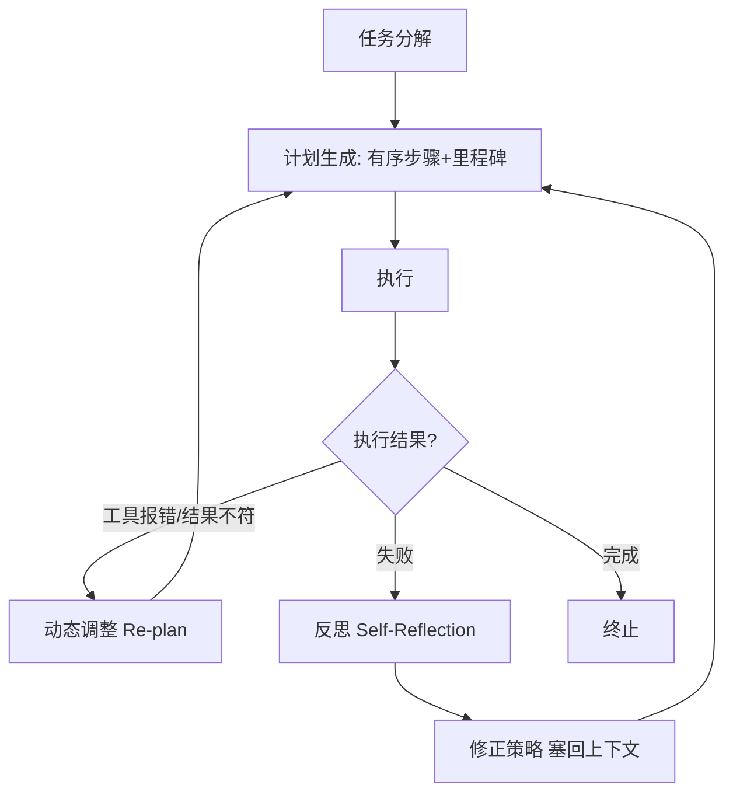
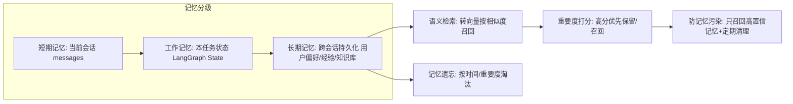
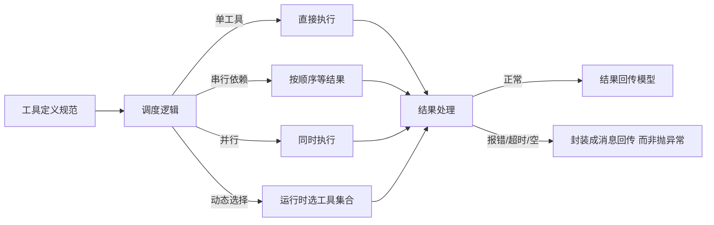
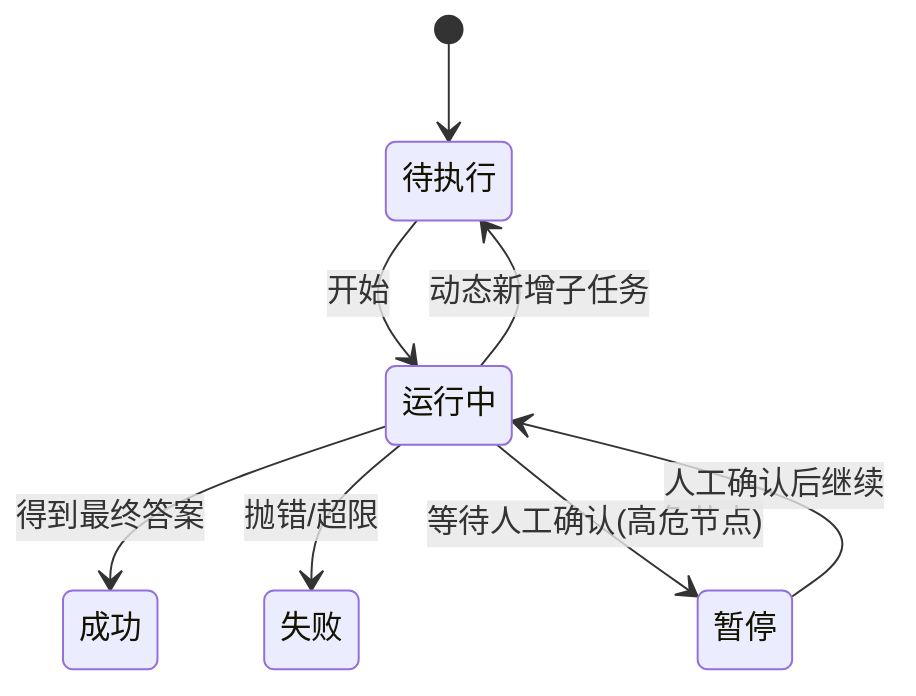

# 阶段二 · 小点 2：Agent 四大核心组件详解

> 所属：阶段二 AI Agent 核心理论与基础范式
> 定位：上一讲建立了"循环"的心智模型，这一讲把它拆成四大零件：**规划、记忆、工具、执行**。任何框架（LangGraph / CrewAI 等）本质都是把这四件事工程化。你先把每个零件"为什么存在、踩什么坑"想明白，后面看框架源码就像看拼装说明书。

## 精简大纲

1. 规划模块（Planning）：任务分解 / 计划生成 / 动态调整 / 反思优化
2. 记忆模块（Memory）：短期 / 工作 / 长期记忆
3. 工具调用模块（Tool Use）：工具定义 / 调度 / 结果处理
4. 执行模块（Execution）：状态机 / 追踪 / 终止 / 熔断 / 人在回路

## 学习内容详情

### 1. 规划模块（大脑指挥层）



- **任务分解**：递归 / 分层分解。**粒度权衡是本节最重要的一条经验**：切太粗=子任务仍无法执行；切太细=每步都调模型、token 翻倍。经验值：子任务应满足「一句话能说清做什么、输入是什么、产出是什么」。

```python
# 一个"合格子任务"的判断模板: 三句话都能答上来才算拆好
def is_ok_subtask(t: str) -> bool:
    return all([
        len(t) > 0,                       # ① 一句话能说清"做什么"
        "输入" in t or "使用" in t,        # ② 输入/前置条件明确
        "输出" in t or "返回" in t,        # ③ 产出物明确
    ])

subtask = "读取 sales.csv，输出按区域分组的销售额汇总"
print(is_ok_subtask(subtask))   # True
```

> 🔬 **深度理解 · 规划（任务分解的粒度权衡）**：
> 1. **本质**：规划不是把目标简单切碎，而是生成一张"可按序/可并行执行、每步产出可验证"的动作清单；分解的粒度直接决定整条执行链路的成本与稳定性。
> 2. **机制**：递归地把大目标拆成子任务，每个子任务应满足"一句话能说清做什么、输入是什么、产出是什么"的最小自洽单元。执行中用 Re-plan 检测"工具报错、结果不符"等信号，动态增删改步骤；失败后再用反思把教训沉淀回上下文。
> 3. **为什么重要**：切太粗会导致子任务仍无法执行、被迫反复重规划；切太细则每步都调一次模型，token、延迟、出错面随步数线性上升——粒度决定了"跑得快不快、稳不稳、贵不贵"三个工程指标。
> 4. **易错点/常见误解**：新手以为"计划一次生成就够"。真实系统里计划几乎总会失效，规划的关键不在第一步拆得多完美，而在**有没有 Re-plan 闭环去纠偏**；否则一旦初始计划有误，就会沿着错误路径一路执行下去。

- **计划生成**：输出有序步骤清单 + 里程碑（关键节点）。
- **动态调整（Re-plan）**：执行中发现工具报错或结果不符，实时修改 / 新增 / 放弃子任务，不死守初始计划。
- **反思优化（Self-Reflection）**：失败后复盘「哪里错了、为什么、下次怎么做」，结论塞回上下文。
- **终止条件**：完成判定 / 异常判定 / 最大轮次熔断，防死循环烧钱。

### 2. 记忆模块（Memory）



| 记忆类型 | 存活范围 | 存储位置 | 对应概念 |
|-|-|-|-|
| 短期记忆 | 当前会话 | 内存中的 messages 列表 | 上下文窗口 |
| 工作记忆 | 本任务期间 | 全局状态变量 | LangGraph 的 State |
| 长期记忆 | 跨会话 | 数据库 / 向量库 | 用户偏好 / 经验 / 知识库 |

- **语义检索**：查询和记忆都转向量按相似度召回，处理"意思相近但字面不同"。

> ⏳ **短期可不深究**：语义检索背后的"转向量 + 按相似度召回"机制第一遍不用细究——它是阶段四 RAG / 向量库的重头戏。这里你只需知道"长期记忆要靠它按语义而非字面来召回"即可，具体原理到时候再学。

- **记忆遗忘**：按时间 / 重要度淘汰，防止记忆库无限膨胀。
- **重要度打分**：高分优先保留、优先召回。
- **记忆污染（重点坑）**：历史错误信息被当事实混入当前推理。对策：只召回高置信记忆、定期清理。

> 🔬 **深度理解 · 记忆（分级结构与记忆污染）**：
> 1. **本质**：Agent 的记忆本质是"把需要跨步/跨会话保留的信息放到合适的位置"，分级（短期/工作/长期）就是为了让不同寿命的信息各得其所，避免全都堆进上下文。
> 2. **机制**：短期记忆存活于当前会话的 messages 列表（即上下文窗口）；工作记忆存活于当前任务的全局状态（如 LangGraph 的 State），随任务生命周期存在；长期记忆跨会话持久化到数据库/向量库，靠语义检索按相似度召回。召回前按置信度/重要度打分，只放行高置信条目，以降低污染。
> 3. **为什么重要**：它解决"上下文有限 vs 任务需要大量/长期信息"的根本矛盾，也支撑跨会话的个性化与连续工作。边界在于：检索召回的是"相关"而非"一定正确"，因此需要置信度与清理机制兜底。
> 4. **易错点/常见误解**：新手常把"短期记忆"误当"模型的训练记忆"。短期记忆是每次请求都随 messages 传给模型的，根本不会写进模型参数；模型对历史毫无记忆，是上下文把历史搬运给它看的。一旦上下文混入错误信息（记忆污染），模型会当真且很难自我纠正。

> ⏳ **短期可不深究**：记忆遗忘（按时间/重要度淘汰）和重要度打分这类"记忆管理策略"属于锦上添花的工程优化点，第一遍知道它们存在即可，等真遇到"记忆库膨胀 / 检索噪声变高"再回来细调策略。

```python
# 一个带"置信度"的记忆条目: 低置信记忆不召回, 防止污染当前推理
class MemoryItem:
    def __init__(self, content: str, confidence: float, created_at: float):
        self.content = content
        self.confidence = confidence   # 0.0~1.0, 越高越可信
        self.created_at = created_at

    def is_confident(self, threshold: float = 0.8) -> bool:
        return self.confidence >= threshold   # 只召回高置信记忆

mem = MemoryItem("用户偏好用中文回复", confidence=0.95, created_at=1700000000)
if mem.is_confident():
    print("可召回:", mem.content)     # 只有高置信的才进上下文
else:
    print("置信度不足, 不召回")       # 防记忆污染
```

### 3. 工具调用模块（连接外部世界的「手」）



- **工具定义规范**：功能描述写清楚使用场景；参数 Schema 严谨；定义返回值格式（这些在阶段一第 4、7 讲已讲过 pydantic 与 JSON Schema）。
- **调度逻辑**：单工具调用 / 工具串行依赖 / 并行调用 / 运行时动态选择工具集合。
- **结果处理（关键工程习惯）**：正常结果回传；**报错 / 超时 / 空结果封装成消息给 LLM 而不是抛异常**——让模型"看到"错误并换方案，而不是让整个循环崩掉；超时时间要控制。
- **白名单 / 黑名单**：只允许白名单内工具；高危操作（删库 / 转账 / 发邮件）进黑名单。
- **高危工具**：执行后不可逆或有强副作用，必须加人工确认。

```python
# 结果处理: 错误封装成消息回传, 而不是 raise 中断循环
import time

def execute_tool(name: str, args: dict) -> str:
    """统一工具执行入口: 永远返回一个'能喂给模型的消息'。"""
    try:
        if name == "search":
            return _search(args["query"])        # _search 为本项目自定义工具函数, 示意需自实现
        if name == "send_email":
            return _send_email(args)      # 高危: 内部会先要人工确认; 函数本身示意需自实现
        return f"未知工具: {name}"
    except TimeoutError:
        # 超时 → 封装成消息让模型决定重试或换思路, 而不是崩掉循环
        return f"工具 {name} 超时, 请稍后重试或换一种方式"
    except Exception as e:
        return f"工具 {name} 执行失败: {e}"   # 模型能看到原因, 自我修正
```

### 4. 执行模块（主循环与状态管理器）



- **任务状态机**：待执行 → 运行中 → 成功 / 失败 / 暂停；状态决定下一步行为。
- **执行链路追踪**：记录每轮思考、每次工具调用输入输出（生产用 LangSmith / LangFuse）。
- **终止条件**：模型给最终答案；或达到最大轮次 / 总时长 / 总预算强制熔断。
- **熔断（Circuit Breaker）**：达到最大轮次立即停止，防死循环、防 token 超支。**工程上必备**——下面用最小代码演示为什么必须加。

> 🔬 **深度理解 · 熔断（Circuit Breaker）**：
> 1. **本质**：熔断是对"不知道循环何时能结束"这件事加的一道硬性成本上限，本质是**把不确定性转化为可预支的预算**。
> 2. **机制**：在每轮循环入口检查计数器（轮次 / 时长 / 累计 token），任一指标超限立即强行终止并返回"已达上限"的兜底结果。它与终止条件正交：终止条件靠模型判断"任务完成"，熔断靠硬编码的"资源上限"保证即使终止失效也不会无限烧钱。
> 3. **为什么重要**：模型可能永远不收敛（反复拿不准 → 再查一次），没有熔断就是无限烧 token、卡死生产任务；它同时充当降级保护，为"人在回路 / 兜底答案"留出触发点。
> 4. **易错点/常见误解**：新手以为熔断只在"明显死循环"时触发。其实模型不收敛是常态而非异常；阈值要按真实任务步数去调——太小任务常做不完，太大会烧较多钱，这是一个需要权衡的经验参数，不是设个安全值就一劳永逸。
- **Human-in-the-loop**：关键 / 高危节点暂停执行，等人工确认或修改后再继续。

```python
# 最小可运行的"执行模块"骨架: 用循环 + 熔断, 演示为什么要 max_turns
MAX_TURNS = 5          # 熔断阈值: 最多跑 5 轮
turns = 0

while True:
    turns += 1
    print(f"—— 第 {turns} 轮推理 ——")

    # 模拟: 模型总是"再查一次"(没写好终止条件就死循环)
    # 真实 Agent 这里可能是"模型调工具→回传→再调"无限循环
    if turns >= MAX_TURNS:          # 熔断!
        print(f"已达最大轮次 {MAX_TURNS}, 强制终止, 防止 token 超支")
        break
    # 正常情况: 模型给出最终答案才 break

# 人机协作: 高危操作前暂停
def confirm(action: str) -> bool:
    """高危操作需要人工确认。生产里这里会弹一个审批。"""
    # ⚠️ input() 是阻塞式交互, 自动化/无 TTY 环境会卡住; 生产请改走审批接口(如飞书/钉钉审批、Webhook)
    return input(f"高危操作 {action}, 确认执行? (y/n) ") == "y"

if confirm("DELETE FROM users"):
    print("执行删除")
else:
    print("已取消")          # 状态回到 运行中/暂停, 由调度器决定
```

## 本节自检

- [ ] 能举出四大组件各自解决的业务问题各一个
- [ ] 能说清工具「报错回传消息」而非「抛异常」的原因
- [ ] 能说出记忆三级结构，并解释"记忆污染"及对策
- [ ] 能画出任务状态机，并说明熔断 / 人工确认各自的触发场景

## 本节配套思考题（快速入门的检验）

1. 任务分解"切太细"到底浪费了什么？除了 token 翻倍，还有什么隐性成本（延迟 / 出错面）？
2. 为什么工具报错要"封装成消息回传"而不是 `raise`？试想 `raise` 一次会让整个 Agent 循环发生什么。
3. 如果会话的长期记忆里混进了一句错误的"用户喜欢英文"，会发生什么？结合"记忆污染"说说你怎么防。
4. 熔断的阈值设太小会怎样（任务做不完），设太大又会怎样（可能烧钱）？你如何权衡？

## 本节常见面试题（深度解析）

> 针对本节核心知识的面试高频点，配合"本质+机制"式理解，能让你答得既有深度又有广度。

### 面试题 1：任务分解"切太细"除了 token 翻倍，还有什么损失？好的划分标准是什么？
- **面试官想考察**：是否理解粒度和工程成本的关系，能否给出可落地的评判依据，而非空谈"适度"。
- **专业作答（含深度）**：
  1. **直接成本**：每步子任务都要调用一次模型，token 总量随步数线性增长。
  2. **隐性成本**：a) 延迟——多轮串行调用显著拉长响应时间；b) 出错面——步骤越多，单步出错并失败重试的概率越大，整体成功率指数下降；c) 上下文累积——每步中间结果都写回上下文，长链路易触到窗口上限或被修剪。
  3. **划分标准**：每个子任务应是一个"最小可执行自洽单元"——一句话能说清"做什么、输入是什么、产出是什么"；过度拆分就违背了这个标准。
  4. **权衡思路**：粒度不是越细越好，而是"恰好能一次性可靠完成、又不需要模型重新规划"。
- **加分亮点 / 深度追问**：可补"面向并行度拆分，可并发子任务用并行降低延迟"；追问：拆太粗为什么也会贵？答：太粗常执行失败 → 触发 Re-plan 反复重规划，反而多轮调用，可能比拆细更贵。

### 面试题 2：工具报错为什么"封装成消息回传给模型"而不是 `raise` 抛异常？
- **面试官想考察**：是否理解 Agent 循环的容错哲学，以及异常处理对整个闭环的影响。
- **专业作答（含深度）**：
  1. **目标不同**：普通程序里异常是"终止错误路径"的信号；Agent 循环里工具报错是"可据以换方案"的信息，应被当作普通观测喂回模型。
  2. **机制**：把报错/超时/空结果统一转成字符串消息（含错误说明），以 `role: tool` 追加回上下文。模型"看到"后自行决定重试、换工具或改参数——错误变成了决策依据而非程序崩溃点。
  3. **后果对比**：若 `raise`，异常一路上抛、外层循环中断，整个 Agent 的自主求解流程直接终止，回到工程逻辑而非模型逻辑，护栏全失效。
  4. **边界**：并非所有错误都该回传——高危、不可重试的错位（如鉴权失败/越权）应硬中断或转人工，交由人在回路，不该让模型反复试。
- **加分亮点 / 深度追问**：补一句"这本质是'把不确定性留在模型侧而非代码侧'的容错设计"；追问：会不会有"错误回传给模型反复浪费 token"？答：会，所以要配合超时熔断与最大重试次数上限。

### 面试题 3：长期记忆里的错误信息为什么危险？你如何设计防"记忆污染"？
- **面试官想考察**：是否真正懂"上下文即事实来源"的机制，而非只背"要清理"三个字。
- **专业作答（含深度）**：
  1. **危险原因**：模型对会话历史没有真实记忆，每次都是把 messages 原样喂给它当"事实"。长期记忆一进上下文就被当作可靠事实参与推理，错误信息会系统性污染后续所有回答，且模型自身很难识别并纠正。
  2. **机制原理**：检索召回靠"相关相似度"，不等于"正确性"；所以需要在召回侧加置信度门槛，在写入侧做来源/时效标注，在存储侧定期清理过期或反复被质疑的条目。
  3. **设计要点**：只召回高置信记忆；对低置信/历史性/瞬时性信息做降权或拒绝召回；对冲突记忆做一致性裁决，必要时回源验证。
  4. **边界**：仍无法杜绝"初始写入的内容本来就是错的"，因此对敏感/易变信息要考虑从权威源实时校验，而非纯靠记忆。
- **加分亮点 / 深度追问**：可补"记忆污染在长链路 Agent 里会逐轮放大，越靠后的步骤越信以为真"；追问：短期记忆里混入错误 offsets 怎么办？答：付之于上下文完整性校验 + 让模型显式标注不确定，必要时短路重问用户。