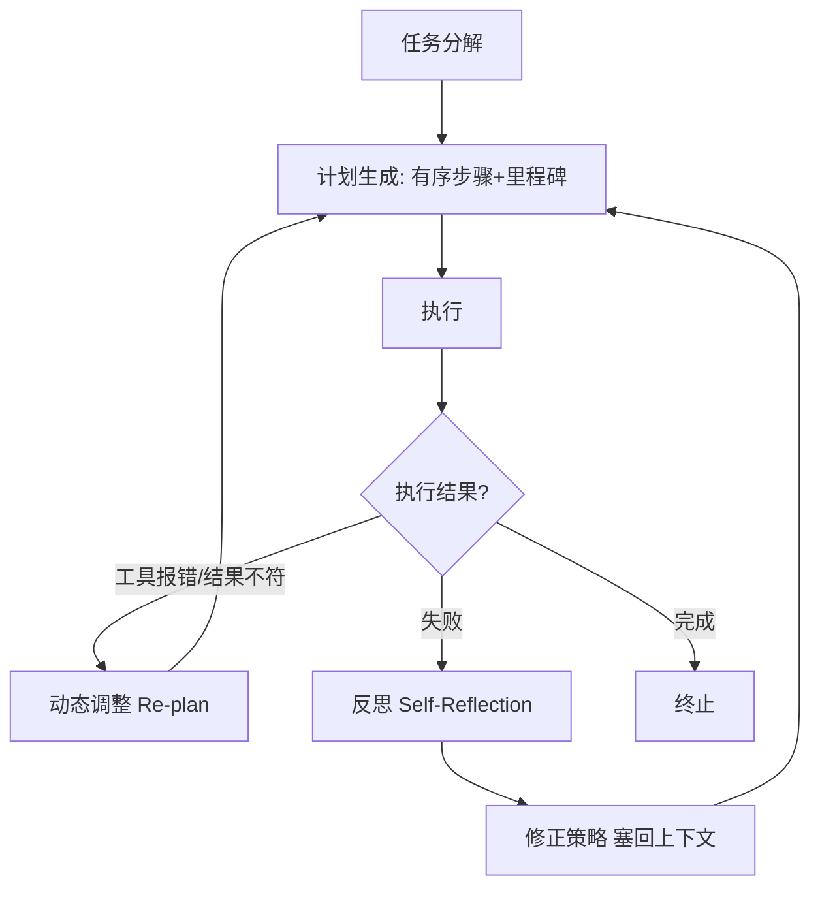
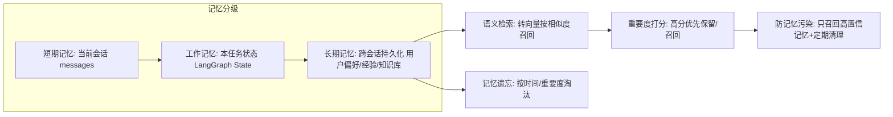
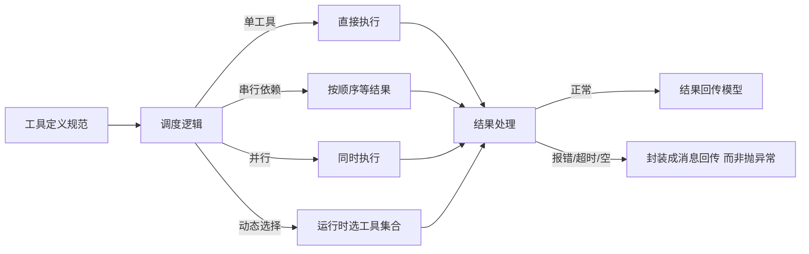
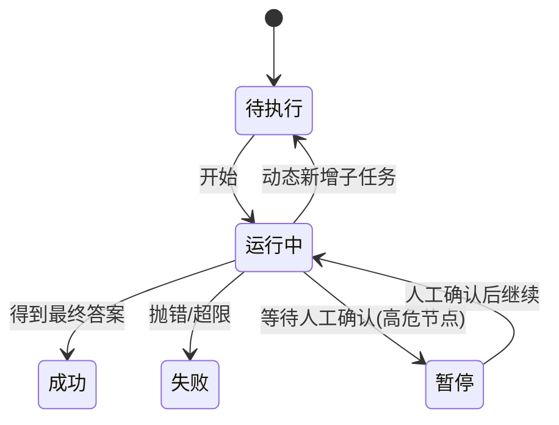

# 阶段二 · 小点 2：Agent 四大核心组件详解

> 所属：阶段二 AI Agent 核心理论与基础范式
> 定位：上一讲建立了"循环"的心智模型，这一讲把它拆成四大零件：**规划、记忆、工具、执行**。任何框架（LangGraph / CrewAI 等）本质都是把这四件事工程化。你先把每个零件"为什么存在、踩什么坑"想明白，后面看框架源码就像看拼装说明书。

## 精简大纲

1. 规划模块（Planning）：任务分解 / 计划生成 / 动态调整 / 反思优化
2. 记忆模块（Memory）：短期 / 工作 / 长期记忆
3. 工具调用模块（Tool Use）：工具定义 / 调度 / 结果处理
4. 执行模块（Execution）：状态机 / 追踪 / 终止 / 熔断 / 人在回路

## 学习内容详情

### 1. 规划模块（大脑指挥层）



- **任务分解**：递归 / 分层分解。**粒度权衡是本节最重要的一条经验**：切太粗=子任务仍无法执行；切太细=每步都调模型、token 翻倍。经验值：子任务应满足「一句话能说清做什么、输入是什么、产出是什么」。

```python
# 一个"合格子任务"的判断模板: 三句话都能答上来才算拆好
def is_ok_subtask(t: str) -> bool:
    return all([
        len(t) > 0,                       # ① 一句话能说清"做什么"
        "输入" in t or "使用" in t,        # ② 输入/前置条件明确
        "输出" in t or "返回" in t,        # ③ 产出物明确
    ])

subtask = "读取 sales.csv，输出按区域分组的销售额汇总"
print(is_ok_subtask(subtask))   # True
```

- **计划生成**：输出有序步骤清单 + 里程碑（关键节点）。
- **动态调整（Re-plan）**：执行中发现工具报错或结果不符，实时修改 / 新增 / 放弃子任务，不死守初始计划。
- **反思优化（Self-Reflection）**：失败后复盘「哪里错了、为什么、下次怎么做」，结论塞回上下文。
- **终止条件**：完成判定 / 异常判定 / 最大轮次熔断，防死循环烧钱。

### 2. 记忆模块（Memory）



| 记忆类型 | 存活范围 | 存储位置 | 对应概念 |
|-|-|-|-|
| 短期记忆 | 当前会话 | 内存中的 messages 列表 | 上下文窗口 |
| 工作记忆 | 本任务期间 | 全局状态变量 | LangGraph 的 State |
| 长期记忆 | 跨会话 | 数据库 / 向量库 | 用户偏好 / 经验 / 知识库 |

- **语义检索**：查询和记忆都转向量按相似度召回，处理"意思相近但字面不同"。
- **记忆遗忘**：按时间 / 重要度淘汰，防止记忆库无限膨胀。
- **重要度打分**：高分优先保留、优先召回。
- **记忆污染（重点坑）**：历史错误信息被当事实混入当前推理。对策：只召回高置信记忆、定期清理。

```python
# 一个带"置信度"的记忆条目: 低置信记忆不召回, 防止污染当前推理
class MemoryItem:
    def __init__(self, content: str, confidence: float, created_at: float):
        self.content = content
        self.confidence = confidence   # 0.0~1.0, 越高越可信
        self.created_at = created_at

    def is_confident(self, threshold: float = 0.8) -> bool:
        return self.confidence >= threshold   # 只召回高置信记忆

mem = MemoryItem("用户偏好用中文回复", confidence=0.95, created_at=1700000000)
if mem.is_confident():
    print("可召回:", mem.content)     # 只有高置信的才进上下文
else:
    print("置信度不足, 不召回")       # 防记忆污染
```

### 3. 工具调用模块（连接外部世界的「手」）



- **工具定义规范**：功能描述写清楚使用场景；参数 Schema 严谨；定义返回值格式（这些在阶段一第 4、7 讲已讲过 pydantic 与 JSON Schema）。
- **调度逻辑**：单工具调用 / 工具串行依赖 / 并行调用 / 运行时动态选择工具集合。
- **结果处理（关键工程习惯）**：正常结果回传；**报错 / 超时 / 空结果封装成消息给 LLM 而不是抛异常**——让模型"看到"错误并换方案，而不是让整个循环崩掉；超时时间要控制。
- **白名单 / 黑名单**：只允许白名单内工具；高危操作（删库 / 转账 / 发邮件）进黑名单。
- **高危工具**：执行后不可逆或有强副作用，必须加人工确认。

```python
# 结果处理: 错误封装成消息回传, 而不是 raise 中断循环
import time

def execute_tool(name: str, args: dict) -> str:
    """统一工具执行入口: 永远返回一个'能喂给模型的消息'。"""
    try:
        if name == "search":
            return _search(args["query"])        # _search 为本项目自定义工具函数, 示意需自实现
        if name == "send_email":
            return _send_email(args)      # 高危: 内部会先要人工确认; 函数本身示意需自实现
        return f"未知工具: {name}"
    except TimeoutError:
        # 超时 → 封装成消息让模型决定重试或换思路, 而不是崩掉循环
        return f"工具 {name} 超时, 请稍后重试或换一种方式"
    except Exception as e:
        return f"工具 {name} 执行失败: {e}"   # 模型能看到原因, 自我修正
```

### 4. 执行模块（主循环与状态管理器）



- **任务状态机**：待执行 → 运行中 → 成功 / 失败 / 暂停；状态决定下一步行为。
- **执行链路追踪**：记录每轮思考、每次工具调用输入输出（生产用 LangSmith / LangFuse）。
- **终止条件**：模型给最终答案；或达到最大轮次 / 总时长 / 总预算强制熔断。
- **熔断（Circuit Breaker）**：达到最大轮次立即停止，防死循环、防 token 超支。**工程上必备**——下面用最小代码演示为什么必须加。
- **Human-in-the-loop**：关键 / 高危节点暂停执行，等人工确认或修改后再继续。

```python
# 最小可运行的"执行模块"骨架: 用循环 + 熔断, 演示为什么要 max_turns
MAX_TURNS = 5          # 熔断阈值: 最多跑 5 轮
turns = 0

while True:
    turns += 1
    print(f"—— 第 {turns} 轮推理 ——")

    # 模拟: 模型总是"再查一次"(没写好终止条件就死循环)
    # 真实 Agent 这里可能是"模型调工具→回传→再调"无限循环
    if turns >= MAX_TURNS:          # 熔断!
        print(f"已达最大轮次 {MAX_TURNS}, 强制终止, 防止 token 超支")
        break
    # 正常情况: 模型给出最终答案才 break

# 人机协作: 高危操作前暂停
def confirm(action: str) -> bool:
    """高危操作需要人工确认。生产里这里会弹一个审批。"""
    # ⚠️ input() 是阻塞式交互, 自动化/无 TTY 环境会卡住; 生产请改走审批接口(如飞书/钉钉审批、Webhook)
    return input(f"高危操作 {action}, 确认执行? (y/n) ") == "y"

if confirm("DELETE FROM users"):
    print("执行删除")
else:
    print("已取消")          # 状态回到 运行中/暂停, 由调度器决定
```

## 本节自检

- [ ] 能举出四大组件各自解决的业务问题各一个
- [ ] 能说清工具「报错回传消息」而非「抛异常」的原因
- [ ] 能说出记忆三级结构，并解释"记忆污染"及对策
- [ ] 能画出任务状态机，并说明熔断 / 人工确认各自的触发场景

## 本节配套思考题（快速入门的检验）

1. 任务分解"切太细"到底浪费了什么？除了 token 翻倍，还有什么隐性成本（延迟 / 出错面）？
2. 为什么工具报错要"封装成消息回传"而不是 `raise`？试想 `raise` 一次会让整个 Agent 循环发生什么。
3. 如果会话的长期记忆里混进了一句错误的"用户喜欢英文"，会发生什么？结合"记忆污染"说说你怎么防。
4. 熔断的阈值设太小会怎样（任务做不完），设太大又会怎样（可能烧钱）？你如何权衡？