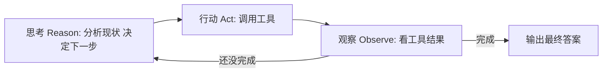
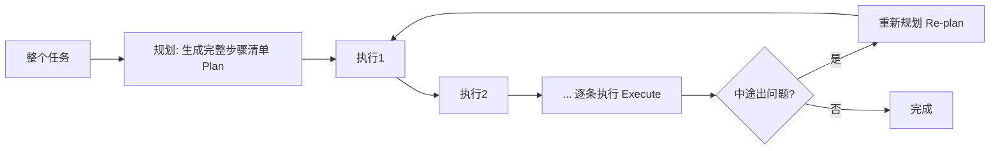
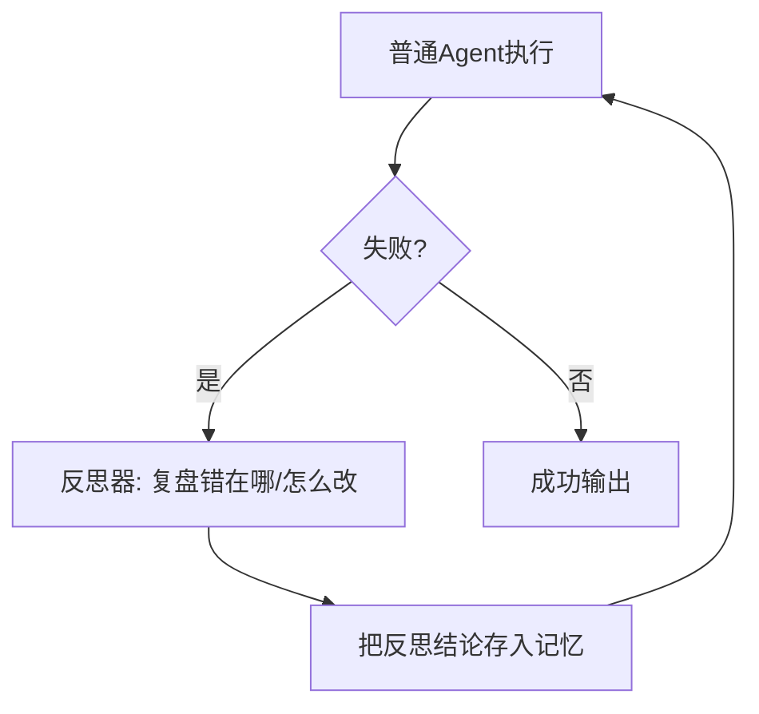
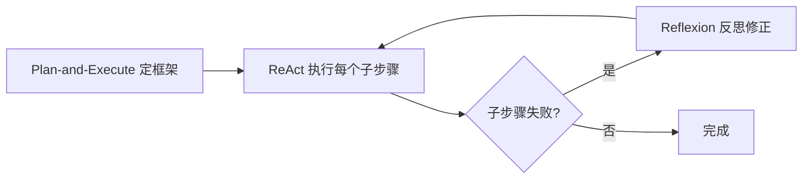

# 阶段二 · 小点 3：经典 Agent 工作范式

> 所属：阶段二 AI Agent 核心理论与基础范式（必懂）
> 定位：四大组件是"零件"，工作范式是"装配图纸"——它决定循环怎么转。这一讲的 ReAct 是**理解一切 Agent 的最小单元**，一定要亲手复现一次；其他范式都是在这个基础上做增减。学完你会突然看懂 LangGraph 里那些 `Node / Edge` 到底在拼什么。

## 精简大纲

1. ReAct 范式：思考 → 行动 → 观察
2. Plan-and-Execute：先规划后执行
3. Reflexion：失败反思重试
4. AutoGPT 模式：自主目标拆解
5. 范式选型对比

## 学习内容详情

### 1. ReAct（Reason + Act）—— 最经典

#### 1.1 循环结构



- 每轮先「想」（分析现状、决定下一步）→ 再「做」（调用工具）→ 再「观察」（看工具结果），三者循环。
- 优势：简单、通用、易实现。
- 局限：没有全局规划，长任务易「走一步算一步」循环跑偏。
- **思考-行动-观察** 是理解所有 Agent 循环的最小单元。

#### 1.2 最朴素的手写 ReAct（阶段二最重要练习）

下面这个 Demo 不依赖任何框架，只用 openai SDK + 一个工具函数，其余全部手写。请逐行读懂它——这就是所有 Agent 框架抽掉外壳后的内核。

```python
import json
import re
from openai import OpenAI

client = OpenAI(api_key="YOUR_KEY")   # 替换为真实 Key, 或改用 os.environ["OPENAI_API_KEY"]；也可直接跑仓库离线版 code/阶段二/react_agent.py

# ========== 第 1 步: 声明唯一一个工具 ==========
TOOLS = [{
    "type": "function",
    "function": {
        "name": "get_weather",
        "description": "查询指定城市的实时天气",
        "parameters": {
            "type": "object",
            "properties": {"city": {"type": "string"}},
            "required": ["city"],
        },
    },
}]

# ========== 第 2 步: 实现工具本体 ==========
def get_weather(city: str) -> str:
    # 模拟真实天气查询
    table = {"北京": "晴 26°C", "上海": "小雨 24°C", "广州": "多云 30°C"}
    return table.get(city, "暂未收录该城市")

# ========== 第 3 步: 手写 ReAct 主循环 ==========
def run_react(user_question: str, max_turns: int = 5):
    messages = [{"role": "user", "content": user_question}]
    turn = 0
    while turn < max_turns:                     # 熔断: 防死循环
        turn += 1
        print(f"\n===== 第 {turn} 轮 =====")
        resp = client.chat.completions.create(
            model="gpt-4o",
            messages=messages,
            tools=TOOLS,                        # 告诉模型有工具可用
        )
        msg = resp.choices[0].message

        if msg.tool_calls:                      # 模型决定"行动": 调工具
            messages.append(msg)                # ① 追加模型的 tool_calls 请求
            for tc in msg.tool_calls:
                print(f"[行动] 调用 {tc.function.name}({tc.function.arguments})")
                args = json.loads(tc.function.arguments)
                result = get_weather(args["city"])
                print(f"[观察] 工具返回: {result}")
                # ② 用同一个 tool_call_id 回传工具结果 → 成对
                messages.append({
                    "role": "tool",
                    "tool_call_id": tc.id,
                    "content": result,
                })
        else:
            # 模型没调工具 = 给出最终答案 → 结束
            print("[完成]", msg.content)
            return msg.content

    print(f"已达最大轮次 {max_turns}, 熔断终止")   # 熔断
    return None

run_react("北京今天天气怎么样？")
# 期望过程: [行动] get_weather("北京") → [观察] 晴 26°C → [完成] 回答
```

> **三个必观察现象**（来自原大纲，务必亲手复现）：
> 1. 把工具改成返回 `{"error": "接口超时"}`，看模型如何自我纠错重试。
> 2. 把 `max_turns` 去掉，给一个模型反复拿不准的问题，观察无限循环烧钱。
> 3. 让工具返回空字符串，看模型会不会把"没结果"当成"没数据"而给出幻觉答案。

### 2. Plan-and-Execute



- 先把整个任务拆成完整步骤清单（Plan），再逐条执行（Execute）。
- 优势：长周期任务有条理、token 更省（不必每步都规划）。
- 局限：初始计划错了后面跟着全错——**需要动态重规划补充机制**。

```python
def plan_and_execute(task: str, planner, executor, max_replans: int = 2):
    """Plan-and-Execute 骨架: 先规划, 执行中出错可重新规划。"""
    plan = planner(task)                 # 第一步: 让模型产出步骤清单
    print("计划:", plan)
    replans = 0

    for step in plan:
        ok = executor(step)              # 逐条执行
        if not ok and replans < max_replans:
            # 执行失败 → 重新规划一次, 不死守原计划
            replans += 1
            print(f"步骤[{step}]失败, 重新规划({replans})")
            plan = planner(task, hint=f"上一步 {step} 失败了, 请换路径")
            break                        # 用新计划重跑
    print("完成")
```

### 3. Reflexion（反思重试）



- 普通 Agent + 失败反思器：失败后让模型复盘「错在哪、怎么改」，结论存记忆再重试。
- 优势：显著提升成功率；代价：多跑几轮、token 开销更高。

```python
def reflexion_agent(task: str, max_attempts: int = 3):
    """Reflexion 骨架: 失败 → 反思 → 带教训重试。"""
    reflection = ""                        # 累积的反思结论
    for attempt in range(1, max_attempts + 1):
        print(f"\n--- 第 {attempt} 次尝试 ---")
        result = run_react(task + (f"\n[上次教训] {reflection}" if reflection else ""))
        if result is not None:
            return result                  # 成功直接返回
        # 失败: 让模型复盘, 把结论作为下一轮的"教训"
        reflection = reflect(task, result)   # reflect() 为本例未给出的复盘函数, 需自行实现
    raise RuntimeError("多次尝试仍失败")
```

### 4. AutoGPT 模式

- 给一个目标（如「帮我建个网站」），Agent 自主拆解并无限循环执行直到自认为完成。
- 优势：Demo 惊艳；局限：容易死循环、任务发散、不可控——**生产慎用**。

> 一句话记住定位：AutoGPT 是"演示很酷、生产吓人"的反面教材。它暴露了"没有熔断、没有人在回路、没有白名单"会变成什么样——所以前面组件讲的熔断 / 高危确认在这是刚需。

### 5. 范式选型对比

| 范式 | 特点 | 代价 / 风险 | 适用 |
|-|-|-|-|
| ReAct | 简单通用 | 长任务易跑偏 | 绝大多数日常任务 |
| Plan-and-Execute | 长任务有条理 | 初始计划错则全错 | 长周期复杂任务 |
| Reflexion | 失败自我修正 | 多消耗 token | 成功率优先场景 |
| AutoGPT | 自主拆解 | 不可控易死循环 | 仅原型演示 |

- **业务落地常混合范式**：如 Plan-and-Execute 定框架 + ReAct 执行子步骤 + Reflexion 兜底。



### 6. 动手练习（阶段二最重要）

- 用最朴素的 Python 复现 Agent 核心循环：只用 openai 官方 SDK + 一个工具函数，其余全部手写。
- 三个必观察现象：工具返回「错误」时模型如何自我纠错；网络抖动时的重试必要性；去掉 max_turns 熔断后无限循环烧钱风险。

> 💡 **可直接跑起来的完整版**：进阶练习请直接使用 [阶段二综合实战：手写完整 Agent](05-阶段二综合实战-手写完整Agent.md) 的配套代码 [`react_agent.py`](../../code/阶段二/react_agent.py)。它把 ReAct / Plan-and-Execute / Reflexion 三种范式都写成了一个**无需 API Key、离线可运行**的完整 Agent（内置 MockLLM），跑完 `python3 code/阶段二/react_agent.py` 再对照文档改造即可。

## 本节自检

- [ ] 能口述 ReAct / Plan-and-Execute / Reflexion 三种范式的循环结构与代价
- [ ] 已完成一个不依赖框架的手写 ReAct Agent Demo，并复现过至少一种失败模式（格式解析失败 / 死循环 / 幻觉）

## 本节配套思考题（快速入门的检验）

1. ReAct 里"思考-行动-观察"三者的顺序为什么必须是循环而非一次性？如果把"观察"去掉会退化成什么？
2. Plan-and-Execute 相比 ReAct 省 token 的根本原因是什么？它的最大单点风险又是什么？
3. Reflexion 的"教训"如果一直攒下去，对上下文会有什么压力？你会怎么给它瘦身（参考阶段一的上下文压缩）？
4. 把上面的手写 ReAct Demo 跑起来，故意让工具返回错误，观察模型怎么自救——把过程用三句话记录下来。