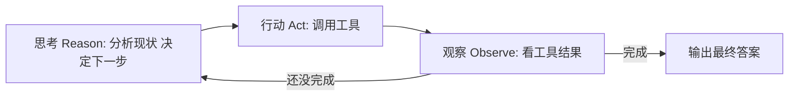
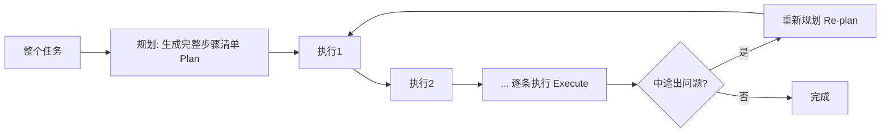
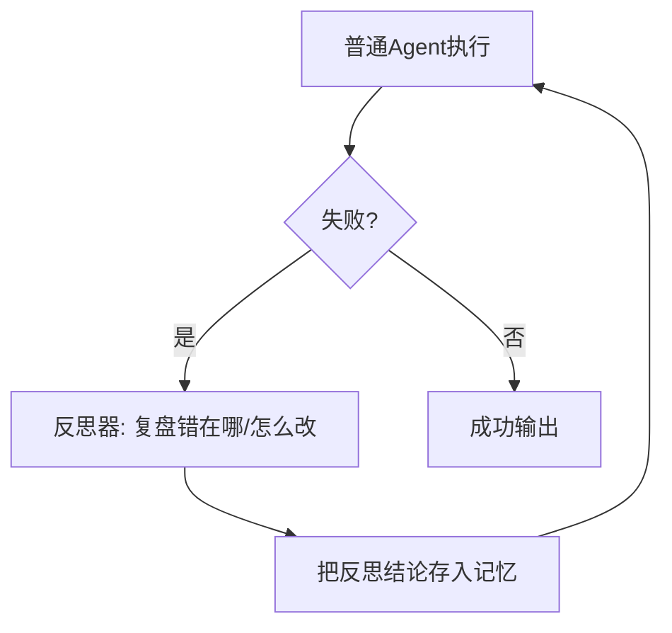
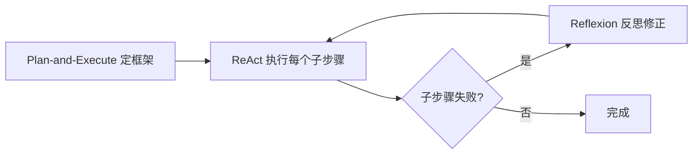

# 阶段二 · 小点 3：经典 Agent 工作范式

> 所属：阶段二 AI Agent 核心理论与基础范式（必懂）
> 定位：四大组件是"零件"，工作范式是"装配图纸"——它决定循环怎么转。这一讲的 ReAct 是**理解一切 Agent 的最小单元**，一定要亲手复现一次；其他范式都是在这个基础上做增减。学完你会突然看懂 LangGraph 里那些 `Node / Edge` 到底在拼什么。

## 精简大纲

1. ReAct 范式：思考 → 行动 → 观察
2. Plan-and-Execute：先规划后执行
3. Reflexion：失败反思重试
4. AutoGPT 模式：自主目标拆解
5. 范式选型对比

## 学习内容详情

### 1. ReAct（Reason + Act）—— 最经典

#### 1.1 循环结构



- 每轮先「想」（分析现状、决定下一步）→ 再「做」（调用工具）→ 再「观察」（看工具结果），三者循环。
- 优势：简单、通用、易实现。
- 局限：没有全局规划，长任务易「走一步算一步」循环跑偏。
- **思考-行动-观察** 是理解所有 Agent 循环的最小单元。

> 🔬 **深度理解 · ReAct（思考-行动-观察）**：
> 1. **本质**：ReAct 把"推理（Reason）"和"行动（Act）"耦合进同一个循环，让模型**用语言边想边做**——它的每一步思考都写在上下文里，天然形成可追溯的推理轨迹。
> 2. **机制**：每一轮：**思考**——模型基于当前上下文分析现状、决定下一步（输出"我要查什么"或动作计划）；**行动**——据此调用一个工具并携带参数；**观察**——把工具返回的结果追加回上下文，作为下一轮思考的新信息。循环直到模型认为自己可以直接给出最终答案。
> 3. **为什么重要**：它是所有 Agent 框架抽掉外壳后的内核（LangGraph 的每个 Node 本质上都是"一次思考或一次行动"）。它同时解决"如何规划下一步"和"如何获取外部信息"两个问题；局限是缺少整体前瞻，长任务易"走一步算一步"地跑偏。
> 4. **易错点/常见误解**：新手以为 ReAct 的"行动"是执行代码逻辑，其实模型只负责**决策与产出动作请求**，真正执行在工具层；也常误解"观察"可省——去掉观察，模型就失去外部反馈，退化成"无信息来源地自说自话"。

#### 1.2 最朴素的手写 ReAct（阶段二最重要练习）

下面这个 Demo 不依赖任何框架，只用 openai SDK + 一个工具函数，其余全部手写。请逐行读懂它——这就是所有 Agent 框架抽掉外壳后的内核。

```python
import json
import re
from openai import OpenAI

client = OpenAI(api_key="YOUR_KEY")   # 替换为真实 Key, 或改用 os.environ["OPENAI_API_KEY"]；也可直接跑仓库离线版 code/阶段二/react_agent.py

# ========== 第 1 步: 声明唯一一个工具 ==========
TOOLS = [{
    "type": "function",
    "function": {
        "name": "get_weather",
        "description": "查询指定城市的实时天气",
        "parameters": {
            "type": "object",
            "properties": {"city": {"type": "string"}},
            "required": ["city"],
        },
    },
}]

# ========== 第 2 步: 实现工具本体 ==========
def get_weather(city: str) -> str:
    # 模拟真实天气查询
    table = {"北京": "晴 26°C", "上海": "小雨 24°C", "广州": "多云 30°C"}
    return table.get(city, "暂未收录该城市")

# ========== 第 3 步: 手写 ReAct 主循环 ==========
def run_react(user_question: str, max_turns: int = 5):
    messages = [{"role": "user", "content": user_question}]
    turn = 0
    while turn < max_turns:                     # 熔断: 防死循环
        turn += 1
        print(f"\n===== 第 {turn} 轮 =====")
        resp = client.chat.completions.create(
            model="gpt-4o",
            messages=messages,
            tools=TOOLS,                        # 告诉模型有工具可用
        )
        msg = resp.choices[0].message

        if msg.tool_calls:                      # 模型决定"行动": 调工具
            messages.append(msg)                # ① 追加模型的 tool_calls 请求
            for tc in msg.tool_calls:
                print(f"[行动] 调用 {tc.function.name}({tc.function.arguments})")
                args = json.loads(tc.function.arguments)
                result = get_weather(args["city"])
                print(f"[观察] 工具返回: {result}")
                # ② 用同一个 tool_call_id 回传工具结果 → 成对
                messages.append({
                    "role": "tool",
                    "tool_call_id": tc.id,
                    "content": result,
                })
        else:
            # 模型没调工具 = 给出最终答案 → 结束
            print("[完成]", msg.content)
            return msg.content

    print(f"已达最大轮次 {max_turns}, 熔断终止")   # 熔断
    return None

run_react("北京今天天气怎么样？")
# 期望过程: [行动] get_weather("北京") → [观察] 晴 26°C → [完成] 回答
```

> **三个必观察现象**（来自原大纲，务必亲手复现）：
> 1. 把工具改成返回 `{"error": "接口超时"}`，看模型如何自我纠错重试。
> 2. 把 `max_turns` 去掉，给一个模型反复拿不准的问题，观察无限循环烧钱。
> 3. 让工具返回空字符串，看模型会不会把"没结果"当成"没数据"而给出幻觉答案。

### 2. Plan-and-Execute



- 先把整个任务拆成完整步骤清单（Plan），再逐条执行（Execute）。
- 优势：长周期任务有条理、token 更省（不必每步都规划）。
- 局限：初始计划错了后面跟着全错——**需要动态重规划补充机制**。

> 🔬 **深度理解 · Plan-and-Execute（先规划后执行）**：
> 1. **本质**：把"想"和"做"分离成两个阶段——先用一次较贵的推理生成完整步骤清单（Plan），再逐条机械执行（Execute），从而**把规划成本从"每步一次"摊薄为"整体一次"**。
> 2. **机制**：`planner` 一次性产出有序步骤清单；`executor` 逐条调用工具执行；一旦某步执行失败且还有重规划额度，就调用 `planner(task, hint=...)`，携带失败信息生成新计划，而非死守原计划。这相当于给"一次性规划"加了一个失败回退钩子。
> 3. **为什么重要**：相比 ReAct 每步都让模型思考"下一步做什么"，Plan-and-Execute 只在规划时花大 token，执行步骤由确定性的调度完成，所以长任务普遍更省、更有条理。单点风险在于：**规划阶段的错会传导到所有执行步骤**，因此必须有 Re-plan。
> 4. **易错点/常见误解**：新手以为"先规划"就一定比 ReAct 聪明。其实计划生成本身会出错，且相比 ReAct 少了对中途新信息做出反应的窗口；在任务步骤之间强耦合、需要随时调整的场景，纯 Plan-and-Execute 反而更笨重。

```python
def plan_and_execute(task: str, planner, executor, max_replans: int = 2):
    """Plan-and-Execute 骨架: 先规划, 执行中出错可重新规划。"""
    plan = planner(task)                 # 第一步: 让模型产出步骤清单
    print("计划:", plan)
    replans = 0

    for step in plan:
        ok = executor(step)              # 逐条执行
        if not ok and replans < max_replans:
            # 执行失败 → 重新规划一次, 不死守原计划
            replans += 1
            print(f"步骤[{step}]失败, 重新规划({replans})")
            plan = planner(task, hint=f"上一步 {step} 失败了, 请换路径")
            break                        # 用新计划重跑
    print("完成")
```

### 3. Reflexion（反思重试）



- 普通 Agent + 失败反思器：失败后让模型复盘「错在哪、怎么改」，结论存记忆再重试。
- 优势：显著提升成功率；代价：多跑几轮、token 开销更高。

> 🔬 **深度理解 · Reflexion（失败反思重试）**：
> 1. **本质**：Reflexion 不同于"原地重试"，它通过一个**显式的反思器**把每次失败沉淀成结构化的"教训"，再带着教训重新开始——核心是把失败从"要重跑的次数"转译为"要修正的策略"。
> 2. **机制**：普通 Agent 执行失败后，反思器用另一段提示让模型回答"错在哪、为什么、下次怎么改"，产出 `reflection` 文本；下一轮把这段教训拼进执行输入（常拼入 system prompt 或记忆），模型带着上次的错误认知重新决策。`max_attempts` 控制循环，不给死磕无限次。
> 3. **为什么重要**：很多失败是"同一个策略换种执行"兜不住的，Reflexion 让模型有机会跳出原来的错误路径，显著提升复杂任务成功率；代价是多轮调用带来更高的 token 与延迟，适合"成功率优先"的场景。
> 4. **易错点/常见误解**：新手以为"反思了就会变聪明"。反思能否奏效取决于模型是否找到**真因**，否则只会自圆其说地重复错误；且教训会持续占据上下文并可能"串味"到后续不相关任务，需要压缩与限定适用范围（这正是阶段二第 5 讲把教训拼 system_prompt 时的取舍）。

```python
def reflexion_agent(task: str, max_attempts: int = 3):
    """Reflexion 骨架: 失败 → 反思 → 带教训重试。"""
    reflection = ""                        # 累积的反思结论
    for attempt in range(1, max_attempts + 1):
        print(f"\n--- 第 {attempt} 次尝试 ---")
        result = run_react(task + (f"\n[上次教训] {reflection}" if reflection else ""))
        if result is not None:
            return result                  # 成功直接返回
        # 失败: 让模型复盘, 把结论作为下一轮的"教训"
        reflection = reflect(task, result)   # reflect() 为本例未给出的复盘函数, 需自行实现
    raise RuntimeError("多次尝试仍失败")
```

### 4. AutoGPT 模式

- 给一个目标（如「帮我建个网站」），Agent 自主拆解并无限循环执行直到自认为完成。
- 优势：Demo 惊艳；局限：容易死循环、任务发散、不可控——**生产慎用**。

> 一句话记住定位：AutoGPT 是"演示很酷、生产吓人"的反面教材。它暴露了"没有熔断、没有人在回路、没有白名单"会变成什么样——所以前面组件讲的熔断 / 高危确认在这是刚需。

> ⏳ **短期可不深究**：AutoGPT 模式第一遍不必深究其具体实现——它的价值主要在于当一个"反面教材"，让你看到"缺少熔断、人在回路、白名单"会失控成什么样。你只需记住它的定位和教训即可，因为它生产基本用不上，学了细节也容易过时。

### 5. 范式选型对比

| 范式 | 特点 | 代价 / 风险 | 适用 |
|-|-|-|-|
| ReAct | 简单通用 | 长任务易跑偏 | 绝大多数日常任务 |
| Plan-and-Execute | 长任务有条理 | 初始计划错则全错 | 长周期复杂任务 |
| Reflexion | 失败自我修正 | 多消耗 token | 成功率优先场景 |
| AutoGPT | 自主拆解 | 不可控易死循环 | 仅原型演示 |

- **业务落地常混合范式**：如 Plan-and-Execute 定框架 + ReAct 执行子步骤 + Reflexion 兜底。



### 6. 动手练习（阶段二最重要）

- 用最朴素的 Python 复现 Agent 核心循环：只用 openai 官方 SDK + 一个工具函数，其余全部手写。
- 三个必观察现象：工具返回「错误」时模型如何自我纠错；网络抖动时的重试必要性；去掉 max_turns 熔断后无限循环烧钱风险。

> 💡 **可直接跑起来的完整版**：进阶练习请直接使用 [阶段二综合实战：手写完整 Agent](05-阶段二综合实战-手写完整Agent.md) 的配套代码 [`react_agent.py`](../../code/阶段二/react_agent.py)。它把 ReAct / Plan-and-Execute / Reflexion 三种范式都写成了一个**无需 API Key、离线可运行**的完整 Agent（内置 MockLLM），跑完 `python3 code/阶段二/react_agent.py` 再对照文档改造即可。

## 本节自检

- [ ] 能口述 ReAct / Plan-and-Execute / Reflexion 三种范式的循环结构与代价
- [ ] 已完成一个不依赖框架的手写 ReAct Agent Demo，并复现过至少一种失败模式（格式解析失败 / 死循环 / 幻觉）

## 本节配套思考题（快速入门的检验）

1. ReAct 里"思考-行动-观察"三者的顺序为什么必须是循环而非一次性？如果把"观察"去掉会退化成什么？
2. Plan-and-Execute 相比 ReAct 省 token 的根本原因是什么？它的最大单点风险又是什么？
3. Reflexion 的"教训"如果一直攒下去，对上下文会有什么压力？你会怎么给它瘦身（参考阶段一的上下文压缩）？
4. 把上面的手写 ReAct Demo 跑起来，故意让工具返回错误，观察模型怎么自救——把过程用三句话记录下来。

## 本节常见面试题（深度解析）

> 针对本节核心知识的面试高频点，配合"本质+机制"式理解，能让你答得既有深度又有广度。

### 面试题 1：为什么说 ReAct 是"理解一切 Agent 的最小单元"？它和普通多轮对话的核心差异是什么？
- **面试官想考察**：对 ReAct 机制本质的把握，能否讲清"循环 + 工具反馈"与普通对话的分野。
- **专业作答（含深度）**：
  1. ReAct = 思考 → 行动（调工具）→ 观察（看结果）→ 再思考，三类动作循环，直到给出最终答案。
  2. **最小单元的含义**：更高阶范式（Plan-and-Execute、Reflexion）都能被看成"在 ReAct 单个循环的某些环节上做扩展"——如 Plan-and-Execute 是把"思考"提前批量做掉，Reflexion 是在失败后往循环里注入教训；LangGraph 的每个 Node，也无非是"一次思考 Node / 一次工具 Node"。
  3. **与多轮对话的差异**：多轮对话只是上下文延续，模型每一轮都端到端生成文本；ReAct 引入了"模型决策是否调用工具、工具结果作为`role: tool`回传"的结构化协议，行为由"外部观测 + 内部推理"共同驱动。
  4. **定位**：正因为最朴素，它最容易手写复现，也最能暴露循环无熔断、错误不回传等工程问题——所以是打地基必练项。
- **加分亮点 / 深度追问**：补"ReAct 的局限恰是没有全局规划，这也是它给 Plan-and-Execute 留出的改进空间"；追问：什么时候 ReAct 会明显不如 Plan-and-Execute？答：任务步骤多且需要整体条理、长期前后依赖时，ReAct 每步规划既贵又易跑偏。

### 面试题 2：Plan-and-Execute 比 ReAct 省 token 的根本原因是什么？它的最大单点风险如何缓解？
- **面试官想考察**：是否真懂"规划成本摊薄"与"DAG 式计划失效"两件事，而非只会背结论。
- **专业作答（含深度）**：
  1. **省 token 的原因**：ReAct 每执行一步都要让模型重新推理"下一步做什么"，规划成本随步数线性累积；Plan-and-Execute 用**一次**较贵的推理生成整体清单，执行步骤的"下一步"由确定性调度决定，不再消耗模型推理，故长任务普遍省。
  2. **最大单点风险**：初始计划出错会传导到后续所有执行步骤（总体错在"源头"）。
  3. **缓解手段**：加 Re-plan 回退钩子——某步失败或结果不符时，携带失败上下文重新让 planner 产出新计划而不是硬执行原计划；再叠加"拆大计划为可重规划的分段"降低单点风险半径。
  4. **权衡**：它对"步骤内部还要动态用外部信息"的任务并不友好，此时不如 ReAct 灵活。
- **加分亮点 / 深度追问**：可补"业界常混合使用：Plan-and-Execute 定框架、ReAct 执行每个子步骤、Reflexion 兜底失败"；追问：只把计划拆大再执行一段，跟 ReAct 的分界线在哪？答：分界线在"执行步骤是否需要向模型重新决策"，仍然是不需要则为 Plan-and-Execute。

### 面试题 3：Reflexion 和普通"失败就重试"的本质区别？它的反思结论应放哪、怎么避免污染？
- **面试官想考察**：能否把"反思"讲成改变策略的机制，而非玄学；以及是否意识到教训的适用范围管理。
- **专业作答（含深度）**：
  1. **本质区别**：重试是"同一策略重跑赌概率没换策略"；Reflexion 是在重试前**生成一段结构化教训**（错在哪、为什么、下次怎么改），下一轮带着教训执行——改变的是策略而非次数。所以它要求反思找真因，否则只会自圆其说地重复。
  2. **机制**：反思器独立于执行器，失败后单独调一次模型产出 `reflection`；再通过 `max_attempts` 限制尝试次数，避免无限消耗 token。
  3. **放哪**：可拼入 system prompt（更聚焦当前任务、不易串味）或写入对话历史/长期记忆（生存期更长）。放 system_prompt 利于"短时间内集中修正"，但注意它对同任务内也可误伤其它步骤。
  4. **防污染**：限定教训的作用域（只对本次失败相关路径生效）、对教训去重和压缩、超过窗口就截断，避免上一任务教训"串味"污染新任务。
- **加分亮点 / 深度追问**：补"Reflexion 多年跃生产力在于它是'自我纠错闭环'，也是 Self-Refine、Self-Consistency 一类自纠正技术的简化模型"；追问：教训拼在 system prompt vs 对话历史哪个更环保？答：system 更聚焦却生存期短、历史更持久却易污染，可视任务长在做取舍。