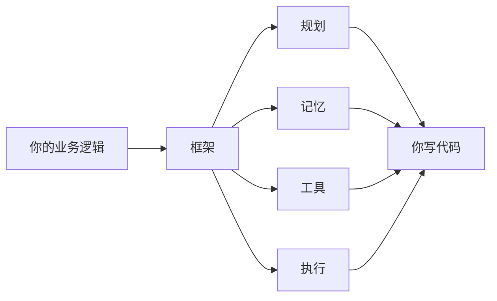
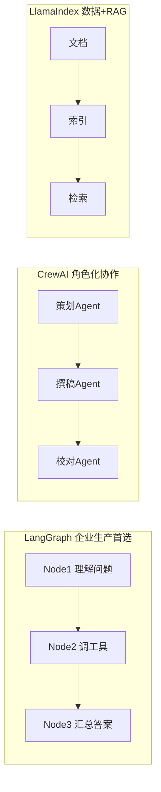
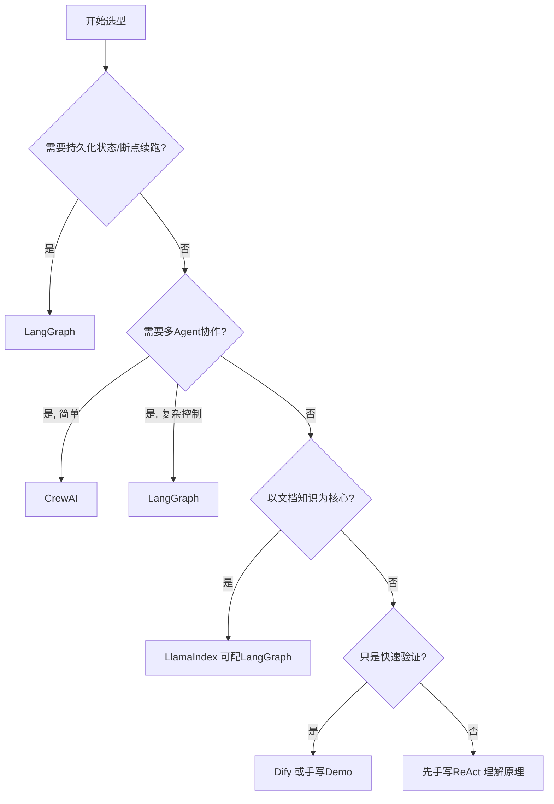

# 阶段二 · 小点 4：Agent 框架选型决策参考

> 所属：阶段二 AI Agent 核心理论与基础范式
> 定位：你已经知道 Agent 的零件（组件）和图纸（范式）了，这一讲回答一个现实问题：**我该用哪个框架，还是干脆手写？** 别急着追新框架——先按需求问 4 个问题，答案会自己浮现。这也是阶段三正式学 LangGraph / CrewAI 等之前的一次"路线预演"。

## 精简大纲

1. 框架的本质：封装「规划-记忆-工具-执行」
2. 主流框架定位速览（LangGraph / CrewAI / AutoGen / LlamaIndex / Dify）
3. 选型决策树：按业务需求问 4 个问题

## 学习内容详情

### 1. 框架的本质



- 框架把阶段二讲的「规划-记忆-工具-执行」封装成可复用代码库，你写业务逻辑即可，不用从零造轮子。但**本质还是那些概念**——阶段二学的组件和范式，在框架里只是换了层皮（Node / State / Checkpointer 等名字）。
- 并不是「新项目必须上框架」：先想清楚需求再选型。需求很简单时，手写 ReAct 反而更可控、依赖更少。

```python
# 判断该不该上框架的简单体检: 命中≥2条才值得
def should_use_framework(needs: list[str]) -> bool:
    framework_worthy = [
        "需要持久化状态/断点续跑",      # 状态机 + Checkpointer
        "需要复杂多Agent协作",          # 编排与通信
        "需要人类审批节点",             # Human-in-the-loop
        "需要可视化调试/追踪",          # 运行图可视化
        "团队协作、要长期维护",         # 约定优于自研
    ]
    hits = sum(1 for n in needs if n in framework_worthy)
    return hits >= 2

print(should_use_framework(["简单问答", "一个工具"]))          # False → 手写即可
print(should_use_framework(["需要断点续跑", "需要人类审批"]))  # True → 上框架
```

### 2. 主流框架定位速览

| 框架 | 定位 | 对应概念 | 一句话记忆 |
|-|-|-|-|
| LangGraph | 以「图」（Node 节点 + Edge 边）组织流程，状态驱动、支持持久化与中断恢复，企业生产首选 | State≈工作记忆，Node≈执行动作，Checkpointer≈记忆持久化 | "把 Agent 画成一张流程图" |
| CrewAI | 强调「角色化」多 Agent：角色 / 目标 / 背景故事，Crew 编排协作，上手快 | 自定义状态流转弱 | "给 Agent 写角色卡" |
| AutoGen | Agent 之间用自然语言「对话」协作，内置代码沙箱，适合研究与原型 | 生产注意沙箱安全；⚠️ 已进入维护模式，官方新框架为 Microsoft Agent Framework | "让 Agent 们互相聊天" |
| LlamaIndex | 数据 + RAG 一体化框架，文档知识问答做检索层最顺 | 常配 LangGraph 编排 | "知识库的瑞士军刀" |
| Dify | 低代码平台，拖拽编排，适合快速验证 | 灵活性受平台限制 | "拖拽搭 Agent" |



### 3. 选型决策树（按业务需求顺序问 4 个问题）



1. **是否需要持久化状态 / 中断恢复？** → 要则 **LangGraph** 优先。
2. **是否需要多 Agent 协作？** → 要且简单用 **CrewAI**，要复杂控制则 **LangGraph**。
3. **是否以文档知识为核心？** → 是则 **LlamaIndex**（可配 LangGraph 编排）。
4. **只是快速验证想法？** → **Dify** 或直接手写 Demo。

### 4. 场景示例

| 场景 | 关键需求 | 选型结论 |
|-|-|-|
| A 企业客服 | 保存会话、断线续聊、调知识库 | 持久化 + 多轮 + RAG → LlamaIndex 做检索层 + LangGraph 做编排层 |
| B 内容团队快速试做文案 | 快速原型 | Dify 或手写简单 Demo |
| C 内部 BI 数据分析助手 | 查询状态机与分步执行 | 先手写 ReAct 理解原理，再评估 LangGraph 落地 |

```python
# 一个"把决策树翻译成代码"的选型助手
def choose_framework(needs: dict) -> str:
    """按业务需求返回推荐框架。needs 形如 {persist: bool, multi_agent: str, doc: bool, quick: bool}"""
    if needs["persist"]:
        return "LangGraph"                          # 问题1: 要持久化
    if needs["multi_agent"] == "complex":
        return "LangGraph"                          # 问题2: 复杂多Agent
    if needs["multi_agent"] == "simple":
        return "CrewAI"                             # 问题2: 简单多Agent
    if needs["doc"]:
        return "LlamaIndex (+LangGraph 编排)"        # 问题3: 文档知识
    if needs["quick"]:
        return "Dify 或手写 Demo"                    # 问题4: 快速验证
    return "先手写 ReAct 理解原理"                    # 默认: 打牢根基

print(choose_framework({"persist": True, "multi_agent": "no", "doc": True, "quick": False}))
# LangGraph  ← 企业客服场景
print(choose_framework({"persist": False, "multi_agent": "simple", "doc": False, "quick": False}))
# CrewAI    ← 简单角色化协作
```

> **一条重要提醒**：阶段二建议先把"手写 ReAct"做扎实再接触框架。框架给你的是效率和工程化，但如果连"循环在干嘛"都不清楚，框架报错你根本无从下手。顺序：**先手写 → 再用框架**。

## 本节自检

- [ ] 能按业务条件在 4 个主流框架中给出选型结论并说明理由
- [ ] 能说出 LangGraph 的 State / Node / Checkpointer 各自对应四大组件里的谁
- [ ] 能判断"该不该上框架"的边界（手写 vs 框架）

## 本节配套思考题（快速入门的检验）

1. 为什么"要持久化 / 断点续跑"是选 LangGraph 的第一优先问题？它对应四大组件里的哪个能力？
2. CrewAI 的"角色化"和 LangGraph 的"图编排"分别适合什么协作复杂度？分界线在哪？
3. 一个只做"天气查询"的单轮问答，用框架还是手写？说说你的取舍依据。
4. 用第 3 节的决策树给"企业内部文档智能问答助手"走一遍，得出什么结论？