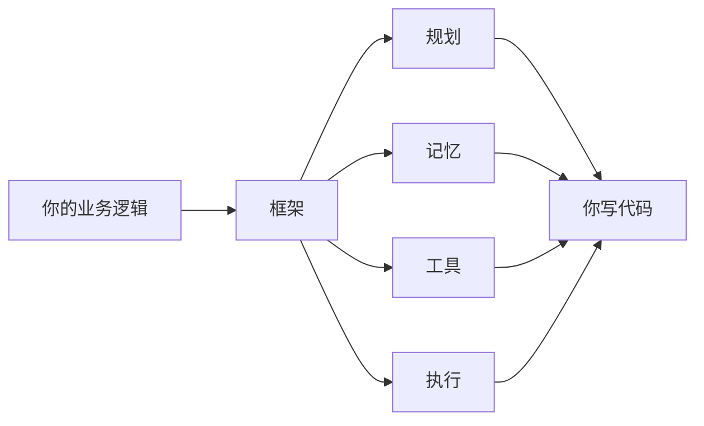
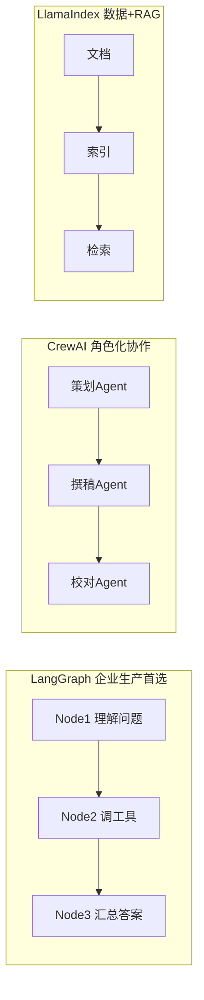
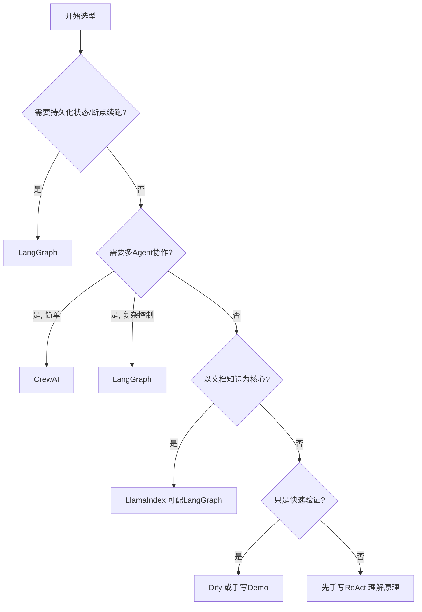

# 阶段二 · 小点 4：Agent 框架选型决策参考

> 所属：阶段二 AI Agent 核心理论与基础范式
> 定位：你已经知道 Agent 的零件（组件）和图纸（范式）了，这一讲回答一个现实问题：**我该用哪个框架，还是干脆手写？** 别急着追新框架——先按需求问 4 个问题，答案会自己浮现。这也是阶段三正式学 LangGraph / CrewAI 等之前的一次"路线预演"。

## 精简大纲

1. 框架的本质：封装「规划-记忆-工具-执行」
2. 主流框架定位速览（LangGraph / CrewAI / AutoGen / LlamaIndex / Dify）
3. 选型决策树：按业务需求问 4 个问题

## 学习内容详情

### 1. 框架的本质



- 框架把阶段二讲的「规划-记忆-工具-执行」封装成可复用代码库，你写业务逻辑即可，不用从零造轮子。但**本质还是那些概念**——阶段二学的组件和范式，在框架里只是换了层皮（Node / State / Checkpointer 等名字）。
- 并不是「新项目必须上框架」：先想清楚需求再选型。需求很简单时，手写 ReAct 反而更可控、依赖更少。

> 🔬 **深度理解 · 框架如何封装四大组件（以 LangGraph 的 State / Node / Checkpointer 为例）**：
> 1. **本质**：框架不发明新概念，它只是把"规划-记忆-工具-执行"这套抽象变成可复用代码库，用一张运行图 / 状态机把它们串起来；你仍写业务逻辑，框架替你完成调度、持久化与追踪。
> 2. **机制**：`Node` 是一个执行单元（一次思考或一次工具调用），`Edge` 定义节点间的转移与条件分支，二者组成有向图；`State` 是跨节点共享的任务状态（对应四大组件里的"工作记忆"）；`Checkpointer` 在每一步把 State 持久化到外部存储，支持宕机 / 中断后的断点续跑（对应"持久化记忆"）。
> 3. **为什么重要**：框架解决的是工程问题而非模型问题——状态怎么存、循环怎么保证不失控、错误 / 人工审批节点怎么编排、运行过程怎么可视化。它把阶段二反复强调的熔断、人在回路、记忆持久化变成开箱即用的构件。
> 4. **易错点/常见误解**：新手以为"用了框架就自动会规划、会反思"。其实框架只提供机制，不替你实现策略——模型是否规划、何时反思、拆多少层仍是你的 Prompt 与流程设计；框架一旦报错，若不懂底层循环几乎无从排查。

```python
# 判断该不该上框架的简单体检: 命中≥2条才值得
def should_use_framework(needs: list[str]) -> bool:
    framework_worthy = [
        "需要持久化状态/断点续跑",      # 状态机 + Checkpointer
        "需要复杂多Agent协作",          # 编排与通信
        "需要人类审批节点",             # Human-in-the-loop
        "需要可视化调试/追踪",          # 运行图可视化
        "团队协作、要长期维护",         # 约定优于自研
    ]
    hits = sum(1 for n in needs if n in framework_worthy)
    return hits >= 2

print(should_use_framework(["简单问答", "一个工具"]))          # False → 手写即可
print(should_use_framework(["需要断点续跑", "需要人类审批"]))  # True → 上框架
```

> 🔬 **深度理解 · 手写 vs 框架的决策边界**：
> 1. **本质**：这不是"哪个技术更强"的比赛，而是"复杂度和可维护性放在哪个抽象层更划算"的工程决策；判断标准是"需求是否频繁触发框架能显著解决的问题"。
> 2. **机制**：框架的价值集中在几类非平凡需求——持久化状态 / 断点续跑（State + Checkpointer）、复杂多 Agent 编排、人工审批节点、可视化调试、团队长期维护。命中它们时，框架用约定与现成组件替你省下大量自研与踩坑；而需求只是"单轮问答 + 一个工具"时，引入框架反而带来学习成本、依赖体积与调试面上的额外负担。
> 3. **为什么重要**：选型应先于开发，在需求阶段就分清"该不该上框架"，避免"为用框架而造复杂系统"或"硬手写导致后期难维护"两个极端。
> 4. **易错点/常见误解**：新手常把"框架报错"和"模型 / 循环设计问题"混为一谈——框架报错往往源于上层循环设计不当而非框架本身；也要警惕"多框架大杂烩"，单一框架加必要插件通常更稳、可维护性更高。

### 2. 主流框架定位速览

| 框架 | 定位 | 对应概念 | 一句话记忆 |
|-|-|-|-|
| LangGraph | 以「图」（Node 节点 + Edge 边）组织流程，状态驱动、支持持久化与中断恢复，企业生产首选 | State≈工作记忆，Node≈执行动作，Checkpointer≈记忆持久化 | "把 Agent 画成一张流程图" |
| CrewAI | 强调「角色化」多 Agent：角色 / 目标 / 背景故事，Crew 编排协作，上手快 | 自定义状态流转弱 | "给 Agent 写角色卡" |
| AutoGen | Agent 之间用自然语言「对话」协作，内置代码沙箱，适合研究与原型 | 生产注意沙箱安全；⚠️ 已进入维护模式，官方新框架为 Microsoft Agent Framework | "让 Agent 们互相聊天" |
| LlamaIndex | 数据 + RAG 一体化框架，文档知识问答做检索层最顺 | 常配 LangGraph 编排 | "知识库的瑞士军刀" |
| Dify | 低代码平台，拖拽编排，适合快速验证 | 灵活性受平台限制 | "拖拽搭 Agent" |



> ⏳ **短期可不深究**：这张框架速览表里各框架的具体 API、上手命令和生态细节第一遍不必背——框架生态迭代快、细节容易过时，而且阶段三会正式上手。你只需记住它们各自"解决什么问题、适合什么场景"即可，真正选型时再打开官方文档看细节。

### 3. 选型决策树（按业务需求顺序问 4 个问题）



1. **是否需要持久化状态 / 中断恢复？** → 要则 **LangGraph** 优先。
2. **是否需要多 Agent 协作？** → 要且简单用 **CrewAI**，要复杂控制则 **LangGraph**。
3. **是否以文档知识为核心？** → 是则 **LlamaIndex**（可配 LangGraph 编排）。
4. **只是快速验证想法？** → **Dify** 或直接手写 Demo。

### 4. 场景示例

| 场景 | 关键需求 | 选型结论 |
|-|-|-|
| A 企业客服 | 保存会话、断线续聊、调知识库 | 持久化 + 多轮 + RAG → LlamaIndex 做检索层 + LangGraph 做编排层 |
| B 内容团队快速试做文案 | 快速原型 | Dify 或手写简单 Demo |
| C 内部 BI 数据分析助手 | 查询状态机与分步执行 | 先手写 ReAct 理解原理，再评估 LangGraph 落地 |

```python
# 一个"把决策树翻译成代码"的选型助手
def choose_framework(needs: dict) -> str:
    """按业务需求返回推荐框架。needs 形如 {persist: bool, multi_agent: str, doc: bool, quick: bool}"""
    if needs["persist"]:
        return "LangGraph"                          # 问题1: 要持久化
    if needs["multi_agent"] == "complex":
        return "LangGraph"                          # 问题2: 复杂多Agent
    if needs["multi_agent"] == "simple":
        return "CrewAI"                             # 问题2: 简单多Agent
    if needs["doc"]:
        return "LlamaIndex (+LangGraph 编排)"        # 问题3: 文档知识
    if needs["quick"]:
        return "Dify 或手写 Demo"                    # 问题4: 快速验证
    return "先手写 ReAct 理解原理"                    # 默认: 打牢根基

print(choose_framework({"persist": True, "multi_agent": "no", "doc": True, "quick": False}))
# LangGraph  ← 企业客服场景
print(choose_framework({"persist": False, "multi_agent": "simple", "doc": False, "quick": False}))
# CrewAI    ← 简单角色化协作
```

> **一条重要提醒**：阶段二建议先把"手写 ReAct"做扎实再接触框架。框架给你的是效率和工程化，但如果连"循环在干嘛"都不清楚，框架报错你根本无从下手。顺序：**先手写 → 再用框架**。

## 本节自检

- [ ] 能按业务条件在 4 个主流框架中给出选型结论并说明理由
- [ ] 能说出 LangGraph 的 State / Node / Checkpointer 各自对应四大组件里的谁
- [ ] 能判断"该不该上框架"的边界（手写 vs 框架）

## 本节配套思考题（快速入门的检验）

1. 为什么"要持久化 / 断点续跑"是选 LangGraph 的第一优先问题？它对应四大组件里的哪个能力？
2. CrewAI 的"角色化"和 LangGraph 的"图编排"分别适合什么协作复杂度？分界线在哪？
3. 一个只做"天气查询"的单轮问答，用框架还是手写？说说你的取舍依据。
4. 用第 3 节的决策树给"企业内部文档智能问答助手"走一遍，得出什么结论？

## 本节常见面试题（深度解析）

> 针对本节核心知识的面试高频点，配合"本质+机制"式理解，能让你答得既有深度又有广度。

### 面试题 1：项目什么时候该上手写、什么时候该上 Agent 框架？请给出清晰的判断思路。
- **面试官想考察**：是否有"按需求选技术"的工程判断力，而非"非框架不 Agent"或"啥都手写"的一刀切。
- **专业作答（含深度）**：
  1. **先定性**：选型不是"框架更强"，而是"把复杂度和可维护性放在哪个抽象层更划算"。
  2. **触发上框架的需求**：需要持久化状态 / 断点续跑、复杂多 Agent 协作、人工审批节点、可视化调试、团队长期维护——命中越多越值得上。
  3. **该手写的场景**：简单单轮问答、单一工具、团队/项目只想理解原理或快速验证 Demo——此时框架反增学习成本、依赖体积与调试面。
  4. **顺序建议**：阶段二先手写 ReAct 打牢"循环"的理解，再引入框架；否则框架报错时无从定位。
- **加分亮点 / 深度追问**：可补"用决策树给'企业内部文档问答'走一步：以文档知识为核心 → LlamaIndex 做检索层 + LangGraph 做编排层"；追问：如果需求现在简单、未来可能变复杂呢？答：优先选可平滑升级的轻量实现并预留抽象层，避免一开始就上重型框架。

### 面试题 2：LangGraph 里 State / Node / Checkpointer 分别对应四大组件里的"谁"？它为什么适合企业生产？
- **面试官想考察**：是否真正把"框架概念"映射回"Agent 原理"，而非只会背名词。
- **专业作答（含深度）**：
  1. **State** 对应"工作记忆"——它是跨节点共享、随任务生命周期存在并不断被读取/写入的任务状态（如当前进度、中间结果）。
  2. **Node** 对应"执行动作 / 循环中的一个环节"（一次思考或一次工具调用），Edge 决定流转与条件分支，共同构成状态机。
  3. **Checkpointer** 对应"持久化记忆"——把每步 State 落盘，支持宕机/中断后的断点续跑，这正是企业长任务与"人在回路能否跨时段恢复"的关键。
  4. **为何生产**：它把 Agent 变成"图 + 状态"这种可观测、可恢复、可编排的结构，稳定性与可调试性都优于裸循环。
- **加分亮点 / 深度追问**：补"Agent 的规划与反思不是框架自动给的，仍是 Prompt 与流程设计的事"；追问：Checkpointer 断点续跑在企业里有什么现实价值？答：长任务中途异常（超时/宕机/审计）可以从最后 Checkpoint 恢复，避免整体重跑、也便于人工介入审批。

### 面试题 3：多 Agent 协作选 CrewAI 还是 LangGraph？"简单 vs 复杂"的分界在哪？
- **面试官想考察**：能否清晰划分"低成本角色化协作"与"高精度图编排"两种需求，并说明依据。
- **专业作答（含深度）**：
  1. **CrewAI 定位**：以"角色卡"（角色/目标/背景故事）驱动，Crew 内多个角色 Agent 协作，上手快，适合协作链路简单、强角色分工、不追求细粒度状态控制的场景。
  2. **LangGraph 定位**：以"图 + 状态"显式编排，可精细控制分支、回溯、持久化与审批节点，适合需复杂控制流、需要精确状态或断点恢复的场景。
  3. **分界依据**：看协作是否需要"对流转做程序化控制"——若只是几个 Agent 一段对话式协作，CrewAI 够；若需要条件分支、循环回溯、人审节点、可恢复执行、精细共享状态，则 LangGraph。
  4. **另一层**：多智能体本身是"多个循环 + 通信与仲裁"，无论选哪个框架，通信、冲突、一致性这三类问题都躲不开，只是框架替你承担了多少。
- **加分亮点 / 深度追问**：可补"简单多 Agent 也可用 LangGraph 显式编排，复杂控制场景可穿插人机协作节点"；追问：什么时候多 Agent 不如单 Agent？答：任务本质串行、无明确子模块边界、单 Agent 上下文装得下时，多 Agent 只会增加通信损耗与一致性负担。