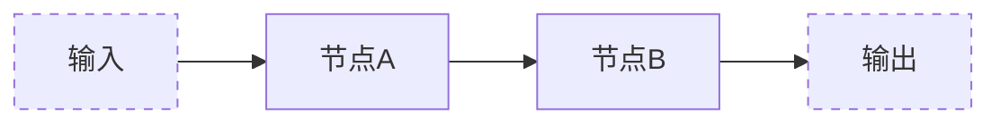
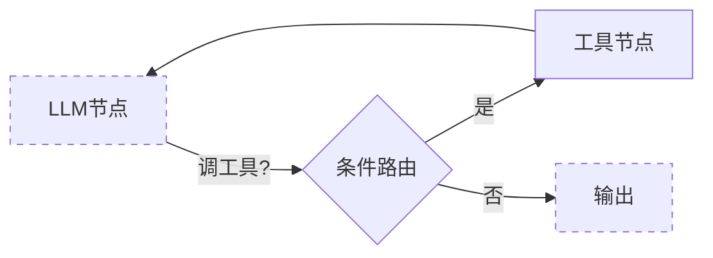

# 阶段三 · 小点 1：LangChain 基础

> 所属：阶段三 主流 Agent 开发框架（生产级首选·重中之重）
> 定位：LangChain 是整套 LangGraph 生态的地基——你用的 ChatModel / @tool / LCEL 全在这里。这一讲把 5 个核心零件逐个弄懂，并回答一个关键问题：为什么"链"不够用、必须上"图"（LangGraph）。

> **选用策略（读阶段三前先看）**：本阶段必修 LangChain + LangGraph；LlamaIndex 在阶段四做 RAG 时再深入；CrewAI / AutoGen / 其他方案了解选型即可。不必 6 套框架全啃，16 周计划只给前两者时间。

## 精简大纲

1. ChatModel：统一模型接口
2. PromptTemplate / FewShotPrompt：模板 + 变量分离
3. LCEL：表达式语言管道
4. @tool / bind_tools / AIMessage.tool_calls：工具体系
5. Chain 的局限与 LangGraph 的必然

## 学习内容详情

> 版本说明：LangChain / LangGraph 已于 2025 年 10 月发布 **1.0**（`langchain` 包重构，聚焦内置 Agent 架构）。本文示例基于稳定的 **LCEL 核心 API**，在 0.3.x 与 1.0 之间均兼容；`LLMChain` / `initialize_agent` 等旧接口已废弃，切记不要照抄旧教程。认准 LCEL、`@tool` 与 LangGraph 的 `StateGraph`。

### 1. ChatModel（模型封装）

#### 1.1 一张图看懂"换模型不改代码"

```mermaid
graph LR
    A[你的业务代码: 只调 .invoke()] --> B[ChatOpenAI]
    A --> C[ChatDeepSeek]
    A --> D[ChatOllama]
    B --> E[统一返回 AIMessage]
    C --> E
    D --> E
```

- 不管底层是 OpenAI、DeepSeek 还是本地 Ollama，都换成同一套 `.invoke()` 调用方式——切换模型只改 import 和一个参数，业务代码零改动。
- 例：`ChatDeepSeek(model="deepseek-chat")` 切 `ChatOllama(model="qwen2.5:7b")`。

```python
from langchain_openai import ChatOpenAI
from langchain_core.messages import HumanMessage

# 换模型只改这一行: ChatOpenAI( ... ) ↔ ChatDeepSeek(...) ↔ ChatOllama(...)
llm = ChatOpenAI(model="gpt-4o", temperature=0.2)

resp = llm.invoke([HumanMessage(content="用一句话介绍 Agent")])
print(resp.content)          # 统一都是 AIMessage, 用 .content 取文本
```

### 2. PromptTemplate / ChatPromptTemplate

- 把 prompt 里「固定不变」和「动态变化」分离成模板 + 变量（`{xxx}` 占位）。
- ChatPromptTemplate 专用于多轮对话（system / human / assistant 三种角色消息）。
- FewShotPrompt：自动把若干「输入→输出」示例拼进 prompt。

```python
from langchain_core.prompts import ChatPromptTemplate, MessagesPlaceholder

# 模板 + 变量分离: {topic} 是占位, 每次调用填入不同内容
prompt = ChatPromptTemplate.from_messages([
    ("system", "你是一位{domain}专家，回答请简洁专业。"),   # 系统角色+变量
    MessagesPlaceholder("history"),                      # 多轮历史占位
    ("human", "请解释：{topic}"),                         # 用户角色+变量
])

# 渲染成消息: 等价于手写一个字典列表
msgs = prompt.invoke({
    "domain": "AI",
    "history": [],                    # 假设没有历史
    "topic": "什么是 RAG",
})
print(msgs.to_messages())
```

> **记忆力点**：`MessagesPlaceholder("history")` 是 LangChain 做多轮对话的开关——后面接的变量 `history` 会被替换成历史消息列表。阶段三第 2 讲的 `MessagesState` 也是同样的"messages 占位"思想。

### 3. LCEL（LangChain 表达式语言）

- 用竖线 `|` 把组件串成管道：`prompt | llm | parser`，数据从左往右流过每个环节。
- LangChain 0.1 之后的核心语法，替代旧的 Chain 类。

```python
from langchain_core.output_parsers import StrOutputParser

# LCEL: 一条数据从左流到右的管道
chain = prompt | llm | StrOutputParser()
#   prompt  → 把词填进模板
#   llm     → 调用模型
#   parser  → 把 AIMessage 剥成纯字符串

text = chain.invoke({
    "domain": "编程", "history": [], "topic": "什么是装饰器",
})
print(text)   # 已经是纯字符串, 不用再取 .content
```

> **一句话理解 LCEL**：就是把"先 A 再 B 再 C"写成 `A | B | C`。组件之间自动做类型对接，少写大量样板代码。

#### 3.1 LCEL 实战：Agent 场景的并行、子链与工具调用

三个生产高频玩法，全部用 LCEL 原生能力完成，不引入任何新框架（`@tool` / `bind_tools` 的正式讲解在第 4 节，这里先看它们如何嵌进管道）：

```python
from langchain_core.output_parsers import StrOutputParser
from langchain_core.prompts import ChatPromptTemplate
from langchain_core.runnables import RunnableLambda, RunnableParallel
from langchain_core.tools import tool
from langchain_openai import ChatOpenAI

# OpenAI 兼容风格: 换 base_url 即可切 DeepSeek / Qwen / Ollama
llm = ChatOpenAI(
    model="deepseek-chat",
    api_key="YOUR_KEY",
    base_url="https://api.deepseek.com/v1",
    temperature=0.2,
)

# ---- 玩法1: RunnableParallel —— 「检索」与「问题改写」两路同时跑 ----
def retrieve(query: str) -> str:
    """模拟向量检索, 返回召回的参考资料。"""
    return f"[{query}] 召回的资料: Agent = LLM + 记忆 + 工具 + 规划..."

def rewrite(query: str) -> str:
    """把口语化的模糊问题补全成完整、无歧义的问题。"""
    return f"请说明 {query} 的核心概念与典型应用场景"

fan_out = RunnableParallel(
    docs=RunnableLambda(retrieve),      # 路A: 拿原问题直接检索
    question=RunnableLambda(rewrite),   # 路B: 同时补全问题, 两路互不等待
)
# 输出形如 {"docs": "...", "question": "..."}, 正好对上子链的两个占位变量

# ---- 玩法2: 子链组合 —— 「格式化上下文 | llm | 解析」封装一次, 处处复用 ----
format_prompt = ChatPromptTemplate.from_messages([
    ("system", "你是一位严谨的助手, 只依据给定资料回答。"),
    ("human", "资料:\n{docs}\n\n问题: {question}"),
])
answer_chain = format_prompt | llm | StrOutputParser()   # ← 可复用的子链

# 玩法1 + 玩法2 串起来: 并行产出 → 直接喂给子链
qa_chain = fan_out | answer_chain
print(qa_chain.invoke("Agent 是什么"))

# ---- 玩法3: LCEL 里调工具 —— bind_tools 后接自定义 Runnable Lambda 执行 ----
@tool
def query_order(order_id: str) -> str:
    """查询订单的物流状态。当用户询问订单进度时调用。"""
    return f"订单{order_id}: 已发货, 预计3日内送达"

llm_with_tools = llm.bind_tools([query_order])

def run_tool_calls(ai_msg):
    """自定义 Runnable Lambda: 执行模型返回的 tool_calls, 拼装工具结果。"""
    results = [query_order.invoke(call["args"]) for call in ai_msg.tool_calls]
    return "\n".join(results) if results else ai_msg.content

tool_chain = llm_with_tools | RunnableLambda(run_tool_calls)
print(tool_chain.invoke("我的订单 A1024 到哪了?"))
```

> ⚠️ LCEL 是「管道组合」思维，擅长把固定流程串成一条直线。一旦出现「调完工具看结果、再决定走哪条分支」这类**超过两层的复杂分支逻辑**，就该考虑 LangGraph 的条件边，而不是用 Runnable 嵌套 if/else 硬拼——那会把管道拼成面条代码。

### 4. 工具体系（第四大件）

#### 4.1 三个零件的关系

```mermaid
graph LR
    A[@tool 把函数变工具] --> B[自动生成 JSON Schema]
    C[bind_tools 把工具附加到模型] --> D[模型能看到这些工具]
    E[AIMessage.tool_calls 模型返回调用请求] --> F[统一了各家API 免去手写解析]
```

- `@tool` 装饰器：把普通 Python 函数一键包装成「模型可调用的工具」——自动提取函数名、docstring（作描述）和参数类型注解（作 Schema），等价于手写 JSON Schema 声明。
- `bind_tools`：把工具列表附加到模型对象，之后每次调用模型都能「看到」工具。
- `AIMessage.tool_calls`：模型返回里携带工具调用请求（工具名 + 参数 + 调用 ID），统一了各家 API 返回，不用再手写 `json.loads` 解析。

```python
from langchain_core.tools import tool

# @tool: docstring 就是给模型的"使用说明", 一定要写清楚!
@tool
def get_weather(city: str) -> str:
    """查询指定城市的实时天气。当用户问天气时调用。"""
    return {"北京": "晴 26°C"}.get(city, f"暂无{city}数据")

# bind_tools: 让模型"看到"这个工具
llm_with_tools = llm.bind_tools([get_weather])

# 调用后模型可能返回 tool_calls
resp = llm_with_tools.invoke("北京天气怎样？")
if resp.tool_calls:
    call = resp.tool_calls[0]
    print("工具名:", call["name"])            # get_weather
    print("参数:", call["args"])              # {'city': '北京'}
    print("调用ID:", call["id"])              # 回传结果时要配对
```

> **对照阶段二的手写版**：`@tool` 自动做了你手写的 `TOOLS = [{...}]` 那份 JSON Schema；`AIMessage.tool_calls` 替你省掉了 `json.loads(tc.function.arguments)`。

### 5. 对比手写版与常见坑

- 框架帮你省掉 Schema 手写、参数 JSON 解析、结果回传拼装；但「模型何时调用工具、参数是否合法」本质问题框架同样解决不了，仍需自己兜底。
- 常见坑：
  1. **docstring 不写清楚** → 模型乱调或漏调。
  2. **工具描述与参数类型注解缺失** → Schema 生成失败。
  3. **认准 LCEL 与 LangGraph**，别学已废弃的旧 Chain。

### 6. Chain 的局限（为什么生产用 LangGraph）

#### 6.1 链是"一条单向管道"



- 链是**单向直线**流程：没有循环、没有条件分支、没有状态管理。
- Agent 恰恰需要「调工具→看结果→再决定」的**循环**——LangGraph 用「图」替代「链」，支持循环和条件分支。



> **结论**：LangChain 是"搭积木的零件箱"，LangGraph 是"拼图的图纸"。单独用 LangChain 只能做"一条线跑完"，要做会循环、会分支、会记住状态的 Agent，必须上 LangGraph（下一讲）。

## 本节自检

- [ ] 能用 ChatPromptTemplate + LCEL 组装一条 `prompt | llm | parser` 管道
- [ ] 能用 @tool 定义一个工具并解释 bind_tools 的作用
- [ ] 能说清为什么 Chain 做不了 Agent、必须用图

## 本节配套思考题（快速入门的检验）

1. `ChatOpenAI` 换成 `ChatOllama` 时，你的业务代码哪里要改？`AIMessage` 这一抽象帮你免掉了什么？
2. `@tool` 从你函数里到底"偷走"了哪些信息来生成 Schema？（提示：函数名 / docstring / 类型注解）缺哪个会影响模型？
3. 用一句话向同事解释：LCEL 的 `|` 和传统「先 A 后 B」的函数嵌套有什么本质不同？
4. 为什么"链"做不了 Agent？缺了循环和条件分支，具体会导致哪些 Agent 关键行为无法实现？