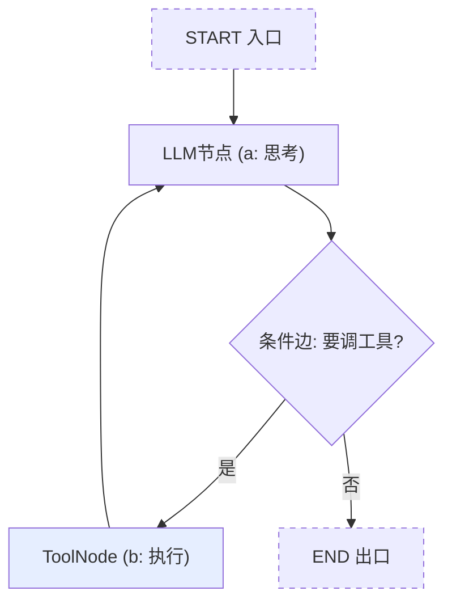
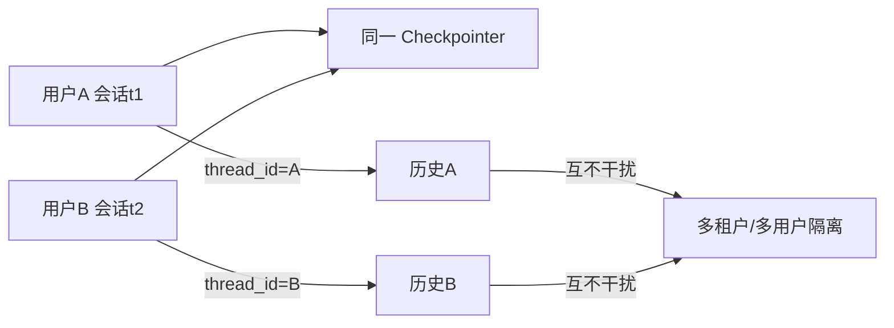
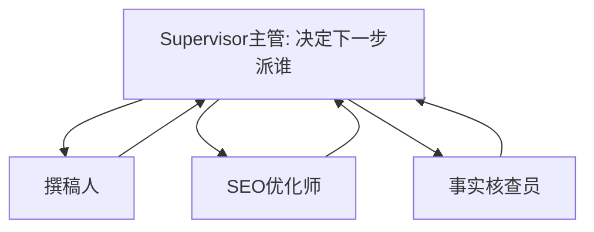

# 阶段三 · 小点 2：LangGraph 核心（Agent 开发事实标准）

> 所属：阶段三 主流 Agent 开发框架（核心实战·重中之重）
> 定位：LangGraph 是生产级 Agent 的事实标准。它的心智模型就一句话：**把 Agent 画成一张图，State 是全局背包，Node 是一次动作，Edge 决定下一步去哪**。这一讲把它彻底讲透，并对照阶段二手写版，让你看到"框架做的每件事"都对应你手写过的某几行代码。

## 精简大纲

1. 核心概念：State / Node / Edge / ConditionalEdge / StateGraph
2. 从零搭建 ReAct Agent（对照阶段二手写版）
3. 持久化记忆与人工中断恢复（Checkpointer / thread_id / interrupt）
4. 多智能体：Supervisor 主管模式
5. 观测：LangSmith 与自建追踪

## 学习内容详情

> 用官方 StateGraph 手搭一遍 ReAct 循环——对照阶段二手写版，你会发现「框架做的每一件事」都对应你手写过的某几行代码。

### 1. 核心概念

#### 1.1 一张图看懂整个运行机制



- **State：** 贯穿整个图运行的「全局数据包」，用 TypedDict 或 Pydantic 定义；最常见字段是 messages，可加任意业务字段（任务进度 / 工具调用次数 / 审批状态）。对照阶段二：State ≈ 工作记忆。
- **Node：** 图中的「处理单元」，就是一个函数：接收当前 State，返回 State 的**增量更新**（只返回要改的字段）。
- **Edge：** 节点连线，三种：普通边（必去 B）、条件边（按 State 动态决定去哪）、入口边（START → 第一个节点）。
- **ConditionalEdge：** 边上的「路由函数」读 State 返回下一个节点名——ReAct 的循环就是条件边把「工具节点」接回「LLM 节点」实现的。
- **StateGraph / compile / invoke：** 声明式画图（add_node / add_edge）→ compile() 编译校验 → invoke(初始 State) 执行。
- **add_messages：** State 里 messages 的「追加」而非「覆盖」规则注解，LangGraph 自动做历史累加。

> ⏳ **短期可不深究**：`Annotated[list, add_messages]` 里 `Annotated` + reducer 的底层合并实现，第一遍只要记住「被标注的字段默认追加、未标注的直接覆盖、也能自定义合并函数」即可；等你需要写复杂的状态合并逻辑时再回来深挖。

- **ToolNode：** 预置的「工具执行节点」，接收 tool_calls 批量执行、自动把结果包成 tool 消息追加进 State。
- **MessagesState：** 预置的「只含 messages 字段」的 State 定义。
- **熔断提醒：** 默认无最大轮次限制！生产必须加（recursion_limit 参数或自定义计数节点），防死循环烧钱。

> 🔬 **深度理解 · State 全局背包与 reducer 机制**：
> 1. **本质**：State 不是普通的可变 dict，而是一份「如何由旧状态与节点增量合并出新状态」的声明。节点返回的不是整个新 State，而是**要改动的增量**。
> 2. **机制**：LangGraph 用 `Annotated[T, reducer]` 标注每个字段的合并规则——被标注的字段把节点返回的增量与旧值交给 reducer 合并（如 `add_messages` 追加而非覆盖）；未标注的字段默认「直接覆盖」。这正是 `think` 节点 `return {"messages": [resp]}` 只返回一条待追加消息、修改内容可能很小，却仍能不丢历史的原因。
> 3. **为什么重要**：它把「跨节点共享状态」从手动 `messages.append` 里解放出来，成为整个图各节点之间唯一的状态契约；想要跨节点累加计数、控制追加或覆盖，都靠在这里声明。
> 4. **易错点**：以为 Node 必须返回完整 State，于是手写 `return state`（把历史一起回传），导致覆盖或重复追加；或忘记用 `Annotated` 标注字段，默认覆盖导致多轮记忆丢失。

### 2. 从零搭建 ReAct Agent

#### 2.1 轨迹预览（对照图）

```
START → think(要查北京天气) → tools(查北京) → think(还要查上海)
     → tools(查上海) → think(算温差) → tools(计算器) → think(汇总) → END
```

- 框架帮做的三件事：
  1. **messages 历史追加**（`add_messages` 自动化，省掉你手写的 `messages.append(...)`）。
  2. **工具调用解析与执行回传**（ToolNode 自动化，省掉你手写的 `json.loads + tool_call_id 配对`）。
  3. **循环控制**从 `for` 循环变成「图上的边」（可视化、可插入任意节点如审批 / 日志）。

#### 2.2 完整可运行代码（LangGraph 版 ReAct）

```python
from typing import Annotated, TypedDict
from langgraph.graph import StateGraph, START, END
from langgraph.graph.message import add_messages
from langgraph.prebuilt import ToolNode
from langchain_core.tools import tool
from langchain_openai import ChatOpenAI
from langchain_core.messages import HumanMessage

# ---- ① 定义 State: 全局背包, messages 用 add_messages 规则自动累加 ----
class State(TypedDict):
    messages: Annotated[list, add_messages]

# ---- ② 定义工具: 等价于阶段二手写版里的 TOOL_REGISTRY ----
@tool
def get_weather(city: str) -> str:
    """查询城市天气。当用户问天气时调用。"""
    return {"北京": "晴 26°C", "上海": "小雨 24°C"}.get(city, "暂无数据")

tools = [get_weather]
llm = ChatOpenAI(model="gpt-4o", temperature=0).bind_tools(tools)

# ---- ③ 定义 LLM 节点: 输入 State, 返回 State 的增量 ----
def think(state: State) -> dict:
    resp = llm.invoke(state["messages"])     # 让模型思考
    return {"messages": [resp]}              # 只返回"要追加的"消息(LangGraph 帮你累加)

# ---- ④ 条件边路由: 模型要调工具就去 tools, 否则结束 ----
def should_continue(state: State) -> str:
    last = state["messages"][-1]
    return "tools" if last.tool_calls else "end"

# ---- ⑤ 组装图 ----
graph = (
    StateGraph(State)
    .add_node("think", think)          # 智能节点
    .add_node("tools", ToolNode(tools))  # 预置工具节点
    .add_edge(START, "think")          # 入口→think
    .add_conditional_edges("think", should_continue, {"tools": "tools", "end": END})  # 条件边
    .add_edge("tools", "think")        # 工具跑完→回到 think(这就是循环!)
    .compile()
)

# ---- ⑥ 执行 ----
result = graph.invoke({"messages": [HumanMessage(content="北京天气？")]})
print(result["messages"][-1].content)
```

> **与阶段二手写版逐行对照**（建议边看边回想手写版）：
> - `think` 节点 = 手写版里"调用模型判断走 action 还是 content"。
> - `ToolNode` = 手写版里"解析 tool_calls + 执行 + tool_call_id 配对回传"。
> - `add_conditional_edges` + `.add_edge("tools","think")` = 手写版的 `while` 循环 + `continue`。
> - `add_messages` = 手写版里一行行 `messages.append(...)`。

> 💡 **可直接跑起来的完整版**：进阶练习请直接使用 [阶段三综合实战：LangGraph 完整 Agent](07-阶段三综合实战-LangGraph完整Agent.md) 的配套代码 [`react_langgraph_agent.py`](../../code/阶段三/react_langgraph_agent.py)。它内置"剧本模型"，**无需 API Key 离线可运行**，跑完 `python3 code/阶段三/react_langgraph_agent.py` 再对照第 2 讲的"轨迹预览图"逐条核对即可。

### 3. 持久化记忆与人工中断（两大生产必备能力）

#### 3.1 记忆与隔离



- **A) 多轮对话记忆：** compile 时挂上 Checkpointer，同一 `thread_id` 的多次 invoke 共享历史；不同 `thread_id` 完全隔离（多用户 / 多租户隔离就靠它）。

```python
from langgraph.checkpoint.memory import MemorySaver

# 挂记忆: 同一 thread_id 的多次调用共享历史
checkpointer = MemorySaver()
app = graph.compile(checkpointer=checkpointer)

# 第 1 次调用: "介绍一下 Agent"
app.invoke({"messages": [HumanMessage("介绍一下 Agent")]}, {"configurable": {"thread_id": "u1_s1"}})
# 第 2 次调用: 模型还记得上一轮, "它有什么价值?" 里的"它"被正确理解
app.invoke({"messages": [HumanMessage("它有什么价值？")]}, {"configurable": {"thread_id": "u1_s1"}})
# 换个 thread_id → 完全独立的历史(多用户隔离)
```

- **生产要点：**
  1. ① `MemorySaver` 存内存、重启即丢 → 生产换 `SqliteSaver` / `RedisSaver` / `PostgresSaver`（同一接口，只换 import）。
  2. ② `thread_id` 用业务会话 ID（`user_id + session_id`）。
  3. ③ 服务重启后 invoke 自动从 Checkpointer 恢复线程历史——「中断恢复」就是这么简单。
  4. ④ 拒绝路径应生成友好回复而非静默结束。

> 🔬 **深度理解 · Checkpointer 与 thread_id 的持久化机制**：
> 1. **本质**：Checkpointer 是 LangGraph 的「状态快照存储器」——每步节点执行后，它把整份 State + 图的执行进度持久化，而不是只在内存里跑一遭。
> 2. **机制**：`compile(checkpointer=...)` 挂上存储后端（内存 / SQLite / Redis / Postgres）。每次 `invoke(..., {"configurable": {"thread_id": X}})`，运行时先用该 thread_id 从 Checkpointer 恢复历史 State，再以其为起点继续执行；不同 thread_id 读到不同快照，天然实现会话隔离。这套快照能力还支撑了「中断续跑」与「时间旅行」（回滚到任意历史步）。
> 3. **为什么重要**：它把「会话记忆」和「可中断恢复」做成框架内建能力，生产上切换存储后端只需换一个 import（如 `MemorySaver` → `SqliteSaver`），业务代码不变。
> 4. **易错点**：`MemorySaver` 只存进程内存、重启即丢，只能本地演示；不指定 thread_id 时每次都是新会话，而多个用户共用一个 thread_id 又会互相污染；敏感数据也不能直接扔给公网托管后端。

#### 3.2 人工中断恢复（高危工具审批）

```python
from langgraph.types import interrupt, Command

def human_confirm(state: State) -> dict:
    """高危操作前暂停整张图, 抛给外部人工确认。"""
    params = {"action": "DELETE FROM users", "row_count": 100}
    decision = interrupt({                              # 暂停! 图在此挂起
        "question": "高危操作, 请确认",
        "params": params,
    })                                                  # 外部 resume 后才继续
    return {"messages": [HumanMessage(content=f"人工决定: {decision}")]}

# 外部(如 API handler)在收到中断后:
#   Command(resume="确认执行") 或 Command(resume="取消")
# → State 由 Checkpointer 保住, 从断点继续
```

> 🔬 **深度理解 · interrupt 与人工中断（human-in-the-loop）**：
> 1. **本质**：`interrupt()` 是 LangGraph 在节点内部「暂停整个图执行并交还控制权」的机制——它不是抛异常退栈，而是把现场保存到自己定义的 Checkpointer 后挂起。
> 2. **机制**：调用 `interrupt(payload)` 后，当前线程执行被挂起，payload（问题 / 参数）暴露给外部；外部用 `graph.invoke(Command(resume=...))` 或 `graph.update_state` 携带决定继续，LangGraph 凭 Checkpointer 里保存的断点接着往下走，节点内 `interrupt` 的返回值即 resume 的内容。
> 3. **为什么重要**：这是「高危操作审批 / 复杂任务人工确认」这类必须停下来等人工决策的场景的正统做法——比手写 if/else 或外部进程拼接更可控，且状态不丢失。
> 4. **易错点**：`interrupt` 只有挂在图内节点里才有意义，且**必须依赖 Checkpointer 才能恢复断点**（没挂 Checkpointer，挂起后接不上）。以为它是普通异常，用 try/except 吞掉，会导致图「莫名卡死」。

### 4. 多智能体：Supervisor 主管模式

#### 4.1 一张图看懂



- 场景：一个「内容总监」调度撰稿人、SEO 优化师、事实核查员三个工人。
- Supervisor 只做一件事——决定下一个派谁；工人节点各司其职（每次都是「角色化」的 LLM 调用）。
- 三大工程要点：
  1. ① 共享 messages 越滚越长 → 每轮做摘要压缩或只传相关切片控 token。
  2. ② 主管路由错误会带偏全局 → route 加兜底分支 + `recursion_limit` 熔断。
  3. ③ **先问「真的需要多智能体吗」**——单 Agent + 多工具能解决的别上多智能体（复杂度翻倍）。

### 5. 观测：LangSmith 与自建追踪

- LangSmith 官方观测平台（付费 SaaS，敏感数据不能出内网时用不了）。
- 自建方案：用 loguru 记录「每一步」的输入输出，落盘成结构化 JSON 行日志；用 run 编号 grep 日志还原完整轨迹。这就是 LangSmith 的最小平替：**trace_id + 节点 / 工具埋点 + 结构化落盘**。

```python
from loguru import logger
import uuid

def logged_node(name: str):
    """给每个节点套一层日志装饰器: 全链路追踪的最小实现。"""
    trace_id = uuid.uuid4().hex[:8]
    def decorator(func):
        def wrapper(state: dict) -> dict:
            logger.info(f"[{trace_id}] 进入节点 {name}, 输入={state}")
            out = func(state)
            logger.info(f"[{trace_id}] 离开节点 {name}, 输出={out}")
            return out
        return wrapper
    return decorator

# 用 run 编号(这里 trace_id) grep 日志即可还原一次完整轨迹
```

> ⏳ **短期可不深究**：上面这个"装饰器包一层日志"的自建追踪写法，第一遍只要能领会「trace_id + 节点/工具埋点 + 结构化落盘」这个最小平替思路即可；真正上生产通常直接用 LangSmith 或成熟的链路追踪中间件，不用自己造轮子。

## 本节自检

- [ ] 能用 StateGraph 从零搭一个带持久化的 ReAct Agent
- [ ] 能实现一次人工中断审批流（高危工具）
- [ ] 理解 thread_id 的会话隔离与 Checkpointer 的存储后端切换

## 本节配套思考题（快速入门的检验）

1. `add_messages` 到底做了什么？如果去掉它，`messages` 字段会变成什么行为（覆盖 vs 追加）？
2. 条件边 `should_continue` 读 `last.tool_calls` 判断去向。如果模型既没调工具也没给答案，这里会发生什么？你怎么兜底？
3. 为什么 `MemorySaver` 只能本地演示、不能上生产？换个持久化后端只需要改什么？
4. `interrupt()` 挂起后，外部怎么让图继续？State 是靠谁保住的？
5. 用一句话解释：为什么"图"能实现"链"做不到的循环和分支？

## 本节常见面试题（深度解析）

> 针对本节核心知识的面试高频点，配合"本质+机制"式理解，能让你答得既有深度又有广度。

### 面试题 1：LangGraph 里 `add_messages` 到底做了什么？去掉它会怎样？
- **面试官想考察**：是否真的理解 State 的 reducer / 增量合并机制，而不是死记"追加"两个字。
- **专业作答（含深度）**：
  1. State 用 `Annotated[list, add_messages]` 声明 messages 字段的合并规则，`add_messages` 是一个 reducer：节点返回的增量与旧值做「追加」而非「覆盖」。
  2. 于是节点只需 `return {"messages": [resp]}`——程序只声明"新增了什么"，LangGraph 负责把旧历史 + 新增串起来，多轮记忆不丢。
  3. 若去掉 add_messages，该字段退化为默认「覆盖」，每次节点的返回会覆盖旧历史，模型下一轮就"失忆"，在 ReAct 循环里会表现异常。
  4. 延伸：reducer 是通用的，自己也能写合并函数控制字段怎么更新（累加计数、去重等）。
- **加分亮点 / 深度追问**：主动讲「未标注字段默认覆盖、只有 Annotated 标注才走 reducer」；追问常是「多节点并发写同一字段怎么合并」——可答由 reducer 确定、LangGraph 保证按序应用。

### 面试题 2：Checkpointer + thread_id 是如何实现多会话记忆与多租户隔离的？为什么 MemorySaver 不能上生产？
- **面试官想考察**：对"状态持久化、会话级记忆、存储后端抽象"这些生产关键点的理解。
- **专业作答（含深度）**：
  1. Checkpointer 是状态快照存储：每次节点执行后把 State + 执行进度持久化到指定后端。
  2. `thread_id` 是会话身份。invoke 时按该 id 先恢复历史再继续执行；不同 thread_id 读到不同快照，实现会话记忆与多租户隔离。
  3. 存储后端抽象：MemorySaver（内存）/ SqliteSaver / RedisSaver / PostgresSaver 接口一致，切换只改 import。MemorySaver 存进程内存、重启即丢，且单机不共享，故只能本地演示。
  4. 生产选型：需要容灾 + 可水平扩展时用 Postgres / Redis，并给每个业务会话分配唯一 thread_id。
- **加分亮点 / 深度追问**：补充 Checkpointer 还能支撑「中断续跑 / 时间旅行」；追问常是「interrupt 恢复靠谁保状态」——答：靠 Checkpointer 保存的断点，没挂它就接不上。

### 面试题 3：为什么"图"能实现"链"做不到的循环和分支？条件边和 State 在其中各起什么作用？
- **面试官想考察**：是否理解图执行模型相对单向管道的本质优势。
- **专业作答（含深度）**：
  1. 链是单向直线 DAG，无法"回到上一步"；图允许边把下游节点接回上游节点，从而构造循环。
  2. 条件边（ConditionalEdge）读 State 动态决定下一节点名，让"根据中间结果选择走向"成为可能，是 ReAct 循环与多分支路由的核心。
  3. State 充当跨节点共享的全局背包，循环里每轮读取/更新它的增量，让"上一轮的工具结果影响本轮决策"成为闭环。
  4. 同时配合 recursion_limit / Checkpointer 等控制手段，循环是"有限且可观测"的。
- **加分亮点 / 深度追问**：主动提"节点可视化 + 可插入审批等任意节点"；追问常是"无状态循环会怎样"——答：节点间无法共享工具结果，Agent 无法基于结果做后续决策。