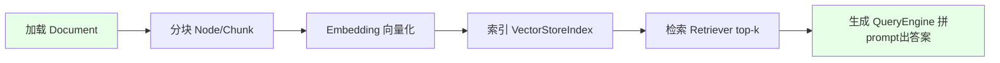
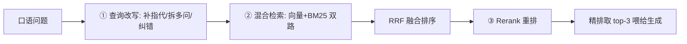

# 阶段三 · 小点 3：LlamaIndex（数据感知型 Agent·重点）

> 所属：阶段三 主流 Agent 开发框架
> 定位：LangChain / LangGraph 负责「编排 Agent」，LlamaIndex 负责「喂给 Agent 知识」。当你的 Agent 要回答"某个文档/数据库里"的问题时，LlamaIndex 是全链路最顺的工具。这一讲讲透"加载→分块→索引→检索→生成"这条数据链路，以及生产标配的检索三件套。

## 精简大纲

1. 定位与安装（0.10+ 拆分包）
2. 数据链路：加载 → 分块 → 索引 → 检索 → 生成
3. 进阶检索三件套：查询改写 / 混合检索 / Rerank
4. 引用溯源
5. 与 LangGraph 组合拳

## 学习内容详情

> 定位：LangChain / LangGraph 负责「编排 Agent」，LlamaIndex 负责「喂给 Agent 知识」——两者经常组合使用。

### 1. 安装与全局配置

- `pip install llama-index llama-index-llms-openai llama-index-embeddings-openai llama-index-embeddings-huggingface`（末位包为下方 `HuggingFaceEmbedding` 所需，缺它 import 会失败）
- 中文语料建议开源中文 Embedding：`HuggingFaceEmbedding(model_name="BAAI/bge-small-zh-v1.5")`（免 API 费、中文效果更好）。
- 0.10 前后 API 差异巨大，认准新版写法（Settings 全局配置）。

```python
from llama_index.core import Settings
from llama_index.llms.openai import OpenAI
from llama_index.embeddings.huggingface import HuggingFaceEmbedding

# 全局配置: 一次设置, 全项目生效
Settings.llm = OpenAI(model="gpt-4o", temperature=0.2)
Settings.embed_model = HuggingFaceEmbedding(
    model_name="BAAI/bge-small-zh-v1.5"   # 中文推荐
)
```

### 2. 数据链路（Document → Node → Index → Retriever → QueryEngine）

#### 2.1 一张图看懂全链路



| 环节 | 组件 | 作用 |
|-|-|-|
| 加载 | Document / Reader | 把 PDF/网页/Notion/数据库读成统一 Document |
| 分块 | Node / Chunk | 切成检索单元（默认约 1024 token/块），**自带元数据（来源文件/页码）** |
| 索引 | VectorStoreIndex | 全部 Node 做 Embedding 后存储，按相似度召回 |
| 检索 | Retriever | 只负责找回「相关 Node 列表」，可替换 |
| 生成 | QueryEngine | Retriever + LLM 组合，`as_query_engine()` 一行生成 |

```python
from llama_index.core import SimpleDirectoryReader, VectorStoreIndex

# ① 加载: 一行读整个目录
docs = SimpleDirectoryReader("data").load_data()

# ② 分块 + 索引: 默认 1024 token/块; 每个 Node自带元数据(引用溯源靠它)
index = VectorStoreIndex.from_documents(docs)

# ③ 检索 + 生成: 一行生成查询引擎
query_engine = index.as_query_engine(similarity_top_k=3)   # 取最相关3块

# ④ 提问
resp = query_engine.query("这份文档讲了什么？")
print(resp.response)
```

> 🔬 **深度理解 · Document / Node / Index 数据抽象**：
> 1. **本质**：LlamaIndex 把「喂给模型的领域知识」做成一串带层级的数据对象，而不是一把原始文本。Document 是最粗粒度的来源单元（一个文件/网页），Node 是真正参与检索的最细单元（一块文本 + 自带元数据），Index 是这些 Node 的「组织方式」（如向量索引）。
> 2. **机制**：加载阶段 Reader 把异构来源（PDF / 网页 / Notion / 数据库）规范化成统一 Document；分块阶段把 Document 切成若干 Node，每个 Node 携带 metadata（来源文件、页码、标题）；索引阶段对 Node 做 Embedding 存入 Index；检索阶段把 user query 编码后在 Index 里按相似度召回 top-k 个 Node。
> 3. **为什么重要**：这种分层让「如何切片」「如何存储」「如何召回」各自可替换——改分块策略不影响存储与检索代码；Node 自带元数据是「引用溯源」和「权限过滤」的基础。
> 4. **易错点**：把 Document 和 Node 混为一谈；以为整篇原文直接 Embedding 就能检好——实际分块粒度直接影响召回命中率，块太小上下文不全、块太大精度下降。

- **Semantic Chunking（语义分块）**：按「语义边界」切而非固定字数切（相邻句子相似度低于阈值处断开），完整论点不被腰斩。
- **父子分块（Parent-Child）**：检索用小块（精准命中）、返回用大块（上下文完整），解决「块太小不全 / 块太大不准」的两难。

> ⏳ **短期可不深究**：Semantic Chunking 和 Parent-Child 这种「花式分块」第一遍只需知道「目的都是让切块更贴近语义、别腰斩论点」，具体调参 / 内网评测是真正做 RAG 落地时的事，现在不用钻细节。

- **ChatEngine**：带多轮记忆，自动改写查询补全指代（「它多少钱」→「iPhone 17 多少钱」）。

### 3. 进阶检索三件套（生产标配）

#### 3.1 为什么是三件套



1. **查询改写：** 检索前先让 LLM 把口语问题改写成检索友好查询（补指代、拆多问、纠错别字）。
   - 例：「它多少钱」→「iPhone 17 多少钱」。
2. **混合检索：** 向量（语义）+ BM25（精确词，如型号 / 人名 / 数字）双路召回，再 RRF 融合排序——单路各有盲区，混合是生产标配。

> ⏳ **短期可不深究**：RRF 那个「按排位倒数相加」的具体融合公式第一遍不用背——只需记住「它把向量路和 BM25 路各自的排名融成一个统一排序」即可，真正调库时看文档就好。

3. **Rerank 重排：** 粗召回 top-10/20 → Cross-Encoder 精排 top-3（两段式「先海选再细读」）。

> 🔬 **深度理解 · 两段式检索（Retriever + Rerank）的精度机制**：
> 1. **本质**：检索要做两遍——第一遍「召回」追求全（recall），第二遍「精排」追求准（precision）。单靠 Embedding 相似度无法同时满足两者。
> 2. **机制**：召回层先用向量（语义）+ BM25（精确词）双路取回较多候选，用 RRF（Reciprocal Rank Fusion）把不同路各自排位融合成统一排序；精排层再用 Cross-Encoder 一类的 Reranker 对候选逐对打分、重排，截取 top-3 喂给生成。
> 3. **为什么重要**：向量擅长语义近似，但对型号 / 人名 / 精确数字容易失效，BM25 恰好擅长精确词匹配——互补能覆盖两类查询；Rerank 能显著压「召回了但相关性差」的噪声，直接改善生成质量。
> 4. **易错点**：把召回当精排用（`similarity_top_k` 贪大、无关块干扰答案）；RRF 只是「排名融合」，不能替代语义级重排；Reranker 也有上下文上限，候选太多会截断。

```python
# 混合检索 + Rerank 示例（结构示意; 生产接 BM25Retriever + 重排模型）
from llama_index.core.retrievers import VectorIndexRetriever

retriever = VectorIndexRetriever(index=index, similarity_top_k=10)
nodes = retriever.retrieve("iPhone 17 多少钱")    # 粗召回 10 块

# ③ 重排: 对粗召回用 Cross-Encoder 精排到 top-3 (略)
# top_nodes = reranker.rerank(nodes, top_n=3)
print(f"粗召回 {len(nodes)} 块, 精排后取 top-3 再喂给生成")
```

### 4. 坑点自查

| 坑 | 现象 | 对策 |
|-|-|-|
| 多次检索冗余 | 每轮都调知识库 | 工具内做缓存 / 去重 |
| 检索 query 生成错误 | 答非所问 | 打印每轮实际用 query 人肉抽查 |
| 无关文档干扰 | 答案被带偏 | `similarity_top_k` 别贪大，加 score 阈值过滤低分块 |

### 5. 引用溯源

```python
# Node 自带元数据(来源文件/页码) → 回答可带引用
resp = query_engine.query("营收增长多少？")
for node in resp.source_nodes:                # 遍历命中的文档块
    print("来源:", node.metadata.get("file_name"))   # 哪个文件
    print("页码:", node.metadata.get("page_label"))  # 哪一页
    print("片段:", node.node.get_text()[:80])        # 原文片段
```

### 6. 与 LangGraph 组合拳（生产最常用）

- **原则**：检索强用 LlamaIndex，流程强用 LangGraph，各干各的擅长事。
- **做法**：把 LlamaIndex 检索引擎封装成 LangChain `@tool`（描述决定模型调用时机），再用 `create_react_agent` 一行创建 ReAct Agent——模型自己决定何时查知识库。

```python
from langchain_core.tools import tool

# 把 LlamaIndex 检索引擎封装成 LangChain @tool
@tool
def query_knowledge(query: str) -> str:
    """查询公司内部知识库。当用户问业务/产品/政策问题时调用。"""
    return str(query_engine.query(query).response)   # 复用上面建好的 query_engine

# create_react_agent: 一句话把"工具"变成"会自己决定查不查的 Agent"
from langgraph.prebuilt import create_react_agent
from langchain_openai import ChatOpenAI

agent = create_react_agent(ChatOpenAI(model="gpt-4o"), tools=[query_knowledge])
result = agent.invoke({"messages": [("user", "我们的退款政策是什么？")]})
print(result["messages"][-1].content)
```

- **为什么这样组合**：
  - LlamaIndex 的 Agent 编排弱于 LangGraph（无 Checkpointer / 复杂分支）。
  - LangChain 的文档解析检索链不如 LlamaIndex 成熟（分块器 / 混合检索 / 重排开箱即用）。
  - 二者通过「@tool 包装 QueryEngine」解耦，各管各的。

## 本节自检

- [ ] 能完成文档加载 → 分块 → 索引 → 检索 → 带引用溯源的问答全链路
- [ ] 能实现混合检索 + Rerank 并接入 LangGraph Agent

## 本节配套思考题（快速入门的检验）

1. 为什么"语义块"里的 Node 要自带元数据（来源文件 / 页码）？对生产有什么实际价值？
2. 单路向量检索最容易在哪类查询上翻车？（提示：型号 / 人名 / 精确数字）
3. 混合检索的"混合"到底混了哪两路？各自擅长什么？RRF 在这里起什么作用？
4. 为什么 LlamaIndex 的检索要包成 `@tool` 塞给 LangGraph，而不是直接调用？

## 本节常见面试题（深度解析）

> 针对本节核心知识的面试高频点，配合"本质+机制"式理解，能让你答得既有深度又有广度。

### 面试题 1：LlamaIndex 为什么把数据拆成 Document → Node → Index → Retriever → QueryEngine 这么多层？各层职责是什么？
- **面试官想考察**：是否理解数据链路由粗到细的分层设计价值，而不是只会调 `as_query_engine()`。
- **专业作答（含深度）**：
  1. Document 是粗粒度来源单元（一个文件/网页），负责"拿到原始知识"；Node 是细粒度检索单元（一块文本 + 自带元数据），负责"能被精准命中"。
  2. Index 管"如何组织这些 Node"（向量索引 / 树 / 关键词索引等），Retriever 只负责"召回相关 Node 列表"，QueryEngine 把 Retriever 结果 + LLM 拼成最终回答。
  3. 分层的核心价值是「可替换性」：换分块策略 / 换存储 / 换召回方式互不影响；同时 Node 元数据支撑引用溯源与权限过滤。
  4. 边界：Retriever 不负责"回答"，只负责"找材料"；真正生成在 QueryEngine（或阶段四略过之外的 Agent 里）。
- **加分亮点 / 深度追问**：主动讲"分块粒度如何同时影响 recall 与精度"，以及 QueryEngine 可被替换成任意 Agent 编排；追问常是"Retriever 和 Reranker 的区别"——答：Retriever 粗召回求全、Reranker 精排求准。

### 面试题 2：单路向量检索在哪类查询上最容易翻车？生产如何用「混合检索 + Rerank」提升精度？
- **面试官想考察**：是否真正理解不同检索路的互补盲区，以及"召回 vs 精排"的两段式道理。
- **专业作答（含深度）**：
  1. 单路向量检索对型号、人名、精确数字等"必须逐字命中"的查询最容易翻车——Embedding 抓语义但允许近似，常把相似但不精确的内容排前面。
  2. 生产方案是混合检索：向量（语义）+ BM25（精确词）双路召回，再用 RRF 融合两者的排名，覆盖两类查询盲区。
  3. 召回层之后接 Rerank（如 Cross-Encoder）对候选逐对精排，截取 top-k 喂给生成，压低"召回对但排序差"的噪声。
  4. 常见工程技巧：给 `similarity_top_k` 设合理上限并加 score 阈值，避免无关块干扰答案。
- **加分亮点 / 深度追问**：主动提"召回追求 recall、精排追求 precision，两者必须分开做"；追问常是"RRF 能替代 Rerank 吗"——答：不能，RRF 是排名融合不含语义相关性打分。

### 面试题 3：为什么要把 LlamaIndex 检索引擎包成 `@tool` 塞给 LangGraph，而不是直接调用 LlamaIndex 自己的 Agent？
- **面试官想考察**：对「检索层与编排层各司其职」的组合架构判断，以及对工具封装边界的理解。
- **专业作答（含深度）**：
  1. 职责划分：检索（语义分块 / 混合检索 / Rerank / 引用溯源）强在 LlamaIndex；流程编排（循环 / 分支 / 持久化 / 审批 / 多智能体）强在 LangGraph。
  2. 桥接方式：把 QueryEngine 封装成 `@tool`，用 docstring 描述决定"模型何时该查知识库"，再用 `create_react_agent` 让模型自主决定调用时机。
  3. 好处：知识库与编排解耦——换知识库不影响 Agent 流程；还获得 LangGraph 的 Checkpointer / 熔断 / 可观测等生产能力。
  4. 适用判断：若是纯"文档问答"可直接 LlamaIndex 的 QueryEngine；一旦有循环 / 多步 / 需要人工干预，就应包成工具交给 LangGraph 编排。
- **加分亮点 / 深度追问**：主动提"工具描述（docstring）决定了模型何时触发检索"这个要点；追问常是"何时不需要 LangGraph"——答：单轮固定检索问答直接 QueryEngine 即可，避免过度设计。