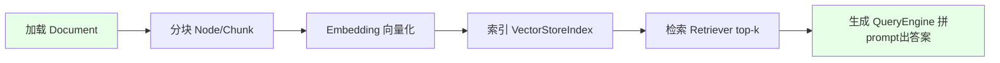
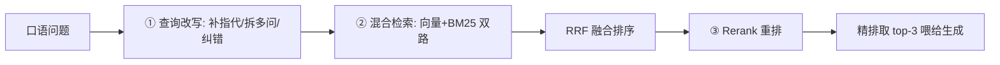

# 阶段三 · 小点 3：LlamaIndex（数据感知型 Agent·重点）

> 所属：阶段三 主流 Agent 开发框架
> 定位：LangChain / LangGraph 负责「编排 Agent」，LlamaIndex 负责「喂给 Agent 知识」。当你的 Agent 要回答"某个文档/数据库里"的问题时，LlamaIndex 是全链路最顺的工具。这一讲讲透"加载→分块→索引→检索→生成"这条数据链路，以及生产标配的检索三件套。

## 精简大纲

1. 定位与安装（0.10+ 拆分包）
2. 数据链路：加载 → 分块 → 索引 → 检索 → 生成
3. 进阶检索三件套：查询改写 / 混合检索 / Rerank
4. 引用溯源
5. 与 LangGraph 组合拳

## 学习内容详情

> 定位：LangChain / LangGraph 负责「编排 Agent」，LlamaIndex 负责「喂给 Agent 知识」——两者经常组合使用。

### 1. 安装与全局配置

- `pip install llama-index llama-index-llms-openai llama-index-embeddings-openai`
- 中文语料建议开源中文 Embedding：`HuggingFaceEmbedding(model_name="BAAI/bge-small-zh-v1.5")`（免 API 费、中文效果更好）。
- 0.10 前后 API 差异巨大，认准新版写法（Settings 全局配置）。

```python
from llama_index.core import Settings
from llama_index.llms.openai import OpenAI
from llama_index.embeddings.huggingface import HuggingFaceEmbedding

# 全局配置: 一次设置, 全项目生效
Settings.llm = OpenAI(model="gpt-4o", temperature=0.2)
Settings.embed_model = HuggingFaceEmbedding(
    model_name="BAAI/bge-small-zh-v1.5"   # 中文推荐
)
```

### 2. 数据链路（Document → Node → Index → Retriever → QueryEngine）

#### 2.1 一张图看懂全链路



| 环节 | 组件 | 作用 |
|-|-|-|
| 加载 | Document / Reader | 把 PDF/网页/Notion/数据库读成统一 Document |
| 分块 | Node / Chunk | 切成检索单元（默认约 1024 token/块），**自带元数据（来源文件/页码）** |
| 索引 | VectorStoreIndex | 全部 Node 做 Embedding 后存储，按相似度召回 |
| 检索 | Retriever | 只负责找回「相关 Node 列表」，可替换 |
| 生成 | QueryEngine | Retriever + LLM 组合，`as_query_engine()` 一行生成 |

```python
from llama_index.core import SimpleDirectoryReader, VectorStoreIndex

# ① 加载: 一行读整个目录
docs = SimpleDirectoryReader("data").load_data()

# ② 分块 + 索引: 默认 1024 token/块; 每个 Node自带元数据(引用溯源靠它)
index = VectorStoreIndex.from_documents(docs)

# ③ 检索 + 生成: 一行生成查询引擎
query_engine = index.as_query_engine(similarity_top_k=3)   # 取最相关3块

# ④ 提问
resp = query_engine.query("这份文档讲了什么？")
print(resp.response)
```

- **Semantic Chunking（语义分块）**：按「语义边界」切而非固定字数切（相邻句子相似度低于阈值处断开），完整论点不被腰斩。
- **父子分块（Parent-Child）**：检索用小块（精准命中）、返回用大块（上下文完整），解决「块太小不全 / 块太大不准」的两难。
- **ChatEngine**：带多轮记忆，自动改写查询补全指代（「它多少钱」→「iPhone 17 多少钱」）。

### 3. 进阶检索三件套（生产标配）

#### 3.1 为什么是三件套



1. **查询改写：** 检索前先让 LLM 把口语问题改写成检索友好查询（补指代、拆多问、纠错别字）。
   - 例：「它多少钱」→「iPhone 17 多少钱」。
2. **混合检索：** 向量（语义）+ BM25（精确词，如型号 / 人名 / 数字）双路召回，再 RRF 融合排序——单路各有盲区，混合是生产标配。
3. **Rerank 重排：** 粗召回 top-10/20 → Cross-Encoder 精排 top-3（两段式「先海选再细读」）。

```python
# 混合检索 + Rerank 示例（结构示意; 生产接 BM25Retriever + 重排模型）
from llama_index.core.retrievers import VectorIndexRetriever

retriever = VectorIndexRetriever(index=index, similarity_top_k=10)
nodes = retriever.retrieve("iPhone 17 多少钱")    # 粗召回 10 块

# ③ 重排: 对粗召回用 Cross-Encoder 精排到 top-3 (略)
# top_nodes = reranker.rerank(nodes, top_n=3)
print(f"粗召回 {len(nodes)} 块, 精排后取 top-3 再喂给生成")
```

### 4. 坑点自查

| 坑 | 现象 | 对策 |
|-|-|-|
| 多次检索冗余 | 每轮都调知识库 | 工具内做缓存 / 去重 |
| 检索 query 生成错误 | 答非所问 | 打印每轮实际用 query 人肉抽查 |
| 无关文档干扰 | 答案被带偏 | `similarity_top_k` 别贪大，加 score 阈值过滤低分块 |

### 5. 引用溯源

```python
# Node 自带元数据(来源文件/页码) → 回答可带引用
resp = query_engine.query("营收增长多少？")
for node in resp.source_nodes:                # 遍历命中的文档块
    print("来源:", node.metadata.get("file_name"))   # 哪个文件
    print("页码:", node.metadata.get("page_label"))  # 哪一页
    print("片段:", node.node.get_text()[:80])        # 原文片段
```

### 6. 与 LangGraph 组合拳（生产最常用）

- **原则**：检索强用 LlamaIndex，流程强用 LangGraph，各干各的擅长事。
- **做法**：把 LlamaIndex 检索引擎封装成 LangChain `@tool`（描述决定模型调用时机），再用 `create_react_agent` 一行创建 ReAct Agent——模型自己决定何时查知识库。

```python
from langchain_core.tools import tool

# 把 LlamaIndex 检索引擎封装成 LangChain @tool
@tool
def query_knowledge(query: str) -> str:
    """查询公司内部知识库。当用户问业务/产品/政策问题时调用。"""
    return str(query_engine.query(query).response)   # 复用上面建好的 query_engine

# create_react_agent: 一句话把"工具"变成"会自己决定查不查的 Agent"
from langgraph.prebuilt import create_react_agent
from langchain_openai import ChatOpenAI

agent = create_react_agent(ChatOpenAI(model="gpt-4o"), tools=[query_knowledge])
result = agent.invoke({"messages": [("user", "我们的退款政策是什么？")]})
print(result["messages"][-1].content)
```

- **为什么这样组合**：
  - LlamaIndex 的 Agent 编排弱于 LangGraph（无 Checkpointer / 复杂分支）。
  - LangChain 的文档解析检索链不如 LlamaIndex 成熟（分块器 / 混合检索 / 重排开箱即用）。
  - 二者通过「@tool 包装 QueryEngine」解耦，各管各的。

## 本节自检

- [ ] 能完成文档加载 → 分块 → 索引 → 检索 → 带引用溯源的问答全链路
- [ ] 能实现混合检索 + Rerank 并接入 LangGraph Agent

## 本节配套思考题（快速入门的检验）

1. 为什么"语义块"里的 Node 要自带元数据（来源文件 / 页码）？对生产有什么实际价值？
2. 单路向量检索最容易在哪类查询上翻车？（提示：型号 / 人名 / 精确数字）
3. 混合检索的"混合"到底混了哪两路？各自擅长什么？RRF 在这里起什么作用？
4. 为什么 LlamaIndex 的检索要包成 `@tool` 塞给 LangGraph，而不是直接调用？