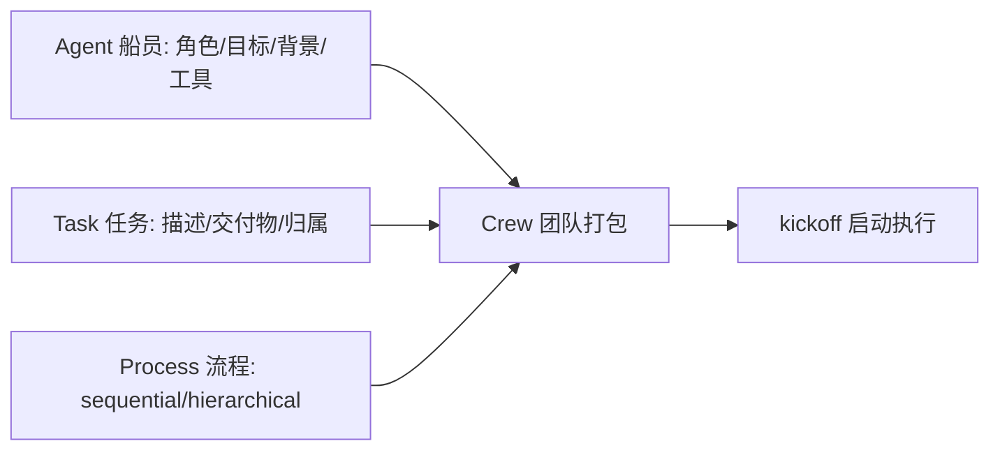
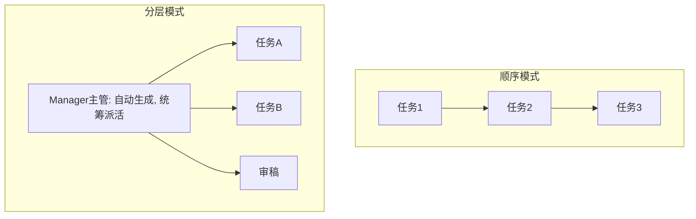
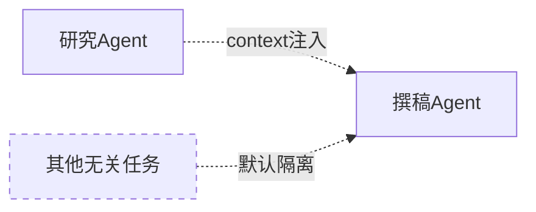

# 阶段三 · 小点 4：CrewAI（多智能体快速开发·上手快）

> 所属：阶段三 主流 Agent 开发框架
> 定位：CrewAI 是"最快能跑起来的多智能体"框架。它把 Agent 建模成**一支真实团队**：每个成员有职位、目标、性格，任务逐个派发，团队按流程推进。上手快是它的卖点，但**行为表达力弱**是它的天花板——这一讲既要让你能一天写出来，也要让你清楚"什么情况该换回 LangGraph"。

## 精简大纲

1. 核心理念：角色化多智能体
2. 三要素：Agent（船员）/ Task（任务）/ Crew（团队）
3. Process：顺序 vs 分层
4. 工程提醒与适用边界

## 学习内容详情

> 安装：`pip install crewai crewai-tools`，运行前设置 OPENAI_API_KEY（或支持的其他模型）。

### 1. 核心理念

- 像组建一个真实团队：每个成员（Agent）有明确职位（角色 / 目标 / 背景故事），任务（Task）逐个派发，团队（Crew）按流程推进。
- 上手速度是四个框架里最快的。



### 2. 三要素

- **Agent（船员）：** 四要素——`role`（职位，如「资深撰稿人」）、`goal`（目标）、`backstory`（背景故事，塑造行为风格的软提示）、`tools`（专属工具集）。**背景故事不是摆设，能显著改变行为风格。**

> 🔬 **深度理解 · 角色分工（role / goal / backstory）的本质**：
> 1. **本质**：CrewAI 的"角色"不是真正的隔离进程，而是给同一个 LLM 提供不同「系统提示 + 任务说明 + 行为风格约束」，让它在不同 Agent 上下文下表现出不同专业性。
> 2. **机制**：每个 Agent 实例化时，role / goal / backstory 会被拼进它的 system prompt；调用 LLM 时只带上「该角色的设定 + 分派给它的任务 + context 注入的上游产出」，而不是全量对话。backstory 以软提示方式影响措辞、语气、抓重点的偏好。
> 3. **为什么重要**：它用极低成本实现"专业化分工与自行隔离"——不用手写一套提示词拼接逻辑，只需声明角色，框架负责组装。也正因如此，换角色 / 换团队的边际成本很低。
> 4. **易错点**：把 backstory 当可有可无——它直接决定行为风格；也误以为多个 Agent 会共享记忆——实际默认隔离，协作靠 `context` 显式传参，靠"共享全局上下文"协作是不成立的。

```python
from crewai import Agent, Task, Crew, Process

# ① 定义船员: 角色 + 目标 + 背景故事 + 工具
researcher = Agent(
    role="资深行业研究员",                    # 职位
    goal="搜集最新AI行业趋势并提炼要点",         # 目标
    backstory="你在一线科技媒体深耕5年, 擅长抓重点、去噪音",  # 背景故事(塑造风格)
    verbose=True,                            # 打印每步执行, 学习神器和排查帮手
)

writer = Agent(
    role="资深内容撰稿人",
    goal="把研究要点写成吸引人的营销推文",
    backstory="你是短视频文案专家, 擅长用一句话抓住读者",
    verbose=True,
)
```

- **Task（任务）：** `description`（做什么）+ **`expected_output`（交付物长什么样——必须写，否则输出质量差）** + `agent`（交给谁）+ `context`（依赖哪些前置任务的产出，等于把上游结果注入本任务上下文）。

> 🔬 **深度理解 · Task 与 context 依赖注入**：
> 1. **本质**：Task 是「派给某个角色的一段工作 + 明确交付物」，`context` 是它获得上游产出的「输入管道」，`expected_output` 是它交给下游 / 终端的「验收标准」。
> 2. **机制**：sequential 模式下任务串行，`context=[前置Task]` 把前置任务的最终产出注入当前任务的 prompt 上下文；`expected_output` 作为输出约束写进任务提示，引导模型产出结构化、可度量的结果。任务间通过 `context` 显式声明依赖，而非共享可变全局状态。
> 3. **为什么重要**：`expected_output` 是质量生命线——写含糊时模型不知道交付什么，会反复自我修改直到 token 耗尽；`context` 让链式协作显式化、可追踪，避免"全员共享记忆"的污染。
> 4. **易错点**：`expected_output` 只写"一段文字"等于没写，要具体到「几条、带什么结构、每条多长」；只声明 agent 归属却忘了 `context` 声明数据依赖，下游拿不到上游产出。

```python
trade_research = Task(
    description="研究2025年AI Agent市场, 提炼3条关键趋势",
    expected_output="3条带具体数字依据的趋势要点, 每条不超过50字",  # 必须写!影响质量
    agent=researcher,
)

write_post = Task(
    description="根据研究结果写一篇200字营销推文",
    expected_output="一段完整的中文营销推文",   # 精确描述交付物
    agent=writer,
    context=[trade_research],                # 依赖研究员产出 → 注入本任务上下文
)
```

- **Crew（团队）：** 把成员和任务打包成执行体，`kickoff()` 启动。

```python
crew = Crew(
    agents=[researcher, writer],      # 团队里的所有船员
    tasks=[trade_research, write_post],  # 要执行的所有任务
    process=Process.sequential,       # 执行流程: 顺序
    verbose=True,
)
result = crew.kickoff({"topic": "AI Agent"})   # 启动! 传入全局输入
print(result.raw)                     # 最终交付物文本
```

> 注：`crew.kickoff({...})` 传全局输入、`result.raw` 取最终文本，属**较新 CrewAI** 的形态；旧版 `kickoff` 返回 `dict`，取值方式不同（请以你安装的版本为准）。

> ⏳ **短期可不深究**：CrewAI 版本迭代节奏偏快，这一遍只要掌握 `Agent / Task / Crew / Process` 这套核心对象与"声明式组队"的心智模型即可，`kickoff` 返回值、构造参数等 API 细节以你安装的版本为准，不必背死具体的版本差异。

### 3. Process（执行流程）

#### 3.1 两种流程对比



- `sequential`：顺序流水线，任务按列表顺序执行，最常用。
- `hierarchical`：分层模式，自动生成 Manager Agent 统筹派活、审稿，适合复杂任务、成本更高。

```python
# 切换流程只需改一个参数
complex_crew = Crew(
    agents=[researcher, writer],
    tasks=[trade_research, write_post],
    process=Process.hierarchical,   # 换成分层: 自动有Manager统筹
    manager_llm="gpt-4o",           # 分层模式需指定主管用的模型
)
```

> ⏳ **短期可不深究**：`hierarchical` 属于进阶用法——自动生成的 Manager 怎么派活、怎么判定完工，底层调度细节偏复杂且成本更高；这一遍以 `sequential` 跑通为准，等真要做复杂多角色协作时再回来补分层模式。

> 🔬 **深度理解 · Process（sequential / hierarchical）编排机制**：
> 1. **本质**：Process 定义了 Crew 里「任务以什么顺序、由谁派发」的编排规则——它是把"一群人"组织成"一条流水线或一次会议"的调度协议。
> 2. **机制**：`sequential` 下任务按传入列表顺序执行，每个 Task 由指定 agent 完成，产出通过 `context` 注入依赖它的后续任务；`hierarchical` 下框架自动创建一个 Manager Agent，由它（用 `manager_llm` 驱动）决定下一步派给哪个船员、何时收尾，相当于多了个"调度大脑"。
> 3. **为什么重要**：它决定了多智能体的协作形态与成本——顺序模式可预期、易排查；分层模式灵活但引入额外 LLM 调用（更贵、输出更难复现）。
> 4. **易错点**：以为 hierarchical 自动搞定一切、不用管依赖——其实 Manager 也可能派错导致链路发散，所以简单 / 可预期任务优先 sequential；分层模式需要提供 `manager_llm`，缺默认模型时无法启动。

### 4. Agent 之间隔离

- 每个 Agent 只看到「自己的角色设定 + 分派给它的任务 + context 指定的上游产出」，**不共享全量对话**——避免互相污染，但信息传递要靠 Task 的 `context` 显式声明。



### 5. 工程提醒

1. `verbose=True` 是最好的学习方式：能看到每个 Agent 实际收到的 prompt 与产出。
2. **任务失败常见原因**：`expected_output` 写得含糊 → 模型不知道交付什么 → 迭代到 token 耗尽。
3. **深度定制弱**：想精确控制「第 3 步失败回滚到第 1 步」这类状态流转，CrewAI 表达力不足 → 复杂流程回到 LangGraph（等价但可控性完全不同）。
4. **生产前必须二次封装**：日志、重试、成本统计 CrewAI 都要自己补。

| 场景 | 用 CrewAI | 用 LangGraph |
|-|-|-|
| 快速搭多角色流水线（研究→写稿→校对） | ✅ 首选 | 也能做但繁琐 |
| 需要断点续跑 / 精确状态回滚 | ❌ 表达力不足 | ✅ |
| 复杂分支 + 人工审批流 | ❌ | ✅ |

## 本节自检

- [ ] 能定义一个三船员团队并跑通一次顺序任务链
- [ ] 能说清 CrewAI 与 LangGraph 的适用边界

## 本节配套思考题（快速入门的检验）

1. 为什么 `expected_output` 必须写清楚？写含糊时模型会怎样（结合"迭代到 token 耗尽"回答）？
2. `Process.hierarchical` 自动生成 Manager 统筹，这种"自动派活"相比 sequential 各有什么代价和收益？
3. 三个船员之间为什么默认不共享全量对话？`context` 字段解决的又是什么？这和"防记忆污染"有什么关系？
4. 假如你要做一个"第 3 步失败回滚到第 1 步重来"的流程，CrewAI 能轻松做吗？你会怎么选型？

## 本节常见面试题（深度解析）

> 针对本节核心知识的面试高频点，配合"本质+机制"式理解，能让你答得既有深度又有广度。

### 面试题 1：CrewAI 里"角色"的本质是什么？多个 Agent 之间是如何"隔离"又"协作"的？
- **面试官想考察**：是否理解"角色 = 系统提示 + 任务 + 风格约束"，以及协作不是靠共享记忆。
- **专业作答（含深度）**：
  1. 角色本质是为同一个 LLM 准备的不同上下文（role / goal / backstory 拼进 system prompt），让它在不同 Agent 下表现出不同专业性，而不是真的隔离进程。
  2. 隔离：每个 Agent 只看到自己的角色设定 + 分派任务 + `context` 注入的上游产出，不共享全量对话，避免相互污染。
  3. 协作：通过 Task 的 `context` 显式声明依赖，把前置任务的产出注入后续任务；数据依赖是显式的，不是"黑盒共享"。
  4. 意义：隔离 + 显式注入让多角色流水线可控、可追踪；这也是它与 LangGraph"共享 State"模型的差异点。
- **加分亮点 / 深度追问**：对比 LangGraph 的 State 共享 vs CrewAI 的 context 注入两种协作模型；追问常是"backstory 有什么用"——答：是塑造行为风格的软提示，直接影响措辞与抓重点。

### 面试题 2：为什么 `expected_output` 必须写清楚？`context` 字段解决的是什么问题？
- **面试官想考察**：对"任务交付物约束"和"依赖注入"这两个协作质量关键点的理解。
- **专业作答（含深度）**：
  1. `expected_output` 是给模型的「验收标准」：写清楚（几条、什么结构、多长）能让模型目标明确、一次到位。
  2. 写含糊时模型不知道交付什么，会"自说自话地反复修改"直到 token 耗尽——这正是任务失败的常见原因。
  3. `context` 是任务获得上游产出的输入管道：只声明了任务归属却忘了 context，下游就"看不到"上游结果。
  4. 归因：expected_output 管"产出的形"、context 管"产出的源"，两者共同决定多任务链能否高质量衔接。
- **加分亮点 / 深度追问**：主动讲"写 expected_output 类似给子函数写返回值契约"；追问常是"如何避免 context 过长"——答：对超长产出先做摘要再注入。

### 面试题 3：`Process.sequential` 和 `Process.hierarchical` 各自代价与收益是什么？如何据此选型？
- **面试官想考察**：对多智能体"编排协议"和成本/可控性权衡的理解。
- **专业作答（含深度）**：
  1. sequential：任务按序执行、由显式 context 串联，可预期、易排查、成本可控，适合"研究→写稿→校对"这类固定流水线。
  2. hierarchical：自动生成 Manager，由 LLM 动态派活、审稿，更灵活、改写复杂任务，但多一次调度 LLM 调用、输出更难复现、Manager 也可能派错。
  3. 选型：默认优先 sequential；任务间分工需动态决策时再上 hierarchical。
  4. 边界：CrewAI 表达力仍偏弱——需要精确状态回滚 / 人工审批中断时，应切回 LangGraph 这类"图编排"框架，而不是硬用 CrewAI。
- **加分亮点 / 深度追问**：补充"多智能体要慎重——单 Agent + 多工具通常更简单可靠"；追问常是"CrewAI 何时该换 LangGraph"——答：需要断点续跑 / 精确状态回滚 / 人工审批流时。