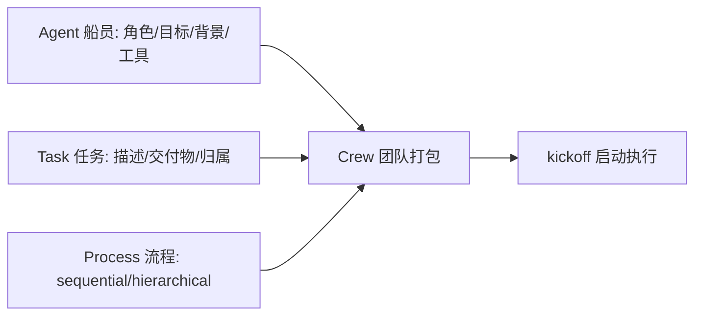
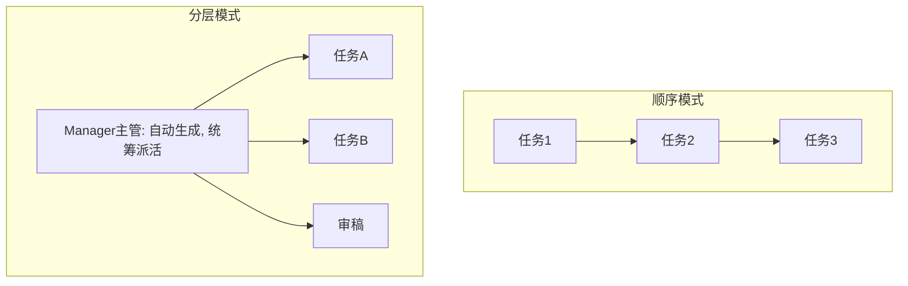
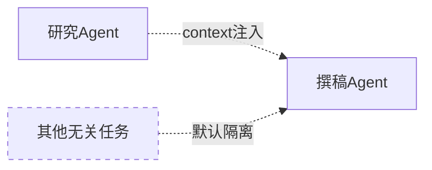

# 阶段三 · 小点 4：CrewAI（多智能体快速开发·上手快）

> 所属：阶段三 主流 Agent 开发框架
> 定位：CrewAI 是"最快能跑起来的多智能体"框架。它把 Agent 建模成**一支真实团队**：每个成员有职位、目标、性格，任务逐个派发，团队按流程推进。上手快是它的卖点，但**行为表达力弱**是它的天花板——这一讲既要让你能一天写出来，也要让你清楚"什么情况该换回 LangGraph"。

## 精简大纲

1. 核心理念：角色化多智能体
2. 三要素：Agent（船员）/ Task（任务）/ Crew（团队）
3. Process：顺序 vs 分层
4. 工程提醒与适用边界

## 学习内容详情

> 安装：`pip install crewai crewai-tools`，运行前设置 OPENAI_API_KEY（或支持的其他模型）。

### 1. 核心理念

- 像组建一个真实团队：每个成员（Agent）有明确职位（角色 / 目标 / 背景故事），任务（Task）逐个派发，团队（Crew）按流程推进。
- 上手速度是四个框架里最快的。



### 2. 三要素

- **Agent（船员）：** 四要素——`role`（职位，如「资深撰稿人」）、`goal`（目标）、`backstory`（背景故事，塑造行为风格的软提示）、`tools`（专属工具集）。**背景故事不是摆设，能显著改变行为风格。**

```python
from crewai import Agent, Task, Crew, Process

# ① 定义船员: 角色 + 目标 + 背景故事 + 工具
researcher = Agent(
    role="资深行业研究员",                    # 职位
    goal="搜集最新AI行业趋势并提炼要点",         # 目标
    backstory="你在一线科技媒体深耕5年, 擅长抓重点、去噪音",  # 背景故事(塑造风格)
    verbose=True,                            # 打印每步执行, 学习神器和排查帮手
)

writer = Agent(
    role="资深内容撰稿人",
    goal="把研究要点写成吸引人的营销推文",
    backstory="你是短视频文案专家, 擅长用一句话抓住读者",
    verbose=True,
)
```

- **Task（任务）：** `description`（做什么）+ **`expected_output`（交付物长什么样——必须写，否则输出质量差）** + `agent`（交给谁）+ `context`（依赖哪些前置任务的产出，等于把上游结果注入本任务上下文）。

```python
trade_research = Task(
    description="研究2025年AI Agent市场, 提炼3条关键趋势",
    expected_output="3条带具体数字依据的趋势要点, 每条不超过50字",  # 必须写!影响质量
    agent=researcher,
)

write_post = Task(
    description="根据研究结果写一篇200字营销推文",
    expected_output="一段完整的中文营销推文",   # 精确描述交付物
    agent=writer,
    context=[trade_research],                # 依赖研究员产出 → 注入本任务上下文
)
```

- **Crew（团队）：** 把成员和任务打包成执行体，`kickoff()` 启动。

```python
crew = Crew(
    agents=[researcher, writer],      # 团队里的所有船员
    tasks=[trade_research, write_post],  # 要执行的所有任务
    process=Process.sequential,       # 执行流程: 顺序
    verbose=True,
)
result = crew.kickoff({"topic": "AI Agent"})   # 启动! 传入全局输入
print(result.raw)                     # 最终交付物文本
```

### 3. Process（执行流程）

#### 3.1 两种流程对比



- `sequential`：顺序流水线，任务按列表顺序执行，最常用。
- `hierarchical`：分层模式，自动生成 Manager Agent 统筹派活、审稿，适合复杂任务、成本更高。

```python
# 切换流程只需改一个参数
complex_crew = Crew(
    agents=[researcher, writer],
    tasks=[trade_research, write_post],
    process=Process.hierarchical,   # 换成分层: 自动有Manager统筹
    manager_llm="gpt-4o",           # 分层模式需指定主管用的模型
)
```

### 4. Agent 之间隔离

- 每个 Agent 只看到「自己的角色设定 + 分派给它的任务 + context 指定的上游产出」，**不共享全量对话**——避免互相污染，但信息传递要靠 Task 的 `context` 显式声明。



### 5. 工程提醒

1. `verbose=True` 是最好的学习方式：能看到每个 Agent 实际收到的 prompt 与产出。
2. **任务失败常见原因**：`expected_output` 写得含糊 → 模型不知道交付什么 → 迭代到 token 耗尽。
3. **深度定制弱**：想精确控制「第 3 步失败回滚到第 1 步」这类状态流转，CrewAI 表达力不足 → 复杂流程回到 LangGraph（等价但可控性完全不同）。
4. **生产前必须二次封装**：日志、重试、成本统计 CrewAI 都要自己补。

| 场景 | 用 CrewAI | 用 LangGraph |
|-|-|-|
| 快速搭多角色流水线（研究→写稿→校对） | ✅ 首选 | 也能做但繁琐 |
| 需要断点续跑 / 精确状态回滚 | ❌ 表达力不足 | ✅ |
| 复杂分支 + 人工审批流 | ❌ | ✅ |

## 本节自检

- [ ] 能定义一个三船员团队并跑通一次顺序任务链
- [ ] 能说清 CrewAI 与 LangGraph 的适用边界

## 本节配套思考题（快速入门的检验）

1. 为什么 `expected_output` 必须写清楚？写含糊时模型会怎样（结合"迭代到 token 耗尽"回答）？
2. `Process.hierarchical` 自动生成 Manager 统筹，这种"自动派活"相比 sequential 各有什么代价和收益？
3. 三个船员之间为什么默认不共享全量对话？`context` 字段解决的又是什么？这和"防记忆污染"有什么关系？
4. 假如你要做一个"第 3 步失败回滚到第 1 步重来"的流程，CrewAI 能轻松做吗？你会怎么选型？