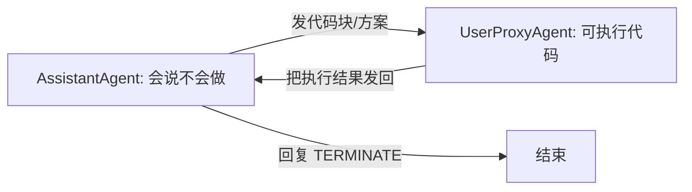

# 阶段三 · 小点 5：AutoGen（微软多智能体框架·进阶）

> 所属：阶段三 主流 Agent 开发框架
> 定位：AutoGen 和 CrewAI 完全不同——它不是"派活"，而是**让多个 Agent 像拉群开会一样互相聊**，聊到有人说「完成」为止。它适合研究实验与原型，但有个**必须记住的安全雷区**：模型生成的代码可能真在你机器上执行。这一讲把核心类和熔断讲透，安全防线单独划重点。

## 精简大纲

1. 核心理念：对话式多智能体
2. 核心类：ConversableAgent / AssistantAgent / UserProxyAgent
3. 双人组与 GroupChat 群聊
4. 工程要点：熔断、TERMINATE、沙箱安全
5. AutoGen 0.4+ 迁移对照：0.2 与 0.4 差异速查

## 学习内容详情

> 版本说明：**本文对应 AutoGen 0.2.x 经典 API（`pip install pyautogen`）**；0.4+ 为全新 async API，写法不同，差异速查见第 5 节「AutoGen 0.4+ 迁移对照」。

### 1. 核心理念

- 多个 Agent 像拉群开会一样，靠互相发自然语言消息协作完成任务，直到有人说「完成」。
- 适合研究实验与原型验证。



### 2. 核心类

- **ConversableAgent：** 所有 Agent 的基类，能收消息、能回消息、可配置是否执行代码、是否需人工输入。
- **AssistantAgent：** 默认「只会说不会做」的纯 LLM 角色：分析问题、写方案、生成代码，但自己不执行。
- **UserProxyAgent：** 代表「人」或「执行环境」：默认可执行 Assistant 发来的代码块，可设定人工介入模式。

| human_input_mode | 行为 | 风险 |
|-|-|-|
| `ALWAYS` | 每次发言都问真人 | 最低 |
| `TERMINATE` | 仅结束时问（默认半自动） | 中 |
| `NEVER` | 全程无人 | **最高** |

```python
import autogen

# Assistant: "会写代码但自己不执行" 的纯LLM
assistant = autogen.AssistantAgent(
    name="coder",
    llm_config={"model": "gpt-4o", "api_key": "YOUR_KEY"},
    system_message="你是一个Python专家, 只输出代码块。",  # 角色设定
)

# UserProxy: 代表"人/执行环境", 默认可执行代码
user_proxy = autogen.UserProxyAgent(
    name="executor",
    human_input_mode="TERMINATE",   # 仅结束时才问真人 (半自动)
    code_execution_config={"work_dir": "sandbox"},  # 代码在 sandbox 目录执行
    max_consecutive_auto_reply=10,   # ★ 熔断1: 双聊最大连续自动回复
)
```

### 3. 运行模式

#### 3.1 双人组

```python
# 让 assistant 帮 user_proxy 完成任务
result = user_proxy.initiate_chat(
    assistant,
    message="写一个计算斐波那契数列的 Python 函数",
)
# 期望流程:
#   1. assistant 发代码块
#   2. user_proxy 提取并执行
#   3. 结果发回 → assistant 确认无误
#   4. assistant 回复 TERMINATE → 结束
```

#### 3.2 GroupChat 群聊（多 Agent 开会）

```python
pm = autogen.AssistantAgent(name="产品经理", llm_config=LLM, system_message="你负责梳理需求")
pg = autogen.AssistantAgent(name="程序员",    llm_config=LLM, system_message="你负责写代码")
qa = autogen.AssistantAgent(name="测试",      llm_config=LLM, system_message="你负责审代码")

group = autogen.GroupChat(
    agents=[pm, pg, qa],
    messages=[],                  # 群聊消息列表, 只会存在内存
    max_round=15,                 # ★ 熔断2: 群聊最大发言轮数(防无限互聊)
)
manager = autogen.GroupChatManager(groupchat=group, llm_config=LLM)
# user_proxy.initiate_chat(manager, message="设计并实现一个登录接口")
```

```mermaid
graph TD
    M[GroupChatManager 管理员: LLM判断该谁发言] --> A[产品经理]
    M --> B[程序员]
    M --> C[测试]
    A -->> M
    B -->> M
    C -->> M
```

### 4. 工程要点（重点）

1. **两个熔断都要设：** `max_consecutive_auto_reply`（双聊）+ `max_round`（群聊），否则互聊到天荒地老。
2. **TERMINATE 约定：** 写进 `system_message`——AutoGen 靠这个关键字判断任务结束。
3. **★ 沙箱安全（最重要）：** `use_docker=False` 时模型代码直接跑在你机器上！模型生成 `os.remove("C:/重要目录")` 完全可能。

```python
# 三档安全方案(从最安全到最省事):
# 方案1: 完全禁用代码执行 —— 最安全
user_safe = autogen.UserProxyAgent(
    name="safe",
    code_execution_config=False,        # 不执行任何代码, 模型只输出文本方案
)
# 方案2: Docker 沙箱隔离 —— 推荐生产
user_docker = autogen.UserProxyAgent(
    name="docker",
    code_execution_config={"docker_image": "python:3.12-slim"},  # 代码在容器里跑, 与宿主隔离
)
# 方案3: 云沙箱 E2B —— 远程隔离
# code_execution_config={"executor": "e2b", ...}
```

4. **消息默认只存内存** → 生产自建消息持久化（改 `register_reply` 钩子存库）。
5. **适用边界：** 研究原型 / 内部实验最佳；对外生产系统优先 LangGraph（可控性、持久化、审批流齐全）。

### 5. AutoGen 0.4+ 迁移对照

#### 5.1 背景：0.4 是完全重写

- AutoGen 0.4（2024 年底起）不是常规升级，而是**完全重写**：async-first（对话入口全部 async/await）、可组合的小 Agent、基于 `autogen_core` 的消息路由架构。
- 社区另维护 **AG2 分支**（`pip install ag2`），延续本文所讲的 0.2.x 经典 API——老代码不想迁移，可换 AG2 继续跑。

#### 5.2 对照表（0.2 → 0.4）

| 概念 | 0.2.x（本文） | 0.4+ |
|-|-|-|
| 包名 | `pyautogen` | `autogen-agentchat` + `autogen-ext` |
| 模型配置 | `llm_config=dict(config_list=[...])` | 构造 model_client（如 `OpenAIChatCompletionClient`）传入 `AssistantAgent` |
| 对话入口 | 同步 `agent.initiate_chat()` | 异步 `await agent.on_messages()` / `on_messages_stream()`（后者返回 async generator，可流式取内部思考） |
| 人工代理 | `UserProxyAgent`（`human_input_mode`） | 人机交互由 runtime 终端与 `autogen_ext` 中的 `UserProxyAgent` 承接 |
| 群聊 | `GroupChat` + `GroupChatManager` | Team 抽象（`RoundRobinGroupChat` / `SelectorGroupChat` 等）+ termination condition |

#### 5.3 0.4 最小示例（伪代码）

```python
# 依赖: pip install autogen-agentchat autogen-ext[openai]
import asyncio

from autogen_agentchat.agents import AssistantAgent
from autogen_agentchat.messages import TextMessage
from autogen_ext.models.openai import OpenAIChatCompletionClient


async def main() -> None:
    # 1) 模型先构造成 client 对象, 而不是塞进 llm_config 字典
    model_client = OpenAIChatCompletionClient(model="gpt-4o")

    agent = AssistantAgent(
        name="coder",
        model_client=model_client,
        system_message="你是一个Python专家, 只输出代码块。",
    )

    # 2) on_messages_stream 返回 async generator, 可流式取内部思考
    stream = agent.on_messages_stream(
        [TextMessage(content="写一个斐波那契函数", source="user")]
    )
    async for msg in stream:
        print(getattr(msg, "content", msg))


asyncio.run(main())   # 脚本入口统一用 asyncio.run 收束; Jupyter 中可直接 await main()
```

> ⚠️ **装包前先看包名**：0.2.x 教程在网络上大量存在（标志：`pip install pyautogen` + `initiate_chat`），搜到的代码先判断版本再照抄。官方迁移指南：https://microsoft.github.io/autogen/0.4.7/user-guide/agentchat-user-guide/migration-guide.html

## 本节自检

- [ ] 能跑通一次双人组协作并正确设置两个熔断
- [ ] 能说清 AutoGen 代码执行的三档安全方案
- [ ] 能说出 0.2 与 0.4 的三个核心差异

## 本节配套思考题（快速入门的检验）

1. 为什么"双聊"和"群聊"各自要设不同的熔断参数？`max_consecutive_auto_reply` 和 `max_round` 分别防的是什么？
2. AutoGen 怎么判断"任务结束了"？`TERMINATE` 为什么必须写进 system_message？
3. 如果 `use_docker=False` 且 `human_input_mode="NEVER"`，会发生什么最坏情况？你会怎么强制避免？
4. AutoGen 的消息存在哪？为什么生产要自己持久化？它和 LangGraph 的 Checkpointer 对比如何？