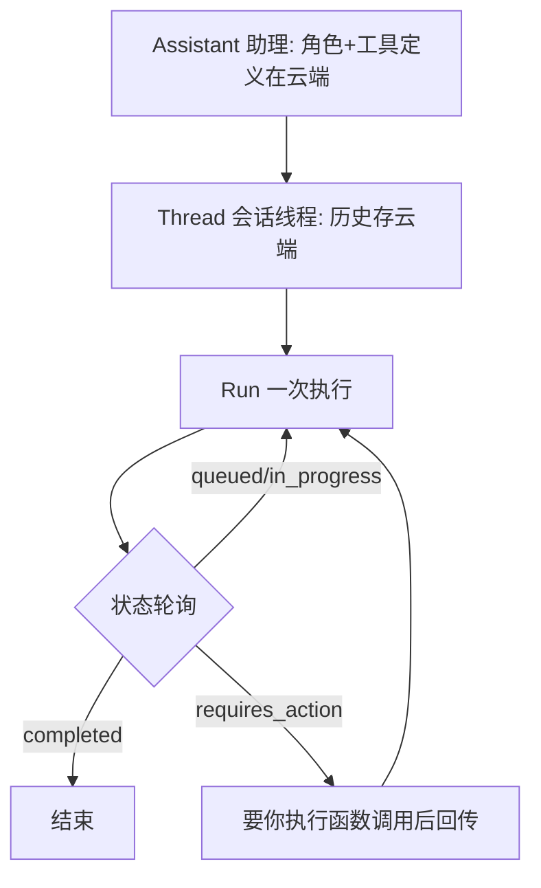
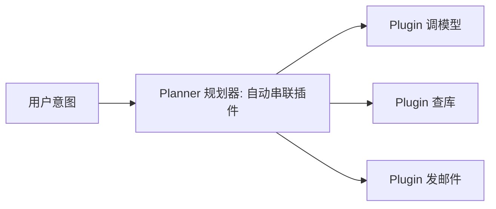
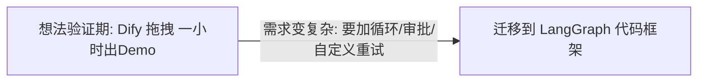

# 阶段三 · 小点 6：其他主流方案（选学）

> 所属：阶段三 主流 Agent 开发框架
> 定位：前 5 讲覆盖了"代码框架派"的主力。这一讲补齐三块拼图：OpenAI 官方的**托管式**（Assistants API）、微软的**插件化**（Semantic Kernel）、以及**低代码平台**（Dify）。它们各有最适配场景，读完你会对"什么时候该用什么"有完整判断力。

## 精简大纲

1. OpenAI Assistants API（托管式 Agent）
2. Semantic Kernel（微软插件化框架）
3. Dify 低代码平台
4. 选型边界总结

## 学习内容详情

### 1. OpenAI Assistants API（快速原型 / Demo）

#### 1.1 三个核心对象



- **Assistant（助理）：** 角色 + 工具全部定义在云端。
- **Thread（会话线程）：** 托管式会话（历史存 OpenAI 云端，对照 LangGraph 的 thread_id + Checkpointer，只是托管方换成 OpenAI）。
- **Run（一次执行）：** 异步任务轮询，状态含 `queued → in_progress → completed / failed / requires_action`（要你执行函数调用后回传）。

```python
from openai import OpenAI
client = OpenAI(api_key="sk-xxx")

# ① 建一个"助理" (云端保存角色+工具)
asst = client.beta.assistants.create(
    name="数据分析助手",
    instructions="你是数据分析助理, 只说结论与依据",   # 角色设定存云端
    model="gpt-4o",
)
# ② 建一个"会话线程"
thread = client.beta.threads.create()

# ③ 发消息 + 触发"一次执行"
client.beta.threads.messages.create(
    thread.id, role="user", content="帮我分析销售数据"
)
run = client.beta.threads.runs.create(thread.id, assistant_id=asst.id)

# ④ 轮询 Run 状态, 直到完成
while run.status not in ("completed", "failed", "requires_action"):
    run = client.beta.threads.runs.retrieve(thread.id, run.id)
print("最终状态:", run.status)
```

- 多轮对话：继续往同一 `thread` 加消息即可；用完记得清理（Assistants/Threads 有数量上限）。

#### 1.2 黑盒代价清单（为什么生产不推荐）

| 代价 | 说明 |
|-|-|
| 无法插入自定义逻辑 | 「模型思考」和「工具执行」之间不能加审批 / 路由 / 状态校验 |
| Bad-case 排查弱 | Run 内部执行细节不完全可见 |
| 深度绑定 OpenAI | 换模型 = 重写集成层；国内合规数据出境是硬伤 |
| 对照 | LangGraph 等价能力全部在你掌控之下 |

> **一句话**：Assistants API 适合快速验证"对话式 Agent"原型，但凡是生产要插逻辑 / 要可控 / 要换模型，就回到 LangGraph。

### 2. Semantic Kernel（SK，微软）

#### 2.1 插件化编排



- 插件化编排框架：把每个能力（调模型 / 查库 / 发邮件）封装成 Plugin，由 **Planner（规划器）**按用户意图自动串联插件。
- Python / C# 双语言一等支持——团队技术栈是 .NET 或 Python/.NET 混合时优先考虑；纯 Python 团队生态和社区不如 LangChain 系。

### 3. Dify（低代码平台）

- 拖拽式编排 Agent，适合非技术团队快速验证想法；但灵活性受平台限制。



- **低代码 vs 代码框架的边界：** 想法验证期用 Dify 快速试（一小时出 Demo）；验证成功、需求变复杂后迁移到 LangGraph。
- **判断信号：** 当你在 Dify 里想「加个循环」「人工审批」「自定义重试逻辑」却做不到时，就是迁移时机。

### 4. 选型边界总结

| 需求 | 首选 |
|-|-|
| 快速验证想法 | Dify 或手写 Demo |
| 托管式会话原型 | Assistants API |
| Python/.NET 混合团队 | Semantic Kernel |
| 生产级可控 Agent | LangGraph |
| 文档知识为核心 | LlamaIndex |

```python
# 一个"按需求返回选型"的决策助手(对照阶段二第4讲的决策树)
def choose_engine(needs: dict) -> str:
    if needs["doc_core"]:
        return "LlamaIndex + LangGraph"        # 文档知识为核心
    if needs["managed_session"]:
        return "Assistants API (仅原型)"        # 要托管会话
    if needs["dotnet_stack"]:
        return "Semantic Kernel"               # .NET混合团队
    if needs["no_code_team"]:
        return "Dify → 复杂后迁 LangGraph"      # 非技术团队
    if needs["need_control"] or needs["prod"]:
        return "LangGraph"                     # 生产/要控制
    return "手写 ReAct 或 Dify Demo"            # 快速验证

print(choose_engine({"prod": True, "need_control": True, "doc_core": False,
                     "managed_session": False, "dotnet_stack": False, "no_code_team": False}))
# LangGraph
```

## 本节自检

- [ ] 能说清 Assistants API 的黑盒代价与 LangGraph 的对照
- [ ] 能判断低代码平台何时该迁移到代码框架

## 本节配套思考题（快速入门的检验）

1. Assistants API 的 Thread 和 LangGraph 的 Checkpointer + thread_id 有什么本质相似与不同（谁托管、谁掌控）？
2. 为什么"要求在模型调用工具前插入人工审批"就判了 Assistants API 的死刑？
3. Dify 这类低代码平台，出现什么"信号"说明该迁到 LangGraph 了？举一个你认同的例子。
4. Semantic Kernel 的准确适配场景是什么？纯 Python 团队为什么未必优先选它？