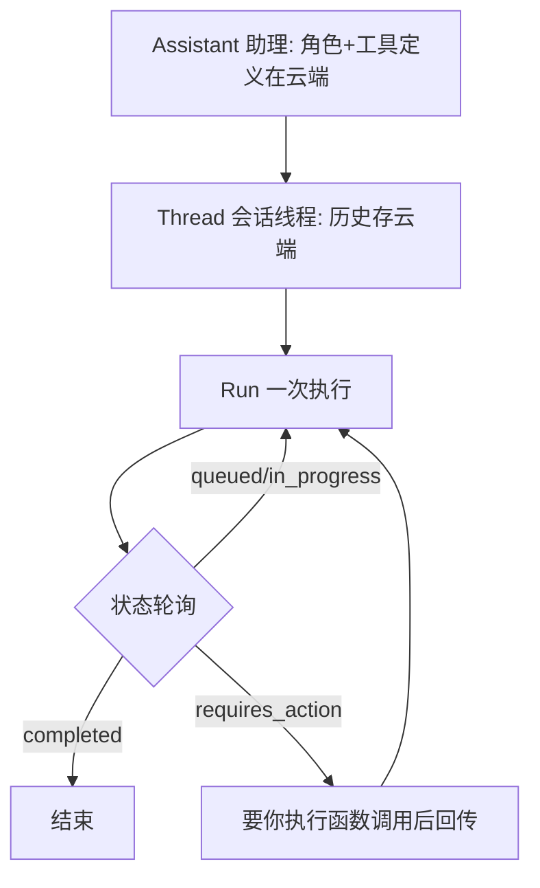
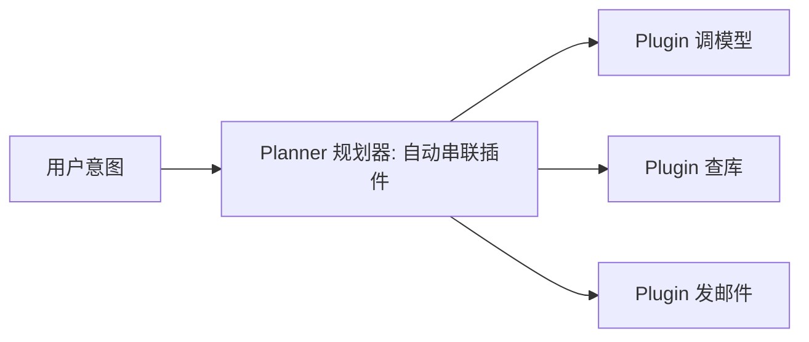
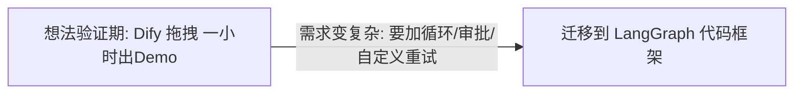

# 阶段三 · 小点 6：其他主流方案（选学）

> 所属：阶段三 主流 Agent 开发框架
> 定位：前 5 讲覆盖了"代码框架派"的主力。这一讲补齐三块拼图：OpenAI 官方的**托管式**（Assistants API）、微软的**插件化**（Semantic Kernel）、以及**低代码平台**（Dify）。它们各有最适配场景，读完你会对"什么时候该用什么"有完整判断力。

## 精简大纲

1. OpenAI Assistants API（托管式 Agent）
2. Semantic Kernel（微软插件化框架）
3. Dify 低代码平台
4. 选型边界总结

## 学习内容详情

### 1. OpenAI Assistants API（快速原型 / Demo）

#### 1.1 三个核心对象



- **Assistant（助理）：** 角色 + 工具全部定义在云端。
- **Thread（会话线程）：** 托管式会话（历史存 OpenAI 云端，对照 LangGraph 的 thread_id + Checkpointer，只是托管方换成 OpenAI）。
- **Run（一次执行）：** 异步任务轮询，状态含 `queued → in_progress → completed / failed / requires_action`（要你执行函数调用后回传）。

```python
from openai import OpenAI
client = OpenAI(api_key="sk-xxx")

# ① 建一个"助理" (云端保存角色+工具)
asst = client.beta.assistants.create(
    name="数据分析助手",
    instructions="你是数据分析助理, 只说结论与依据",   # 角色设定存云端
    model="gpt-4o",
)
# ② 建一个"会话线程"
thread = client.beta.threads.create()

# ③ 发消息 + 触发"一次执行"
client.beta.threads.messages.create(
    thread.id, role="user", content="帮我分析销售数据"
)
run = client.beta.threads.runs.create(thread.id, assistant_id=asst.id)

# ④ 轮询 Run 状态, 直到完成
while run.status not in ("completed", "failed", "requires_action"):
    run = client.beta.threads.runs.retrieve(thread.id, run.id)
print("最终状态:", run.status)
```

> 🔬 **深度理解 · Assistants API 的 Assistant / Thread / Run 三对象**：
> 1. **本质**：这是 OpenAI 提供的「托管式 Agent」建模——你在云端定义"这个 AI 是谁、会哪些工具"（Assistant）、"一段会话的历史"（Thread）、"一次具体的执行与推进"（Run），状态与恢复都由服务端替你管理。
> 2. **机制**：Assistant 把角色/工具定义存于云端；Thread 存会话消息，天然对标 LangGraph 的 thread_id + Checkpointer，只是托管方换成 OpenAI；Run 是异步任务，需轮询其状态，遇到 `requires_action` 表示要你执行函数调用后回传 `tool_outputs` 并继续。
> 3. **为什么重要**：它极大降低演示 / 原型的搭建成本——不用自己管状态与工具循环；但代价是「模型思考」与「工具执行」之间无法插入自定义逻辑，可控性被锁在黑盒里。
> 4. **易错点**：误以为 Run 是一次性同步调用，实际要轮询；`requires_action` 后必须回传工具结果再 poll 才会继续；也容易忽略 Thread 有创建数量上限、用完要清理。

> ⏳ **短期可不深究**：Run 那套 `queued → in_progress → requires_action` 状态机与 `tool_outputs` 回传的轮询写法细节，第一遍知道「它是异步任务、要轮询、要你执行工具后回传」即可；开原型时照着官方示例抄就行。

- 多轮对话：继续往同一 `thread` 加消息即可；用完记得清理（Assistants/Threads 有数量上限）。

#### 1.2 黑盒代价清单（为什么生产不推荐）

| 代价 | 说明 |
|-|-|
| 无法插入自定义逻辑 | 「模型思考」和「工具执行」之间不能加审批 / 路由 / 状态校验 |
| Bad-case 排查弱 | Run 内部执行细节不完全可见 |
| 深度绑定 OpenAI | 换模型 = 重写集成层；国内合规数据出境是硬伤 |
| 对照 | LangGraph 等价能力全部在你掌控之下 |

> **一句话**：Assistants API 适合快速验证"对话式 Agent"原型，但凡是生产要插逻辑 / 要可控 / 要换模型，就回到 LangGraph。

### 2. Semantic Kernel（SK，微软）

> ⚠️ **状态提示（2026）**：微软已将 Semantic Kernel 与 AutoGen 合并为 **Microsoft Agent Framework（MAF）**，SK 进入维护模式，新项目建议转向 MAF。本节保留 SK 的「插件化编排」思想，用于理解其与代码框架的差异。

#### 2.1 插件化编排



- 插件化编排框架：把每个能力（调模型 / 查库 / 发邮件）封装成 Plugin，由 **Planner（规划器）**按用户意图自动串联插件。
- Python / C# 双语言一等支持——团队技术栈是 .NET 或 Python/.NET 混合时优先考虑；纯 Python 团队生态和社区不如 LangChain 系。

> 🔬 **深度理解 · Semantic Kernel 的插件化编排（Plugin + Planner）**：
> 1. **本质**：SK 把「一个可复用的能力单元」（调模型 / 查库 / 发邮件）抽象成 Plugin，再由 Planner 按用户意图自动把这些插件串成一条执行计划——把「技能封装」和「技能调度」分离开。
> 2. **机制**：每个 Plugin / Kernel Function 声明名称、语义描述与参数；Planner 面向用户意图，调用 LLM 决定「需要哪些插件、按什么顺序、传什么参数」，再按计划执行。这与 LangChain「手写 LCEL 管道」的确定式编排形成对照——SK 偏向「运行时动态规划」。
> 3. **为什么重要**：它让「能力」与「编排」解耦、可复用，动态调度适合意图多变的场景；但动态计划不如手写管道可控、可复现。
> 4. **易错点**：Planner 可能规划出错或加载过多插件导致上下文膨胀；且 SK 已进维护模式（被 MAF 合并），新项目路径应跟着 MAF 走，别在 SK 老 API 上深挖。

> ⏳ **短期可不深究**：SK 的 Planner 底层「怎么套用 LLM 生成执行计划」的实现细节偏复杂，且 SK 已进维护模式（被 MAF 合并），新项目建议直接看 MAF——这里只需领会「技能封装 + 动态调度」这个思想差异即可。

### 3. Dify（低代码平台）

- 拖拽式编排 Agent，适合非技术团队快速验证想法；但灵活性受平台限制。



- **低代码 vs 代码框架的边界：** 想法验证期用 Dify 快速试（一小时出 Demo）；验证成功、需求变复杂后迁移到 LangGraph。
- **判断信号：** 当你在 Dify 里想「加个循环」「人工审批」「自定义重试逻辑」却做不到时，就是迁移时机。

### 4. 选型边界总结

| 需求 | 首选 |
|-|-|
| 快速验证想法 | Dify 或手写 Demo |
| 托管式会话原型 | Assistants API |
| Python/.NET 混合团队 | Semantic Kernel |
| 生产级可控 Agent | LangGraph |
| 文档知识为核心 | LlamaIndex |

```python
# 一个"按需求返回选型"的决策助手(对照阶段二第4讲的决策树)
def choose_engine(needs: dict) -> str:
    if needs["doc_core"]:
        return "LlamaIndex + LangGraph"        # 文档知识为核心
    if needs["managed_session"]:
        return "Assistants API (仅原型)"        # 要托管会话
    if needs["dotnet_stack"]:
        return "Semantic Kernel"               # .NET混合团队
    if needs["no_code_team"]:
        return "Dify → 复杂后迁 LangGraph"      # 非技术团队
    if needs["need_control"] or needs["prod"]:
        return "LangGraph"                     # 生产/要控制
    return "手写 ReAct 或 Dify Demo"            # 快速验证

print(choose_engine({"prod": True, "need_control": True, "doc_core": False,
                     "managed_session": False, "dotnet_stack": False, "no_code_team": False}))
# LangGraph
```

## 本节自检

- [ ] 能说清 Assistants API 的黑盒代价与 LangGraph 的对照
- [ ] 能判断低代码平台何时该迁移到代码框架

## 本节配套思考题（快速入门的检验）

1. Assistants API 的 Thread 和 LangGraph 的 Checkpointer + thread_id 有什么本质相似与不同（谁托管、谁掌控）？
2. 为什么"要求在模型调用工具前插入人工审批"就判了 Assistants API 的死刑？
3. Dify 这类低代码平台，出现什么"信号"说明该迁到 LangGraph 了？举一个你认同的例子。
4. Semantic Kernel 的准确适配场景是什么？纯 Python 团队为什么未必优先选它？

## 本节常见面试题（深度解析）

> 针对本节核心知识的面试高频点，配合"本质+机制"式理解，能让你答得既有深度又有广度。

### 面试题 1：Assistants API 的 Thread 与 LangGraph 的 Checkpointer + thread_id 本质相似与不同是什么？
- **面试官想考察**：是否理解"托管的会话状态 vs 自掌控的状态持久化"这一核心差异。
- **专业作答（含深度）**：
  1. 相似：两者都以"会话 ID"（Thread / thread_id）维持续航状态，都支持多轮记忆与恢复，都是"对话状态"的载体。
  2. 不同：是谁托管——Thread 的状态存在 OpenAI 云端、你通过 API 间接操作；LangGraph 的 Checkpointer 由你指定存储后端（本地 / Redis / Postgres）、完全掌控。
  3. 含义：Assistants 更省事但不可迁移（换模型 = 换平台）、难以定制；LangGraph 更灵活可控、可水平扩展、可审计。
  4. 结论：托管式适合快速原型和"状态无所谓"的 Demo；要自定义逻辑、控制存储位置、可运维，选自托管代码框架。
- **加分亮点 / 深度追问**：提"国内合规数据出境"这一现实约束；追问常是"Thread 能加自定义业务字段吗"——答：托管式会话基本只能存消息，自定义状态能力弱，这正是其黑盒代价之一。

### 面试题 2：为什么"要求在模型调用工具前插入人工审批"就判了 Assistants API 的死刑？
- **面试官想考察**：对"是否允许在图的节点间插入自定义逻辑"这一编排自由度关键点的理解。
- **专业作答（含深度）**：
  1. Assistants API 把「模型思考 → 工具执行」封装在 Run 内部，Run 作为一个原子动作要么 `requires_action` 要你回传、要么跑完，你**不能在两者之间插入审批 / 路由 / 状态校验**这类自定义步骤。
  2. 等价能力在 LangGraph：把"人工审批"做成一个普通 Node 放在「工具节点」之前，用 `interrupt` 挂起等人工确认，再 `resume` 放行——你想插什么都行。
  3. 本质差异是「黑盒 vs 白盒」：托管式给你"托管能力"但拿走"干预能力"；只要业务需要精确控制每一步，托管式就不适用。
  4. 结论：这是判断"要不要上代码框架"的一条硬性信号——有审批 / 自定义路由 / 状态校验需求就别用托管式。
- **加分亮点 / 深度追问**：明确"人工审批本质是在图的状态流里加一个等待人工输入的节点"；追问常是"Demo 阶段可以先用 Assistants 吗"——答：可以，只要接受后期要重写集成层。

### 面试题 3：托管式 / 插件化（SK）/ 低代码（Dify）/ 代码框架（LangGraph）各自主导什么场景？出现什么"信号"说明该往代码框架迁移？
- **面试官想考察**：对 Agent 技术栈宏观选型与"复杂度迁移时机"的判断力。
- **专业作答（含深度）**：
  1. 定位梳理：Assistants 适合托管会话原型；Dify 适合非技术团队快速验证想法；SK / MAF 适合需要插件复用与 .NET/Python 混合栈；LangGraph 是生产级可控 Agent 的主选。
  2. 迁移信号：当你发现 "加个循环做不到""加人工审批做不到""自定义重试做不到""跨会话状态难以管理"时，就说明当前方案的表达力已到天花板，该迁到能自由编排的代码框架。
  3. 判断原则：先问"是否需要精确控制、是否要自定义逻辑、是否要换模型 / 数据出境"；需要的用代码框架，纯验证期的可用低代码 / 托管式。
  4. 演进路径常见：Dify / Assistants 验证 → 迁 LangGraph + LlamaIndex 组合成生产架构。
- **加分亮点 / 深度追问**：讲"低代码 / 托管的优点恰恰也是它的约束来源——上手快 = 可定制范围小"；追问常是"给一个具体迁移例子"——答：在 Dify 里想做跨步骤循环与审批做不到时，就是迁移时点。