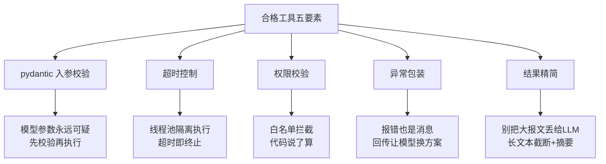
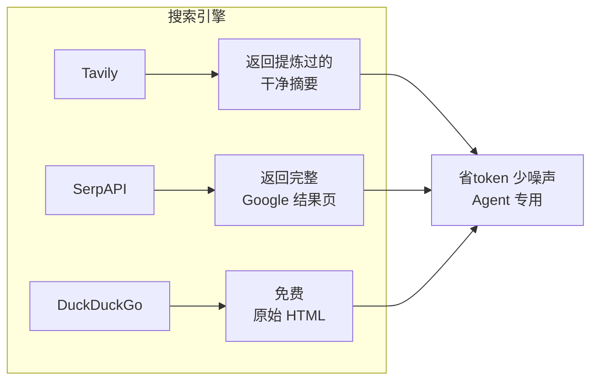
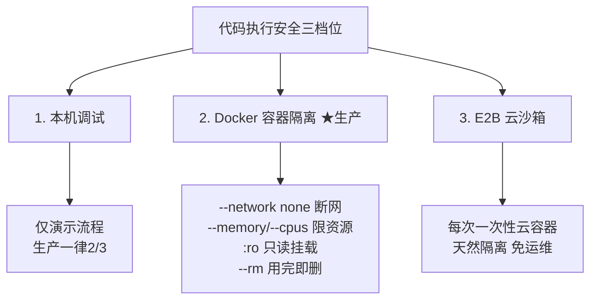
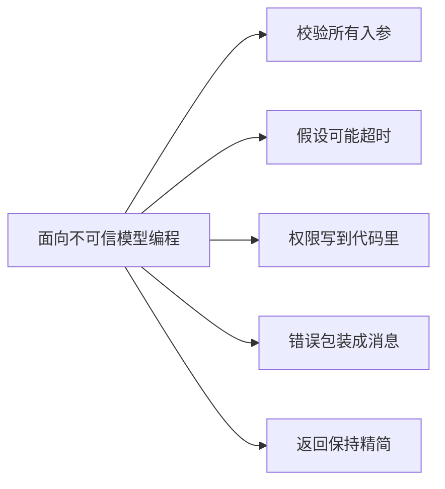

# 阶段四 · 小点 1：工具调用生态

> 所属：阶段四 工具生态与外围组件集成
> 定位：Agent 能力的上限，很大程度来自工具。这一讲把「如何把一个普通函数升级成一个合格的工具」讲透：五要素规范、搜索 / 代码执行 / 文件 / 业务系统四大类工具的取舍，以及一个生产级「工具工厂」怎么写。

## 精简大纲

1. 工具开发五要素规范（工具工厂）
2. 搜索工具：Tavily / SerpAPI / DuckDuckGo
3. 代码执行工具：安全三档位 ★
4. 文件处理与业务系统集成
5. 总结：写工具 = 面向「不可信的模型」编程

## 学习内容详情

> 核心认知：Agent 能力上限很大程度来自工具；工具开发不是写函数，要考虑入参校验、异常、超时、权限、返回结果格式化。

### 1. 工具开发五要素（记忆口诀）

#### 1.1 为什么工具不能只是函数？

你写的 `def search(q): ...` 喂给模型后，会在运行时面临完全不可控的输入：
- 模型可能传**非法参数**（字符串没清洗、数字传成字符串）；
- 模型可能传**恶意参数**（诱导路径穿越、注入）；
- 工具可能**卡死**（外部 API 超时不返回）；
- 工具可能**抛异常**导致整个 Agent 中断；
- 工具可能**返回几 MB 的原始报文**，把上下文撑爆。

所以合格工具的五个要素如下：



1. **pydantic 入参校验**——模型给的参数永远可疑，先校验再执行。类型不符、超范围、注入符号，在校验层就拦下来。
2. **超时控制**——线程池隔离执行，超时即终止不再占用。外部工具有可能永远不返回，必须给它一个「deadline」。
3. **权限校验**——白名单拦截：能不能调，代码说了算，大模型说了不算。模型无法绕过你硬编码的校验逻辑。
4. **异常包装**——报错也是「消息」，封装成友好错误回传模型让它换方案，而不是抛异常中断。
5. **结果精简**——别把原始大报文丢给 LLM（上下文是花钱买的），长文本截断 + 摘要。

#### 1.2 工具工厂：一次写好，处处继承

把上述规范封装进一个「工具工厂」，新增业务工具只写业务逻辑，规范自动继承：

```python
# 核心: 把任意函数包进"五要素", 生产通用的 Tool 脚手架
from typing import Callable, Any
from functools import wraps
from concurrent.futures import ThreadPoolExecutor, TimeoutError
from pydantic import create_model, ValidationError
import json, inspect

_ALLOWED_TOOL_NAMES = {"search", "calc_weather"}      # ① 权限白名单(硬编码, 模型改不了)
_SUMMARY_LEN = 500                                      # ⑤ 返回内容精简阈值

def tool_factory(name: str, timeout: float = 10.0):
    """工具工厂: 自动给函数套上『校验 + 超时 + 权限 + 异常包装 + 精简』"""
    def decorator(func: Callable) -> Callable:
        # ① 读取函数签名, 用 pydantic 动态生成入参模型
        sig = inspect.signature(func)
        fields = {
            p_name: (p_ann if p_ann is not inspect.Parameter.empty else str, ...)  # 无类型注解默认 str, 兜底
            for p_name, p_ann in sig.parameters.items()
        }
        ParamModel = create_model(name + "_params", **fields)

        @wraps(func)
        def wrapper(*args, **kwargs):
            # ② 权限校验: 不在白名单直接拒绝(模型说了不算)
            if name not in _ALLOWED_TOOL_NAMES:
                return json.dumps({"error": f"工具 {name} 未授权"}, ensure_ascii=False)
            # ① 入参校验: 先过 pydantic 再真正执行
            try:
                valid = ParamModel(**kwargs)
                kwargs = valid.model_dump()
            except ValidationError as e:
                return json.dumps(
                    {"error": f"参数不合法: {e.errors()}"}, ensure_ascii=False
                )                                   # ③ 异常包装: 回传友好错误
            # ② 超时控制: 线程池里跑, 到点强杀
            with ThreadPoolExecutor(max_workers=1) as pool:
                future = pool.submit(func, **kwargs)
                try:
                    raw = future.result(timeout=timeout)
                except TimeoutError:
                    return json.dumps(
                        {"error": f"工具 {name} 执行超时({timeout}s)"}, ensure_ascii=False)
                except Exception as e:              # ④ 异常包装: 任何异常都封装成消息
                    return json.dumps({"error": f"工具 {name} 失败: {e}"}, ensure_ascii=False)
            # ⑤ 结果精简: 长文本截断, 别撑爆上下文
            text = str(raw)
            if len(text) > _SUMMARY_LEN:
                text = text[:_SUMMARY_LEN] + "...(已截断)"
            return text
        return wrapper
    return decorator

# 用法: 业务函数只要写上名字+业务逻辑, 五要素自动继承
@tool_factory("search", timeout=5.0)
def search(query: str, limit: int = 3):
    """真正的检索逻辑, 这里只写业务, 不管校验超时"""
    return f"关于 [{query}] 的检索结果, 取前 {limit} 条。"

@tool_factory("calc_weather")
def calc_weather(city: str):
    return {"北京": "晴 26°C"}.get(city, f"暂无{city}天气")

print(search(query="RAG", limit=2))        # 正常走五要素
print(search("") if False else "跳过")        # 一眼看出: 白名单+校验+超时+包装+精简 全自动生效
```

- 新增工具只需两个动作：写业务函数 + 用 `@tool_factory` 标注；校验、超时、权限、异常、精简全部复用。
- 团队约定：所有工具必须**经过工厂产出**，禁止把裸写、无规范的函数直接喂给模型。

#### 1.3 function calling 参数坑速查

工具 Schema（名字 / 描述 / 参数定义）直接决定模型的调用准确率，高频踩坑五条：

| 坑 | 正确姿势 |
|-|-|
| **类型严格**：`integer` 传字符串会被直接拒 | Schema 类型写准，别指望模型自动纠错——pydantic 校验层兜底 |
| **enum 枚举要在 Schema 里声明** | `"enum": ["json", "csv"]` 写进参数定义，而不是靠 prompt 说「只能选…」 |
| **`required` 与 optional 明确** | 真必填的进 `required` 列表；可缺省的给默认值，减少模型漏传/瞎填 |
| **参数命名用 snake_case** | `max_results` 的遵循率明显高于 `maxResults`——模型对 snake_case 函数签名训练最充分 |
| **嵌套层级 ≤ 3** | 参数套参数再套参数，填充错误率飙升——拍平成 `a_b_c` 式的键 |

> ⏳ **短期可不深究**：参数命名用 snake_case、嵌套层级 ≤3 这类「调用细节」第一遍不用背——它们只影响调用成功率的高低，不决定工具能不能用。先把「类型写准 + enum 进 Schema + required 明确」这三条主线记牢，跑通流程后再回来打磨这些调优细节。

> 🔬 **深度理解 · 工具调用 Schema 与 function calling**：
> 1. **本质**：function calling 的本质是**把“函数签名”变成模型能理解的结构化选择题**——模型不自量执行，只负责从你给的候选里挑一个函数、按约束填好参数，真正的执行永远在模型之外（你的代码里）。
> 2. **机制**：整条链路是「工具声明 → 模型推理 → 结构化回传 → 宿主执行 → 结果回填」的循环。① 你把每个工具转成 JSON Schema（name / description / parameters）发给模型；② 模型看到用户问题后，不直接输出答案，而是输出一个「要不要调工具 + 调哪个 + 参数填什么」的结构化请求（严格来说是一次特殊的 generation，形式和 JSON 一样）；③ 宿主代码收到后真正的发起调用、捕获结果，把结果作为一条消息再喂回模型，模型基于真实结果继续推理或产出最终答案；④ description 写得越准，模型“该不该在此时调它”的决定就越聪明——这是 function calling 的**质量命门**。
> 3. **为什么重要**：它是 Tool 型 Agent 的“话术层”。模型本身没有权限、没有网络、不能执行代码，必须靠这一层把意图翻译成可执行的动作；没有它，Agent 永远只能“聊聊”，不能“做事”。
> 4. **易错点/常见误解**：误解一是「模型会真的执行函数」——不，它只是产出结构化参数，执行是你写的代码；误解二是「description 不重要」——恰恰相反，description 决定模型何时调用、误调率一大半出在这；误解三是「把 Schema 写得越复杂越好」——`required` 全填、层级嵌套太深都会让模型填参更不稳定，够用即可。

### 2. 搜索工具

#### 2.1 三款主流搜索方案对比



| 方案 | 定位 | 返回质量 | 成本 |
|-|-|-|-|
| **Tavily** | 专为 Agent 优化 | 提炼过的干净摘要，省 token 少噪声 | 有免费额度，性价比高 |
| SerpAPI | 对接 Google | 完整结果页，全而贵 | 较贵 |
| DuckDuckGo | 免费起步 | 原始 HTML，要自己清洗 | 免费，适合练手 |

- **要点一（结果精简）**：搜索结果不能说整页 HTML，只取 `answer + 标题/URL/摘要前 100 字`，防上下文爆炸。
- **要点二（加重试）**：外部搜索不稳定，用 `tenacity` 加重试（自动指数退避）。

```python
from tenacity import retry, stop_after_attempt, wait_exponential, retry_if_exception_type
import requests

@retry(
    stop=stop_after_attempt(3),                        # 最多重试 3 次
    wait=wait_exponential(multiplier=1, min=1, max=10), # 退避 1s->2s->...->10s
    retry=retry_if_exception_type(requests.RequestException),  # 只重试网络异常
)
def search_tavily(q: str, api_key: str) -> dict:
    """调用 Tavily 搜索, 返回精简结果。失败自动重试。"""
    resp = requests.post(
        "https://api.tavily.com/search",
        json={"query": q, "max_results": 3, "include_answer": True},
        headers={"Authorization": f"Bearer {api_key}"},
        timeout=10,
    )
    data = resp.json()
    # 精简: 只留 answer + 前3条标题/URL/摘要前100字, 防止撑爆上下文
    return {
        "answer": data.get("answer", ""),
        "results": [
            {"title": r.get("title"), "url": r.get("url"),
             "content": (r.get("content") or "")[:100]}   # 摘要截断到 100 字
            for r in data.get("results", [])[:3]
        ],
    }
```

### 3. 代码执行工具（安全三档位）★

> 安全红线：大模型生成的代码 == 不可信输入！就算 prompt 写「只写计算代码」，它仍可能输出 `os.system("rm -rf")`——严格执行三档位。



| 档位 | 方案 | 说明 |
|-|-|-|
| 1 | 本机调试 | 仅演示流程，生产一律 2/3 |
| 2 | Docker 容器隔离 | `--network none` 断网防外传；`--memory/--cpus` 防资源耗尽；`:ro` 只读挂载；`--rm` 用完即删 |
| 3 | E2B 云沙箱 | 每次一个一次性云容器，天然隔离，免运维 |

```python
# Docker 跑一句用户代码: 断网 + 限资源 + 只读 + 用完即删
# 命令等价于:
#   docker run --rm \
#       --network none \            # 断网: 防止代码外传敏感数据
#       --memory 128m --cpus 0.5 \  # 限内存+CPU: 防止挖矿/死循环耗尽宿主机
#       -v /onlyread:/data:ro \     # 只读挂载: 宿主机数据只给看, 不给改
#       python:3.11-slim python -c "用户代码"
import subprocess

def run_in_docker(code: str) -> str:
    """用 Docker 安全执行一段不可信的代码"""
    cmd = [
        "docker", "run", "--rm",
        "--network", "none",                 # 关键: 容器无网络, 无法外传
        "--memory", "128m", "--cpus", "0.5",
        "python:3.11-slim", "python", "-c", code,
    ]
    try:
        proc = subprocess.run(cmd, capture_output=True, text=True, timeout=20)
        return proc.stdout or proc.stderr
    except subprocess.TimeoutExpired:
        return "执行超时, 已终止"               # 异常包装: 回传友好, 不抛异常
```

> ⏳ **短期可不深究**：`docker run` 的 `--network none / --memory / --cpus / :ro` 这些具体开关**第一遍只需知道“有容器级隔离这件事”**，不用逐条背参数——它们是加固细节，真正要上生产沙箱时照着文档抄就行。先把「大模型生成的代码 = 不可信输入」这条安全主线记牢。

```python
# 档位3 E2B 云沙箱: 每次一个一次性云容器, 免自维护沙箱(最小示例)
# pip install e2b-code-interpreter
from e2b_code_interpreter import Sandbox

with Sandbox() as sb:                        # 上下文管理器: 自动创建/销毁容器
    execution = sb.run_code("print(sum(range(101)))")
    print(execution.logs)                    # stdout / stderr 日志
    print(execution.results)                 # 结构化结果(文本/富文本/图片等 artifacts)
    if execution.error:                      # 执行报错也别抛异常, 包装回传让模型自己改
        print(execution.error)
```

- **预装环境**：E2B 沙箱自带常见数据科学栈（Python / pandas / matplotlib 等），数据分析 Agent 开箱即用；
- **免自维护沙箱**：不用自己运维 Docker 集群，容器一次性、用完即焚、天然隔离；
- **按量计费**：注意给 `run_code` 加超时与代码长度限制，防死循环烧钱。

> 🔬 **深度理解 · 不可信代码的隔离执行（沙箱）**：
> 1. **本质**：沙箱的本质是把**「执行权」与「宿主资源」分离**——让不可信代码在自己的受限环境中跑，即使它做了最坏的事（删文件 / 挖矿 / 外传数据），损害的也仅限于这个一次性环境，碰不到宿主的系统与数据。
> 2. **机制**：隔离按强度递进，本质是「边界画在哪一层」。① 进程级（如出子进程）最弱，只隔离栈，共享 CPU/内存/网络/文件系统；② 容器级（Docker）在**内核层面**用 namespace + cgroup 隔离文件系统、进程表、网络、资源配额——所以断网能挡外传、`--memory/--cpus` 能防资源耗尽、`:ro` 挂载让宿主目录只读不可改；③ 虚拟机/“云沙箱”（如 E2B）再加一层硬件虚拟化隔离，每次起一个一次性容器，用完即焚，天然免运维。代码仍在同一系统调用能力边界内，安全边界画得越深、开销越大。
> 3. **为什么重要**：代码执行工具是 LLM 能力放大器，也是最大的风险敞口。没有隔离，一行 `os.remove` / `requests.post(拿到私有数据)` 就可能让 Agent 从“帮你算数”变成“帮你闯祸”——沙箱决定你敢不敢把执行权交给模型。
> 4. **易错点/常见误解**：误解一「断网就足够」——断网能挡外传，却挡不住删数据/磁盘耗尽，必须叠加只读+资源配额；误解二「沙箱 = 跑分环境」——容器不是 VM，共享宿主机内核，误配 `--privileged` 可逃逸到宿主机；误解三「只要 Docker 就一定安全」——镜像与挂载点配置不当照样有洞，隔离是分层纵深不是单点灵药。

### 4. 文件处理与业务系统集成

#### 4.1 文件处理

- **PDF**：PyMuPDF 解析（快、保留版式）；
- **Excel / CSV**：pandas / openpyxl 读写；
- **图片 OCR**：PaddleOCR 识别文字；
- **安全约束**：文件大小限制（如 ≤ 10MB）、文件类型白名单（拒绝 .exe、.sh）。

```python
import pymupdf as fitz   # 官方当前推荐包名为 pymupdf（旧名别名 fitz，不要写成 `import PyMuPDF`）

ALLOWED_EXTS = {".pdf", ".txt", ".md", ".csv", ".xlsx"}   # 文件类型白名单
MAX_SIZE = 10 * 1024 * 1024                               # 大小上限 10MB

def read_pdf(path: str) -> str:
    """PDF 解析: 先验类型+大小, 再提取全文(截断防撑爆上下文)"""
    ext = "." + path.rsplit(".", 1)[-1].lower()
    if ext not in ALLOWED_EXTS:
        return f"不支持的类型 {ext}, 允许: {ALLOWED_EXTS}"
    import os
    if os.path.getsize(path) > MAX_SIZE:
        return "文件超过 10MB, 拒绝解析"
    doc = fitz.open(path)
    text = "\n".join(page.get_text() for page in doc)
    return text[:2000]   # 只回传前 2000 字, 防止上下文爆炸
```

#### 4.2 业务系统集成要点

- **鉴权处理**：token 获取、过期刷新、权限不足的报错分支（401 自动重登 / 403 提示无权限）。
- **接口降级**：外部服务挂掉时返回兜底内容（缓存旧数据 / 「服务暂不可用」提示），不拖垮 Agent。
- **幂等**：不幂等操作（如扣款、发券）重试前必须人工确认，否则重试一次多扣一次钱。

```python
import requests

def fetch_with_fallback(url: str, cache=None) -> str:
    """
    外部接口的降级模板:
    1) 优先请求实时数据
    2) 失败先查缓存兜底
    3) 再失败返回"服务暂不可用"
    绝不把异常冒泡出去拖垮 Agent
    """
    try:
        resp = requests.get(url, timeout=5)
        resp.raise_for_status()
        data = resp.json()
        if cache is not None:
            cache[url] = data            # 成功后写入缓存, 供下次兜底
        return data
    except Exception:
        if cache is not None and url in cache:
            return cache[url]            # 降级1: 用缓存旧数据
        return "服务暂不可用, 请稍后再试"    # 降级2: 友好提示
```

### 5. 总结：写工具 = 面向「不可信的模型」编程



- 工具五要素不是可选项，是生产底线。忘写任何一条，上线就可能在某个角落翻车。
- 最省事的方式：**工具工厂**统一封装，业务开发只写「纯净业务函数」。
- 以上都是**进程内**的组织方式；当工具需要跨应用/跨宿主共享时，把同一套五要素升级为标准协议，见 [05-MCP协议与工具接入](05-MCP协议与工具接入.md)。

## 本节自检

- [ ] 能说出工具开发五要素并落地一个带工厂的工具
- [ ] 能说清代码执行的「安全三档位」及各自适用场景
- [ ] 能写出带重试 + 降级的搜索/外部接口封装
- [ ] 能区分「校验、超时、权限、异常包装、结果精简」分别解决什么问题

## 本节常见面试题（深度解析）

> 针对本节核心知识的面试高频点，配合"本质+机制"式理解，能让你答得既有深度又有广度。

### 面试题 1：为什么给模型的工具不能只是一个普通函数？工具五要素各解决什么问题？

- **面试官想考察**：是否真的经历过"把工具喂给模型"的坑，还是只背了概念；能否从"模型不可信"这个根因倒推出每一道防线。
- **专业作答（含深度）**：
  1. **根因**：工具消费的输入来自模型生成的参数，是**完全不可控**的——可能非法（类型／范围错）、可能恶意（注入、路径穿越）、可能让工具卡死、可能抛异常中断 Agent、也可能返回超大报文爆掉上下文。
  2. **五要素逐条对应**：① pydantic 入参校验——在真正执行前拦截非法/恶意参数；② 超时控制——线程池隔离 + deadline，外部 API 永不返回时不占用进程；③ 权限校验——白名单硬编码在代码里，模型说服不了它；④ 异常包装——把异常封装成"消息"回传模型让它换方案，而不是抛异常中断整个循环；⑤ 结果精简——截断/摘要，避免大报文把上下文（=钱）撑爆。
  3. **升华**：这五条本质都是用工程手段去兜底「LLM 不可信」这一个事实，缺任何一条，线上某处就会在不带屎感的地方翻车。
- **加分亮点 / 深度追问**：可补充"用工具工厂统一封装，业务只写纯函数、五要素自动继承"，并说明这符合"模板方法/装饰器"模式；被追问时能答"权限判定必须在代码层而非 prompt 层，因为模型可能被间接注入哄骗"。

### 面试题 2：聊聊 function calling 的完整调用链路，模型在哪个环节真正"执行"了函数？

- **面试官想考察**：是否理解 function calling 只是"结构化参数生成"，而不存在模型真正执行——很多新手把这两件事混淆。
- **专业作答（含深度）**：
  1. **流程四步**：把工具 Schema（name/description/parameters，JSON Schema 格式）随上下文发给模型 → 模型在需要时输出一个含 `tool_calls` 的结构化回复（选哪个工具 + 参数填什么）→ 宿主代码校验并**真正执行**该函数 → 把返回结果作为 tool 消息回填，模型基于真实结果继续推理或给出最终答案。
  2. **关键澄清**：模型全程只做"决策与填参"，不执行任何代码；执行权始终在宿主（你的代码）手里，这是安全边界。
  3. **质量命门**：`description` 决定模型何时调、调哪个；`enum`/`required`/类型声明决定它填参准不准——工具 Schema 本身就是给模型的"说明书"。
- **加分亮点 / 深度追问**：可提"并行工具调用/多 tool_calls"、以及 function calling 的 Accuracy 受 Schema 复杂度和描述措辞影响很大；被追问"模型填错参数怎么办"时答"工具五要素里的校验层兜底 + 错误包装回传让它自纠"。

### 面试题 3：让 LLM 执行一段它自己生成的代码，你会怎么保证安全？

- **面试官想考察**：是否有真实的安全意识，能给出"分层隔离"而不是一句"用 Docker"敷衍；是否理解威胁模型（跑飞/资源耗尽/外传数据/越权改动）。
- **专业作答（含深度）**：
  1. **先承认前提**：模型生成的代码 = 不可信输入，prompt 约束不可靠，必须环境隔离。
  2. **按强度分档**：① 本机调试（仅演示）；② Docker 容器——`--network none` 断网反外传、`--memory/--cpus` 限资源防挖矿/死循环、`:ro` 只读挂载保护宿主数据、`--rm` 用完即焚；③ E2B 等云沙箱——一次性容器天然隔离、免自运维，用于更高隔离需求。
  3. **再叠加**：执行超时 + 代码长度限制 + 结果截断，防死循环与上下文爆炸；并说明这些与"工具五要素"一脉相承。
- **加分亮点 / 深度追问**：可主动补"容器不是虚拟机，共享宿主机内核，`--privileged` 或挂载越界可逃逸，真高安全要上 VM/云沙箱"；被追问"断网就够了吗"时答"断网只挡外传，删数据/磁盘耗尽仍要只读+配额兜底"。