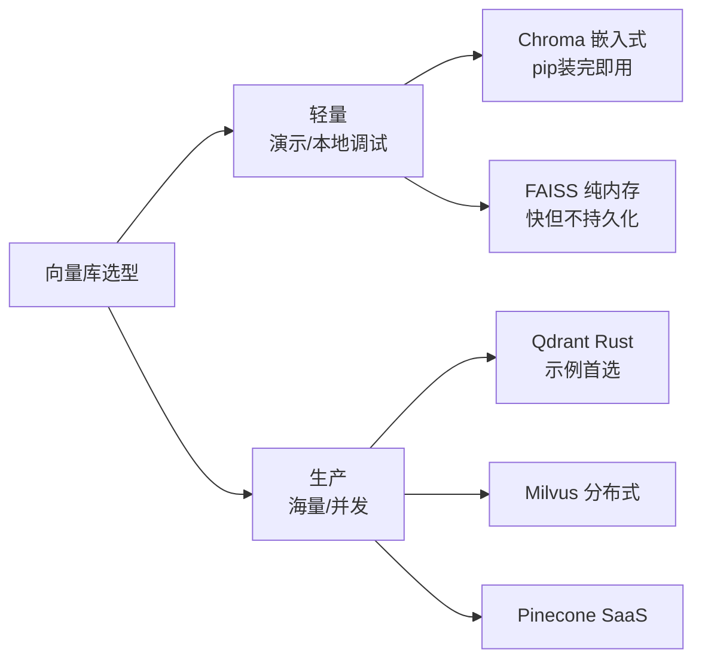
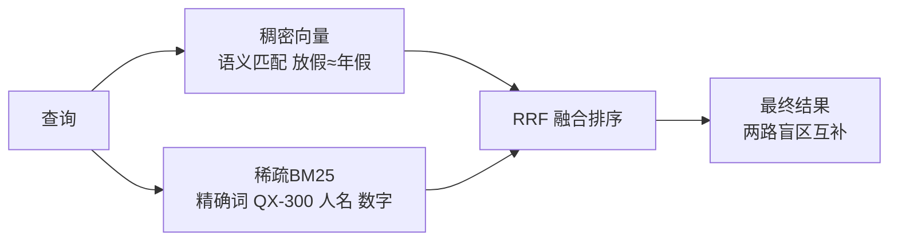
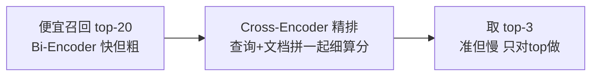
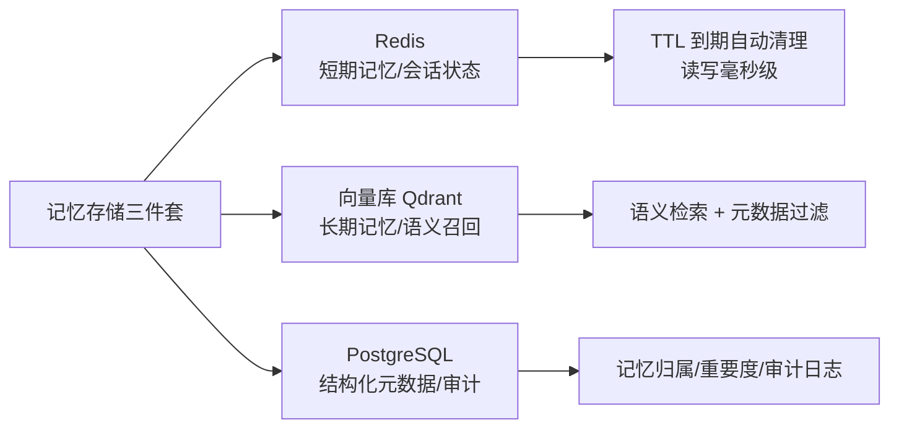
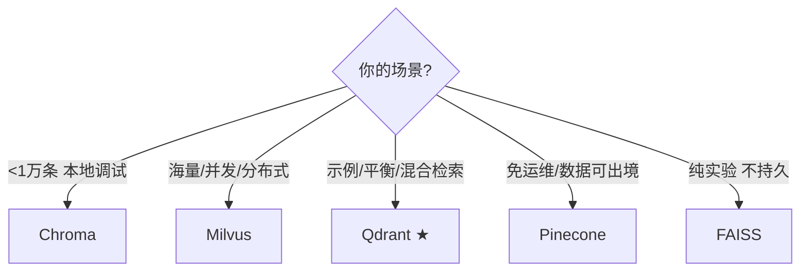

# 阶段四 · 小点 2：向量数据库与记忆存储

> 所属：阶段四 工具生态与外围组件集成
> 定位：向量库是 Agent 的「长期记忆 + 知识库」的地基。这一讲从「什么叫向量」讲起，把 Embedding 选型、ANN 索引、混合检索、Rerank 一次讲清，再给你一份「Redis + 向量库 + PostgreSQL」的生产级记忆存储分工方案。

## 精简大纲

1. 向量基础：Embedding、相似度、检索原理
2. 轻量方案：Chroma / FAISS
3. 生产级向量库：Milvus / Qdrant / Pinecone
4. 检索进阶：元数据过滤、混合检索、Rerank
5. 记忆存储组合方案（生产架构）
6. 总结：向量库怎么选、怎么配

## 学习内容详情

### 1. 向量基础

#### 1.1 从「词 → 向量」看 Embedding

```mermaid
graph LR
    A["放假通知"] -->|Embedding<br/>编码模型| B[[ 0.12, 0.87, -0.34, ... 0.05 ]<br/>384维向量]]
    C["年假安排"] -->|Embedding| D[[ 0.11, 0.85, -0.30, ... 0.04 ]<br/>384维向量]]
    E["红烧肉做法"] -->|Embedding| F[[ 0.6, -0.1, 0.9, ... 0.8 ]]
    B -.语义相近.-> D
```

- **Embedding**：把一段文字变成一串数字（向量）。语义相近的文字，向量方向也相近。
- **Embedding 维度**：向量长度（384 / 512 / 1536 维），维度越高表达力越强但越贵、越慢、占内存越大。
- **选型三问**：
  1. **中文效果**——BGE 系列对中文远好于英文模型，中文语料优先 BGE；
  2. **本地部署（开源）还是 API（闭源）**——离线/隐私要求选开源本地，图省事选 API；
  3. **精度够不够**——先小模型跑通流程，不够再升维 / 换更强模型。

#### 1.2 余弦相似度

- 衡量两个向量「方向」是否接近，`cos = (A·B) / (|A||B|)`，取值 `[-1, 1]`，越接近 1 表示越相似（同向）。
- 向量检索默认用余弦相似度（只关心方向、不关心长度），这也是为什么它能忽略文本长短差异。

```python
import numpy as np

def cos_sim(a, b):
    """余弦相似度: 1=完全同向, 0=正交, -1=反向"""
    return float(np.dot(a, b) / (np.linalg.norm(a) * np.linalg.norm(b) + 1e-9))

a = np.array([0.12, 0.87, -0.34])      # "放假通知"
b = np.array([0.11, 0.85, -0.30])      # "年假安排"
c = np.array([0.60, -0.10, 0.90])      # "红烧肉"
print(f"放假 vs 年假: {cos_sim(a, b):.3f}")   # 高, 语义相近
print(f"放假 vs 红烧: {cos_sim(a, c):.3f}")   # 低, 语义无关
```

> 🔬 **深度理解 · 向量嵌入与相似度检索（维度 & 度量）**：
> 1. **本质**：Embedding 是把一段文本映射到高维连续向量空间里的一个点，**“语义相近”≈“空间距离近”**。它做了词法表达（"年假"vs"休假"）到语义表达的一次升维抽象，让“检索”从“字面匹配嘴上”变成“几何上找邻近点”。
> 2. **机制**：维度就是语义能“记住”的自由度的数量——384/768/1536 维，每一维可粗略理解为在某个隐含语义轴上的强度。相似度度量选的是**在该向量空间里怎么量“近”**：余弦看方向（`(A·B)/(|A||B|)`，忽略长度，文本检索默认）、点积看方向+长度（未归一化时受向量模长干扰）、L2 欧氏看绝对距离（对向量长度/尺度敏感）。多数 embedding 模型输出已归一化时三者排序往往等价，但**选错度量（尤其对非归一化向量）会导致排序失真**。库与模型必须“维度一致 + 度量一致”，换模型=维度变=全量重嵌重插。
> 3. **为什么重要**：它是整套 RAG/记忆的根基——召回质量上限由“向量空间里语义是否真的邻近”决定，之后的分块、检索、Rerank 都只能在这个基础上修修补补；维度与度量是选型时最容易埋错的两个“隐含合同”。
> 4. **易错点/常见误解**：误解一「维度越高越好」——表达力强但更贵更慢更占内存，够用即止；误解二「所有模型都能互相混用」——不同 embedding 模型的空间不同，混用即维度或度量不匹配，直接报错或召回失真；误解三「余弦 = 万金油」——对带长度信号的语义（如词频加权）可能丢弃信息，得看模型与场景。

#### 1.3 ANN 近似检索（HNSW / IVF）

```mermaid
graph TD
    A[百万级向量不可能全扫] --> B[暴力全扫: O(N) 太慢]
    A --> C[ANN 近似检索: 建索引]
    C --> D[HNSW 分层跳表式图索引 ★默认]
    C --> E[IVF 先聚类再就近找桶]
    D --> F[近似但极快<br/>海量数据毫秒返回]
```

- **ANN（Approximate Nearest Neighbor）**：不保证 100% 精确，但换来指数级提速，是海量向量检索的标配。
- **HNSW**：当前事实上的默认索引（分层导航图，跳着找，速度快精度高）。
- **IVF**：先聚类成桶，检索只扫最近的几个桶，更省内存。
- **HNSW 关键参数（生产调优就这三个）**：
  - `ef_construction`：建索引的精度/速度权衡，128-256 常用（建索引时定死，改了要重建索引）；
  - `ef_search`：查询的精度/延迟权衡，**运行时可调**、无需重建索引，召回不够先加它；
  - `M`：图连接度（每个节点的邻居数），越大召回越稳、内存占用越高。
- **生产先评估再调参**：用固定查询集跑 **recall@k** 基线，缺精度再动参数，别拍脑袋。

> ⏳ **短期可不深究**：HNSW 的 `ef_construction / ef_search / M` 三个参数具体怎么配、IVF 的桶数选多少，**第一遍知道“ANN 是近似检索、有速度-精度权衡”即可**，不用背数值——等真正压到百万级向量、跑 recall 基线时再细调。先记住「全扫 O(N) 太慢 → 建索引提速、要精度就调索引参数」。

### 2. 轻量 vs 生产方案



| 方案 | 定位 | 亮点 | 短板 |
|-|-|-|-|
| **Chroma** | 嵌入式 | pip 装完即用，本地调试首选 | 单机，数据不大 |
| FAISS | Meta 纯内存库 | 极快 | 不持久化，只适合实验 |
| Milvus | 国产分布式 | 大规模、云原生 | 组件多、部署重 |
| **Qdrant** | Rust 写的 | 单机/分布式皆宜，原生支持混合检索与元数据过滤 | 需自行部署 |
| Pinecone | 全托管 SaaS | 免运维 | 数据出境，成本高 |
| **pgvector** | 已有 PostgreSQL 技术栈的团队首选（向量与业务数据同库、事务一致） | 中小规模（百万级以内向量）够用，不新增存储组件 | 大规模 ANN 性能与内存管理弱于专用库 |

#### 2.1 Chroma 五件套：增删改查 + 元数据过滤

```python
# pip install chromadb
import chromadb

client = chromadb.PersistentClient(path="./chroma_db")          # 持久化落盘
col = client.get_or_create_collection("docs")                  # 建集合

def embed_bge(text: str) -> list:
    """演示用简易哈希向量(真实项目换成中文BGE模型/API)。
    Chroma 默认用英文小模型, 中文语料务必显式指定中文Embedding。"""
    import hashlib
    vec = []
    for i in range(len(text)):
        vec.append(int(hashlib.md5(f"{text}{i}".encode()).hexdigest(), 16) / 1e38)
    return vec or [0.0]

# 增
col.upsert(
    ids=["doc1", "doc2"],
    embeddings=[embed_bge("年假最长15天"), embed_bge("报销需附发票")],
    documents=["年假规定", "报销规定"],
    metadatas=[{"dept": "HR", "date": 2025}, {"dept": "Finance", "date": 2024}],
)
# 查(带元数据过滤: 只要HR部门的, 再取top1)
res = col.query(
    query_embeddings=[embed_bge("我能休几天假?")],
    where={"dept": "HR"},                 # 先按结构化条件过滤
    n_results=1,
)
print(res["documents"])
# 改
col.update(ids=["doc1"], documents=["年假最长15天, 需提前申请"])
# 删
col.delete(ids=["doc2"])
```

> ⚠️ **注意（演示局限）**：上面的 `embed_bge` 是按字符数生成的可变长哈希向量，**维度随文本长度变化**。Chroma 要求同一 collection 内所有向量**等维**，query 与入库文本长度不同会报「维度不匹配」。真实项目务必用**固定维度**的中文 Embedding 模型（如 BGE / sentence-transformers）；本示例仅演示 API 流程。

#### 2.2 Qdrant 生产对照（示例首选）

五件套流程与 Chroma 一一对应（建集合 → 写入 → 过滤检索 → 删除），但 API 更贴生产：显式声明向量配置、payload 结构化过滤、原生混合检索。

```python
# pip install qdrant-client
from qdrant_client import QdrantClient
from qdrant_client.models import (
    VectorParams, Distance, PointStruct, Filter, FieldCondition, MatchValue, Query,
)

# ① 连接: 本地调试用内存模式零部署; 生产换成 QdrantClient(url="http://localhost:6333")
client = QdrantClient(":memory:")

# ② 建集合: 显式声明向量维度与距离(必须与 embedding 模型一致)
client.create_collection(
    collection_name="docs",
    vectors_config=VectorParams(size=384, distance=Distance.COSINE),
)

# ③ 写入: PointStruct(id, vector, payload), payload 即元数据
client.upsert(collection_name="docs", points=[
    PointStruct(id=1, vector=embed_bge("年假最长15天"),
                payload={"dept": "HR", "tenant": "t1"}),
    PointStruct(id=2, vector=embed_bge("报销需附发票"),
                payload={"dept": "Finance", "tenant": "t1"}),
])

# ④ 检索: query_points(旧版叫 search) + Filter, must/should/must_not 三种关系
hits = client.query_points(
    collection_name="docs",
    query=embed_bge("我能休几天假?"),
    query_filter=Filter(
        must=[FieldCondition(key="dept", match=MatchValue(value="HR"))],  # 必须满足(AND)
        # should=[FieldCondition(key="tenant", match=MatchValue(value="t1"))],  # 满足其一(OR)
        # must_not=[FieldCondition(key="dept", match=MatchValue(value="Finance"))],  # 必须不满足
    ),
    limit=3,
).points
print([(h.id, h.payload) for h in hits])

# ⑤ 删除
client.delete(collection_name="docs", points_selector=[1])
```

- **混合检索（简述）**：Qdrant 原生支持在 `query_points` 里配 `prefetch`——先并行发两路子查询（稠密向量 + 稀疏向量），再用 `fusion=Query.FUSION_RRF` 融合排序一次返回。对照上节「稠密 + 稀疏双路召回 + RRF 融合」的思路，只是由库在一次请求里完成。

#### 2.3 pgvector 最小用法

已有 PostgreSQL 的团队不必新上向量库——`pgvector` 扩展让 PG 直接当向量库用，向量与业务数据同库、同一事务。

```sql
-- ① 启用向量扩展(库管理员执行一次)
CREATE EXTENSION vector;

-- ② 建表: embedding 列的维度必须与 embedding 模型输出一致(这里以 768 维为例)
CREATE TABLE kb_chunks (
    id        bigserial PRIMARY KEY,
    content   text,
    embedding vector(768)
);

-- ③ 写入: 向量以 '[0.1, 0.2, ...]' 文本形式直接插入
INSERT INTO kb_chunks (content, embedding)
VALUES ('年假最长15天', '[0.12, 0.87, ...]');

-- ④ 相似检索: <=> 是余弦距离(越小越近), 取最相近的 5 条
SELECT content
FROM   kb_chunks
ORDER  BY embedding <=> $1::vector
LIMIT  5;
```

> ⚠️ **向量维度必须与 embedding 模型输出一致**：建列时定死 `vector(768)`，入库向量就必须是 768 维；**换模型 = 维度变 = 全量重嵌重插**，没有「部分迁移」这回事（Qdrant 的 `VectorParams(size=...)` 同理）。

> ⏳ **短期可不深究**：pgvector 的具体建表 SQL（`CREATE EXTENSION vector`、`embedding vector(768)`、`<=>` 运算符）第一遍知道“PG 加上扩展就能当向量库”即可，不必现在就背语法——等确定要用“PG 现有技术栈不引组件”这条路线时再抄。真正要紧的是「维度必须与模型一致」这条隐含合同。

### 3. 检索进阶三件套 ★生产标配

#### 3.1 元数据过滤

- **思路**：先按结构化条件（`dept=HR`、`date>2025`）缩小范围，再在子集内做向量检索——精度大幅提升。
- **多租户隔离也靠它**：每个租户的文档打上 `tenant_id` 标签，检索强制带该过滤条件，天然隔离数据。

#### 3.2 混合检索（稠密 + 稀疏双路召回）



- **稠密向量（Dense）**：捕捉语义，但「放假」匹配「年假」这种同义替换容易漏精确型号。
- **稀疏 BM25（Sparse）**：精确词匹配（型号 QX-300、人名、数字），但不懂语义。
- 单路都有盲区，**生产标配是双路召回再融合（RRF）**。

```python
def reciprocal_rank_fusion(dense_hits: list, sparse_hits: list, k: int = 60) -> list:
    """
    RRF 融合: 两路排名按 1/(k+rank) 打分再求和, 取总分最高的。
    - dense_hits  稠密召回结果(每项带 id)
    - sparse_hits 稀疏BM25召回结果
    """
    score = {}
    for rank, hit in enumerate(dense_hits, start=1):
        score[hit["id"]] = score.get(hit["id"], 0) + 1 / (k + rank)   # 稠密路贡献分
    for rank, hit in enumerate(sparse_hits, start=1):
        score[hit["id"]] = score.get(hit["id"], 0) + 1 / (k + rank)   # 稀疏路贡献分
    return sorted(score.items(), key=lambda x: x[1], reverse=True)
```

> 🔬 **深度理解 · 混合检索（稠密 + 稀疏 + RRF 融合）**：
> 1. **本质**：混合检索是在**“语义检索”和“词语检索”两个互补空间上各跑一路，再把排名融合**。稠密向量擅长“放假≈年假”这种换词同义，稀疏(BM25)/关键词擅长“QX-300、人名、精确编号”这种必须字面命中、向量语义抓不住的场景——两路各自的盲区恰好是对方的强项。
> 2. **机制**：① **稠密路**把 query 和 doc 都过 embedding，在连续向量空间中找语义邻近；② **稀疏路**基于词频统计（BM25 = TF 词的文档频率加权 · IDF 倒排频率）做精确词匹配，能命中新词、编号、专有名词；③ **RRF（Reciprocal Rank Fusion）** 不比较原始分数（两路分数尺度不可比），而是只看**各自名次**：每个候选按 `1/(k+rank)` 计分、两路求和，`k` 通常取 60 用于平滑——名次越靠前贡献越大，被两路同时命中即“双倍加分”。这样绕开了“稠密分数 0.8 和 BM25 分数 12 怎么直接相加”的度量难题。
> 3. **为什么重要**：单一检索总有盲区，混合检索把召回率整体抬高、让后续检索更可靠；它不替代 Rerank，而是为 Rerank 提供“更全、更不偏科”的候选集。
> 4. **易错点/常见误解**：误解一「把两路的原始分数直接相加」——尺度不同会失衡，RRF 的意义正是用名次替代分数；误解二「RRF 求的是并集」——同一候选在两路都出现是被合并加权，而不是重复；误解三「混合 = 精排」——它只解决“召得全”，排序的最终质量还要靠后面的 Cross-Encoder 精排。

#### 3.3 Rerank 重排序（Cross-Encoder）



- **Bi-Encoder**：查询和文档各自编码再比相似度，快但粗，适合第一轮海量召回。
- **Cross-Encoder**：把「查询+文档」拼成一个序列一起送给模型精细打分，准但慢，只对候选 top-20 做。
- **两段式**：便宜召回 top-20 → Rerank 精排取 top-3，兼顾质量与速度。

```python
# 概念示例: 两段式检索的调用顺序
def two_stage_retrieve(q: str, vector_col, reranker, top_candidates=20, top_final=3):
    # 第一段: Bi-Encoder 快速从10万条里召回 top-20 (便宜)
    candidates = vector_col.query(query_embeddings=[embed_bge(q)], n_results=top_candidates)
    # 第二段: Cross-Encoder 精排 top-20 取 top-3 (准)
    reranked = reranker.rerank(
        query=q,
        documents=candidates["documents"],
        top_n=top_final,
    )
    return reranked        # 返回精排后的最终 3 条
```

> 🔬 **深度理解 · Rerank 精排（Bi-Encoder vs Cross-Encoder）**：
> 1. **本质**：Rerank 是**“先用便宜模型海选、再用贵模型精排”的两段式召回管线**。第一段追求召回率和速度（宁可多召回但别漏），第二段只对候选小集合做精细相关度打分，追求序的准确性。
> 2. **机制**：① **Bi-Encoder（一次召回）**：query 和 doc **分别**过同一个 encoder 得两个向量，再算相似度——在每个 doc 只与 query 比较，可离线预计算 doc 向量、超高吞吐，但**糟糕在它把“文档相关性”压成一个单点向量夹角**，细粒度交互信息（某个词到底重不重要）没法保留，所以“快但粗”；② **Cross-Encoder（精排）**：把「query 与 doc」**拼接成一个输入序列**一起送模型，让两者在 attention 层面充分交互，直接输出“这对是否相关”的精细打分——准，但无法预计算，每个候选都要单独跑一次模型，所以“准但慢”，只适合对 top-20 这类小集合做。**Bi-Encoder 开销约 O(N)，Cross-Encoder 开销约 O(候选数)**，这正是“两段式”能兼顾的原因。
> 3. **为什么重要**：向量召回只保证“语义上像”，不代表“能直接回答这个问题”；Rerank 把“凭切面感觉排的候选”重排成“真正贴合 query 意图的答案”，是 RAG 回答质量显著拉高的关键一步。
> 4. **易错点/常见误解**：误解一「拿 Cross-Encoder 对全库做」——会慢到不可用，必须两段式；误解二「Rerank 重新算一遍向量」——Cross-Encoder 走的是交互打分而非向量相似度，别再调余弦；误解三「Rerank 能兜住召回没捞到的东西」——**它是“排序”不是“召回”**，top-20 里压根没有的正确答案，精排也救不回来，所以召回阶段必须放宽 top-K。

### 4. 记忆存储组合方案（生产架构）

#### 4.1 三种存储的职责分工



| 存储 | 管什么 | 为什么用它 |
|-|-|-|
| **Redis** | 会话状态 / 短期记忆 | TTL 到期自动清理，读写毫秒级 |
| **向量库（Qdrant 等）** | 长期记忆 | 语义召回 + 元数据过滤 |
| **PostgreSQL** | 结构化元数据 | 记忆归属 / 重要度 / 审计日志 |

- **核心思想**：三者各司其职，不要用一个存储硬扛所有场景。短期存 Redis、语义存向量库、结构化存 PG。
- 例：一条用户偏好记忆 → 文本进向量库（可语义召回）、`user_id + importance + 时间戳` 进 PG（可过滤审计）、最近对话进 Redis（TTL 短）。

### 5. 生产提示

- 文档入库前先完成**清洗与分块**（对照 LlamaIndex 链路，阶段三讲过）——脏数据进库，检索全是噪声。
- **Chroma 默认用英文小模型做 Embedding，中文语料建议显式指定中文 BGE 模型**（如 `BAAI/bge-small-zh-v1.5`）。

### 6. 总结：向量库怎么选



## 本节自检

- [ ] 能用 Chroma 完成增删改查 + 元数据过滤
- [ ] 能用 Qdrant 实现混合检索 + Rerank，并说清 Redis / 向量库 / PG 的分工
- [ ] 能说清 HNSW 索引为什么比全扫快
- [ ] 能讲清「稠密 BM25 双路召回 + RRF 融合 + Cross-Encoder 精排」的完整链路

## 本节常见面试题（深度解析）

> 针对本节核心知识的面试高频点，配合"本质+机制"式理解，能让你答得既有深度又有广度。

### 面试题 1：向量检索为什么能“语义相同”命中不同说法？维度与度量各指什么、选错会怎样？

- **面试官想考察**：是否理解了 embedding 从“字面”到“几何”的抽象，还是只背了“用余弦算相似度”；能否讲清维度/度量这两个隐含合同。
- **专业作答（含深度）**：
  1. **为什么会“语义命中”**：embedding 把词/句映射到高维空间，语义相近的文本落在邻近区域——“年假”与“休假”的词法不同，但编码后的点相互靠近，检索=在该空间找最近邻，于是不同说法也能命中。
  2. **维度是表达力预算**：384/768/1536 等代表语义“记住”多少个自由轴；维度高表达力强但更贵、更慢、更占内存，够用即止。
  3. **度量是“怎么算近”**：余弦看方向（忽略长度、文本默认）、点积看方向+长度、L2 看绝对距离；面向非归一化向量时选错度量会让排序失真。
  4. **两个合同**：库与模型必须维度一致 + 度量一致；换模型=维度变=全量重嵌重插，没有部分迁移。
- **加分亮点 / 深度追问**：可主动提“多数开源 embedding 输出已归一化时，余弦/点积排序往往等价，所以关键是别混用不同模型”；被追问“高维反正规问题”时可答“维度升高后几何直觉失效（n 维球体≈表面），这也是为何要借助 ANN 而非迷信维度”。

### 面试题 2：HNSW 为什么比全库扫描快？它和精确检索的取舍点在哪？

- **面试官想考察**：是否真懂 ANN 的“近似换速度”，能否讲清 HNSW 的分层导航思路以及速度-精度来自哪个旋钮。
- **专业作答（含深度）**：
  1. **全扫的痛**：精确检索对每条算相似度是 O(N)，百万级向量不可接受。ANN 用索引把“全扫”换成“跳邻居”来找近似近邻。
  2. **HNSW 思路**：用跳表思想搭“分层导航图”——上层稀疏连接（长距离跳跃快速逼近粗区域），下层稠密连接（局部精确定位近邻），查询从上往下逐层降入，所以“跳着找”而非“挨个比”。
  3. **速度-精度平衡旋钮**：`M`（图连接度，越大召回越稳、内存越高）、`ef_construction`（建索引精度/速度，定死要重建）、`ef_search`（查询精度/延迟,**运行时**可调、召回不够先加它）。判断缺不缺精度用固定查询集跑 recall@k 基线，不拍脑袋。
- **加分亮点 / 深度追问**：可并列提 IVF“先聚类再扫桶”作对照（省内存，精度略低于 HNSW）；被追问“为什么 HNSW 是事实默认”时答“精度-延迟-内存三项平衡最好，且 `ef_search` 可在查询时不重建索引地动态调”。

### 面试题 3：为什么生产队偏爱「稠密+稀疏双路召回 + RRF 融合 + Cross-Encoder 精排」这一整套？

- **面试官想考察**：能否把召回（recall 阶段的目标）和精排（precision 阶段）的分工讲透，而不是把一堆名词罗列出来。
- **专业作答（含深度）**：
  1. **先分层**：召回阶段目标“召得全、不偏科”，排序阶段目标“序得准、贴合意图”，两段目标不同所以要两套方案。
  2. **为什么双路**：稠密向量能抓语义换词，扔了“QX-300/人名/编号”这种字面精确信息；稀疏 BM25 能抓精确词，却不懂语义。双方盲区互斥，混合让“候选集更全更有代表性”。
  3. **为什么用 RRF 而不是加分数**：两路原始分数尺度不可比（0.8 vs 12），RRF 只看名次、按 `1/(k+rank)` 融合，`k=60` 平滑，被两路共同命中者权重叠加。
  4. **为什么还要 Rerank**：召回的密集相似≠真的贴题；Cross-Encoder 把 query+doc 拼成一个输入做细粒度交互打分，只对 top-20 精排取 top-3，用“O(候选数)”的昂贵代价换取最终序的质量。
- **加分亮点 / 深度追问**：可强调“Rerank 是排序不是召回，top-K 放宽才扛得住漏召回”；被追问“这套在什么时候可以简化”时答“语料干净、主题单一的轻量场景，一路稠密检索+可选 Rerank 即可，混合检索在精确词场景才显出增益”。