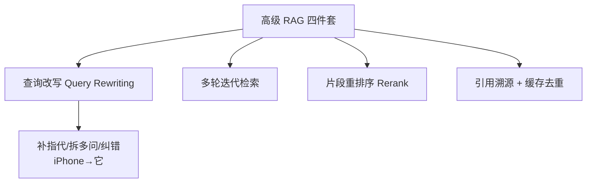
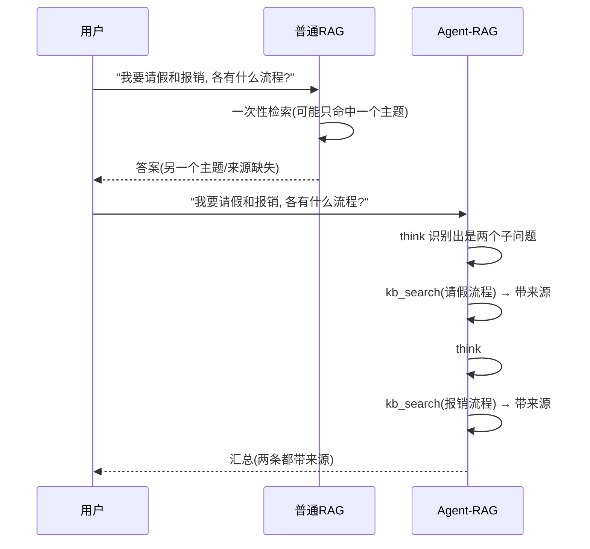
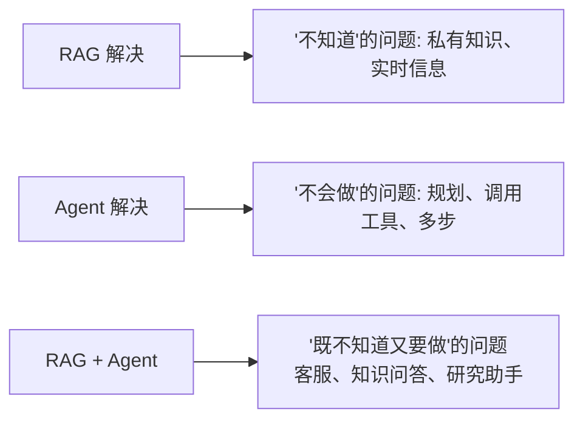

# 阶段四 · 小点 3：RAG 技术体系（Agent 知识底座）

> 所属：阶段四 工具生态与外围组件集成
> 定位：RAG（检索增强生成）是 Agent 的「知识底座」，让模型在没有训练过的情况下，也能基于你的私有文档回答并标明出处。这一讲把整条 RAG 流水线、四个生产级高级技术、以及「怎么把它封装成 Agent 工具」一次讲透。

## 精简大纲

1. RAG 完整流程与各环节故障排查
2. 高级 RAG：查询改写 / 多轮迭代检索 / 片段重排序 / 引用溯源
3. 普通 RAG vs Agent 内部 RAG
4. Agent-RAG 融合模式
5. 总结：一句话理解 RAG + Agent

## 学习内容详情

### 1. RAG 完整流程

#### 1.1 一张图看懂整条流水线

```mermaid
graph LR
    subgraph 入库(离线一次)
        A[原始文档] --> B[文档加载 Loader]
        B --> C[清洗降噪]
        C --> D[分块 Chunk]
        D --> E[向量化 Embedding]
        E --> F[(向量库)]
    end
    subgraph 在线(每次提问)
        G[用户提问] --> H[检索 Top-K]
        H --> I[把 问题+片段 拼进 Prompt]
        I --> J[LLM 生成 带引用答案]
    end
    F -.-> H
```

- RAG 分**两段**：离线**入库**（加载→清洗→分块→向量化→存库）一段跑一次；在线**检索生成**（每次提问走一遍）。
- 共 **7 个环节**：加载、清洗、分块、向量化、检索、生成（外加库）。每个环节都可能出故障。

#### 1.2 各环节常见故障清单

| 环节 | 常见故障 | 排查方向 |
|-|-|-|
| 加载 | 乱码 / PDF 解析丢内容 | 换 Loader、检查编码 |
| 清洗 | 广告、页眉、HTML 标签混入 | 加正则 / 依赖库清洗 |
| 分块 | **把论点腰斩**（跨块语义断裂） | 调整 chunk_size / overlap，按语义断句 |
| 向量化 | 中文效果差 | 换中文 BGE 模型 |
| 检索 | **召回无关**（top-K 里没有对的） | 加混合检索 / Rerank |
| 生成 | **幻觉**（模型瞎编） | 引用溯源 + 强制基于片段回答 |

> **记忆点**：RAG 缓解幻觉、支持引用溯源，是客服 / 知识问答 Agent 的知识底座——它让模型「不靠记忆、而靠检索到的片段」作答。

#### 1.3 分块与召回——RAG 最易翻车的一环

```python
# 概念: 简单分块 + 重叠, 避免"把论点腰斩"
def split_into_chunks(text: str, chunk_size: int = 200, overlap: int = 40) -> list:
    """
    分块策略: 固定长度 + 前后重叠。
    - chunk_size: 每块字符数
    - overlap   : 相邻块重叠, 防止一句话正好卡在边界被腰斩
    生产往往按段落/标题/句号语义切, 而不是固定长度。
    """
    chunks = []
    start = 0
    while start < len(text):
        chunks.append(text[start : start + chunk_size])
        start += chunk_size - overlap   # 下一块往回叠 overlap 个字符
    return chunks
```

#### 1.4 chunking 策略对比（生产选型）

固定长度只是「教学基线」，生产分块要按语料形态选策略：

- **固定长度 + 重叠**：实现最简单（即上面 `split_into_chunks`），问题是机械切割、割裂语义——关键论点可能被边界拦腰斩断。
- **递归字符分块**：按 `段落 → 句子 → 字符` 逐级回退——块太大先按段落切，段落还大再按句子切，兜底才按字符切。LangChain `RecursiveCharacterTextSplitter` 的默认推荐，通用语料首选。
- **标题感知分块**：按 Markdown / HTML 的标题结构切，并把「标题路径」写进 chunk 元数据（如 `产品手册 > 安装 > 环境要求`）——检索时可按标题过滤，生成时标题路径就是现成上下文。技术文档首选。
- **语义分块**：相邻句子算 embedding 相似度，相似度骤降处即语义断点——边界最自然，但每句都要过一次 embedding，开销最大。
- **父子分块（small-to-big）**：小块用于检索（命中更准），命中后返回其所属大块供生成（上下文更全）——LlamaIndex 的 small-to-big 模式。

| 策略 | 边界质量 | 成本 | 适用场景 |
|-|-|-|-|
| 固定长度 + 重叠 | 差（易腰斩论点） | 最低 | 基线 / 快速验证 |
| 递归字符分块 | 中 | 低 | 通用语料默认选择 |
| 标题感知分块 | 高（结构天然对齐） | 低 | Markdown / HTML 技术文档 |
| 语义分块 | 最高（边界最自然） | 高（全量过 embedding） | 高价值语料、长叙述文本 |
| 父子分块 | 高（检得准 + 上下文全） | 中（存两套块） | 检索准但生成缺上下文时 |

> ⚠️ **分块策略没有银弹**：别靠感觉选——先拿 20 条真实 query，分别用候选策略跑 recall@5 对比召回率，数据说话再定。

> 🔬 **深度理解 · RAG 全流程与检索质量评估（chunking / embedding / rerank）**：
> 1. **本质**：RAG 是一条**“离线建库 + 在线检索生成”**的知识流水线，本质是把“模型没学过的私有事实”先切块、编码、存进库，查询时把“最相关的几段”塞进 prompt，让模型“照着现成的料作答”而不是凭空编。它解决的矛盾是：LLM 参数知识**不是**最新/私有的，而问答又要依据事实。
> 2. **机制（为什么每一步都可能掉链子）**：哪怕 Embedding 再好、Rerank 再准，**都救不回“分块把论点腰斩”和“脏数据进库”**——因为召回和排序只能在已入库的块上做。质量是链路“木桶”的短板决定，评估必须是端到端：准备一组真实测试 query 与其期望命中的文档（golden set），测 **recall@k**（正确答案有没有被召回到 top-k）看召回、再在 top-k 上测排序看 precision。chunking 用固定长度+重叠、embedding 用中文 BGE、再决定要不要 rerank，step-by-step 用数据对比，而不是拍脑袋某个单一环节。
> 3. **为什么重要**：它决定了答问的“可靠性天花板”。召回漏料→幻觉或答非所问，排序歪→给了错误依据，生成阶段再怎么写 prompt 也救不回来；没有评估口径，就永远在“调了好像变好”的玄学里打转。
> 4. **易错点/常见误解**：误解一「Rerank 能补齐召回的缺陷」——它是排序不是召回，候选里没有的捞不回来；误解二「只要 embedding 强就万事大吉」——再强的 embedding 对“被切碎的论点”也无能为力，分块不当全白搭；误解三「凭感觉评判好坏」——必须用 recall@k / 命中率这类可测指标，带 golden set 评估才是生产姿势。

### 2. 高级 RAG 技术（生产标配）

#### 2.1 四件套总览



- **查询改写（Query Rewriting）**：检索前先用 LLM 把用户口语化问题改写成检索友好查询（补指代、拆多问、纠错别字）——「它多少钱」补全为「iPhone 17 多少钱」。
- **多轮迭代检索**：Agent 的重试循环天然实现——工具描述明确写「可重试」，模型自主决定查几轮、换什么词。
- **片段重排序**：检索内先召回 top-10/20 → Rerank 取 top-3（对照小点 2 的 Cross-Encoder）。
- **引用溯源**：返回附 source + prompt 强制「标注来源」——答案出自哪个文件哪一块，生产必备（可审计、可纠错、可信）。
- **缓存去重**：相同子问题命中缓存直接复用（生产加 TTL，如 10 分钟过期），省调用、省延迟。

> 🔬 **深度理解 · 查询改写（Query Rewriting）**：
> 1. **本质**：查询改写的本质是**“先让模型把口语问题翻译成检索系统能听懂的查询，再去检索”**——它是用户口语与向量库检索之间的一层“语义接口”。用户说“它多少钱”，检索库压根没有“它”；不改写，top-K 必偏。
> 2. **机制**：用一个轻量 LLM 调用把原始 question 加工成更适合检索的 query：① **补指代**——把“它”“这个”还原成前置实体（“它多少钱”→“iPhone 17 多少钱”）；② **拆多问**——把“请假和报销怎么办”拆成两个独立子查询，避免两个主题搅在一个向量里降低各自命中率；③ **纠错别字/补全**——去口语冗余、纠正错别字。改写后的 query 再进 embedding 检索，命中率显著提升。本质上是**用一次额外 LLM 调用（通常很便宜）换一次检索的高命中**。
> 3. **为什么重要**：用户输入 → 可检索 query 之间的鸿沟，是普通 RAG 掉链子的高发源。它把“检索吃什么”与“用户怎么问”解耦，是高级 RAG 里性价比最高的环节之一。
> 4. **易错点/常见误解**：误解一「改写=答一遍」——改写只输出查询、不做回答，别把解答塞进检索词；误解二「改写会丢信息」——改写会“精简”也可能误删意图里的关键限定，所以要保留原始 query 兜底或用改写+原query 双路；误解三「每问必改写」——热词/命名清晰的简单问题直接检索即可，改写也有成本，按需启用。

#### 2.2 查询改写 + 缓存去重 + 引用溯源的检索工具

```python
# 生产级"知识库检索工具" = 改写 + 缓存 + 溯源 三件套
import time, hashlib, json

def query_rewrite(llm, raw_question: str) -> str:
    """① 查询改写: 让 LLM 把口语问题改写成检索友好查询"""
    prompt = (
        "请把下面用户的提问改写成更适合检索库的简洁查询。"
        "补全指代、拆开多问、纠正错别字, 只输出改写后的查询。\n提问: " + raw_question
    )
    return llm.invoke(prompt).strip()      # 例: "它多少钱" -> "iPhone 17 的价格"

_cache: dict = {}                          # ② 简单内存缓存(生产用Redis带TTL)

> ⚠️ 以下代码引用了阶段四 02 定义的 `embed_bge`、`query_rewrite` 及向量库对象 `vector_col`，需先补全这些依赖再整体运行（本片段演示链路，**非自包含**）。

def retrieve(question: str, vector_col, llm, ttl: int = 600) -> dict:
    """带 改写+缓存+溯源 的检索入口"""
    key = hashlib.md5(question.encode()).hexdigest()
    hit = _cache.get(key)
    if hit and time.time() - hit["ts"] < ttl:      # ② 缓存命中且未过期 -> 直接复用
        return {"answer": hit["answer"], "cached": True}
    rewritten = query_rewrite(llm, question)       # ① 先改写
    hits = vector_col.query(                       # 再检索 (内部可带Rerank)
        query_embeddings=[embed_bge(rewritten)], n_results=3,
    )
    context = "\n".join(
        f"[来源:{doc_id}] {text}"                  # ③ 给每段贴上来源标签
        for doc_id, text in zip(hits["ids"][0], hits["documents"][0])
    )
    answer = llm.invoke(
        f"仅根据以下资料回答, 并标注来源。\n{context}\n问题:{question}"
    ).strip()
    _cache[key] = {"answer": answer, "ts": time.time()}
    return {"answer": answer, "cached": False, "context": context}
```

> ⏳ **短期可不深究**：上面内存字典 `_cache` + 哈希 key + 手写 TTL 这套**缓存实现细节，第一遍看懂“有缓存去重这件事”即可**——生产直接用 Redis（带 TTL、多进程共享），不必现在复刻这套手写逻辑。先把「同一问题别重复烧一次 LLM」这条收益记住。

#### 2.3 多轮迭代检索与 Cross-Encoder Rerank（最小代码）

四件套里「多轮迭代检索」「片段重排序」两个只有文字描述，补上最小实现：

```python
# ---- ① 多轮迭代检索: 检索 → 判据缺失 → 改写再检索, 直到判据齐或轮次用完 ----
def iterative_retrieve(question, vector_col, llm, max_rounds=3) -> list:
    query, evidence = question, []
    for round in range(max_rounds):
        hits = vector_col.query(query_embeddings=[embed_bge(query)], n_results=3)
        evidence += hits["documents"][0]
        missing = llm.invoke(          # 判据检查: 回答还缺什么关键信息?
            f"问题:{question}\n已检索到:{evidence}\n"
            "若信息已足够回答只输出 DONE, 否则输出一个改写后的检索查询。")
        if "DONE" in missing:
            break                      # 判据齐全, 提前收手(省 token)
        query = missing.strip()        # 缺什么就带什么改写再检索
    return evidence

# ---- ② Cross-Encoder Rerank: (query, chunk) 成对精算分, 排序取 top_k ----
def rerank(query: str, candidates: list, cross_encoder, top_k=3) -> list:
    """candidates 是召回的 top-20; cross_encoder 如 BAAI/bge-reranker 系模型"""
    pairs = [(query, chunk) for chunk in candidates]     # 每对 拼在一起精算
    scores = cross_encoder.predict(pairs)                # 相关性打分(准但慢)
    ranked = sorted(zip(candidates, scores), key=lambda x: x[1], reverse=True)
    return [c for c, _ in ranked[:top_k]]                # 精排后只取 top-3
```

- 多轮迭代检索在生产里通常由 Agent 的重试循环天然实现（工具描述写清「可重试」），上面的骨架是把它显式写成循环的样子。
- Rerank 要点：召回阶段便宜粗筛 top-20，Cross-Encoder 只精排这 20 条（它逐对计算、慢）——即小点 2 的两段式检索。

> ⏳ **短期可不深究**：上面那段“显式的手写多轮检索循环”第一遍看懂思路即可，不用照抄——**生产场景通常交给 Agent 内置的重试循环**（详见第 3 节），这里只是为了让“多轮迭代”这个抽象概念有个可见的最小形状。把「检索不到就改写再查，直到判据齐或轮次用完」的语义想明白就够。

### 3. 普通 RAG vs Agent 内部 RAG

| 类型 | 检索时机 | 特点 |
|-|-|-|
| 普通 RAG | 用户提问直接检索一次 | 简单，但复杂问题一次检索不够 |
| Agent-RAG | 由 Agent 决策何时检索 | 可多轮动态检索、自主改写查询 |



- 普通 RAG 一次检索就挂的场景（含两个子问题），Agent-RAG 能走通：`think → kb_search(子问题1) → think → kb_search(子问题2) → 汇总`（两条都带来源）。
- **判断标准**：问题是否单一主题 + 是否需要多来源交叉。是 → 上 Agent-RAG，否 → 普通 RAG 足够。

> 🔬 **深度理解 · 普通 RAG vs Agent-RAG（检索的控制权交给谁）**：
> 1. **本质**：二者的分野不是“谁的检索更高级”，而是**“检索时机与次数由谁决定”**——普通 RAG 由固定流程在用户提问那一刻检索一次；Agent-RAG 把“检索”作为 Agent 可自主调用的工具（`kb_search`），由模型在推理循环里决定**何时检、检几次、换什么关键词**。
> 2. **机制**：普通 RAG 是“一次 user query → 一次 top-K → 一次 generate”的直线；Agent-RAG 则套进 ReAct/规划循环：Agent 识别出“这个问题其实含两个独立主题”→ 调 `kb_search(请假流程)` 拿带来源的答案 → 再调 `kb_search(报销流程)`，最后统一汇总。也就是说，普通 RAG 的“检索”是**预置的一次性动作**，Agent-RAG 的“检索”是**推理循环里的可选择动作**——天然支持多轮、改写、跨来源合并。
> 3. **为什么重要**：它决定了系统能处理的问题复杂度。单一主题单来源用普通 RAG 就够、省 token 省延迟；一旦输入含多主题、需要交叉多来源、或问题本身要逐步澄清，固定一次性检索就会漏料——Agent-RAG 用“把检索变成工具”把答案质量提上来，代价是更多轮次与延迟开销。
> 4. **易错点/常见误解**：误解一「Agent-RAG = 更好的 RAG」——它不是“更强”，是“更灵活也更贵”，用错场景反而更慢更抖；误解二「工具里塞了 RAG 就叫 Agent-RAG」——关键在于检索是否进入 Agent 的**决策循环**，只暴露一个傻瓜 `kb_search` 但不让它决定“何时检”，仍是可调接口而非主动检索；误解三「普通 RAG 做不出多主题」——能做，但需要硬编码“拆问题、依次检、合并”的流程，复杂度其实回了 Agent 手里。

### 4. RAG 与 Agent 融合模式

#### 4.1 把知识库封装成 Agent 工具

```mermaid
graph LR
    A[QueryEngine<br/>向量库检索逻辑] -->|@tool 包装| B[知识库检索工具]
    B --> C[Agent 自己判断<br/>什么时候去检索]
    C --> D[可多轮动态检索]
    C --> E[可自主改写查询]
```

- 知识库封装成 Agent 工具（`@tool` 包装 QueryEngine），Agent 自己判断什么时候去检索。
- **检索工具设计要点**：查询改写 + 缓存去重 + 引用溯源三者齐备（对照 2.2 的代码）。

```python
from langchain_core.tools import tool

class QueryEngine:
    """封装向量库的检索对象(简版)"""
    def __init__(self, col): self.col = col
    def query(self, q: str): return retrieve(q, self.col, llm=None)["answer"]  # 简化

@tool
def kb_search(question: str) -> str:
    """从公司知识库检索答案。当用户问公司制度/流程/政策时调用。可重试。"""
    return engine.query(question)     # 内部已含 改写+缓存+溯源
```

#### 4.2 检索强用 LlamaIndex、流程强用 LangGraph 的组合拳

- **LlamaIndex**：专精「数据接入与检索」，Document/Node/Index/QueryEngine 四件套天生为 RAG 而生（对照阶段三 LlamaIndex 小节）。
- **LangGraph**：专精「工作流编排」，负责 Agent 的多轮决策、分支、循环。
- **黄金组合**：LlamaIndex 负责 Ingestion + Retrieval（怎么把文档处理好、检索准），LangGraph 负责 Orchestration（什么时候检索、要不要重试、怎么汇总）。

### 5. 总结：一句话理解 RAG + Agent



- **RAG 解决「不知道」**：模型没训练过或过时的问题，靠检索到的资料作答。
- **Agent 解决「不会做」**：需要规划、调用工具、多步推理的任务。
- **二者结合**：知识库当工具、Agent 当大脑，覆盖绝大多数生产场景（客服、知识问答、研究助手）。

## 本节自检

- [ ] 能说清 RAG 七环节及每个环节的常见故障
- [ ] 能实现带查询改写 + 缓存 + 溯源的知识库检索工具并接入 Agent
- [ ] 能区分普通 RAG 与 Agent-RAG，并判断哪种问题该用哪种
- [ ] 能说清 LlamaIndex（检索）与 LangGraph（编排）的分工

## 本节常见面试题（深度解析）

> 针对本节核心知识的面试高频点，配合"本质+机制"式理解，能让你答得既有深度又有广度。

### 面试题 1：一个 RAG 系统“答得不对”，你会怎么排查？请从整条流水线讲。

- **面试官想考察**：是否把 RAG 当成一串要逐环排查的流水线，而不只是“一个检索+一个生成”；是否知道「排序/召回救不了分块和入库的锅」这个层次。
- **专业作答（含深度）**：
  1. **先定位是召回问题还是生成问题**：把 top-K 检索到的片段直接看——对、翻车很可能在召回（分块揉碎、embedding 差、检索策略偏）；片段对但答案错，问题在生成（prompt 未强制据料作答、未约束引用）。
  2. **逐环节过一遍**：① 加载/清洗——PDF 乱码、HTML 标签混入；② 分块——论点被腰斩则换递归/标题感知/父子分块；③ 向量化——中文语料用英文模型会差，换中文 BGE；④ 检索——top-K 里没有正确的就加混合检索+Rerank；⑤ 生成——幻觉说明 prompt 没强制基于片段作答或来源标注缺失。
  3. **用评估说话**：别猜，用典型 query 集 + golden set 跑 recall@k；调整是数据驱动而不是拍脑袋。
- **加分亮点 / 深度追问**：可强调“Rerank 是排序不是召回，候选里没有的救不回来”，所以先解决‘召回有没有捞到’再谈排序；被追问“为什么同时用普通 RAG 和 Agent-RAG”时可答“单一主题、单来源走普通 RAG 省钱省时，多主题交叉才交给 Agent 决策”。

### 面试题 2：分块（chunking）为什么是 RAG 最易翻车的一环？你会怎么做选型与评估？

- **面试官想考察**：能否讲清“分块决定检索与生成的下限”，并对固定长度、递归、标题感知、语义、父子等策略有真实判断力。
- **专业作答（含深度）**：
  1. **为什么关键**：分块是**离线入库时一次性定死**的，之后的召回和排序都只能在“已入库的块”上做——把论点拦腰切碎的块，再强的 embedding 和 Rerank 也捞不完整，所以这是 RAG 质量木桶里的短板。
  2. **策略权衡**：固定长度+重叠最简单但机械切、易切碎语义；递归字符分块按段落→句子→字符逐级回退，通用语料默认；标题感知分块按结构切并把“标题路径”写进元数据，技术文档首选；语义分块按 embedding 相似度断点切、边界最自然但开销大；父子分块（small-to-big）小块检索、返回大块生成，检索准+上下文全。
  3. **怎么选**：不是凭感觉——拿 20 条真实 query + golden set，跑 recall@5 对比各策略，数据说话；同时留意 chunk 大小与 overlap 影响块间上下文连贯性和去重。
- **加分亮点 / 深度追问**：可主动补“分块还要考虑 embedding 的输入长度上限和 token 成本”；被追问“为什么招回了相关块却生成还错”时答“可能块太小丢上下文或 prompt 没把多块拼好，可用父子分块或加大 overlap 缓解”。

### 面试题 3：普通 RAG 和 Agent-RAG 的区别是什么？什么场景该用哪个？

- **面试官想考察**：是否真理解“检索控制权交给谁”而不是只看名字；能否给出可用的判断标准并说明各自的成本。
- **专业作答（含深度）**：
  1. **核心区别**：普通 RAG 是固定流程“提问一次→检索一次→生成一次”；Agent-RAG 把检索封装成 `kb_search` 工具、纳入 Agent 的推理循环，由模型自主决定“何时检索、检几轮、换什么词、怎么跨来源汇总”。
  2. **适用判断**：问题是否单一主题、是否只需单来源——能满足就用普通 RAG（省 token、省延迟、更稳）；一旦含多主题、需多来源交叉、或要分步澄清，就用 Agent-RAG（多轮动态检索、自主改写）。
  3. **成本权衡**：Agent-RAG 更灵活，但多轮=更多调用与延迟、行为更多样，不适合固定、高频、低延迟诉求。
- **加分亮点 / 深度追问**：可补“Amazing：普通 RAG 想处理多主题也能做，但往往得硬编码‘拆问题、依次检、合并’的流程，复杂度兜了一圈又回到手写”；被追问“Agent-RAG 检索会不会发散”时答“判据机制（信息够就 DONE）和轮次上限能收敛，防止无限重试”。