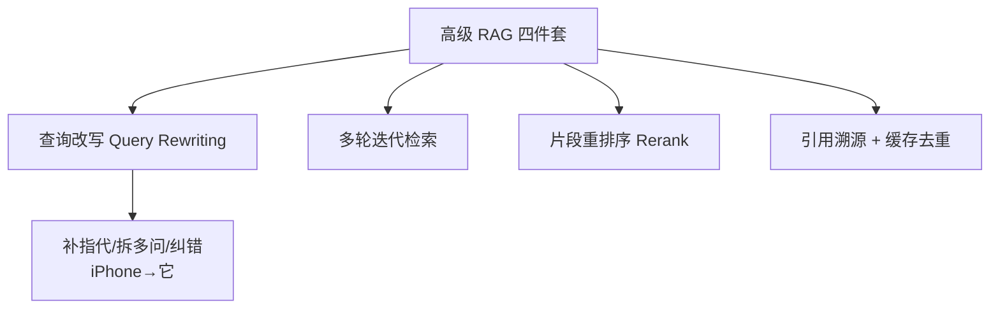
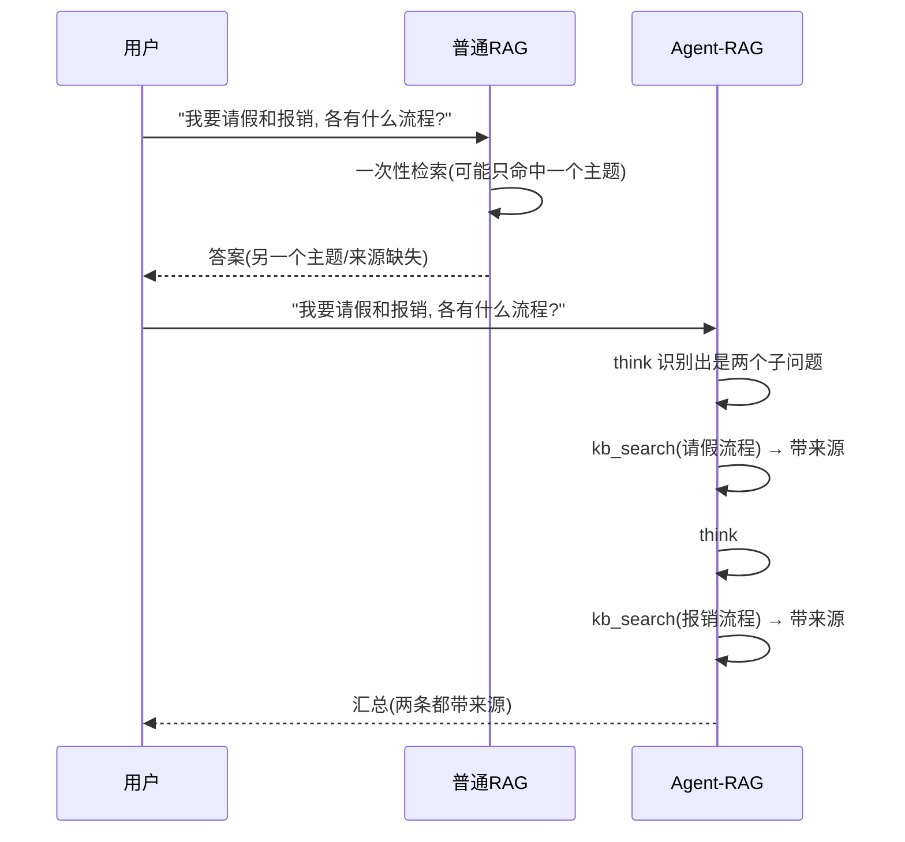
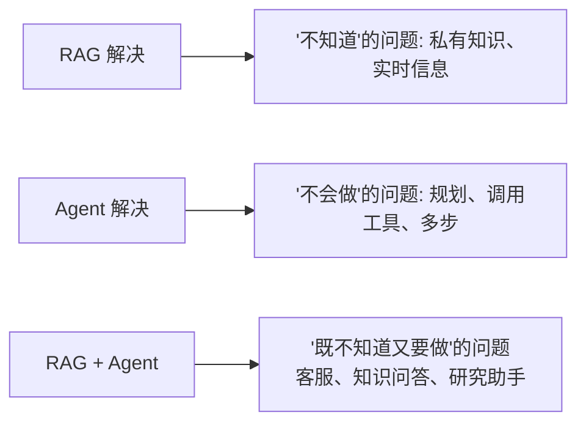

# 阶段四 · 小点 3：RAG 技术体系（Agent 知识底座）

> 所属：阶段四 工具生态与外围组件集成
> 定位：RAG（检索增强生成）是 Agent 的「知识底座」，让模型在没有训练过的情况下，也能基于你的私有文档回答并标明出处。这一讲把整条 RAG 流水线、四个生产级高级技术、以及「怎么把它封装成 Agent 工具」一次讲透。

## 精简大纲

1. RAG 完整流程与各环节故障排查
2. 高级 RAG：查询改写 / 多轮迭代检索 / 片段重排序 / 引用溯源
3. 普通 RAG vs Agent 内部 RAG
4. Agent-RAG 融合模式
5. 总结：一句话理解 RAG + Agent

## 学习内容详情

### 1. RAG 完整流程

#### 1.1 一张图看懂整条流水线

```mermaid
graph LR
    subgraph 入库(离线一次)
        A[原始文档] --> B[文档加载 Loader]
        B --> C[清洗降噪]
        C --> D[分块 Chunk]
        D --> E[向量化 Embedding]
        E --> F[(向量库)]
    end
    subgraph 在线(每次提问)
        G[用户提问] --> H[检索 Top-K]
        H --> I[把 问题+片段 拼进 Prompt]
        I --> J[LLM 生成 带引用答案]
    end
    F -.-> H
```

- RAG 分**两段**：离线**入库**（加载→清洗→分块→向量化→存库）一段跑一次；在线**检索生成**（每次提问走一遍）。
- 共 **7 个环节**：加载、清洗、分块、向量化、检索、生成（外加库）。每个环节都可能出故障。

#### 1.2 各环节常见故障清单

| 环节 | 常见故障 | 排查方向 |
|-|-|-|
| 加载 | 乱码 / PDF 解析丢内容 | 换 Loader、检查编码 |
| 清洗 | 广告、页眉、HTML 标签混入 | 加正则 / 依赖库清洗 |
| 分块 | **把论点腰斩**（跨块语义断裂） | 调整 chunk_size / overlap，按语义断句 |
| 向量化 | 中文效果差 | 换中文 BGE 模型 |
| 检索 | **召回无关**（top-K 里没有对的） | 加混合检索 / Rerank |
| 生成 | **幻觉**（模型瞎编） | 引用溯源 + 强制基于片段回答 |

> **记忆点**：RAG 缓解幻觉、支持引用溯源，是客服 / 知识问答 Agent 的知识底座——它让模型「不靠记忆、而靠检索到的片段」作答。

#### 1.3 分块与召回——RAG 最易翻车的一环

```python
# 概念: 简单分块 + 重叠, 避免"把论点腰斩"
def split_into_chunks(text: str, chunk_size: int = 200, overlap: int = 40) -> list:
    """
    分块策略: 固定长度 + 前后重叠。
    - chunk_size: 每块字符数
    - overlap   : 相邻块重叠, 防止一句话正好卡在边界被腰斩
    生产往往按段落/标题/句号语义切, 而不是固定长度。
    """
    chunks = []
    start = 0
    while start < len(text):
        chunks.append(text[start : start + chunk_size])
        start += chunk_size - overlap   # 下一块往回叠 overlap 个字符
    return chunks
```

### 2. 高级 RAG 技术（生产标配）

#### 2.1 四件套总览



- **查询改写（Query Rewriting）**：检索前先用 LLM 把用户口语化问题改写成检索友好查询（补指代、拆多问、纠错别字）——「它多少钱」补全为「iPhone 17 多少钱」。
- **多轮迭代检索**：Agent 的重试循环天然实现——工具描述明确写「可重试」，模型自主决定查几轮、换什么词。
- **片段重排序**：检索内先召回 top-10/20 → Rerank 取 top-3（对照小点 2 的 Cross-Encoder）。
- **引用溯源**：返回附 source + prompt 强制「标注来源」——答案出自哪个文件哪一块，生产必备（可审计、可纠错、可信）。
- **缓存去重**：相同子问题命中缓存直接复用（生产加 TTL，如 10 分钟过期），省调用、省延迟。

#### 2.2 查询改写 + 缓存去重 + 引用溯源的检索工具

```python
# 生产级"知识库检索工具" = 改写 + 缓存 + 溯源 三件套
import time, hashlib, json

def query_rewrite(llm, raw_question: str) -> str:
    """① 查询改写: 让 LLM 把口语问题改写成检索友好查询"""
    prompt = (
        "请把下面用户的提问改写成更适合检索库的简洁查询。"
        "补全指代、拆开多问、纠正错别字, 只输出改写后的查询。\n提问: " + raw_question
    )
    return llm.invoke(prompt).strip()      # 例: "它多少钱" -> "iPhone 17 的价格"

_cache: dict = {}                          # ② 简单内存缓存(生产用Redis带TTL)

def retrieve(question: str, vector_col, llm, ttl: int = 600) -> dict:
    """带 改写+缓存+溯源 的检索入口"""
    key = hashlib.md5(question.encode()).hexdigest()
    hit = _cache.get(key)
    if hit and time.time() - hit["ts"] < ttl:      # ② 缓存命中且未过期 -> 直接复用
        return {"answer": hit["answer"], "cached": True}
    rewritten = query_rewrite(llm, question)       # ① 先改写
    hits = vector_col.query(                       # 再检索 (内部可带Rerank)
        query_embeddings=[embed_bge(rewritten)], n_results=3,
    )
    context = "\n".join(
        f"[来源:{doc_id}] {text}"                  # ③ 给每段贴上来源标签
        for doc_id, text in zip(hits["ids"][0], hits["documents"][0])
    )
    answer = llm.invoke(
        f"仅根据以下资料回答, 并标注来源。\n{context}\n问题:{question}"
    ).strip()
    _cache[key] = {"answer": answer, "ts": time.time()}
    return {"answer": answer, "cached": False, "context": context}
```

### 3. 普通 RAG vs Agent 内部 RAG

| 类型 | 检索时机 | 特点 |
|-|-|-|
| 普通 RAG | 用户提问直接检索一次 | 简单，但复杂问题一次检索不够 |
| Agent-RAG | 由 Agent 决策何时检索 | 可多轮动态检索、自主改写查询 |



- 普通 RAG 一次检索就挂的场景（含两个子问题），Agent-RAG 能走通：`think → kb_search(子问题1) → think → kb_search(子问题2) → 汇总`（两条都带来源）。
- **判断标准**：问题是否单一主题 + 是否需要多来源交叉。是 → 上 Agent-RAG，否 → 普通 RAG 足够。

### 4. RAG 与 Agent 融合模式

#### 4.1 把知识库封装成 Agent 工具

```mermaid
graph LR
    A[QueryEngine<br/>向量库检索逻辑] -->|@tool 包装| B[知识库检索工具]
    B --> C[Agent 自己判断<br/>什么时候去检索]
    C --> D[可多轮动态检索]
    C --> E[可自主改写查询]
```

- 知识库封装成 Agent 工具（`@tool` 包装 QueryEngine），Agent 自己判断什么时候去检索。
- **检索工具设计要点**：查询改写 + 缓存去重 + 引用溯源三者齐备（对照 2.2 的代码）。

```python
from langchain_core.tools import tool

class QueryEngine:
    """封装向量库的检索对象(简版)"""
    def __init__(self, col): self.col = col
    def query(self, q: str): return retrieve(q, self.col, llm=None)["answer"]  # 简化

@tool
def kb_search(question: str) -> str:
    """从公司知识库检索答案。当用户问公司制度/流程/政策时调用。可重试。"""
    return engine.query(question)     # 内部已含 改写+缓存+溯源
```

#### 4.2 检索强用 LlamaIndex、流程强用 LangGraph 的组合拳

- **LlamaIndex**：专精「数据接入与检索」，Document/Node/Index/QueryEngine 四件套天生为 RAG 而生（对照阶段三 LlamaIndex 小节）。
- **LangGraph**：专精「工作流编排」，负责 Agent 的多轮决策、分支、循环。
- **黄金组合**：LlamaIndex 负责 Ingestion + Retrieval（怎么把文档处理好、检索准），LangGraph 负责 Orchestration（什么时候检索、要不要重试、怎么汇总）。

### 5. 总结：一句话理解 RAG + Agent



- **RAG 解决「不知道」**：模型没训练过或过时的问题，靠检索到的资料作答。
- **Agent 解决「不会做」**：需要规划、调用工具、多步推理的任务。
- **二者结合**：知识库当工具、Agent 当大脑，覆盖绝大多数生产场景（客服、知识问答、研究助手）。

## 本节自检

- [ ] 能说清 RAG 七环节及每个环节的常见故障
- [ ] 能实现带查询改写 + 缓存 + 溯源的知识库检索工具并接入 Agent
- [ ] 能区分普通 RAG 与 Agent-RAG，并判断哪种问题该用哪种
- [ ] 能说清 LlamaIndex（检索）与 LangGraph（编排）的分工