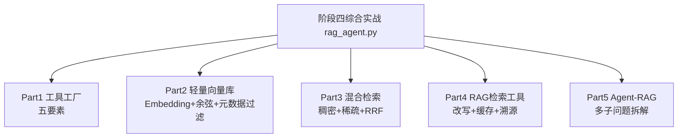
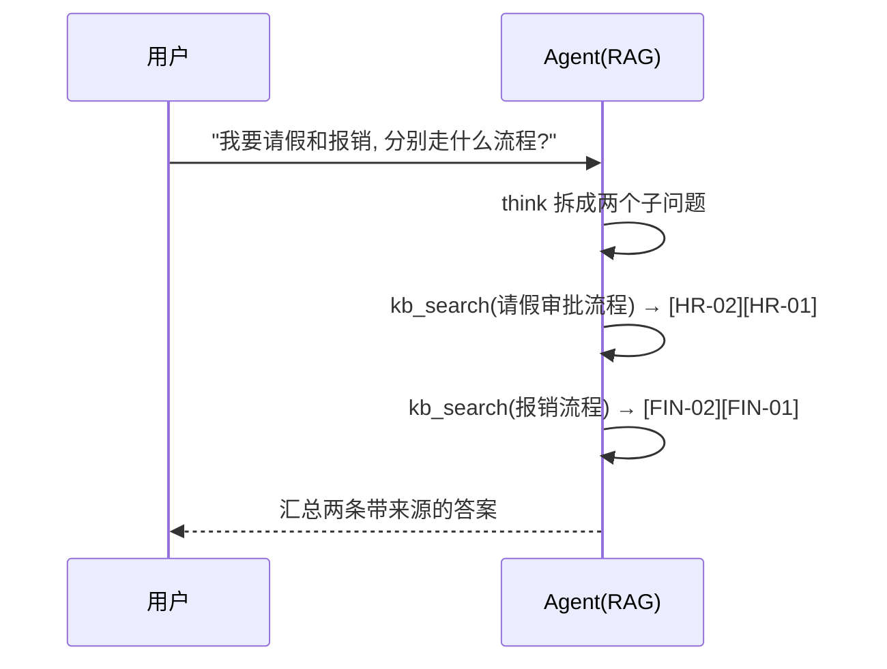

# 阶段四 · 综合实战：RAG 知识库 + 工具 Agent

> 所属：阶段四 工具生态与外围组件集成
> 定位：把阶段四三个小点（工具调用生态 / 向量库与记忆 / RAG 体系）串成一份**离线可运行**的完整 Demo——一个「知识库问答 Agent」，既会长记性（向量检索）、又会用工具（五要素工厂）、还能拆解多子问题（Agent-RAG）。

## 一句话看懂本 Demo

`rag_agent.py` 用纯 Python（仅依赖 pydantic）实现了一个完整的「企业知识库问答 Agent」全家桶，覆盖阶段四三大能力：



## 运行方式

```
python3 code/阶段四/rag_agent.py
```

不需要 API Key、不需要外网、不需要装重依赖。

## 完整代码位置

[code/阶段四/rag_agent.py](../../code/阶段四/rag_agent.py)

---

## 每个 Part 在讲什么

### Part 1 · 工具工厂（对应小点 1）

`tool_factory` 装饰器把任意业务函数升级成「合格工具」，自动套上五要素：

| 要素 | 实现位置 | 演示效果 |
|-|-|-|
| ① 入参校验 | `create_model` 按函数签名动态生成 pydantic 模型 | `1 + 2; import os` 被「非法字符」拦截 |
| ② 超时控制 | 线程池隔离 + `future.result(timeout)` | 卡死工具到点强杀 |
| ③ 权限校验 | 硬编码白名单 `_TOOL_WHITELIST` | 模型无法绕过 |
| ④ 异常包装 | `try/except` 封装成友好消息 | `1 / 0` 返回「除数不能为 0」而非抛异常 |
| ⑤ 结果精简 | `_RESULT_MAX_LEN` 截断 | 长报文不再撑爆上下文 |

```python
@tool_factory("calc", timeout=3.0)
def calc(expression: str) -> str:
    """计算数学表达式（仅四则运算与括号，防注入）。"""
    from re import fullmatch
    if not fullmatch(r"[\d+\-*/().\s]+", expression):   # 白名单字符集校验
        return f"表达式含非法字符: {expression}"
    try:
        return str(eval(expression, {"__builtins__": {}}, {}))  # 禁内置名防注入
    except ZeroDivisionError:
        return "错误: 除数不能为 0"
```

> 新增业务工具只写业务逻辑，五要素全部由工厂继承——这是「工具工厂」模式的核心价值。

### Part 2 · 轻量向量库（对应小点 2）

没有引入 Qdrant/Chroma，而是用**纯 Python 手写**了一个最小的向量库，让你看穿向量库的本质：

- **`embed()`**：字符级 bag-of-characters Embedding——把每个汉字的哈希映射到 256 维向量上累加。语义相近文本（共享常用字）向量方向就接近。
- **`cos_sim()`**：余弦相似度（只关心方向、忽略长度）。
- **`TinyVectorStore`**：支持增删改查 + **元数据过滤**（`where` 参数）+ top-K 检索。

```python
dense = _store.query(q_vec, where={"dept": "HR"}, n=5)   # 先按部门过滤再检索
```

> 生产请直接用它对应物：Qdrant / Chroma / Milvus。看懂这个就能看懂它们——本质都是「向量 + 索引 + 过滤 + top-K」。

> ⏳ **短期可不深究**：上面 `embed()` 用「字符级 bag-of-characters 哈希累加」手搓向量，纯粹是为了让你看穿向量库本质的教学替身——**它的语义质量远不如真实 embedding**，第一遍不必纠结它的实现细节。记住「它是演示、生产换中文 BGE」即可，别把字符哈希当成真实 embedding 方案。

> 🔬 **深度理解 · 向量库的本质（Embedding + 索引 + 过滤 + top-K）**：
> 1. **本质**：一个向量库并不是什么神秘系统，它做四件事的编排——**Embedding（把文本变向量）→ 索引（把百万向量组织起来好找近邻）→ 过滤（先用结构化条件缩范围）→ top-K（返回最相近的 K 条）**。看懂这四步，你就拿到了所有向量库（Qdrant / Chroma / Milvus / FAISS）的通用抽象层。
> 2. **机制**：① 入库时 embedding 模型把 chunk 变向量，写入时额外带上 metadata（如 `dept=HR`）；② 库内部用 HNSW/IVF 等 ANN 索引加速“找近邻”，避免对全库 O(N) 全扫；③ 查询时先按 `where/Filter` 的结构化条件框定子集（多租户隔离、部门圈定都靠它），再在子集内做向量 top-K；④ 返回的 K 条连同 payload/metadata 一起交回上层。这套抽象下，手写版和小 toy 库与生产分布式库只是“索引与集群能力”的差异，接口心智完全可迁移。
> 3. **为什么重要**：它把「怎么靠相似度找到相关内容」这件核心事解耦成可直接选的组件——你不需要关心 ANN 怎么建、分片怎么拆，只要保证「维度度量一致 + metadata 过滤正确 + top-K 取够」，就能稳定复用地做语义检索与长期记忆。
> 4. **易错点/常见误解**：误解一「向量库 = embedding 模型」——库只负责存与找，embedding 在库外生成、维度由模型决定，二者是两回事；误解二「全库语义召回就是全部」——不给 metadata 过滤，多租户会串数据、语义也会被无关域干扰；误解三「手写的哈希向量能当生产 embedding」——它没有真正的语义泛化，只是让你看懂 API 的替代品。

### Part 3 · 混合检索（对应小点 2）

稠密 + 稀疏双路召回再 RRF 融合，弥补单一检索的盲区：

| 一路 | 用什么 | 擅长 |
|-|-|-|
| 稠密（Dense） | 字符向量 + 余弦 | 语义相近（「请假」≈「休假」） |
| 稀疏（Sparse） | BM25 精确词 | 型号 / 人名 / 数字 |

```python
dense = _store.query(q_vec, n=5)                 # 稠密路
sparse = bm25_scores(_tokenize(q), _store)       # 稀疏路
fused = reciprocal_rank_fusion([d for d,_,_ in dense], sparse)[:3]  # RRF 融合
```

### Part 4 · RAG 检索工具（对应小点 3）

`kb_search` 是一个被工厂包装、带描述、可重试的**工具**，内部实现 RAG 三件套：

1. **查询改写** `_llm.rewrite`——把「它怎么做」补全为「请假怎么做」；
2. **缓存去重** `MockLLM._cache`——相同问题二次命中直接复用（运行输出里第二次 `cached: true`）；
3. **引用溯源**——答案强制标注来源 `[HR-02]`，可审计、可纠错。

```python
res = _llm.answer(question, hits)   # 强制"仅基于检索片段+标注来源"
```

> 顺带运用了小点2的**元数据过滤**：`_topic_dept(query)` 根据关键词圈定部门范围，检索只在对应域进行（请假→HR，报销→Finance），运行输出里两者不再跨域串扰。

> ⏳ **短期可不深究**：`MockLLM` 里的「规则式改写/按模板生成/内存缓存」是**为了让 Demo 无 API Key、可离线运行**的替身，不必深究它的每行实现——生产会换成真实 LLM + Cross-Encoder Rerank + Redis 缓存（见下表「怎么改成生产版」）。你只要看懂「改写→检索→带来源生成→缓存」这条骨架就抓住了重点。

### Part 5 · Agent-RAG（对应小点 3 精髓）

这是普通 RAG 与 Agent-RAG 差异的现场演示：



普通 RAG 对「一个提问含两个主题」只会检索一次，极可能漏掉其中一域；Agent-RAG 由 Agent 自主判断、分步检索、逐步汇总。

> 🔬 **深度理解 · Agent-RAG 的现场演示意义**：
> 1. **本质**：这个 Part 用最小可跑的例子，演示了 Agent-RAG 与普通 RAG 的**分水岭——检索时机解耦**：普通 RAG 在提问那一刻被“绑定检索 n 次”；Agent-RAG 把 `kb_search` 变成 Agent 的一块零件，由模型在推理中决定“现在该不该查、查哪个子问题”，遇到“请假＋报销”这种复合问题就自动拆两步。
> 2. **机制**：sequenceDiagram 里每一步 `think→kb_search(某子问题)` 其实就是一次 ReAct 迭代：模型先“想”当前缺什么信息（think），再调用对应工具获取带来源的片段，拿到结果后基于新信息继续想下一步，直到子问题都齐了才汇总交答案。这里的 `think` 就是 Agent 的规划层，`kb_search` 是它的执行手——两者在循环里交替完成“拆解–检索–汇总”。
> 3. **为什么重要**：它证明“把 RAG 包成工具”这个设计能直接解决普通 RAG 的硬伤——一个 query 含多主题时固定一次检索必然漏域；同时它复用前面所有 Part（五要素工厂、向量库、混合检索、改写缓存溯源），说明 Agent 化不是另起炉灶，而是把既有零件编成工具再交给模型调度。
> 4. **易错点/常见误解**：误解一「Step 记为主线」——本 Demo 的 `_topic_dept` 关键词路由只是实现细节，生产用 LLM 路由/分类器（见替换表），别把它当正确答案模板；误解二「多主题才叫 Agent-RAG」——本质是“检索是否进 Agent 决策循环”，多主题只是最直观的触发场景；误解三「Demo 的性能=生产性能」——MockLLM 的铁律改写不能代表真实推理质量，生产要看真实 LLM 的多轮表现与延迟。

## 关键输出对照表

| 运行片段 | 输出 | 说明什么 |
|-|-|-|
| `calc("1 + 2 * 3")` | `7` | 正常计算 |
| `calc("1 + 2; import os")` | `表达式含非法字符` | ① 入参校验拦截注入 |
| `calc("1 / 0")` | `错误: 除数不能为 0` | ④ 异常包装成消息 |
| `kb_search("请假怎么做")` ×2 | 第二次 `cached: true` | ② 缓存去重生效 |
| `kb_search("请假…")` 的 sources | `[HR-02][HR-01]` | 元数据过滤 + 引用溯源 |
| Agent-RAG「请假+报销」 | 先 `HR` 后 `FIN` | 多子问题分步检索汇总 |

## 怎么改成「真实生产版」

| 本 Demo | 生产替换 |
|-|-|
| `embed()` 字符哈希 | 中文 BGE 模型（`BAAI/bge-small-zh-v1.5`） |
| `TinyVectorStore` | Qdrant / Chroma / Milvus |
| MockLLM（规则改写/生成） | 真实 LLM + Cross-Encoder Rerank |
| `_topic_dept` 关键词 | LLM 路由 / 元数据分类器 |
| `MockLLM._cache`（内存） | Redis + TTL |

每个替换点都只动「内部实现」，`kb_search` 这个工具对外接口不变——这正是**工具封装**带来的好处。

> 🔬 **深度理解 · 工具封装：为什么“内部全换、接口不变”这么值钱**：
> 1. **本质**：工具封装的价值核心是**“把易变实现藏到稳定接口后面”**——业务方（Agent / 上层调用方）只面对一个签名固定的 `kb_search(question)`，而它背后的 embedding 模型、引擎、缓存可以随时替换，调用方零改动。
> 2. **机制**：这是软件工程里经典的**接口-实现分离（依赖倒置/抽象稳定）**。替换表里每一项（`embed()`→BGE、`TinyVectorStore`→Qdrant、`MockLLM`→真实 LLM）都只改变“工厂/工具内部被注入的依赖”，工具本身与模型交互的“Schema 不变”。真正的诀窍是：工厂参数化 + 内部依赖可注入，让“换实现”变成“换配置”，而不是“改调用方”。
> 3. **为什么重要**：它是「先跑通 Demo 再上生产」这条路径能成立的前提——你能在最便宜的环境里验证整体链路与正确性，然后逐组件替换到生产实现，而不需要重写 Agent 逻辑；这也让测试、灰度、回滚都围绕“某个内部组件”而非“整条代码”进行。
> 4. **易错点/常见误解**：误解一「抽象是给自己看摆设」——没有稳定接口，每次换组件都要连带改 Agent/校验/缓存逻辑，改动面和回归风险成倍放大；误解二「把具体组件名写进对外描述」——`kb_search` 的 description 应讲“能查什么”，别写“基于 Qdrant”，否则换库还要同步改模型提示词；误解三「依赖注入=过度设计」——本 Demo 的替换表本身就是“想清楚边界”的证据，这恰恰是克制后仍留下的必要接口。

## 达成标准（对照自检）

- [ ] 能说清工具工厂五要素各自解决什么问题，并复述工厂写法
- [ ] 能讲清向量库的本质（Embedding + 索引 + 过滤 + top-K）
- [ ] 能解释稠密/稀疏双路 + RRF 融合为什么比单一检索准
- [ ] 能说出 Agent-RAG 相比普通 RAG 的核心差异（多子问题分步检索）

## 本节常见面试题（深度解析）

> 针对本节核心知识的面试高频点，配合"本质+机制"式理解，能让你答得既有深度又有广度。

### 面试题 1：这个 Demo 用“纯 Python 手写向量库 + MockLLM”跑通了 RAG，它和真实生产实现本质相同在哪、不同在哪？

- **面试官想考察**：能否区分“抽象共性”与“工程差异”，而不是背组件名；是否理解「先低成本验证链路、再逐组件替换」的工程方法论。
- **专业作答（含深度）**：
  1. **相同点（抽象层）**：本质都是「Embedding → 索引 → 过滤 → top-K」这条向量库心智；也都是「改写 → 检索 → 带来源生成 → 缓存」这条 RAG 骨架。看懂手写版，等于拿到所有向量库/RAG 的通用抽象，口智可迁移。
  2. **不同点（工程层）**：手写哈希向量没有语义泛化，MockLLM 是规则替身、内存缓存无 TTL；生产换真实中文 BGE、真向量库（Qdrant 等）、真实 LLM + Cross-Encoder Rerank、Redis 缓存——但这些都只换“内部实现”，对外 `kb_search` 接口不变。
  3. **方法论**：这条"先最小可跑、再逐项替换"的路径证明了工具封装的收益——换实现=换配置，测试/灰度/回滚围绕单组件而非整条代码。
- **加分亮点 / 深度追问**：可主动提“接口-实现分离/依赖注入”和“对外描述别写具体组件名，否则换库还要改 prompt”；被追问"为什么 Demo 不直接用 Qdrant"时答"为了最小化依赖、让你看穿本质，生产再引入真组件"。

### 面试题 2：这个 Demo 的工具工厂为什么能“一次写好、处处继承”？它在安全上替你把了什么关？

- **面试官想考察**：是否真理解装饰器/工厂模式的复用本质，以及五要素各自对应的安全价值，而不是只会背五个名词。
- **专业作答（含深度）**：
  1. **复用本质**：`tool_factory` 用装饰器在“函数定义时”就能读取签名、用 pydantic 生成参数模型，并在调用时统一包一层校验/超时/权限/异常/精简，业务函数只写核心逻辑——所以新增工具两个动作（写业务 + 打 `@tool_factory`）即自动获得整套规范。
  2. **安全把关**：① 白名单硬编码在代码里，模型无法绕过（权限判定不在 prompt 在代码）；② 入参先过 pydantic 再执行，非法/注入在校验层被拦；③ 线程池超时强杀，卡死工具不拖垮 Agent；④ 异常包装成消息，不抛异常中断循环；⑤ 结果截断，防大报文撑爆上下文。
  3. **价值**：它把“对不可信模型的防御”做成默认行为而不是漏写风险，是对生产底线的一次性收口。
- **加分亮点 / 深度追问**：可补“装饰器封装等同程序语义上的统一入口，避免了每个工具各写各的安全代码导致漏网”；被追问"校验层能防住注入吗"时答"基础校验（类型/范围/字符白名单如 `calc` 的正则）能挡大多注入，深层次语意风险还需结合执行沙箱分层防御"。

### 面试题 3：为什么普通 RAG 对“一个提问含两个主题”会翻车，Agent-RAG 却不会？说说两者决策机制差异。

- **面试官想考察**：是否讲得清「普通 RAG 检索是一次固定绑定，Agent-RAG 是不确定性的推理循环」，而不只是复述“Agent 更强”。
- **专业作答（含深度）**：
  1. **普通 RAG 的绑定**：输入“请假＋报销各有什么流程”，普通 RAG 只检索一次、返回 top-K，很可能只命中一域，另一域漏料、来源缺失。它的“检索时机和次数”是写死的。
  2. **Agent-RAG 的解耦**：`kb_search` 是 Agent 推理循环里的工具——模型先 think 拆出两个子问题，分别调 `kb_search(请假)`、`kb_search(报销)`，各带来源，最后统一汇总，因此两域都补齐。
  3. **决策机制本质**：本质是**“检索的控制权”从固定流程移交给了模型**——让模型自主决定何时检、检几轮、换什么词、怎么合并；代价是多轮导致的更高延迟与开销。
  4. **权衡判断**：单一主题、单来源用普通 RAG 更划算；复合/需交叉就问 Agent-RAG。
- **加分亮点 / 深度追问**：可补“若让普通 RAG 硬啃多主题，就得自己硬编码'拆-检-合并'流程，复杂度兜回手写”；被追问"Agent-RAG 会不会查个没完"时答"用判据机制（信息齐即 DONE）+ 轮次上限收敛，避免无限重试"。