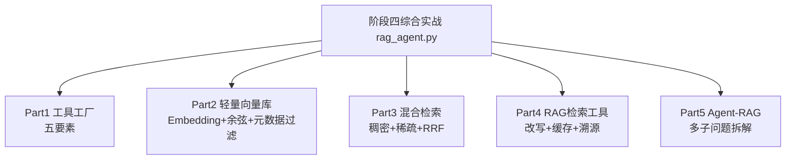
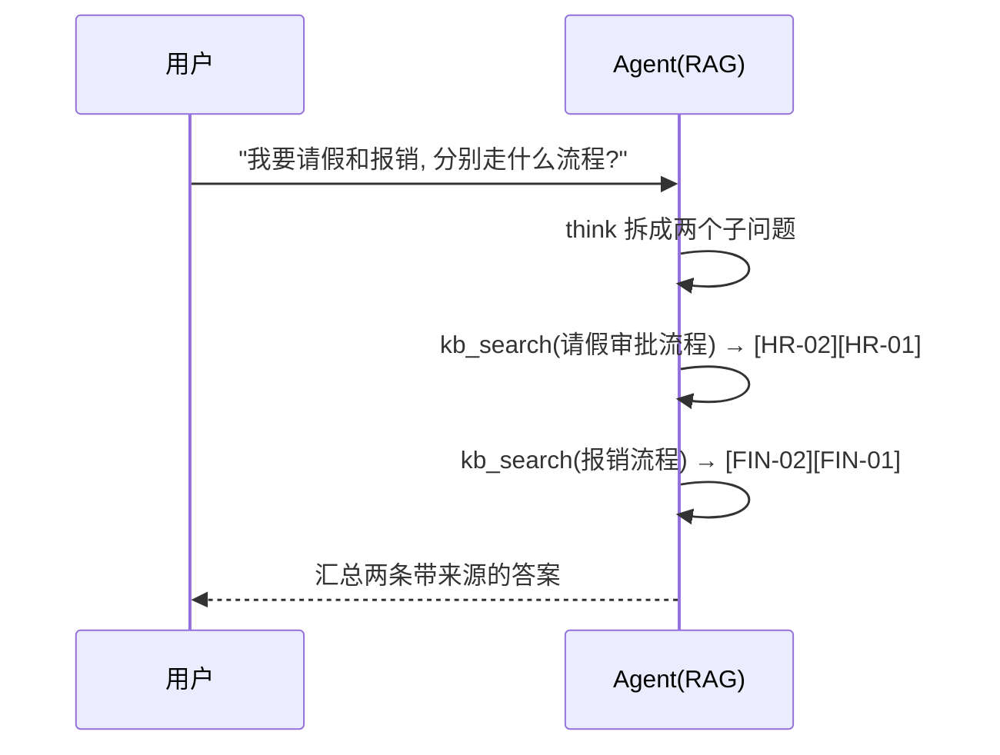

# 阶段四 · 综合实战：RAG 知识库 + 工具 Agent

> 所属：阶段四 工具生态与外围组件集成
> 定位：把阶段四三个小点（工具调用生态 / 向量库与记忆 / RAG 体系）串成一份**离线可运行**的完整 Demo——一个「知识库问答 Agent」，既会长记性（向量检索）、又会用工具（五要素工厂）、还能拆解多子问题（Agent-RAG）。

## 一句话看懂本 Demo

`rag_agent.py` 用纯 Python（仅依赖 pydantic）实现了一个完整的「企业知识库问答 Agent」全家桶，覆盖阶段四三大能力：



## 运行方式

```
python3 code/阶段四/rag_agent.py
```

不需要 API Key、不需要外网、不需要装重依赖。

## 完整代码位置

[code/阶段四/rag_agent.py](../../code/阶段四/rag_agent.py)

---

## 每个 Part 在讲什么

### Part 1 · 工具工厂（对应小点 1）

`tool_factory` 装饰器把任意业务函数升级成「合格工具」，自动套上五要素：

| 要素 | 实现位置 | 演示效果 |
|-|-|-|
| ① 入参校验 | `create_model` 按函数签名动态生成 pydantic 模型 | `1 + 2; import os` 被「非法字符」拦截 |
| ② 超时控制 | 线程池隔离 + `future.result(timeout)` | 卡死工具到点强杀 |
| ③ 权限校验 | 硬编码白名单 `_TOOL_WHITELIST` | 模型无法绕过 |
| ④ 异常包装 | `try/except` 封装成友好消息 | `1 / 0` 返回「除数不能为 0」而非抛异常 |
| ⑤ 结果精简 | `_RESULT_MAX_LEN` 截断 | 长报文不再撑爆上下文 |

```python
@tool_factory("calc", timeout=3.0)
def calc(expression: str) -> str:
    """计算数学表达式（仅四则运算与括号，防注入）。"""
    from re import fullmatch
    if not fullmatch(r"[\d+\-*/().\s]+", expression):   # 白名单字符集校验
        return f"表达式含非法字符: {expression}"
    try:
        return str(eval(expression, {"__builtins__": {}}, {}))  # 禁内置名防注入
    except ZeroDivisionError:
        return "错误: 除数不能为 0"
```

> 新增业务工具只写业务逻辑，五要素全部由工厂继承——这是「工具工厂」模式的核心价值。

### Part 2 · 轻量向量库（对应小点 2）

没有引入 Qdrant/Chroma，而是用**纯 Python 手写**了一个最小的向量库，让你看穿向量库的本质：

- **`embed()`**：字符级 bag-of-characters Embedding——把每个汉字的哈希映射到 256 维向量上累加。语义相近文本（共享常用字）向量方向就接近。
- **`cos_sim()`**：余弦相似度（只关心方向、忽略长度）。
- **`TinyVectorStore`**：支持增删改查 + **元数据过滤**（`where` 参数）+ top-K 检索。

```python
dense = _store.query(q_vec, where={"dept": "HR"}, n=5)   # 先按部门过滤再检索
```

> 生产请直接用它对应物：Qdrant / Chroma / Milvus。看懂这个就能看懂它们——本质都是「向量 + 索引 + 过滤 + top-K」。

### Part 3 · 混合检索（对应小点 2）

稠密 + 稀疏双路召回再 RRF 融合，弥补单一检索的盲区：

| 一路 | 用什么 | 擅长 |
|-|-|-|
| 稠密（Dense） | 字符向量 + 余弦 | 语义相近（「请假」≈「休假」） |
| 稀疏（Sparse） | BM25 精确词 | 型号 / 人名 / 数字 |

```python
dense = _store.query(q_vec, n=5)                 # 稠密路
sparse = bm25_scores(_tokenize(q), _store)       # 稀疏路
fused = reciprocal_rank_fusion([d for d,_,_ in dense], sparse)[:3]  # RRF 融合
```

### Part 4 · RAG 检索工具（对应小点 3）

`kb_search` 是一个被工厂包装、带描述、可重试的**工具**，内部实现 RAG 三件套：

1. **查询改写** `_llm.rewrite`——把「它怎么做」补全为「请假怎么做」；
2. **缓存去重** `MockLLM._cache`——相同问题二次命中直接复用（运行输出里第二次 `cached: true`）；
3. **引用溯源**——答案强制标注来源 `[HR-02]`，可审计、可纠错。

```python
res = _llm.answer(question, hits)   # 强制"仅基于检索片段+标注来源"
```

> 顺带运用了小点2的**元数据过滤**：`_topic_dept(query)` 根据关键词圈定部门范围，检索只在对应域进行（请假→HR，报销→Finance），运行输出里两者不再跨域串扰。

### Part 5 · Agent-RAG（对应小点 3 精髓）

这是普通 RAG 与 Agent-RAG 差异的现场演示：



普通 RAG 对「一个提问含两个主题」只会检索一次，极可能漏掉其中一域；Agent-RAG 由 Agent 自主判断、分步检索、逐步汇总。

## 关键输出对照表

| 运行片段 | 输出 | 说明什么 |
|-|-|-|
| `calc("1 + 2 * 3")` | `7` | 正常计算 |
| `calc("1 + 2; import os")` | `表达式含非法字符` | ① 入参校验拦截注入 |
| `calc("1 / 0")` | `错误: 除数不能为 0` | ④ 异常包装成消息 |
| `kb_search("请假怎么做")` ×2 | 第二次 `cached: true` | ② 缓存去重生效 |
| `kb_search("请假…")` 的 sources | `[HR-02][HR-01]` | 元数据过滤 + 引用溯源 |
| Agent-RAG「请假+报销」 | 先 `HR` 后 `FIN` | 多子问题分步检索汇总 |

## 怎么改成「真实生产版」

| 本 Demo | 生产替换 |
|-|-|
| `embed()` 字符哈希 | 中文 BGE 模型（`BAAI/bge-small-zh-v1.5`） |
| `TinyVectorStore` | Qdrant / Chroma / Milvus |
| MockLLM（规则改写/生成） | 真实 LLM + Cross-Encoder Rerank |
| `_topic_dept` 关键词 | LLM 路由 / 元数据分类器 |
| `MockLLM._cache`（内存） | Redis + TTL |

每个替换点都只动「内部实现」，`kb_search` 这个工具对外接口不变——这正是**工具封装**带来的好处。

## 达成标准（对照自检）

- [ ] 能说清工具工厂五要素各自解决什么问题，并复述工厂写法
- [ ] 能讲清向量库的本质（Embedding + 索引 + 过滤 + top-K）
- [ ] 能解释稠密/稀疏双路 + RRF 融合为什么比单一检索准
- [ ] 能说出 Agent-RAG 相比普通 RAG 的核心差异（多子问题分步检索）