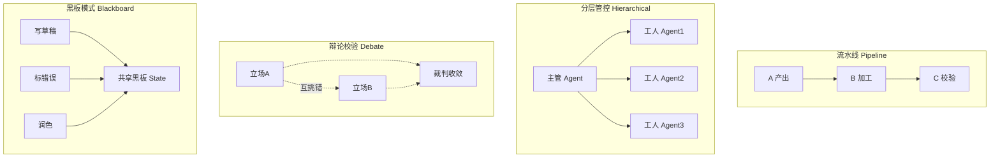
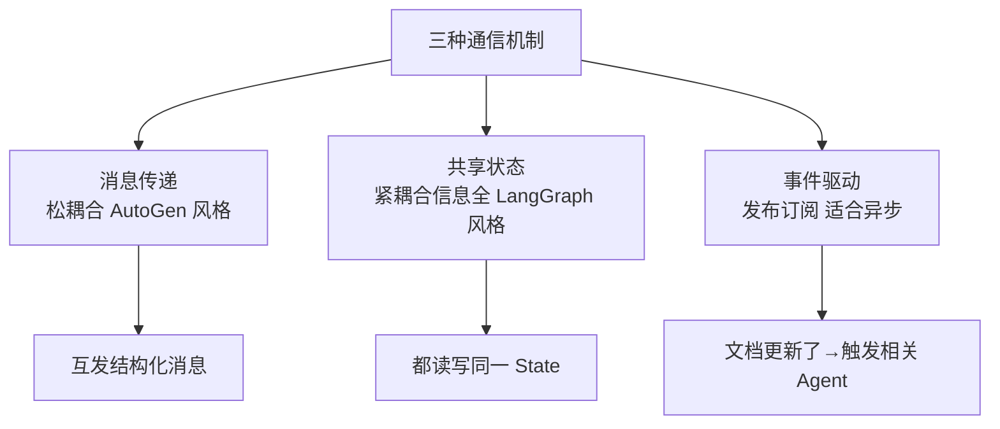

# 阶段五 · 小点 1：多智能体系统（MAS）进阶

> 所属：阶段五 进阶技术：能力增强与优化
> 定位：单个 Agent 遇到瓶颈（任务太复杂、单模型幻觉难自查、需要专业分工）时，就上多智能体。这一讲把四种架构、三种通信、协调调度一次讲清，并给出一份可运行的「分工协作」与「对抗验证」代码。

## 精简大纲

1. 四种架构模式：流水线 / 分层管控 / 辩论校验 / 黑板
2. 三种通信机制：消息传递 / 共享状态 / 事件驱动
3. 协调调度：任务分配、冲突检测与解决
4. 大规模多智能体（了解即可）
5. 辩论校验模式工程要点

## 学习内容详情

> 核心认知：多智能体不是「越多越好」，是用**复杂度换能力**。能用单 Agent 解决的绝不上多智能体；上多智能体就必然面对通信、一致性、成本的代价。

### 1. 四种架构模式

#### 1.1 一张图看懂四种模式



| 模式 | 特点 | 落地对照 |
|-|-|-|
| 流水线（Pipeline） | A 产出 → B 加工 → C 校验，像传送带；结构简单、易排查；一环卡住全链停摆 | CrewAI 顺序模式 |
| 分层管控（Hierarchical） | 一个「主管 Agent」派活验收，多个「工人 Agent」干活；可控性最强 | LangGraph Supervisor |
| 辩论校验（Debate） | 两立场对立 Agent 互相挑错 + 裁判收敛结论；抑制单模型幻觉 | 代价：token 3~5 倍，只用于关键节点 |
| 黑板模式（Blackboard） | 多个 Agent 共享「黑板」（共享状态区），各自读写擅长部分，互不阻塞 | 写草稿 / 标错误 / 润色协同 |

> **选型口诀**：任务线性 → 流水线；一人派活分工 → 分层管控；答案是关键且错误代价高 → 辩论校验；多人协作同一产出 → 黑板。

#### 1.2 分工协作（Supervisor）代码骨架

```python
# 分层管控 = 主管派活 + 工人执行（LangGraph Supervisor 的极简示意）
class Worker:
    """工人：只负责一件事。抽象后，工人内部可以是任意 Agent/工具。"""
    def __init__(self, name, fn): self.name, self.fn = name, fn

    def run(self, task: str) -> str:
        print(f"  [{self.name}] 执行任务: {task}")
        return self.fn(task)

class Supervisor:
    """主管：负责任务拆解、派发、验收，不亲手干活。"""
    def __init__(self):
        self.workers = {
            "gather": Worker("取数", lambda t: f"取到数据: {t}"),
            "clean":  Worker("清洗", lambda t: f"清洗完: {t}"),
            "report": Worker("写报告", lambda t: f"报告: {t}"),
        }

    def run(self, goal: str) -> list:
        """派活 → 收集 → 汇总（这里把 goal 映射为串行流水线）"""
        results, plan = [], ["gather", "clean", "report"]
        for step in plan:
            results.append(self.workers[step].run(f"{goal}-{step}"))
        return results   # 每一步的产出，供上层汇总

Supervisor().run("季度经营分析")
```

#### 1.3 对抗验证（Debate）代码骨架

```python
def debate(pro_agent, con_agent, judge, question: str, rounds: int = 2) -> str:
    """
    辩论校验：正方/反方互相挑错 N 轮，最后裁判收敛结论。
    只用于"错误代价高"的关键节点——平时用它会多烧 3~5 倍 token。
    """
    positive = pro_agent(question)      # 正方先给出结论
    negative = con_agent(question, positive)   # 反方挑正方漏洞
    verdicts = []
    for _ in range(rounds):
        positive = pro_agent(question, negative)    # 正方回应反方质疑
        negative = con_agent(question, positive)    # 反方再次挑错
    verdict = judge(question, positive, negative)   # 裁判收敛
    return verdict
```

> 关键：裁判 prompt **必须包含「指出事实错误」**（见小点 5），否则裁判容易「各打五十大板」，辩论白打。

#### 1.4 黑板模式（Blackboard）代码骨架

黑板模式 = 共享黑板（一个 dict）+ 各专家检查自己能处理的 key、写回结果，互不阻塞。

```python
# 纯标准库风格: 共享 Blackboard dict, 各专家只认自己的 key
def drafter(state):          # 专家1: 写草稿(有主题且还没草稿才动)
    if "topic" in state and "draft" not in state:
        state["draft"] = f"关于《{state['topic']}》的初稿"
    return state

def fact_checker(state):     # 专家2: 标错误(有草稿才能查)
    if "draft" in state and "issues" not in state:
        state["issues"] = ["数据未标来源", "结论跳跃"]
    return state

def polisher(state):         # 专家3: 润色(错误查完才润色)
    if "issues" in state and "final" not in state:
        state["final"] = f"润色后定稿: {state['draft']}(修复{len(state['issues'])}处)"
    return state

def run_blackboard(specialists, state, max_loops=6) -> dict:
    """各专家轮询黑板: 能处理就写回, 直到产出齐/没人再动/轮次用完"""
    for _ in range(max_loops):                          # 终止条件①: 防死循环
        snapshot = dict(state)
        for agent in specialists:
            state = agent(state)                        # 每人只处理自己能吃的 key
        if {"draft", "issues", "final"} <= set(state):  # 终止条件②: 产出齐了
            break
        if state == snapshot:                           # 终止条件③: 没人再写黑板
            break
    return state

bb = run_blackboard([drafter, fact_checker, polisher],
                    {"topic": "季度经营分析"})
print(bb.get("final"))
```

> ⏳ **短期可不深究**：黑板模式（Blackboard）是相对冷门的协作范式，第一遍只需记住"共享状态 + 各专家只认自己能处理的 key"这个思想即可；生产选型第一选择仍是 Supervisor，黑板往往是确认场景后的定向优化。

#### 1.5 流水线模式（Pipeline）代码骨架

流水线模式 = 工序固定的顺序列表，上一步的 state 直接流进下一个工位。

```python
# 纯标准库风格: Agents 顺序列表, state 像传送带一样流过每个工位
def gather(state):    # 工序1: 取数
    state["data"] = f"原始数据({state['goal']})"
    return state

def clean(state):     # 工序2: 清洗
    state["data"] = f"清洗后({state['data']})"
    return state

def report(state):    # 工序3: 出报告
    state["final"] = f"报告: {state['data']}"
    return state

def run_pipeline(state: dict, pipeline: list) -> dict:
    for agent in pipeline:        # 工序顺序 = 列表顺序, 一环卡住全链停摆
        state = agent(state)
    return state

pipeline = [gather, clean, report]
print(run_pipeline({"goal": "季度经营分析"}, pipeline)["final"])
```

> ⚠️ **选型**：黑板适合「专家能力异构、完成顺序不定」；流水线适合「工序固定」；**不确定就先用 Supervisor**——分层管控可控性最强、排查最容易，黑板与流水线是确认场景后的定向优化。

### 2. 三种通信机制



- **消息传递：** Agent 互发结构化消息（松耦合，AutoGen 风格）。
- **共享状态：** 都读写同一 State（紧耦合但信息全，LangGraph 风格）。
- **事件驱动：** 发布 / 订阅（「文档更新了」事件触发相关 Agent，适合异步流水）。
- **消息格式标准化**：约定统一消息结构（发送者 / 类型 / 内容 / 引用的任务 ID），否则每个 Agent 各说各话，解析全是特判。

> ⏳ **短期可不深究**：事件驱动（发布 / 订阅）通信在第一遍学多智能体时极少用到，它主要服务异步、跨长周期的流水场景；先把"消息传递 / 共享状态"这两种搞定，事件驱动到真需要异步解耦时再看。

```python
# 统一消息格式（数据类），杜绝"各说各话"
from dataclasses import dataclass

@dataclass
class Message:
    sender: str          # 谁发的
    msg_type: str        # 类型: task/result/query
    content: str         # 内容
    task_id: int = 0     # 引用哪个任务

def relay(agent_a, agent_b, msg: Message):
    """消息传递: A 发消息, B 按统一协议解析处理"""
    assert msg.msg_type in {"task", "result", "query"}   # 类型白名单
    return agent_b(Message(sender=agent_a,
                           msg_type=msg.msg_type,
                           content=msg.content,
                           task_id=msg.task_id))
```

> 🔬 **深度理解 · 多智能体的通信与协调机制**：
> 1. **本质**：通信解决「信息怎么在智能体之间流动」，协调解决「谁、何时、对什么负责并形成统一结论」；两者叠在一起才把一群"单兵"变成"一个团队"。通信 ≠ 协作——能互发消息只代表通道通了，不意味着目标能收敛。
> 2. **机制**：消息传递把一次交互显式化为「发送者–接收者–内容」，可审计、易追踪，但要先定协议；共享状态让所有方读同一份权威 State，读写简单、信息齐全，却引入并发竞争与数据耦合；事件驱动通过发布 / 订阅解耦"谁关心"与"谁产生"，天然适合异步。协调通常由协调者（如 Supervisor）完成任务拆解、去重、排序，或借助共享方案 / 黑板做冲突消解。三者并非二选一，生产常组合：消息做交互、共享状态做事实底座。
> 3. **为什么重要**：通信机制直接决定 `token` 冗余、可观测性与耦合度；协调机制决定多步多智能体能否在有限轮次内收敛到可接受结论。没有统一消息格式，各 Agent 解析全是特判、改一个就要改全链路。
> 4. **易错点**：新手常把「能通消息」误当成「已能协作」，其实缺的是协调层的决策规则；另一个误区是死磕「消息传递 vs 共享状态」非此即彼，成熟系统往往是"松耦合交互 + 紧耦合共享状态"的混合架构。

### 3. 协调调度

- **任务分配策略**：主管按工人能力 / 负载派活；简单场景直接顺序，复杂场景用黑板竞争或调度器。
- **冲突检测与解决**：两个 Agent 对同一字段给出矛盾结论 →
  1. **检测**：版本号 / 时间戳比对（谁写的更晚？谁的任务 ID 更新？）
  2. **解决**：优先级规则（既定优先级表）→ 升级人工 → 裁判仲裁，按场景选一种。

```python
def resolve_conflict(field: str, val_a: dict, val_b: dict) -> dict:
    """
    冲突解决: 优先时间戳最新, 再按字段优先级表, 最后升级人工。
    val = {"value": ..., "ts": 时间戳, "author": "agentA"}
    """
    if val_a["ts"] != val_b["ts"]:                    # ① 时间戳最新者胜
        return val_a if val_a["ts"] > val_b["ts"] else val_b
    PRIORITY = {"price": "finance", "region": "hr"}   # ② 字段→权威作者
    spec = PRIORITY.get(field)
    if spec:
        return val_a if val_a["author"] == spec else val_b
    return {"value": None, "need_human": True}        # ③ 升级人工
```

### 4. 大规模多智能体（🟢 了解即可）

- 几十上百个 Agent 协同，**学术热点、工业极少**——通信开销随规模**平方级增长**，收益远跟不上。

```mermaid
graph LR
    A[N 个 Agent] --> B[通信对数 O(N²)]
    B --> C[开销随规模平方级涨]
    C --> D[收益增长远跟不上]
    D --> E[工业极少上百Agent]
```

- 务实做法：多数业务用 2~6 个 Agent 足够；上百个只存在于论文与少数头部场景。

> ⏳ **短期可不深究**：大规模（几十上百个 Agent）多智能体是学术热点、工业极少，学习成本高且收益低；第一遍略读了解「通信是 O(N²) 瓶颈」这一结论即可，不必研究其编排细节。

### 5. 辩论校验模式工程要点

- **成本**：每轮 3 次以上 LLM 调用 → 只在「错误代价高」的节点启用，日常问答别用。
- **裁判 prompt 必须包含「指出事实错误」**——否则容易各打五十大板，辩论白打。
- **变体**：可加第三名「检索员」辩手，只准用检索结果说话（把辩论锚定在事实上）。

> 🔬 **深度理解 · 辩论校验（Debate）机制**：
> 1. **本质**：用「多立场相互攻击 + 裁判收敛」把单模型一次输出里的内在分歧"外化"，用博弈换取更高的事实可靠性与置信度。
> 2. **机制**：正方先给结论，反方针对其缺陷反诘，双方就质疑往复交锋、补充或修正依据，最后由裁判按固定标准裁定哪方更站得住。有效性依赖两点——裁判能识别并惩罚「事实错误」，且双方存在信息差（检索员只报检索证据就是为了制造这种差）。
> 3. **为什么重要**：单模型自查容易陷入「自我确认偏误」，越想越觉得自己对；辩论用"外部对立方"打破这种偏误，适合法律 / 医疗 / 金融等结论错不起的节点，也是抑制部分幻觉的务实手段。
> 4. **易错点**：裁判若不强制「指出事实错误」就会变成"鼓励和稀泥、各打五十大板"；同时辩论烧 token 是常下文的 3~5 倍，滥用在日常问答上等于用最高成本干最低价值的事——它是定点武器，不是常规火力。

## 本节自检

- [ ] 能区分「分工协作」（Supervisor）与「对抗验证」（Debate）两种 MAS 用法
- [ ] 能说清三种通信机制的取舍
- [ ] 能写出统一消息格式 + 冲突检测/解决的代码

## 本节常见面试题（深度解析）

> 针对本节核心知识的面试高频点，配合"本质+机制"式理解，能让你答得既有深度又有广度。

### 面试题 1：什么时候该从单 Agent 升级到多智能体？多智能体到底给你带来了什么、代价又是什么？
- **面试官想考察**：是否真的懂 MAS 的「复杂度换能力」——不是会背四种架构，而是能给出上 MAS 的边界与权衡。
- **专业作答（含深度）**：
  - 触发条件三选一：① 任务太复杂、单一 Agent 一次推理放不下或易崩；② 单模型幻觉难自查、结论错不起；③ 需要清晰的专业分工与隔离（如审计、权限）。
  - 收益：能力"加总放大"、专业隔离、错误能在多角色间被交叉校验；代价：通信与协调的 token 冗余、状态一致性问题、排查复杂度上升。
  - 务实结论：能用单 Agent 解决就绝不上 MAS；上多智能体要面向"代价可承受的收益"，且多数业务 2~6 个智能体已足够。
- **加分亮点 / 深度追问**：可主动提「MAS 不是越多越好」，追问时常问「上百 Agent 为什么工业少见」——因为通信对数 O(N²)、收益增长远跟不上，只有学术热点和头部场景在用。

### 面试题 2：消息传递 / 共享状态 / 事件驱动三种通信机制怎么选？生产里通常怎么组合？
- **面试官想考察**：是否理解三种机制的语义差异，以及"耦合 / 可观测性 / 异步"之间的真实权衡，而不是背书。
- **专业作答（含深度）**：
  - 消息传递：发送者–接收者显式化，可审计、易定位，但要先定协议——适合需要留痕、异步解耦的交互。
  - 共享状态：全体读写同一权威 State，信息全、读写简单，但引入并发竞争与紧耦合——适合需要全局一致视角的流程。
  - 事件驱动：发布 / 订阅解耦"生产者与消费者"，天然异步，但追踪链路更隐式——适合跨长周期的流水。
  - 生产组合：消息做交互、共享状态做事实底座，事件驱动在真异步场景补位；并配统一消息结构与 task_id 以便关联。
- **加分亮点 / 深度追问**：可主动说「三者不是互斥，成熟系统常混合」，并强调"通信 ≠ 协作"，追问常是"如何保证多方写的状态不打架"——引出版本号 / 时间戳 / 优先级表这些冲突消解手段。

### 面试题 3：Supervisor 分工协作与 Debate 对抗验证各自适用什么场景？辩论的裁判为什么强调"必须指出事实错误"？
- **面试官想考察**：是否能区分两种最常用的 MAS 用法并讲透其工程要点。
- **专业作答（含深度）**：
  - Supervisor：主管派活 + 工人执行，可控性强、最易排查，适合"可拆解成多个有明确产出的子任务"的流程。
  - Debate：对立立场互挑错 + 裁判收敛，用额外 token 换取事实可靠性，适合错误代价高、答案很关键的中决策节点。
  - 裁判要点：若不强制"指出事实错误"，裁判只会各打五十大板、辩论毫无收敛价值；可加"检索员"只报证据，把辩论锚定在事实上。
  - 成本意识：Debate 通常 3~5 倍 token，是定点武器而非日常问答常规手段。
- **加分亮点 / 深度追问**：可主动区分两者的「收敛方式」——Supervisor 靠"裁决派活"收敛、Debate 靠"证据对抗 + 裁判裁定"收敛；追问可以是"Debate 翻倍调用会不会反而引入新幻觉"，答：会，所以只用于高价值节点且裁判、检索证据要硬约束。