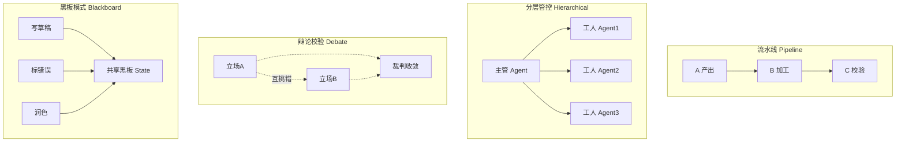
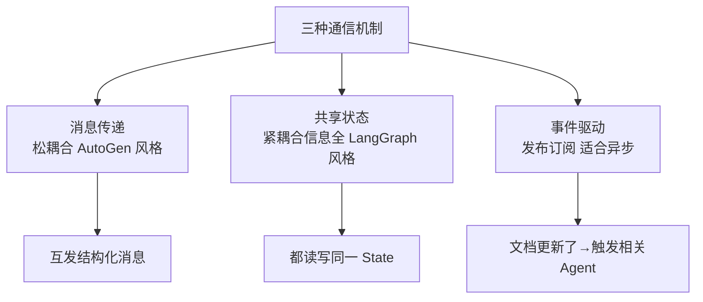

# 阶段五 · 小点 1：多智能体系统（MAS）进阶

> 所属：阶段五 进阶技术：能力增强与优化
> 定位：单个 Agent 遇到瓶颈（任务太复杂、单模型幻觉难自查、需要专业分工）时，就上多智能体。这一讲把四种架构、三种通信、协调调度一次讲清，并给出一份可运行的「分工协作」与「对抗验证」代码。

## 精简大纲

1. 四种架构模式：流水线 / 分层管控 / 辩论校验 / 黑板
2. 三种通信机制：消息传递 / 共享状态 / 事件驱动
3. 协调调度：任务分配、冲突检测与解决
4. 大规模多智能体（了解即可）
5. 辩论校验模式工程要点

## 学习内容详情

> 核心认知：多智能体不是「越多越好」，是用**复杂度换能力**。能用单 Agent 解决的绝不上多智能体；上多智能体就必然面对通信、一致性、成本的代价。

### 1. 四种架构模式

#### 1.1 一张图看懂四种模式



| 模式 | 特点 | 落地对照 |
|-|-|-|
| 流水线（Pipeline） | A 产出 → B 加工 → C 校验，像传送带；结构简单、易排查；一环卡住全链停摆 | CrewAI 顺序模式 |
| 分层管控（Hierarchical） | 一个「主管 Agent」派活验收，多个「工人 Agent」干活；可控性最强 | LangGraph Supervisor |
| 辩论校验（Debate） | 两立场对立 Agent 互相挑错 + 裁判收敛结论；抑制单模型幻觉 | 代价：token 3~5 倍，只用于关键节点 |
| 黑板模式（Blackboard） | 多个 Agent 共享「黑板」（共享状态区），各自读写擅长部分，互不阻塞 | 写草稿 / 标错误 / 润色协同 |

> **选型口诀**：任务线性 → 流水线；一人派活分工 → 分层管控；答案是关键且错误代价高 → 辩论校验；多人协作同一产出 → 黑板。

#### 1.2 分工协作（Supervisor）代码骨架

```python
# 分层管控 = 主管派活 + 工人执行（LangGraph Supervisor 的极简示意）
class Worker:
    """工人：只负责一件事。抽象后，工人内部可以是任意 Agent/工具。"""
    def __init__(self, name, fn): self.name, self.fn = name, fn

    def run(self, task: str) -> str:
        print(f"  [{self.name}] 执行任务: {task}")
        return self.fn(task)

class Supervisor:
    """主管：负责任务拆解、派发、验收，不亲手干活。"""
    def __init__(self):
        self.workers = {
            "gather": Worker("取数", lambda t: f"取到数据: {t}"),
            "clean":  Worker("清洗", lambda t: f"清洗完: {t}"),
            "report": Worker("写报告", lambda t: f"报告: {t}"),
        }

    def run(self, goal: str) -> list:
        """派活 → 收集 → 汇总（这里把 goal 映射为串行流水线）"""
        results, plan = [], ["gather", "clean", "report"]
        for step in plan:
            results.append(self.workers[step].run(f"{goal}-{step}"))
        return results   # 每一步的产出，供上层汇总

Supervisor().run("季度经营分析")
```

#### 1.3 对抗验证（Debate）代码骨架

```python
def debate(pro_agent, con_agent, judge, question: str, rounds: int = 2) -> str:
    """
    辩论校验：正方/反方互相挑错 N 轮，最后裁判收敛结论。
    只用于"错误代价高"的关键节点——平时用它会多烧 3~5 倍 token。
    """
    positive = pro_agent(question)      # 正方先给出结论
    negative = con_agent(question, positive)   # 反方挑正方漏洞
    verdicts = []
    for _ in range(rounds):
        positive = pro_agent(question, negative)    # 正方回应反方质疑
        negative = con_agent(question, positive)    # 反方再次挑错
    verdict = judge(question, positive, negative)   # 裁判收敛
    return verdict
```

> 关键：裁判 prompt **必须包含「指出事实错误」**（见小点 5），否则裁判容易「各打五十大板」，辩论白打。

### 2. 三种通信机制



- **消息传递：** Agent 互发结构化消息（松耦合，AutoGen 风格）。
- **共享状态：** 都读写同一 State（紧耦合但信息全，LangGraph 风格）。
- **事件驱动：** 发布 / 订阅（「文档更新了」事件触发相关 Agent，适合异步流水）。
- **消息格式标准化**：约定统一消息结构（发送者 / 类型 / 内容 / 引用的任务 ID），否则每个 Agent 各说各话，解析全是特判。

```python
# 统一消息格式（数据类），杜绝"各说各话"
from dataclasses import dataclass

@dataclass
class Message:
    sender: str          # 谁发的
    msg_type: str        # 类型: task/result/query
    content: str         # 内容
    task_id: int = 0     # 引用哪个任务

def relay(agent_a, agent_b, msg: Message):
    """消息传递: A 发消息, B 按统一协议解析处理"""
    assert msg.msg_type in {"task", "result", "query"}   # 类型白名单
    return agent_b(Message(sender=agent_a,
                           msg_type=msg.msg_type,
                           content=msg.content,
                           task_id=msg.task_id))
```

### 3. 协调调度

- **任务分配策略**：主管按工人能力 / 负载派活；简单场景直接顺序，复杂场景用黑板竞争或调度器。
- **冲突检测与解决**：两个 Agent 对同一字段给出矛盾结论 →
  1. **检测**：版本号 / 时间戳比对（谁写的更晚？谁的任务 ID 更新？）
  2. **解决**：优先级规则（既定优先级表）→ 升级人工 → 裁判仲裁，按场景选一种。

```python
def resolve_conflict(field: str, val_a: dict, val_b: dict) -> dict:
    """
    冲突解决: 优先时间戳最新, 再按字段优先级表, 最后升级人工。
    val = {"value": ..., "ts": 时间戳, "author": "agentA"}
    """
    if val_a["ts"] != val_b["ts"]:                    # ① 时间戳最新者胜
        return val_a if val_a["ts"] > val_b["ts"] else val_b
    PRIORITY = {"price": "finance", "region": "hr"}   # ② 字段→权威作者
    spec = PRIORITY.get(field)
    if spec:
        return val_a if val_a["author"] == spec else val_b
    return {"value": None, "need_human": True}        # ③ 升级人工
```

### 4. 大规模多智能体（🟢 了解即可）

- 几十上百个 Agent 协同，**学术热点、工业极少**——通信开销随规模**平方级增长**，收益远跟不上。

```mermaid
graph LR
    A[N 个 Agent] --> B[通信对数 O(N²)]
    B --> C[开销随规模平方级涨]
    C --> D[收益增长远跟不上]
    D --> E[工业极少上百Agent]
```

- 务实做法：多数业务用 2~6 个 Agent 足够；上百个只存在于论文与少数头部场景。

### 5. 辩论校验模式工程要点

- **成本**：每轮 3 次以上 LLM 调用 → 只在「错误代价高」的节点启用，日常问答别用。
- **裁判 prompt 必须包含「指出事实错误」**——否则容易各打五十大板，辩论白打。
- **变体**：可加第三名「检索员」辩手，只准用检索结果说话（把辩论锚定在事实上）。

## 本节自检

- [ ] 能区分「分工协作」（Supervisor）与「对抗验证」（Debate）两种 MAS 用法
- [ ] 能说清三种通信机制的取舍
- [ ] 能写出统一消息格式 + 冲突检测/解决的代码