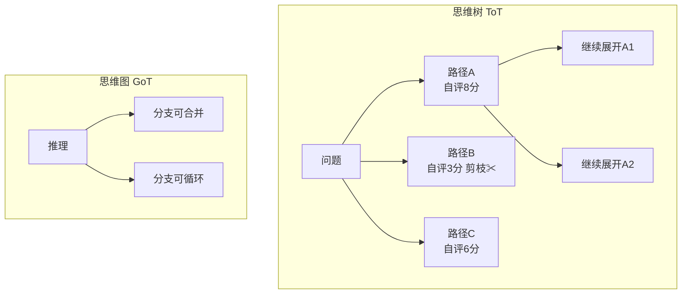
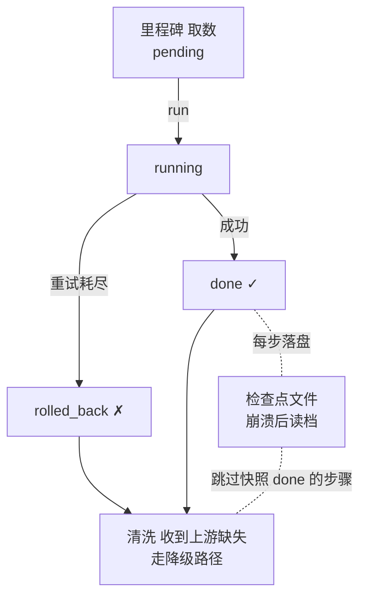

# 阶段五 · 小点 2：规划能力增强

> 所属：阶段五 进阶技术：能力增强与优化
> 定位：长任务的 Agent 最怕「跑一半崩了」「某一步失败全链死掉」「死板执行不撞南墙不回头」。这一讲先把论文范儿的 ToT/GoT 讲清（了解即可），再给出真正工程的武器：里程碑 / 失败回滚 / 断点续执行 / 动态重规划。

## 精简大纲

1. 🟢 思维树 ToT / 思维图 GoT（论文概念，了解即可）
2. 🔴 工程可用：里程碑追踪 / 失败回滚 / 断点续执行
3. 🔴 动态规划（重规划）
4. 长任务管理器要点

## 学习内容详情

> 核心认知：ToT/GoT 是「论文的优雅」，里程碑/回滚/断点/重规划是「生产的刚需」。学规划增强，重点把后面四个工程技能练到能写代码。

### 1. ToT / GoT（🟢 论文范儿，了解即可）



- **思维树（ToT）**：对同一问题**并行生成多条推理路径**，自评打分后剪枝、保留高分路径继续展开（像下棋推演多个分支）。效果惊艳但一次任务几十次 LLM 调用，工业极少落地。
- **启示**：生产中可以用「多方案生成 + 评分择优」的**简化版**（生成 2~3 个方案 → 打分选优），没必要整树搜索。
- **思维图（GoT）**：把树推广成图，推理分支可**合并、循环**。更前沿，同样了解即可。

> ⏳ **短期可不深究**：ToT/GoT 是论文级的「优雅」，一次任务就要几十次 LLM 调用，工业极少落地；第一遍只需记住"多方案生成 + 评分择优"的简化启发即可，不必深入整树搜索、图合并机制的实现。

### 2. 工程可用的规划增强（🔴 生产真需求）

#### 2.1 里程碑 + 回滚 + 断点续执行的关系



- **里程碑（Milestone）**：把长任务切成有明确产出的检查点（「取数完成→校验完成→报告完成」）。作用：**进度可观测、失败可定位、断点可恢复**。
- **失败回滚（Rollback）**：某步失败重试耗尽后，标记该步回滚（放弃 / 补偿），后续步骤收到「上游缺失」信号走降级路径——而不是让整条链死掉。
- **断点续执行（Resume）**：任务状态每步落盘；进程崩溃 / 重启后从上次完成的里程碑继续，不从头再来。生产对照：**LangGraph 的 Checkpointer** 就是框架级实现。
- **动态规划 / 重规划（Re-planning）**：执行中根据工具反馈修改计划：发现脏数据就临时插一个「数据清洗」步骤——不僵硬执行初始方案。

> 🔬 **深度理解 · 规划（Plan-and-Execute / ReAct / 任务拆解）与长任务管理**：
> 1. **本质**：规划是把"一步到底"的隐式推理，显式化为「可观测、可回退、可恢复的子步骤序列」——让长任务从"黑盒碰运气"变成"白盒可管理"。
> 2. **机制**：以 ReAct 为代表的「推理–行动–观察」循环是内置在单次迭代里的瞬时规划；而 Plan-and-Execute 把「先整体规划」与「逐步执行」拆成两个阶段，更适合长任务。工程落地常用「任务拆解」把目标切成里程碑（Milestone），每步执行后视反馈决定推进 / 回滚 / 追加；再叠加断点续执行与动态重规划，形成"先拆、再跑、坏了能回、变了能改"的闭环。
> 3. **为什么重要**：长任务最怕"跑一半崩掉 / 某步失败全链死 / 撞了南墙不回头"。拆解 + 里程碑让进度可观测、失败可定位；回滚与断点让失败不致命；重规划让计划跟随现实。它解决的是"可靠性"与"可控性"，这正是论文级规划与生产级规划的分水岭。
> 4. **易错点**：把「一次性计划」当成规划的全部——真正的长任务规划必须引入"执行反馈→修订"的动态闭环；另一种错误是把任务拆得过细，每步都重调度反而放大 token 与调度开销，拆解的粒度要匹配失败的可恢复性而非越细越好。

#### 2.2 里程碑状态机

```python
# 里程碑的四种状态流转: pending → running → done / rolled_back
from enum import Enum

class MilestoneStatus(Enum):
    PENDING = "pending"
    RUNNING = "running"
    DONE = "done"
    ROLLED_BACK = "rolled_back"

def transition(step, old, new):
    """状态机: 只允许合法的迁移, 防止状态错乱"""
    legal = {
        MilestoneStatus.PENDING: {MilestoneStatus.RUNNING},
        MilestoneStatus.RUNNING: {MilestoneStatus.DONE, MilestoneStatus.ROLLED_BACK},
        MilestoneStatus.DONE: set(),                 # done 后不可再变(除非回滚补偿)
        MilestoneStatus.ROLLED_BACK: {MilestoneStatus.PENDING},   # 允许重试恢复
    }
    if new not in legal[old]:
        raise ValueError(f"非法状态迁移: {old} -> {new}")
    print(f"  [里程碑:{step}] {old.value} → {new.value}")
```

#### 2.3 断点续执行 + 动态重规划的长任务管理器

```python
import json, os, time

STATE_FILE = "./plan_state.json"      # 状态每步落盘

class LongTaskManager:
    """带 落盘 + 断点恢复 + 动态插入 的长任务管理器"""

    def __init__(self, steps: list):
        # steps: [{"name": "取数", "fn": callable}]
        self.steps = steps
        self.state = {s["name"]: "pending" for s in steps}

    # ---- 落盘 & 读档 ----
    def save(self):
        with open(STATE_FILE, "w", encoding="utf-8") as f:
            json.dump(self.state, f, ensure_ascii=False)

    def load(self) -> bool:
        """崩溃重启后先读档, 返回是否接着上次跑"""
        if not os.path.exists(STATE_FILE):
            return False
        with open(STATE_FILE, encoding="utf-8") as f:
            self.state = json.load(f)
        print(f"[断点恢复] 读档: 还有 {sum(s=='pending' for s in self.state.values())} 步未完成")
        return True

    # ---- 主循环 ----
    def run(self, replan=None):
        self.load()                                # ① 先读档
        for step in self.steps:
            name = step["name"]
            if self.state.get(name) == "done":      # ② 已完成的直接跳过
                print(f"[跳过] {name} 已完成, 不复跑")
                continue
            transition(name, MilestoneStatus.PENDING, MilestoneStatus.RUNNING)
            self.state[name] = "running"; self.save()
            try:
                step["fn"]()                        # ③ 真正执行
                self.state[name] = "done"
            except Exception as e:
                self.state[name] = "rolled_back"    # ④ 失败标记回滚
                print(f"[回滚] {name} 失败: {e}")
                self.save()                         # 失败态也要落盘(否则重启后会丢失回滚标记)
                continue                            # ⑤ 不中断, 让后续走降级
            self.save()
            if replan:                              # ⑥ 动态重规划钩子
                replan(self)                        #    (可临时插入新里程碑)
        print("[完成] 所有里程碑处理结束")
```

```python
# 使用: 模拟中途崩溃后恢复
def make_task():
    return LongTaskManager([
        {"name": "取数",   "fn": lambda: time.sleep(0.1)},
        {"name": "清洗",   "fn": lambda: time.sleep(0.1)},
        {"name": "报告",   "fn": lambda: time.sleep(0.1)},
    ])

# 第一次跑到一半模拟进程被杀(只跑了取数), 状态已落盘
t1 = make_task(); t1.state["取数"] = "done"; t1.save()
# 重启后:
t2 = make_task(); t2.run()   # 从"清洗"继续, 不复跑"取数"
```

> ⏳ **短期可不深究**：这里用手写 JSON 每步落盘只是为了让你看懂"状态持久化→重启读档跳步"的原理；第一遍不必自行造检查点轮子，生产直接用 LangGraph Checkpointer 这类框架级实现即可，道理一样、能力更全。

### 3. 动态重规划代码

```python
def dirty_data_replan(manager: LongTaskManager):
    """
    重规划钩子示例: 若发现"清洗"阶段标记了脏数据, 就临时插一个"数据清洗"里程碑。
    在 run() 的 replan 回调里调用, 实现"不僵硬执行初始方案"。
    """
    if manager.state.get("清洗") == "rolled_back":
        new_step = {"name": "数据清洗", "fn": lambda: print("临时插入: 深度清洗脏数据")}
        manager.steps.insert(1, new_step)          # 动态插入计划
        manager.state["数据清洗"] = "pending"
        print("[重规划] 检测到脏数据, 已插入『数据清洗』里程碑")
```

> 🔬 **深度理解 · 动态重规划（Re-planning）**：
> 1. **本质**：把计划从"当真理"降级为"当假设"——执行过程中用工具反馈持续校验并修订它，让"计划"从静态文本变成"随现实更新的可执行假设"。
> 2. **机制**：典型的闭环是「执行子步 → 观察工具返回 → 识别与假设不符的异常 → 更新剩余计划（插入 / 重排 / 放弃子步）→ 继续」。本文的重规划钩子即在 `run()` 主循环里提供回调点，检测到脏数据（如清洗步回滚）就向步骤列表插入补偿里程碑。它与 ReAct 的瞬时"观察后决策"本质同源，只是作用在任务级而非单步级。
> 3. **为什么重要**：现实环境（网页结构变化、数据脏、工具返回异常）不会按初始计划走，僵硬执行初始方案会让 Agent"撞了南墙不回头"；动态重规划是长任务能在不确定世界里存活的关键。
> 4. **易错点**：警惕"过度重规划"——每次反馈都大改计划会造成震荡与无限追加，通常要设修订阈值或与回滚 / 补偿配合，避免重规划本身成为死循环来源。

### 4. 长任务管理器要点

- **裸写版原理**：状态落盘（JSON / DB）→ 崩溃重启后先读档 → 已完成的步骤直接跳过。
- **里程碑状态机**：`pending / running / done / rolled_back` 四态。
- **动态插入**：`run()` 里插「计划修订」钩子，如检测到脏数据就追加新里程碑。
- 生产上不用自造轮子，直接用 **LangGraph Checkpointer**（框架级落盘 + 恢复）。

## 本节自检

- [ ] 能说清 ToT/GoT 与里程碑/回滚/断点续执行的本质差异（论文 vs 工程）
- [ ] 能实现一个带状态落盘 + 断点恢复的长任务管理器
- [ ] 能写出里程碑四态状态机 + 动态重规划钩子

## 本节常见面试题（深度解析）

> 针对本节核心知识的面试高频点，配合"本质+机制"式理解，能让你答得既有深度又有广度。

### 面试题 1：ToT/GoT 这类"论文级"规划为什么生产里很少用？真实的工程规划增强做了什么？
- **面试官想考察**：能否区分"学术优雅"与"生产刚需"，并说清工程规划的核心矛盾。
- **专业作答（含深度）**：
  - ToT 一次性并行生成多条推理路径、自评剪枝再展开，效果惊艳但一次任务几十次 LLM 调用，token 与延迟都不可接受；GoT 在图层面做分支合并 / 循环，更前沿、更复杂。
  - 所以工业落地取"简化版"：生成 2~3 个方案 → 打分选优，而非整树搜索。
  - 真正生产需要的是工程规划三件套：里程碑（任务可观测、失败可定位）、失败回滚（某步失败不让全链死）、断点续执行（崩溃后从上次完成点接着跑），核心是可靠性而非搜索最优解。
- **加分亮点 / 深度追问**：可主动点出"论文关心效果上界、工业关心可靠性下界"，追问常是"生产里还需要什么"——答：动态重规划，让计划随现实变化。

### 面试题 2：断点续执行的原理是什么？手写 JSON 落盘和 LangGraph Checkpointer 有何差异？
- **面试官想考察**：是否真正理解"状态持久化 + 重启读档"的机制，以及为什么生产要框架级实现。
- **专业作答（含深度）**：
  - 原理：每步执行完把该步状态"落盘"（JSON/DB/框架检查点），崩溃重启后先读档，把已完成（done）的里程碑直接跳过，从第一个未完成（pending）的继续。
  - 要点：失败态（rolled_back）也要落盘，否则重启会丢失回滚标记导致状态错乱；恢复粒度决定了"从哪一步接着跑"。
  - 手写版只演示原理；Checkpointer 提供框架级快照、可序列化任意图状态（含中间变量、内存、历史消息），并天然支持提交/回滚与分支，且不污染业务代码。
  - 局限边界：状态若存在进程外（数据库 / 外部副作用），仅靠检查点不足以回滚已发生的外部副作用，那需要补偿机制。
- **加分亮点 / 深度追问**：可主动提到"落盘 + 读档 = 计划增长为幂等/可恢复"，追问常是"外部副作用怎么恢复"，答：检查点只管内部状态，副作用要用补偿 / 事务 / 降级路径处理。

### 面试题 3：动态重规划与 ReAct 有什么关系？重规划会不会引入新的风险？
- **面试官想考察**：能否把"任务级重规划"与"单步推理循环"打通，并意识到动态机制的双刃剑属性。
- **专业作答（含深度）**：
  - 同源：ReAct 是"推理–行动–观察"的瞬时决策循环，动态重规划把同样的"观察反馈→修订计划"提升到任务级，二者哲学一致，只是作用粒度不同（单步 vs 任务）。
  - 机制：执行子步 → 观察工具返回 → 识别异常 → 插入/重排/放弃子步 → 继续，可用 replan 钩子在主循环回调。
  - 风险：过度重规划会导致计划震荡、无限追加子步，反而制造新的死循环或成本失控；应设修订阈值、与回滚/补偿联动。
- **加分亮点 / 深度追问**：可主动区分"Plan-and-Execute（先总体规划再执行）"与"ReAct（边执行边决策）"的取舍，追问常是"动态插入计划如何避免冲突"——答：插入要校验状态机合法性并落盘，且要与已回滚步骤的降级路径协同。