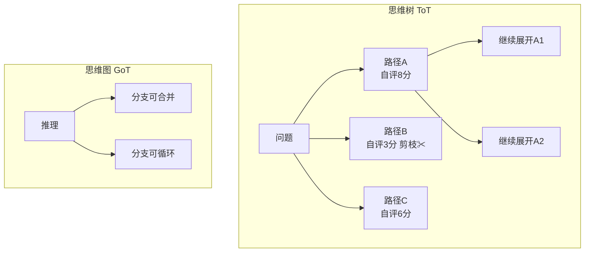
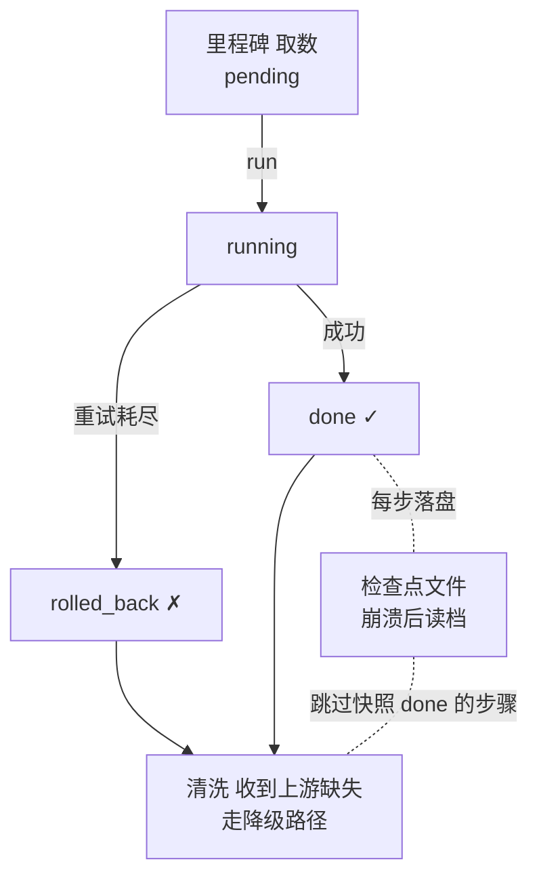

# 阶段五 · 小点 2：规划能力增强

> 所属：阶段五 进阶技术：能力增强与优化
> 定位：长任务的 Agent 最怕「跑一半崩了」「某一步失败全链死掉」「死板执行不撞南墙不回头」。这一讲先把论文范儿的 ToT/GoT 讲清（了解即可），再给出真正工程的武器：里程碑 / 失败回滚 / 断点续执行 / 动态重规划。

## 精简大纲

1. 🟢 思维树 ToT / 思维图 GoT（论文概念，了解即可）
2. 🔴 工程可用：里程碑追踪 / 失败回滚 / 断点续执行
3. 🔴 动态规划（重规划）
4. 长任务管理器要点

## 学习内容详情

> 核心认知：ToT/GoT 是「论文的优雅」，里程碑/回滚/断点/重规划是「生产的刚需」。学规划增强，重点把后面四个工程技能练到能写代码。

### 1. ToT / GoT（🟢 论文范儿，了解即可）



- **思维树（ToT）**：对同一问题**并行生成多条推理路径**，自评打分后剪枝、保留高分路径继续展开（像下棋推演多个分支）。效果惊艳但一次任务几十次 LLM 调用，工业极少落地。
- **启示**：生产中可以用「多方案生成 + 评分择优」的**简化版**（生成 2~3 个方案 → 打分选优），没必要整树搜索。
- **思维图（GoT）**：把树推广成图，推理分支可**合并、循环**。更前沿，同样了解即可。

### 2. 工程可用的规划增强（🔴 生产真需求）

#### 2.1 里程碑 + 回滚 + 断点续执行的关系



- **里程碑（Milestone）**：把长任务切成有明确产出的检查点（「取数完成→校验完成→报告完成」）。作用：**进度可观测、失败可定位、断点可恢复**。
- **失败回滚（Rollback）**：某步失败重试耗尽后，标记该步回滚（放弃 / 补偿），后续步骤收到「上游缺失」信号走降级路径——而不是让整条链死掉。
- **断点续执行（Resume）**：任务状态每步落盘；进程崩溃 / 重启后从上次完成的里程碑继续，不从头再来。生产对照：**LangGraph 的 Checkpointer** 就是框架级实现。
- **动态规划 / 重规划（Re-planning）**：执行中根据工具反馈修改计划：发现脏数据就临时插一个「数据清洗」步骤——不僵硬执行初始方案。

#### 2.2 里程碑状态机

```python
# 里程碑的四种状态流转: pending → running → done / rolled_back
from enum import Enum

class MilestoneStatus(Enum):
    PENDING = "pending"
    RUNNING = "running"
    DONE = "done"
    ROLLED_BACK = "rolled_back"

def transition(step, old, new):
    """状态机: 只允许合法的迁移, 防止状态错乱"""
    legal = {
        MilestoneStatus.PENDING: {MilestoneStatus.RUNNING},
        MilestoneStatus.RUNNING: {MilestoneStatus.DONE, MilestoneStatus.ROLLED_BACK},
        MilestoneStatus.DONE: set(),                 # done 后不可再变(除非回滚补偿)
        MilestoneStatus.ROLLED_BACK: {MilestoneStatus.PENDING},   # 允许重试恢复
    }
    if new not in legal[old]:
        raise ValueError(f"非法状态迁移: {old} -> {new}")
    print(f"  [里程碑:{step}] {old.value} → {new.value}")
```

#### 2.3 断点续执行 + 动态重规划的长任务管理器

```python
import json, os, time

STATE_FILE = "./plan_state.json"      # 状态每步落盘

class LongTaskManager:
    """带 落盘 + 断点恢复 + 动态插入 的长任务管理器"""

    def __init__(self, steps: list):
        # steps: [{"name": "取数", "fn": callable}]
        self.steps = steps
        self.state = {s["name"]: "pending" for s in steps}

    # ---- 落盘 & 读档 ----
    def save(self):
        with open(STATE_FILE, "w", encoding="utf-8") as f:
            json.dump(self.state, f, ensure_ascii=False)

    def load(self) -> bool:
        """崩溃重启后先读档, 返回是否接着上次跑"""
        if not os.path.exists(STATE_FILE):
            return False
        with open(STATE_FILE, encoding="utf-8") as f:
            self.state = json.load(f)
        print(f"[断点恢复] 读档: 还有 {sum(s=='pending' for s in self.state.values())} 步未完成")

    # ---- 主循环 ----
    def run(self, replan=None):
        self.load()                                # ① 先读档
        for step in self.steps:
            name = step["name"]
            if self.state.get(name) == "done":      # ② 已完成的直接跳过
                print(f"[跳过] {name} 已完成, 不复跑")
                continue
            transition(name, MilestoneStatus.PENDING, MilestoneStatus.RUNNING)
            self.state[name] = "running"; self.save()
            try:
                step["fn"]()                        # ③ 真正执行
                self.state[name] = "done"
            except Exception as e:
                self.state[name] = "rolled_back"    # ④ 失败标记回滚
                print(f"[回滚] {name} 失败: {e}")
                continue                            # ⑤ 不中断, 让后续走降级
            self.save()
            if replan:                              # ⑥ 动态重规划钩子
                replan(self)                        #    (可临时插入新里程碑)
        print("[完成] 所有里程碑处理结束")
```

```python
# 使用: 模拟中途崩溃后恢复
def make_task():
    return LongTaskManager([
        {"name": "取数",   "fn": lambda: time.sleep(0.1)},
        {"name": "清洗",   "fn": lambda: time.sleep(0.1)},
        {"name": "报告",   "fn": lambda: time.sleep(0.1)},
    ])

# 第一次跑到一半模拟进程被杀(只跑了取数), 状态已落盘
t1 = make_task(); t1.state["取数"] = "done"; t1.save()
# 重启后:
t2 = make_task(); t2.run()   # 从"清洗"继续, 不复跑"取数"
```

### 3. 动态重规划代码

```python
def dirty_data_replan(manager: LongTaskManager):
    """
    重规划钩子示例: 若发现"清洗"阶段标记了脏数据, 就临时插一个"数据清洗"里程碑。
    在 run() 的 replan 回调里调用, 实现"不僵硬执行初始方案"。
    """
    if manager.state.get("清洗") == "rolled_back":
        new_step = {"name": "数据清洗", "fn": lambda: print("临时插入: 深度清洗脏数据")}
        manager.steps.insert(1, new_step)          # 动态插入计划
        manager.state["数据清洗"] = "pending"
        print("[重规划] 检测到脏数据, 已插入『数据清洗』里程碑")
```

### 4. 长任务管理器要点

- **裸写版原理**：状态落盘（JSON / DB）→ 崩溃重启后先读档 → 已完成的步骤直接跳过。
- **里程碑状态机**：`pending / running / done / rolled_back` 四态。
- **动态插入**：`run()` 里插「计划修订」钩子，如检测到脏数据就追加新里程碑。
- 生产上不用自造轮子，直接用 **LangGraph Checkpointer**（框架级落盘 + 恢复）。

## 本节自检

- [ ] 能说清 ToT/GoT 与里程碑/回滚/断点续执行的本质差异（论文 vs 工程）
- [ ] 能实现一个带状态落盘 + 断点恢复的长任务管理器
- [ ] 能写出里程碑四态状态机 + 动态重规划钩子