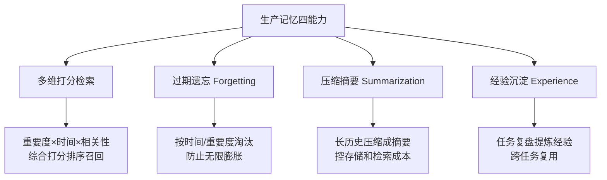
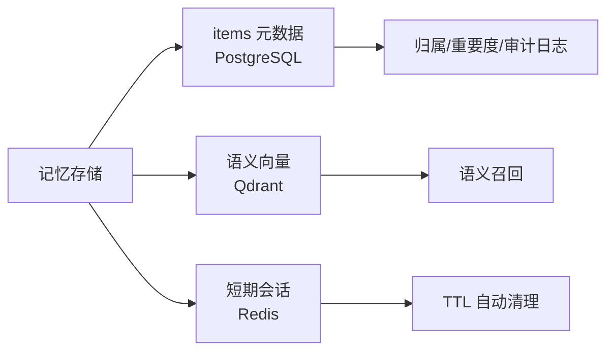

# 阶段五 · 小点 3：记忆系统优化

> 所属：阶段五 进阶技术：能力增强与优化
> 定位：阶段二已经解决了「能存能取」，阶段五把它升级成生产级的四大能力——打分检索、过期遗忘、压缩摘要、经验沉淀，并给出一个可直接运行的记忆类。还讲清了记忆在三类存储里的落地分工。

## 精简大纲

1. 生产记忆四能力：多维打分检索 / 过期遗忘 / 压缩摘要 / 经验沉淀
2. 记忆存储接入（Redis + 向量库 + PG）
3. 经验沉淀钩子
4. 一个可运行的记忆类 Demo

## 学习内容详情

> 核心认知：记忆系统不是「越存越多越好」，而是「存得精、取得到、旧得扔、事上学到经验」。生产记忆 = 检索权重 + 遗忘策略 + 摘要压缩 + 经验复用 四件事一起做。

### 1. 生产记忆四能力（对照阶段二「能存能取」的升级）

#### 1.1 一张图看懂四能力



1. **多维打分检索**：记忆按**重要度 / 时间 / 相关性**等多维打分，检索时综合排序召回高置信记忆。
2. **过期遗忘（Forgetting）**：按时间 / 重要度淘汰过期或低价值记忆，防止记忆库无限膨胀。
3. **压缩摘要**：把长历史记忆压缩成摘要存储，控制存储与检索成本。
4. **经验沉淀**：任务结束后把「哪些做法有效」提炼成经验存为长期记忆，跨任务复用。

### 2. 记忆存储接入（生产架构）



- `items` 存 **PostgreSQL**（元数据：归属 / 重要度 / 审计日志）+ **Qdrant**（语义向量：语义召回）。
- `recall()` 底层换成 **Qdrant 向量相似度检索**；`forget()` 用**定时任务每天跑一次**。
- **Redis** 存短期会话状态（TTL 自动清理）。

> 分工对照：结构化元数据 → PG，语义 → 向量库，短期动态 → Redis（阶段四小点 2 讲过，这里落实到记忆）。

### 3. 经验沉淀钩子（Agent 主循环外挂）

- 任务结束时让 LLM 复盘「本次任务哪些做法有效？提炼 1 条经验」，`mem.remember(summary, importance=0.7, kind="exp")` 写入长期记忆。
- 下次相似任务直接召回经验，**避免重复踩坑**。

```python
def experience_hook(mem, task_result: str) -> None:
    """
    经验沉淀钩子: 任务结束后复盘提炼, 写入长期记忆。
    生产里这一步用 LLM 生成总结; 这里用固定规则演示(重要度取 0.7 → 高置信)。
    """
    lesson = f"经验: 【{task_result}】这次的关键做法在 X 环节(复盘自审)"
    mem.remember(text=lesson, importance=0.7, kind="exp")
    print("[经验沉淀] 已写入:", lesson)
```

### 4. 一个可运行的记忆类 Demo

把记忆类从「能存能取」升级为「打分检索 + 遗忘 + 摘要 + 经验」。

```python
import time, heapq

class ProductionMemory:
    """生产级记忆: 打分检索 + 过期遗忘 + 压缩摘要 + 经验沉淀"""

    def __init__(self, forget_threshold=5.0):
        self.items = []                    # [{text, importance, ts, kind, hit}]
        self.forget_threshold = forget_threshold

    # ---- 写入 ----
    def remember(self, text: str, importance: float = 0.5, kind: str = "fact"):
        self.items.append({"text": text, "importance": importance,
                           "ts": time.time(), "kind": kind, "hit": 0})

    # ---- 多维打分检索 ----
    def recall(self, query: str, k: int = 3) -> list:
        """
        打分 = 相关性(命中关键词) + 重要度 * 权重 + 时间近因 三合一。
        召回综合分最高的 top-k 条高置信记忆。
        """
        def score(item):
            relevance = 1.0 if query in item["text"] else 0.0
            imp = item["importance"] * 0.5                 # 重要度占 50%
            recency = 1.0 / (1.0 + (time.time() - item["ts"]) / 3600)  # 越近越高
            return relevance * 0.6 + imp + recency * 0.3
        ranked = sorted(self.items, key=score, reverse=True)
        for it in ranked[:k]:
            it["hit"] += 1                                 # 记录命中次数
        return [it["text"] for it in ranked[:k]]

    # ---- 过期遗忘 ----
    def forget(self, max_age_sec: float):
        """按 时间 + 重要度 淘汰: 过期且低重要的删掉, 防止记忆库无限膨胀。
        生产由定时任务每天调用一次; 高重要度即使旧也保留。"""
        now = time.time()
        before = len(self.items)
        self.items = [
            it for it in self.items
            if (now - it["ts"] < max_age_sec) or it["importance"] >= 0.8
        ]
        print(f"[遗忘] 清理 {before - len(self.items)} 条低价值过期记忆")

    # ---- 压缩摘要 ----
    def summarize(self, n: int = 4):
        """把最旧的低价值记忆压缩成一条摘要, 控制存储/检索成本。
        生产用 LLM 生成摘要; 这里演示合并文本。"""
        old_low = sorted(self.items, key=lambda x: x["ts"])[:n]
        if len(old_low) < n:
            return
        summary = "摘要: " + " | ".join(i["text"][:20] for i in old_low)
        self.items = self.items[n:] + [
            {"text": summary, "importance": 0.4, "ts": time.time(),
             "kind": "summary", "hit": 0}]
        print(f"[压缩] {n} 条旧记忆 → 1 条摘要")

    # ---- 经验沉淀 ----
    def recall_experience(self, query: str) -> str:
        """只召回 kind == 'exp' 的经验类记忆, 用于任务复用"""
        exps = [i["text"] for i in self.items if i["kind"] == "exp"]
        matches = [e for e in exps if query in e]
        return matches[0] if matches else "暂无相关经验"


# ---------- 使用示例 ----------
mem = ProductionMemory()
mem.remember("用户偏好: 喜欢简洁回答", importance=0.6)
mem.remember("报销流程: 需附发票", importance=0.2, kind="fact")
mem.remember("本次复用: 数据清洗前先做缺失值探查", importance=0.7, kind="exp")
experience_hook(mem, "季度报表")        # 沉淀一条经验
print("召回(相关):", mem.recall("报销", k=2))
print("经验:", mem.recall_experience("清洗"))
mem.forget(max_age_sec=5.0)             # 模拟: 时间久了自动淘汰低价值
```

## 本节自检

- [ ] 能实现带打分检索 + 遗忘 + 摘要 + 经验沉淀的记忆类
- [ ] 能说清 Redis / 向量库 / PG 在记忆系统中的分工
- [ ] 能写出经验沉淀钩子并在 Agent 主循环里挂上