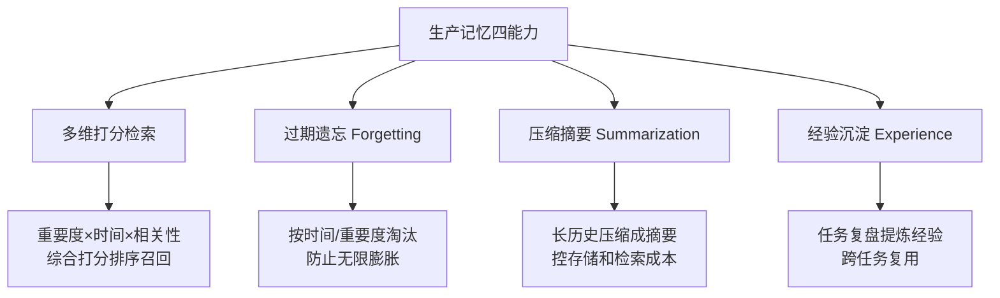
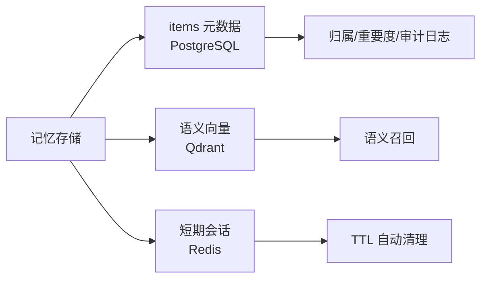

# 阶段五 · 小点 3：记忆系统优化

> 所属：阶段五 进阶技术：能力增强与优化
> 定位：阶段二已经解决了「能存能取」，阶段五把它升级成生产级的四大能力——打分检索、过期遗忘、压缩摘要、经验沉淀，并给出一个可直接运行的记忆类。还讲清了记忆在三类存储里的落地分工。

## 精简大纲

1. 生产记忆四能力：多维打分检索 / 过期遗忘 / 压缩摘要 / 经验沉淀
2. 记忆存储接入（Redis + 向量库 + PG）
3. 经验沉淀钩子
4. 一个可运行的记忆类 Demo

## 学习内容详情

> 核心认知：记忆系统不是「越存越多越好」，而是「存得精、取得到、旧得扔、事上学到经验」。生产记忆 = 检索权重 + 遗忘策略 + 摘要压缩 + 经验复用 四件事一起做。

### 1. 生产记忆四能力（对照阶段二「能存能取」的升级）

#### 1.1 一张图看懂四能力



1. **多维打分检索**：记忆按**重要度 / 时间 / 相关性**等多维打分，检索时综合排序召回高置信记忆。
2. **过期遗忘（Forgetting）**：按时间 / 重要度淘汰过期或低价值记忆，防止记忆库无限膨胀。
3. **压缩摘要**：把长历史记忆压缩成摘要存储，控制存储与检索成本。
4. **经验沉淀**：任务结束后把「哪些做法有效」提炼成经验存为长期记忆，跨任务复用。

> 🔬 **深度理解 · 记忆的遗忘与压缩（记忆生命周期）**：
> 1. **本质**：遗忘与压缩不是"删除功能"，而是"控制信息生命周期"的成本与质量治理——让记忆库不无限膨胀，同时保证高价值、新近、相关的信息仍可被召回。
> 2. **机制**：遗忘按"时间 + 重要度"淘汰（过期且低重要删掉，高重要即使旧也保留）；压缩是把最旧的低价值记忆批量聚合为一条摘要再转存，用"摘要代替原始条目"，从而同时压存储与检索开销。二者配合，能在"留得住的信息"与"存得下的规模"之间取得平衡。
> 3. **为什么重要**：记忆库若只增不减，存储无限膨胀、语义检索噪声上升、召回质量下降、token 成本失控；若只靠原始条目不压缩，长历史会话会拖垮上下文窗口。遗忘与压缩是记忆系统"生产级"与"玩具级"的分界线。
> 4. **易错点**：以为遗忘=永久删除——生产常用"软删除 + 审计"保留回滚与追溯能力；另一误区是压缩时把不同事实强行拼接导致语义污染，摘要要考虑条目标签与重要度权重，避免"压缩后反而更难用"。

### 2. 记忆存储接入（生产架构）



- `items` 存 **PostgreSQL**（元数据：归属 / 重要度 / 审计日志）+ **Qdrant**（语义向量：语义召回）。
- `recall()` 底层换成 **Qdrant 向量相似度检索**；`forget()` 用**定时任务每天跑一次**。
- **Redis** 存短期会话状态（TTL 自动清理）。

> 分工对照：结构化元数据 → PG，语义 → 向量库，短期动态 → Redis（阶段四小点 2 讲过，这里落实到记忆）。

> 🔬 **深度理解 · 短期记忆与长期记忆的分工**：
> 1. **本质**：短期记忆是"正在进行的对话/任务的工作区"，长期记忆是"跨会话可复用的知识底座"——分存不是技术炫技，而是让"时效性"与"持久性"各归其位。
> 2. **机制**：短期用 Redis 这类 KV 存会话消息，靠 TTL 到期自动清理，天然适合"烧完就丢"的对话轮次；长期用向量库（Qdrant）存语义向量，检索靠 `user_id` payload 过滤实现多租户隔离；结构化事实（如用户偏好字段）落在 PG，便于事务化、幂等 upsert 与审计。检索时按"会话上下文 → 语义长期 → 结构化事实"分层召回。
> 3. **为什么重要**：短期记忆单独存能防上下文爆炸、能精准做会话隔离；长期记忆单独存才能跨任务召回经验与偏好，向量化又让"语义相近"而非"字面相同"能被召回——三者缺一个,记忆系统就有明显的功能缺口。
> 4. **易错点**：把"长期记忆"全部堆进上下文窗口（无记忆库）或"短期记忆"不设过期（无限膨胀）；另一个误区是不做多租户隔离，不同用户检索到彼此的记忆——向量库的 payload 过滤（如 `user_id`）是隔离的关键，绝不能在召回后靠"猜"来区分归属。

#### 2.1 Redis：会话短期记忆

```python
# Redis: 短期会话记忆(LPUSH 追加消息 + TTL 到期自动清理, 免定时任务)
import redis, json

r = redis.Redis(host="localhost", port=6379, decode_responses=True)

def save_turn(session_id: str, turn: dict, ttl: int = 3600):
    """追加一条会话消息, 并给整个会话续期(TTL 秒后整段自动清掉)"""
    key = f"session:{session_id}"
    r.lpush(key, json.dumps(turn, ensure_ascii=False))  # LPUSH: 消息追加进列表(新的在前)
    r.expire(key, ttl)                                  # 等价 SET key value EX ttl 的过期语义
    # 简单键值状态也可: r.set(f"state:{session_id}", val, ex=ttl)

def load_history(session_id: str, last: int = 20) -> list:
    """只取最近 last 条拼上下文(防上下文爆炸), 倒回时间正序"""
    msgs = [json.loads(x) for x in r.lrange(f"session:{session_id}", 0, last - 1)]
    return list(reversed(msgs))
```

> ⏳ **短期可不深究**：Redis 的具体命令细节（LPUSH / EXPIRE / LRANGE 的语义）第一遍不必背，记住"短期会话靠 TTL 到期自动清理、只取最近 N 条防上下文爆炸"这两个结论即可，真用到再查文档。

#### 2.2 Qdrant：语义长期记忆

```python
# Qdrant: 语义长期记忆(upsert 带 user_id payload, 检索时按 user_id 过滤隔离)
import time
from qdrant_client import QdrantClient
from qdrant_client.models import (
    VectorParams, Distance, PointStruct, Filter, FieldCondition, MatchValue,
)

qc = QdrantClient(url="http://localhost:6333")            # 生产实例
qc.create_collection("memories",
                     vectors_config=VectorParams(size=384, distance=Distance.COSINE))

def remember_fact(mem_id: int, user_id: str, text: str, vector: list):
    """长期记忆写入: 语义向量 + user_id/时间戳进 payload"""
    qc.upsert("memories", points=[PointStruct(
        id=mem_id, vector=vector,
        payload={"text": text, "user_id": user_id, "ts": time.time()},
    )])

def recall_about(query_vec: list, user_id: str, top: int = 5):
    """语义召回: 只在该用户自己的记忆里搜(多租户隔离靠 payload 过滤)"""
    return qc.query_points(
        "memories", query=query_vec, limit=top,
        query_filter=Filter(must=[
            FieldCondition(key="user_id", match=MatchValue(value=user_id)),
        ]),
    ).points
```

> ⏳ **短期可不深究**：Qdrant 的 payload 过滤 / `FieldCondition` 这些向量库调用细节偏底层，第一遍知道"检索时按 `user_id` 过滤做多租户隔离"这个思想即可，具体 API 因版本而变，用的时候再按官方文档写。

#### 2.3 PostgreSQL：结构化事实

```python
# PostgreSQL: 结构化事实(同一字段 ON CONFLICT 幂等更新, 不产生重复行)
import psycopg2

pg = psycopg2.connect("dbname=agent user=postgres")
cur = pg.cursor()

def upsert_fact(user_id: str, field: str, value: str):
    """结构化事实写入: user_id+field 唯一, 已存在则更新(如 favorite_color)"""
    cur.execute("""
        INSERT INTO user_facts (user_id, field, value, updated_at)
        VALUES (%s, %s, %s, now())
        ON CONFLICT (user_id, field)          -- 键冲突: 不插新行, 改成更新
        DO UPDATE SET value = EXCLUDED.value, updated_at = now()
    """, (user_id, field, value))
    pg.commit()
```

#### 2.4 记忆冲突处理

同一字段新旧矛盾（用户先说「喜欢红色」，后来又说「其实我更喜欢蓝色」），直接覆盖会丢审计、盲目叠加会前后打架。三板斧：**时间戳最新优先**、**来源置信度加权**（明确陈述 > 推测）、**软删除不物理删**（保留审计）。

```python
def resolve_conflict(old: dict, new: dict) -> dict:
    """冲突三板斧: 新且更可信者胜出, 旧值软删除留审计, 不物理删"""
    WEIGHT = {"explicit": 1.0, "inferred": 0.5}     # 置信度: 明确陈述 > 推测
    if new["ts"] > old["ts"] and WEIGHT[new["source"]] >= WEIGHT[old["source"]]:
        old["deleted"] = True                       # 软删除: 审计/回滚仍可用
        return new
    return old

resolve_conflict({"value": "红色", "ts": 1, "source": "inferred"},   # 闲聊里推测的
                 {"value": "蓝色", "ts": 2, "source": "explicit"})   # 明确说的 -> 蓝色胜出
```

> ⚠️ **敏感信息（密码 / 密钥 / 支付凭证）一律不入记忆库**：写入前用脱敏清单拦截——正则识别 `password / token / api_key / 卡号` 等特征直接丢弃或打码。宁可少记一条，不能把密钥存进会被语义检索召回的库。

### 3. 经验沉淀钩子（Agent 主循环外挂）

- 任务结束时让 LLM 复盘「本次任务哪些做法有效？提炼 1 条经验」，`mem.remember(summary, importance=0.7, kind="exp")` 写入长期记忆。
- 下次相似任务直接召回经验，**避免重复踩坑**。

```python
def experience_hook(mem, task_result: str) -> None:
    """
    经验沉淀钩子: 任务结束后复盘提炼, 写入长期记忆。
    生产里这一步用 LLM 生成总结; 这里用固定规则演示(重要度取 0.7 → 高置信)。
    """
    lesson = f"经验: 【{task_result}】这次的关键做法在 X 环节(复盘自审)"
    mem.remember(text=lesson, importance=0.7, kind="exp")
    print("[经验沉淀] 已写入:", lesson)
```

### 4. 一个可运行的记忆类 Demo

把记忆类从「能存能取」升级为「打分检索 + 遗忘 + 摘要 + 经验」。

```python
import time

class ProductionMemory:
    """生产级记忆: 打分检索 + 过期遗忘 + 压缩摘要 + 经验沉淀"""

    def __init__(self, forget_threshold=5.0):
        self.items = []                    # [{text, importance, ts, kind, hit}]
        self.forget_threshold = forget_threshold

    # ---- 写入 ----
    def remember(self, text: str, importance: float = 0.5, kind: str = "fact"):
        self.items.append({"text": text, "importance": importance,
                           "ts": time.time(), "kind": kind, "hit": 0})

    # ---- 多维打分检索 ----
    def recall(self, query: str, k: int = 3) -> list:
        """
        打分 = 相关性(命中关键词) + 重要度 * 权重 + 时间近因 三合一。
        召回综合分最高的 top-k 条高置信记忆。
        """
        def score(item):
            relevance = 1.0 if query in item["text"] else 0.0
            imp = item["importance"] * 0.5                 # 重要度占 50%
            recency = 1.0 / (1.0 + (time.time() - item["ts"]) / 3600)  # 越近越高
            return relevance * 0.6 + imp + recency * 0.3
        ranked = sorted(self.items, key=score, reverse=True)
        for it in ranked[:k]:
            it["hit"] += 1                                 # 记录命中次数
        return [it["text"] for it in ranked[:k]]

    # ---- 过期遗忘 ----
    def forget(self, max_age_sec: float):
        """按 时间 + 重要度 淘汰: 过期且低重要的删掉, 防止记忆库无限膨胀。
        生产由定时任务每天调用一次; 高重要度即使旧也保留。"""
        now = time.time()
        before = len(self.items)
        self.items = [
            it for it in self.items
            if (now - it["ts"] < max_age_sec) or it["importance"] >= 0.8
        ]
        print(f"[遗忘] 清理 {before - len(self.items)} 条低价值过期记忆")

    # ---- 压缩摘要 ----
    def summarize(self, n: int = 4):
        """把最旧的低价值记忆压缩成一条摘要, 控制存储/检索成本。
        生产用 LLM 生成摘要; 这里演示合并文本。"""
        old_low = sorted(self.items, key=lambda x: x["ts"])[:n]
        if len(old_low) < n:
            return
        summary = "摘要: " + " | ".join(i["text"][:20] for i in old_low)
        self.items = self.items[n:] + [
            {"text": summary, "importance": 0.4, "ts": time.time(),
             "kind": "summary", "hit": 0}]
        print(f"[压缩] {n} 条旧记忆 → 1 条摘要")

    # ---- 经验沉淀 ----
    def recall_experience(self, query: str) -> str:
        """只召回 kind == 'exp' 的经验类记忆, 用于任务复用"""
        exps = [i["text"] for i in self.items if i["kind"] == "exp"]
        matches = [e for e in exps if query in e]
        return matches[0] if matches else "暂无相关经验"


# ---------- 使用示例 ----------
mem = ProductionMemory()
mem.remember("用户偏好: 喜欢简洁回答", importance=0.6)
mem.remember("报销流程: 需附发票", importance=0.2, kind="fact")
mem.remember("本次复用: 数据清洗前先做缺失值探查", importance=0.7, kind="exp")
experience_hook(mem, "季度报表")        # 沉淀一条经验
print("召回(相关):", mem.recall("报销", k=2))
print("经验:", mem.recall_experience("清洗"))
mem.forget(max_age_sec=5.0)             # 模拟: 时间久了自动淘汰低价值
```

## 本节自检

- [ ] 能实现带打分检索 + 遗忘 + 摘要 + 经验沉淀的记忆类
- [ ] 能说清 Redis / 向量库 / PG 在记忆系统中的分工
- [ ] 能写出经验沉淀钩子并在 Agent 主循环里挂上

## 本节常见面试题（深度解析）

> 针对本节核心知识的面试高频点，配合"本质+机制"式理解，能让你答得既有深度又有广度。

### 面试题 1：短期记忆和长期记忆为什么要分开存储？各自用怎样的技术、如何衔接？
- **面试官想考察**：是否理解"时效性 vs 持久性"这个记忆分类的本质，而不只是罗列组件。
- **专业作答（含深度）**：
  - 短期记忆是"当前对话/任务的工作区"，讲究时效与易清，用 Redis 存会话消息、TTL 自动过期、只取最近 N 条防上下文爆炸。
  - 长期记忆是"跨会话可复用的知识底座"，讲究持久与可检索，用向量库（Qdrant）存语义向量（`user_id` payload 过滤做多租户隔离）；结构化偏好则落 PG 做幂等 upsert 与审计。
  - 衔接：检索时分层召回——先会话上下文，再语义长期，再结构化事实；写入时短期可滚动升级为长期（如重要事实晋升到向量库）。
  - 边界：长期记忆不等于全量上下文，语义检索召回的是"相近"而非"字面相同"的子集。
- **加分亮点 / 深度追问**：可主动提"分层检索"与"写路径升级"，追问常是"如何保证不同用户不读到彼此记忆"——答：检索阶段用向量库的 metadata/payload 过滤，而绝不在召回后靠猜测区分归属。

### 面试题 2：为什么记忆库会"无限膨胀"？遗忘与压缩是怎么控制它的？
- **面试官想考察**：是否理解"记忆增删"之间要做的成本与质量权衡，并清楚软删除与硬删除的区别。
- **专业作答（含深度）**：
  - 膨胀危害：存储上涨、语义检索噪声上升、召回质量下降、token 成本失控、历史压垮上下文。
  - 遗忘：按"时间 + 重要度"淘汰——过期且低重要删掉，高重要即使旧也保留，优先做"质量过滤"。
  - 压缩：把最旧的低价值条目聚合为一条摘要转存，用摘要代替原文，同时压存储与检索、替长历史瘦身。
  - 软删除：生产不物理删，保留审计与回滚；兼顾合规与可追溯。
- **加分亮点 / 深度追问**：可主动点出"遗忘是质量治理、压缩是规模治理、二者互补"，追问常是"压缩会不会破坏信息"——答：可能引入语义污染，所以摘要要带重要度与标签、合并需谨慎，避免"压完反而更难用"。

### 面试题 3：向量记忆怎么做多租户隔离？同一条事实更新时如何避免数据打架？
- **面试官想考察**：是否真懂向量库的隔离手段与记忆写入的冲突处理，而非只会在内存里 `append`。
- **专业作答（含深度）**：
  - 多租户隔离：写入时把 `user_id` 等归属信息放进向量点的 payload，检索时用 payload 过滤生成"只含该用户"的候选集再排序，避免跨用户串扰。
  - 冲突处理三件套：时间戳最新者优先、来源置信度加权（明确陈述 > 推测）、软删除不物理删（保留审计）；PG 侧用 `ON CONFLICT ... DO UPDATE` 做幂等 upsert。
  - 敏感防泄漏：密码 / 密钥 / 卡号等不进记忆库，写前用脱敏清单拦截——语义召回库绝不藏密钥。
- **加分亮点 / 深度追问**：可主动提出"隔离放在检索阶段（filter）而不放在召回后"以及"向量语义召回风险（可能召回相似但敏感的内容）"，追问常是"攻击者逆向会不会拿到别的用户记忆"——答：隔离靠元数据过滤 + 服务端鉴权，而不靠向量不可读。