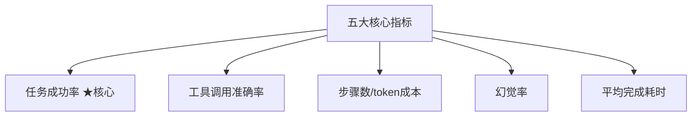
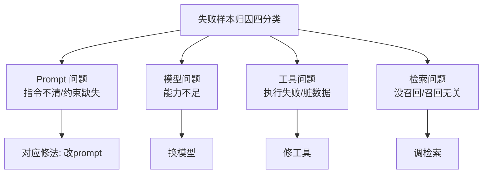
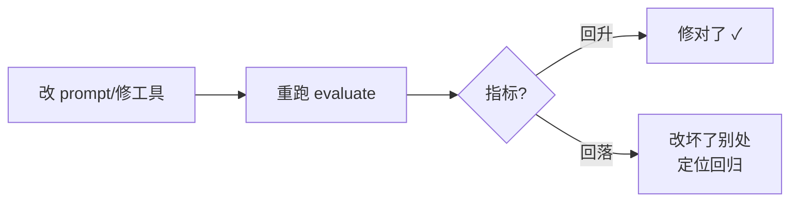

# 阶段五 · 小点 4：Agent 评估与评测

> 所属：阶段五 进阶技术：能力增强与优化
> 定位：怎么证明你的 Agent 「变好了」？评估是 Agent 工程的「回归测试」——没有评测集，改 prompt / 换模型全靠玄学。这一讲讲清五大指标、公开/自建评测集的取舍、LLM-as-judge 三原则，以及让 Agent 持续变好的 Bad-case 迭代闭环。

## 精简大纲

1. 五大核心指标
2. 公开 Benchmark vs 自建业务评测集
3. LLM-as-judge（模型当裁判）三原则
4. Bad-case 四分类与迭代闭环
5. 一个可运行的 evaluate 骨架

## 学习内容详情

> 原则：公开 Benchmark 只做选型参考；**业务效果必须用自己的评测集说话**。

### 1. 五大核心指标



1. **任务成功率**：评测集里「完整达成用户意图」的占比——最核心指标。
2. **工具调用准确率**：该调的调了 + 不该调的没调（闲聊触发检索也算错——过度调用浪费 token 且拖慢响应）。
3. **步骤数量 / token 成本**：完成任务用了几轮循环、烧了多少 token；同等成功率下步骤越少越优秀——**无限循环的 Agent 就是被这个指标暴露的**。
4. **幻觉率**：回答中「编造事实」的比例，靠 LLM 裁判 + 人工抽检结合评估。
5. **平均完成耗时**：延迟体感指标。

> 🔬 **深度理解 · Agent 评估指标体系（成功率 / 工具准确率 vs 静态 Benchmark）**：
> 1. **本质**：Agent 评估不是"答对了没"，而是把「意图达成 + 工具行为 + 效率 + 真实性 + 时延」多维拆成可在固定用例集上重复计算的量化指标，充当工程上的"回归测试"。
> 2. **机制**：任务成功率统计完整达成用户意图的比例（核心）；工具调用准确率同时惩罚"该调没调"与"不该调却调"（如闲聊触发检索、浪费 token）；步骤数 / token 成本暴露无限循环；幻觉率量化编造；平均耗时体现延迟体感。它们常需结合 LLM 裁判与人工抽检共同计算。
> 3. **为什么重要**：没有评测集，改 prompt / 换模型全靠玄学；有了它，任何改动都能用"指标是否回升/回落"客观验证，从而建立持续迭代闭环。MMLU-Pro / HumanEval 这类静态知识 / 代码题只衡量"知识 / 代码正确性（如 pass@k）"，测不出"会用工具、会多步推理、不无限循环"的 Agent 能力——所以只做选型参考，业务评估必须用自建回归集。
> 4. **易错点**：把"答案对了"当成"任务成功了"——忽视了工具调用是否恰当与是否控制成本；另一个误区是只做一次性评估，不把失败样本固化成回归集，导致改 prompt 修好一例又弄坏别的。

### 2. 公开 Benchmark vs 自建业务评测集

| 维度 | 公开 Benchmark | 自建业务评测集 |
|-|-|-|
| 例子 | AgentBench / GAIA / MMLU-Pro / HumanEval | 你的真实业务问题整理成固定用例 |
| 作用 | 选模型时横向参考 | Agent 的「回归测试」 |
| 局限 | 题目 ≠ 你的业务 | 需要花时间维护 |

四个主流公开 Benchmark 各自考什么（评测维度对照）：

| Benchmark | 评测维度 |
|-|-|
| **AgentBench** | 多环境工具使用综合（办公 / 游戏 / 数据库等多环境下的工具调用能力） |
| **GAIA** | 通用助手多步推理（多步推理 + 工具 + 检索的通用助手能力） |
| **MMLU-Pro** | 知识问答加强版（更难、干扰项更多的知识选择题） |
| **HumanEval** | 代码生成（函数级代码正确性，pass@k） |

- **自建业务评测集**：把真实业务问题整理成固定用例集：**输入 + 期望要点**（该调什么工具、答案含什么关键词、来源是什么）。每次改 prompt / 换模型后重跑——这就是 Agent 的「回归测试」。

```python
# 自建评测集示例: 每条用例 = 输入 + 期望要点
EVAL_CASES = [
    {"input": "北京明天天气如何？",
     "expect": {"tool": "get_weather", "keyword": ["北京"]}},       # 应调天气工具
    {"input": "你好",
     "expect": {"tool": None, "keyword": []}},                       # 闲聊不应调工具
    {"input": "报销流程是什么？",
     "expect": {"tool": "kb_search", "keyword": ["报销", "发票"]}},
]
```

> ⏳ **短期可不深究**：MMLU-Pro / HumanEval（含 pass@k）这类公开 Benchmark 的评测协议细节（如何出题、如何计 pass@k）只用于选型参考，第一遍不必深究；业务评估的重心是把自己场景的用例固化成回归集，静态评测协议用到再看。

### 3. LLM-as-judge 三原则

> LLM 当裁判省人工，但会错。三条铁律缺一不可。

1. **裁判模型要比被测模型强**（否则判不准）。
2. **评分标准与输出格式必须固定**（否则结果不可比）。
3. **抽 10% 人工复核**（裁判自己也会幻觉）。

```python
JUDGE_PROMPT = """你是评测裁判。请仅依据给定标准判断回答是否达成用户意图。
评分标准(必须返回 JSON): {{"success": true/false, "reason": "..."}}
用例来源必须存在, 编造内容判 false。
作答:{answer}"""

def judge_success(answer: str, keyword: list) -> bool:
    """简化裁判: 检查期望关键词是否出现。生产用 LLM 裁判 + 人工抽检。"""
    return all(k in answer for k in keyword)
```

> 🔬 **深度理解 · LLM-as-judge 机制与偏差**：
> 1. **本质**：用更强的模型作为"裁判"来替代部分人工判分，本质是把"评估"本身也模型化——它带来了规模化，但把模型自身的偏差也引入了评估链路。
> 2. **机制**：规定好评分标准与输出格式（常为固定 JSON schema），给裁判被测样本，让其按标准返回 score/reason；为对抗裁判幻觉与偏好，抽样（如 10%）人工复核兜底。它的可靠性受限于裁判模型能力、提示稳定性和个人偏好 / 顺序偏好（position bias）。
> 3. **为什么重要**：人工判分慢且贵，LLM-as-judge 让"改 prompt → 重跑 → 自动打分"的迭代闭环可以规模化地天天跑；它缓解了"没有人工就打不了分"的瓶颈。
> 4. **易错点**：裁判模型不比被测模型强时判不准；评分标准不固定则结果不可比；不抽人工复核则裁判自己的幻觉会悄悄变成系统性误判。还要警惕位置偏差（先出现的答案更容易被选）与格式敏感——这也是为什么"裁判更强 + 模板固定 + 人工抽检"三条铁律缺一不可。

### 4. Bad-case 四分类与迭代闭环



- 失败样本归因四类：**prompt 问题**（指令不清 / 约束缺失）、**模型问题**（能力不足）、**工具问题**（执行失败 / 返回脏数据）、**检索问题**（没召回 / 召回了无关内容）。
- **分类决定修法**：改 prompt / 换模型 / 修工具 / 调检索——**别用改 prompt 去治工具的病**。
- **迭代闭环**：改 prompt / 修工具 → 重跑 evaluate → 指标回升 = 修对了；指标回落 = 改坏了别处（回归测试防「按下葫芦浮起瓢」）。



### 5. 一个可运行的 evaluate 骨架

把上述指标落到代码，跑了就能得到一份「Agent 健康报告」。

```python
import time

class Evaluator:
    """对一批评测用例跑 Agent, 统计五大指标"""
    def __init__(self, cases: list, agent_call):
        self.cases, self.agent_call = cases, agent_call

    def run(self) -> dict:
        succ = ok_tool = steps = hal = lat = 0
        for c in self.cases:
            t0 = time.time()
            result = self.agent_call(c["input"] or "")   # → (answer, used_tool, n_steps)
            lat += time.time() - t0
            answer, used_tool, n_steps = result
            # ① 任务成功率: 期望关键词都命中
            if c["expect"].get("keyword", []) and \
               all(k in answer for k in c["expect"]["keyword"]):
                succ += 1
            # ② 工具调用准确率: 该调的调了/不该调的没调
            if used_tool == c["expect"].get("tool"):
                ok_tool += 1
            steps += n_steps                             # ③ 步骤数(越低越好)
            if "编造" in answer:                          # ④ 简化幻觉计数
                hal += 1
        n = len(self.cases)
        return {
            "任务成功率": round(succ / n, 3),
            "工具调用准确率": round(ok_tool / n, 3),
            "平均步骤数": round(steps / n, 2),            # ③ 无限循环在此暴露
            "幻觉率": round(hal / n, 3),
            "平均耗时(s)": round(lat / n, 3),             # ⑤ 延迟体感
        }

# 用法: ev = Evaluator(EVAL_CASES, my_agent.run); print(ev.run())
```

### 6. 评估工具链落地（LangSmith / Ragas / Langfuse）

自建 evaluate 骨架解决「有没有」，工具链解决「效率与规模化」——trace 全链路可视化、评估结果面板化、团队共享同一套回归集。

#### 6.1 LangSmith：LangChain 生态的追踪 + 评估平台

- **trace 全链路**：Agent 每一步的输入输出（LLM 调用 / 工具执行 / 检索）全记录——bad-case 定位从「翻日志」变成「点开看」；
- **数据集管理**：评测用例云端版本化，团队共享同一套回归集；
- **LLM-as-judge 评估器**：内置裁判评估器，跑完自动打分（对照上文三原则）；
- **生产监控**：线上延迟 / token 消耗 / 失败率实时看板。

```bash
# 最小接入: 装包 + 两个环境变量, LangChain/LangGraph 的调用自动上报
pip install langsmith
export LANGSMITH_TRACING=true
export LANGSMITH_API_KEY=...
```

```python
from langsmith import Client

client = Client()
client.create_dataset(dataset_name="kb-qa-regression")   # 建评测数据集(用例可逐条加)
# 跑评估: 指定数据集 + 被测对象 + 评估器, 结果直接进面板
client.run_on_dataset(
    dataset_name="kb-qa-regression",
    llm_or_chain_factory=my_agent,        # 被测的 Agent/链
    evaluation=my_judge_evaluator,        # LLM-as-judge 或自定义评估器
)
```

> ⏳ **短期可不深究**：LangSmith / Langfuse 这类工具链的云端接入细节（环境变量、API Key、`run_on_dataset` 参数）第一遍知道"装包 + 配环境变量即可自动上报"就行，具体接入跟着官方文档走即可，不必背参数。

#### 6.2 Ragas：RAG 专用评估库

RAG 效果光看「答案对不对」不够，还要拆开看「检索质量」——Ragas 的四个核心指标把锅分清楚：

- **faithfulness（忠实度）**：答案是否只基于检索内容、不夹带私货——幻觉率的量化版；
- **answer_relevancy（答案相关性）**：答案是否切题；
- **context_precision / context_recall（检索质量）**：召回的片段里多少真有用 / 该召回的召回了多少——直接定位「是检索的锅还是生成的锅」。

> ⚠️ **版本提示**：以下示例对应 Ragas **≤0.1.x 的旧式声明式 API**（`from ragas.metrics import faithfulness`）。Ragas 0.4+ 已把指标重构为**类式 API**（如 `AnswerRelevancy` / `ResponseRelevancy` 等类及对应 `Input/Output`），导入路径与指标名有所变化。实际使用时请按所装版本，以官方迁移文档为准：https://docs.ragas.io/en/stable/howtos/migrations/migrate_from_v0_to_v1/

```python
# pip install ragas
from ragas import evaluate
from ragas.dataset_schema import EvaluationDataset
from ragas.metrics import (
    faithfulness, answer_relevancy, context_precision, context_recall,
)

ds = EvaluationDataset.from_list([{
    "user_input": "报销流程是什么?",
    "retrieved_contexts": ["报销需附发票, 三个工作日内提交..."],  # 检索到的片段
    "response": "报销需附发票, 三个工作日内提交审批。",           # Agent 的答案
}])
report = evaluate(dataset=ds,
                  metrics=[faithfulness, answer_relevancy,
                           context_precision, context_recall])
```

> ⏳ **短期可不深究**：Ragas 的具体导入路径与指标名因版本迭代变化较快（本文已提示 0.4+ 改为类式 API），第一遍只需理解"忠实度 / 相关性 / 检索质量"这四个维度分别说什么，写代码时按所装版本的官方迁移文档来即可，不必死记 API。

> 🔬 **深度理解 · Ragas 与检索指标（RAG 评估为什么不能只看答案）**：
> 1. **本质**：Ragas 把 RAG 的"答案"和"检索"拆成两个可分开定位的环节，用专门指标回答"锅到底在生成层还是检索层"，避免"答案不对"这种笼统结论掩盖真实病灶。
> 2. **机制**：faithfulness（忠实度）度量答案是否只基于检索到的上下文、不夹带私货——即"幻觉率的量化版"；answer_relevancy 度量答案是否切题；context_precision 度量召回的片段中有多少真有用（检出有用达标），context_recall 度量该召回的到底召回了没有（尽量不漏）。四者结合定位"是检索的锅还是生成的锅"。
> 3. **为什么重要**：光看"答案对不对"，检索召回空洞但生成能猜、或检索丰富但生成瞎编，都无法归因；拆开这些指标才能对症修——context_precision/recall 低去调检索，faithfulness 低去约束生成。
> 4. **易错点**：把"忠实度"当成"正确率"（它只管"是否忠于检索内容"，不保证这个内容本身对）；只报一个总指标会掩盖检索与生成的问题叠加；用旧版 API 与新库混装会直接报错或结果不可比——先明确所装版本再选指标。

与 LangSmith 集成后，Ragas 的评估结果直接挂到 trace 面板上——检索质量与生成质量在同一视图对齐。

#### 6.3 Langfuse：开源可自托管替代

- 与 LangSmith 同类（trace + 评估 + 监控），但**开源自托管**、OTLP 协议接入，数据不出内网；
- 对**数据合规敏感的团队**（金融 / 医疗 / 政企）首选——LangSmith 是 SaaS，trace 里难免携带业务数据。

#### 6.4 三者定位对比

| 工具 | 定位 | 一句话取舍 |
|-|-|-|
| **LangSmith** | LangChain 生态绑定最深 | 追踪 + 评估 + 监控开箱即用，上手最快 |
| **Ragas** | RAG 指标专精 | 只管评估不记 trace，与前两者配合使用 |
| **Langfuse** | 开源可自托管 | 数据合规敏感团队首选，代价是自运维 |

> ⚠️ **先自建小评测集跑通闭环，再接工具链放大效率**：工具链是放大器不是替代品——评测集才是评估的根，没有它，面板再漂亮也只是「看戏更清楚」；有了它，工具链让回归跑得更快、看得更清。

## 本节自检

- [ ] 能构建包含 3 个以上业务用例的评测集并跑出五大指标
- [ ] 能对失败样本完成四分类归因并给出对应修法
- [ ] 能说清 LLM-as-judge 三原则并演示一个 evaluate 骨架

## 本节常见面试题（深度解析）

> 针对本节核心知识的面试高频点，配合"本质+机制"式理解，能让你答得既有深度又有广度。

### 面试题 1：怎么给一个 Agent 做量化评估？五大指标各自衡量什么、为什么"任务成功率"不能单看"答案对没对"？
- **面试官想考察**：是否能从"意图 + 工具行为 + 效率 + 真实性 + 时延"多维建模评估，而不只懂"答得对不对"。
- **专业作答（含深度）**：
  - 任务成功率：完整达成用户意图的占比，是核心但非全部。
  - 工具调用准确率：同时惩罚"该调没调"与"不该调却调"（闲聊触发检索也计入错误，白烧 token 拖慢响应）。
  - 步骤数 / token 成本：同等成功率下越少越优，专门暴露无限循环。
  - 幻觉率：靠 LLM 裁判 + 人工抽检量化编造；平均耗时管延迟体感。
  - 为什么要综合：答案对但多绕了几圈、或答案对却乱调工具，单看成功率完全发现不了；且静态 Benchmark（MMLU-Pro/HumanEval）只测知识与代码正确性，测不出会用工具、不绕圈的能力，所以业务必须用自建回归集。
- **加分亮点 / 深度追问**：可主动点出"工具调用准确率防的是过度调用/误调用"，追问常是"怎么自动判断工具该不该调"——答：用用例里预置的 `expect.tool` 期望值与实际调用比对，本质上是行为级校验。

### 面试题 2：LLM-as-judge 有哪些天然缺陷？三条铁律分别解决什么问题？
- **面试官想考察**：是否知道"裁判也是模型"这个前提，并理解偏差与校准手段，而不只是把三原则背下来。
- **专业作答（含深度）**：
  - 裁判模型本身会幻觉、有偏好与位置偏差（position bias），且其强弱点会传导为评估偏差。
  - 三条铁律：① 裁判比被测强——弱裁判判不准强的答案；② 评分标准与输出格式固定——否则结果不可比、无法回归；③ 抽 10% 人工复核——兜住裁判的系统性幻觉与偏好。
  - 额外注意：固定 JSON schema 可抵御格式漂移；必要时用多个裁判交叉或引入人工锚点校准。
- **加分亮点 / 深度追问**：可主动提"位置偏差"这类细颗粒风险，追问常是"裁判评测结果和人工不一致怎么办"——答：不一致即信号，用于校准/修正评估维度，而不是默认裁判对。

### 面试题 3：RAG 评估为什么不能只看"答案对不对"？faithfulness 与 context_precision/recall 各自定位什么？
- **面试官想考察**：是否理解"生成层"与"检索层"要分开归因，Ragas 四个指标分别解决什么问题。
- **专业作答（含深度）**：
  - 只对答案打分，检索空洞但生成能猜、或检索丰富但生成瞎编，都无法定位是谁的锅。
  - faithfulness（忠实度）：答案是否只基于检索上下文、不夹带私货——幻觉率的量化版，属于"生成层"。
  - answer_relevancy：答案是否切题。
  - context_precision：召回的片段有多少真有用；context_recall：该召回的召回没有——这两者属"检索层"。
  - 对症下药：precision/recall 低去调检索（切分、embedding、top-k），faithfulness 低去约束生成。
- **加分亮点 / 深度追问**：可主动指出"忠实度高 ≠ 答案正确"（只证明没编造，不保证检索内容本身对），追问常是"想同时查检索和生成，怎么集成"——答：Ragas 出指标、LangSmith 挂 trace，检索质量与生成质量在同一视图对齐。