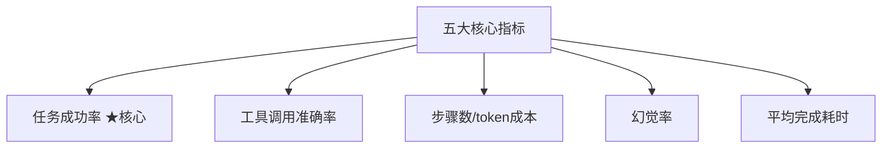
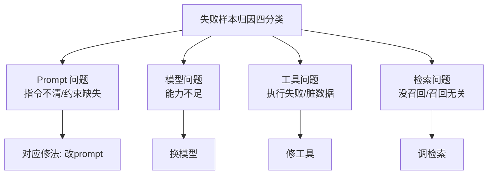
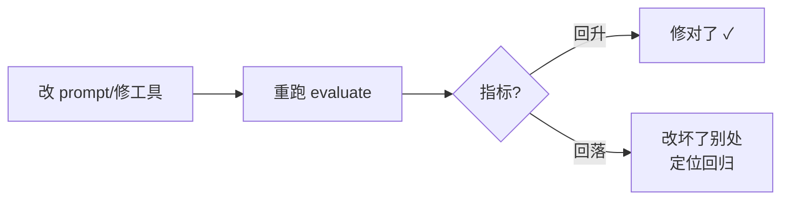

# 阶段五 · 小点 4：Agent 评估与评测

> 所属：阶段五 进阶技术：能力增强与优化
> 定位：怎么证明你的 Agent 「变好了」？评估是 Agent 工程的「回归测试」——没有评测集，改 prompt / 换模型全靠玄学。这一讲讲清五大指标、公开/自建评测集的取舍、LLM-as-judge 三原则，以及让 Agent 持续变好的 Bad-case 迭代闭环。

## 精简大纲

1. 五大核心指标
2. 公开 Benchmark vs 自建业务评测集
3. LLM-as-judge（模型当裁判）三原则
4. Bad-case 四分类与迭代闭环
5. 一个可运行的 evaluate 骨架

## 学习内容详情

> 原则：公开 Benchmark 只做选型参考；**业务效果必须用自己的评测集说话**。

### 1. 五大核心指标



1. **任务成功率**：评测集里「完整达成用户意图」的占比——最核心指标。
2. **工具调用准确率**：该调的调了 + 不该调的没调（闲聊触发检索也算错——过度调用浪费 token 且拖慢响应）。
3. **步骤数量 / token 成本**：完成任务用了几轮循环、烧了多少 token；同等成功率下步骤越少越优秀——**无限循环的 Agent 就是被这个指标暴露的**。
4. **幻觉率**：回答中「编造事实」的比例，靠 LLM 裁判 + 人工抽检结合评估。
5. **平均完成耗时**：延迟体感指标。

### 2. 公开 Benchmark vs 自建评测集

| 维度 | 公开 Benchmark | 自建业务评测集 |
|-|-|-|
| 例子 | AgentBench / GAIA / MMLU-Pro / HumanEval | 你的真实业务问题整理成固定用例 |
| 作用 | 选模型时横向参考 | Agent 的「回归测试」 |
| 局限 | 题目 ≠ 你的业务 | 需要花时间维护 |

四个主流公开 Benchmark 各自考什么（评测维度对照）：

| Benchmark | 评测维度 |
|-|-|
| **AgentBench** | 多环境工具使用综合（办公 / 游戏 / 数据库等多环境下的工具调用能力） |
| **GAIA** | 通用助手多步推理（多步推理 + 工具 + 检索的通用助手能力） |
| **MMLU-Pro** | 知识问答加强版（更难、干扰项更多的知识选择题） |
| **HumanEval** | 代码生成（函数级代码正确性，pass@k） |

- **自建业务评测集**：把真实业务问题整理成固定用例集：**输入 + 期望要点**（该调什么工具、答案含什么关键词、来源是什么）。每次改 prompt / 换模型后重跑——这就是 Agent 的「回归测试」。

```python
# 自建评测集示例: 每条用例 = 输入 + 期望要点
EVAL_CASES = [
    {"input": "北京明天天气如何？",
     "expect": {"tool": "get_weather", "keyword": ["北京"]}},       # 应调天气工具
    {"input": "你好",
     "expect": {"tool": None, "keyword": []}},                       # 闲聊不应调工具
    {"input": "报销流程是什么？",
     "expect": {"tool": "kb_search", "keyword": ["报销", "发票"]}},
]
```

### 3. LLM-as-judge 三原则

> LLM 当裁判省人工，但会错。三条铁律缺一不可。

1. **裁判模型要比被测模型强**（否则判不准）。
2. **评分标准与输出格式必须固定**（否则结果不可比）。
3. **抽 10% 人工复核**（裁判自己也会幻觉）。

```python
JUDGE_PROMPT = """你是评测裁判。请仅依据给定标准判断回答是否达成用户意图。
评分标准(必须返回 JSON): {{"success": true/false, "reason": "..."}}
用例来源必须存在, 编造内容判 false。
作答:{answer}"""

def judge_success(answer: str, keyword: list) -> bool:
    """简化裁判: 检查期望关键词是否出现。生产用 LLM 裁判 + 人工抽检。"""
    return all(k in answer for k in keyword)
```

### 4. Bad-case 四分类与迭代闭环



- 失败样本归因四类：**prompt 问题**（指令不清 / 约束缺失）、**模型问题**（能力不足）、**工具问题**（执行失败 / 返回脏数据）、**检索问题**（没召回 / 召回了无关内容）。
- **分类决定修法**：改 prompt / 换模型 / 修工具 / 调检索——**别用改 prompt 去治工具的病**。
- **迭代闭环**：改 prompt / 修工具 → 重跑 evaluate → 指标回升 = 修对了；指标回落 = 改坏了别处（回归测试防「按下葫芦浮起瓢」）。



### 5. 一个可运行的 evaluate 骨架

把上述指标落到代码，跑了就能得到一份「Agent 健康报告」。

```python
import time

class Evaluator:
    """对一批评测用例跑 Agent, 统计五大指标"""
    def __init__(self, cases: list, agent_call):
        self.cases, self.agent_call = cases, agent_call

    def run(self) -> dict:
        succ = ok_tool = steps = hal = lat = 0
        for c in self.cases:
            t0 = time.time()
            result = self.agent_call(c["input"] or "")   # → (answer, used_tool, n_steps)
            lat += time.time() - t0
            answer, used_tool, n_steps = result
            # ① 任务成功率: 期望关键词都命中
            if c["expect"].get("keyword", []) and \
               all(k in answer for k in c["expect"]["keyword"]):
                succ += 1
            # ② 工具调用准确率: 该调的调了/不该调的没调
            if used_tool == c["expect"].get("tool"):
                ok_tool += 1
            steps += n_steps                             # ③ 步骤数(越低越好)
            if "编造" in answer:                          # ④ 简化幻觉计数
                hal += 1
        n = len(self.cases)
        return {
            "任务成功率": round(succ / n, 3),
            "工具调用准确率": round(ok_tool / n, 3),
            "平均步骤数": round(steps / n, 2),            # ③ 无限循环在此暴露
            "幻觉率": round(hal / n, 3),
            "平均耗时(s)": round(lat / n, 3),             # ⑤ 延迟体感
        }

# 用法: ev = Evaluator(EVAL_CASES, my_agent.run); print(ev.run())
```

### 6. 评估工具链落地（LangSmith / Ragas / Langfuse）

自建 evaluate 骨架解决「有没有」，工具链解决「效率与规模化」——trace 全链路可视化、评估结果面板化、团队共享同一套回归集。

#### 6.1 LangSmith：LangChain 生态的追踪 + 评估平台

- **trace 全链路**：Agent 每一步的输入输出（LLM 调用 / 工具执行 / 检索）全记录——bad-case 定位从「翻日志」变成「点开看」；
- **数据集管理**：评测用例云端版本化，团队共享同一套回归集；
- **LLM-as-judge 评估器**：内置裁判评估器，跑完自动打分（对照上文三原则）；
- **生产监控**：线上延迟 / token 消耗 / 失败率实时看板。

```bash
# 最小接入: 装包 + 两个环境变量, LangChain/LangGraph 的调用自动上报
pip install langsmith
export LANGSMITH_TRACING=true
export LANGSMITH_API_KEY=...
```

```python
from langsmith import Client

client = Client()
client.create_dataset(dataset_name="kb-qa-regression")   # 建评测数据集(用例可逐条加)
# 跑评估: 指定数据集 + 被测对象 + 评估器, 结果直接进面板
client.run_on_dataset(
    dataset_name="kb-qa-regression",
    llm_or_chain_factory=my_agent,        # 被测的 Agent/链
    evaluation=my_judge_evaluator,        # LLM-as-judge 或自定义评估器
)
```

#### 6.2 Ragas：RAG 专用评估库

RAG 效果光看「答案对不对」不够，还要拆开看「检索质量」——Ragas 的四个核心指标把锅分清楚：

- **faithfulness（忠实度）**：答案是否只基于检索内容、不夹带私货——幻觉率的量化版；
- **answer_relevancy（答案相关性）**：答案是否切题；
- **context_precision / context_recall（检索质量）**：召回的片段里多少真有用 / 该召回的召回了多少——直接定位「是检索的锅还是生成的锅」。

```python
# pip install ragas
from ragas import evaluate
from ragas.dataset_schema import EvaluationDataset
from ragas.metrics import (
    faithfulness, answer_relevancy, context_precision, context_recall,
)

ds = EvaluationDataset.from_list([{
    "user_input": "报销流程是什么?",
    "retrieved_contexts": ["报销需附发票, 三个工作日内提交..."],  # 检索到的片段
    "response": "报销需附发票, 三个工作日内提交审批。",           # Agent 的答案
}])
report = evaluate(dataset=ds,
                  metrics=[faithfulness, answer_relevancy,
                           context_precision, context_recall])
```

与 LangSmith 集成后，Ragas 的评估结果直接挂到 trace 面板上——检索质量与生成质量在同一视图对齐。

#### 6.3 Langfuse：开源可自托管替代

- 与 LangSmith 同类（trace + 评估 + 监控），但**开源自托管**、OTLP 协议接入，数据不出内网；
- 对**数据合规敏感的团队**（金融 / 医疗 / 政企）首选——LangSmith 是 SaaS，trace 里难免携带业务数据。

#### 6.4 三者定位对比

| 工具 | 定位 | 一句话取舍 |
|-|-|-|
| **LangSmith** | LangChain 生态绑定最深 | 追踪 + 评估 + 监控开箱即用，上手最快 |
| **Ragas** | RAG 指标专精 | 只管评估不记 trace，与前两者配合使用 |
| **Langfuse** | 开源可自托管 | 数据合规敏感团队首选，代价是自运维 |

> ⚠️ **先自建小评测集跑通闭环，再接工具链放大效率**：工具链是放大器不是替代品——评测集才是评估的根，没有它，面板再漂亮也只是「看戏更清楚」；有了它，工具链让回归跑得更快、看得更清。

## 本节自检

- [ ] 能构建包含 3 个以上业务用例的评测集并跑出五大指标
- [ ] 能对失败样本完成四分类归因并给出对应修法
- [ ] 能说清 LLM-as-judge 三原则并演示一个 evaluate 骨架