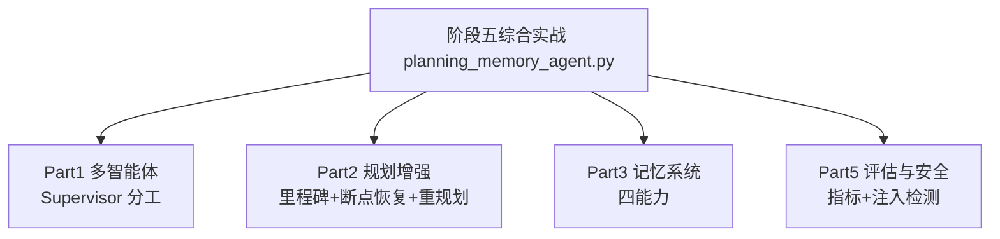

# 阶段五 · 综合实战：带检查点恢复 + 经验沉淀的多智能体工作流 Agent

> 所属：阶段五 进阶技术：能力增强与优化
> 定位：把阶段五五个小点（多智能体 / 规划 / 记忆 / 评估 / 安全）串成一个**离线可运行**的完整 Demo——一个「会分工会恢复、会记经验、能被量化评测、还防注入」的工作流 Agent。

## 一句话看懂本 Demo

`planning_memory_agent.py` 用纯 Python 标准库，把阶段五五大能力组装成一份可运行代码：



## 运行方式

```
python3 code/阶段五/planning_memory_agent.py
```

不需要 API Key、不需要外网、不需要装任何第三方库（只依赖标准库）。

## 完整代码位置

[code/阶段五/planning_memory_agent.py](../../code/阶段五/planning_memory_agent.py)

---

## 每个 Part 在讲什么

### Part 1 · 多智能体 Supervisor（对应小点 1）

分工协作模式：`Supervisor` 主管把目标拆成 `[取数→清洗→写报告]` 三步，派给不同的 `Worker` 工人执行，最后验收汇总——「主管派活，工人干活」。

```python
class Supervisor:
    def __init__(self):
        self.workers = {
            "gather": Worker("取数", lambda t: f"【来自{t}的数据】"),
            "clean":  Worker("清洗", lambda t: f"[已清洗] {t}"),
            "report": Worker("写报告", lambda t: f"《报告·{t}》"),
        }
    def dispatch(self, goal: str) -> dict:
        results = {}
        for step in ["gather", "clean", "report"]:
            results[step] = self.workers[step].run(f"{goal}·{step}")
        return results
```

运行输出里能看到三个工人依次出工，主管最后验收。

### Part 2 · 规划增强（对应小点 2）

`LongTaskManager` 实现生产规划三件套：

| 能力 | 实现 | 演示输出 |
|-|-|-|
| **里程碑状态机** | `pending→running→done/rolled_back` 四态 + 非法迁移拦截 | `[里程碑:清洗] pending → running` |
| **落盘 + 断点恢复** | 状态每步写 JSON，重启先读档 | `[断点恢复] 已完成 1 步, 待办 2 步` |
| **跳过已完成** | 读档后 done 的步骤直接跳过 | `[跳过:取数] 已完成, 不复跑` |
| **动态重规划** | `replan` 钩子：检测到取数回滚就插入补偿步 | `[临时插入] 补偿取数` |

```python
# 模拟崩溃恢复: 先把"取数"标为 done 并落盘, 重启后应跳过它
flow1 = build_workflow(sup, mem)
flow1.state["取数"] = "done"; flow1.save()
flow1.run(replan=replan_hook)   # 从"清洗"继续, 不复跑"取数"
```

### Part 3 · 记忆系统（对应小点 3）

`ProductionMemory` 集成记忆四能力：

- **打分检索** `recall`——相关性 + 重要度 + 时间近因综合打分排 top-k（输出里"报告要简洁"的高重要度记忆被优先召回）。
- **过期遗忘** `forget`——按时间 + 重要度淘汰低价值记忆，防无限膨胀。
- **压缩摘要** `summarize`——把最旧 4 条低价值记忆压成 1 条摘要（输出 `4 条旧记忆 → 1 条摘要`）。
- **经验沉淀** `remember_experience`——写入 `kind="exp"` 的长期经验，`recall_experience` 跨任务复用（输出里"清洗"经验被成功召回）。

### Part 4 · 联动

`build_workflow` 把 Supervisor + 规划 + 记忆组装成一条完整流程：主管派活产出的东西成为各里程碑，长任务可断点恢复，结束后靠经验钩子沉淀"少踩坑"的经验。

### Part 5 · 评估与安全（对应小点 4 / 5）

- **评估** `evaluate`：对评测集跑出五大指标（成功率 0.67 / 工具调用准确率 1.0 / 平均步骤数 2 / 幻觉率 0 / 耗时）。
- **安全回归** `security_regression`：用攻击样例集跑注入检测——两条攻击被拦下（`True`），正常问题放行（`False`），验证三层防御第一层生效。

## 关键输出对照表

| 运行片段 | 输出 | 说明什么 |
|-|-|-|
| Supervisor 派活 | 3 个工人依次执行 | 分工协作模式 |
| 断点恢复 | `已完成 1 步, 待办 2 步` | 状态落盘 + 读档 |
| 跳过已完成 | `[跳过:取数] 不复跑` | 断点续执行 |
| 经验沉淀 + 召回 | 写入 → 成功召回 | 跨任务经验复用 |
| 压缩摘要 | `4 条旧记忆 → 1 条摘要` | 控存储成本 |
| 注入检测 | 攻击 `True`，正常 `False` | 第一层防御生效 |

## 怎么改成「真实生产版」

| 本 Demo | 生产替换 |
|-|-|
| `Worker` 普通函数 | 真实 LLM Agent / 框架封装（LangGraph） |
| `Supervisor` 手写派活 | LangGraph Supervisor / CrewAI |
| JSON 落盘 | LangGraph Checkpointer / DB |
| `ProductionMemory` 内存 | Redis + Qdrant + PG 三存储 |
| 关键词召回 | LLM-as-judge + 向量检索 |

换成真实组件只动内部实现，`flow.run()` / `mem.recall()` 等对外接口不变——这就是**分模块封装**带来的好处。

## 达成标准（对照自检）

- [ ] 能复述 Supervisor 分工模式与麻将的"主管派活"
- [ ] 能讲清里程碑四态 + 断点恢复 + 动态重规划
- [ ] 能说出记忆四能力各自解决什么问题
- [ ] 能跑出五大评估指标并理解回归测试的意义