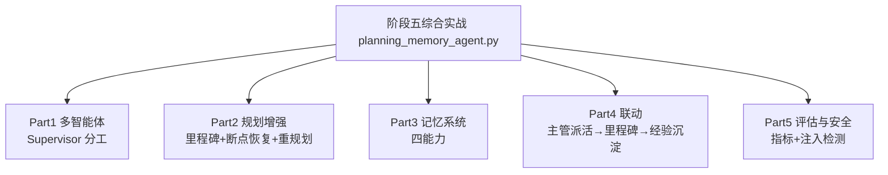

# 阶段五 · 综合实战：带检查点恢复 + 经验沉淀的多智能体工作流 Agent

> 所属：阶段五 进阶技术：能力增强与优化
> 定位：把阶段五五个小点（多智能体 / 规划 / 记忆 / 评估 / 安全）串成一个**离线可运行**的完整 Demo——一个「会分工会恢复、会记经验、能被量化评测、还防注入」的工作流 Agent。

## 一句话看懂本 Demo

`planning_memory_agent.py` 用纯 Python 标准库，把阶段五五大能力组装成一份可运行代码：



## 运行方式

```
python3 code/阶段五/planning_memory_agent.py
```

不需要 API Key、不需要外网、不需要装任何第三方库（只依赖标准库）。

## 完整代码位置

[code/阶段五/planning_memory_agent.py](../../code/阶段五/planning_memory_agent.py)

---

## 每个 Part 在讲什么

### Part 1 · 多智能体 Supervisor（对应小点 1）

分工协作模式：`Supervisor` 主管把目标拆成 `[取数→清洗→写报告]` 三步，派给不同的 `Worker` 工人执行，最后验收汇总——「主管派活，工人干活」。

```python
class Supervisor:
    def __init__(self):
        self.workers = {
            "gather": Worker("取数", lambda t: f"【来自{t}的数据】"),
            "clean":  Worker("清洗", lambda t: f"[已清洗] {t}"),
            "report": Worker("写报告", lambda t: f"《报告·{t}》"),
        }
    def dispatch(self, goal: str) -> dict:
        results = {}
        for step in ["gather", "clean", "report"]:
            results[step] = self.workers[step].run(f"{goal}·{step}")
        return results
```

运行输出里能看到三个工人依次出工，主管最后验收。

### Part 2 · 规划增强（对应小点 2）

`LongTaskManager` 实现生产规划三件套：

| 能力 | 实现 | 演示输出 |
|-|-|-|
| **里程碑状态机** | `pending→running→done/rolled_back` 四态 + 非法迁移拦截 | `[里程碑:清洗] pending → running` |
| **落盘 + 断点恢复** | 状态每步写 JSON，重启先读档 | `[断点恢复] 已完成 1 步, 待办 2 步` |
| **跳过已完成** | 读档后 done 的步骤直接跳过 | `[跳过:取数] 已完成, 不复跑` |
| **动态重规划** | `replan` 钩子：检测到取数回滚就插入补偿步 | 仅当把「取数」重置为 `rolled_back` 时才输出 `[临时插入] 补偿取数`（见下方脚本说明） |

```python
# 模拟崩溃恢复: 先把"取数"标为 done 并落盘, 重启后应跳过它
flow1 = build_workflow(sup, mem)
flow1.state["取数"] = "done"; flow1.save()
flow1.run(replan=replan_hook)   # 从"清洗"继续, 不复跑"取数"
```

> ⏳ **短期可不深究**：Part 2 里手写 JSON 落盘只是为了演示"状态持久化 + 读档续跑"的原理；第一遍不必纠结 `STATE_FILE` 的字段细节，生产直接用 LangGraph Checkpointer/DB 这类框架级落盘即可，道理一致。

### Part 3 · 记忆系统（对应小点 3）

`ProductionMemory` 集成记忆四能力：

- **打分检索** `recall`——相关性 + 重要度 + 时间近因综合打分排 top-k（输出里"报告要简洁"的高重要度记忆被优先召回）。
- **过期遗忘** `forget`——按时间 + 重要度淘汰低价值记忆，防无限膨胀。
- **压缩摘要** `summarize`——把最旧 4 条低价值记忆压成 1 条摘要（输出 `4 条旧记忆 → 1 条摘要`）。
- **经验沉淀** `remember_experience`——写入 `kind="exp"` 的长期经验，`recall_experience` 跨任务复用（输出里"清洗"经验被成功召回）。

### Part 4 · 联动

`build_workflow` 把 Supervisor + 规划 + 记忆组装成一条完整流程：主管派活产出的东西成为各里程碑，长任务可断点恢复，结束后靠经验钩子沉淀"少踩坑"的经验。

> 🔬 **深度理解 · 编排 / 状态 / 记忆的解耦（综合实战的骨架）**：
> 1. **本质**：一个好的工作流 Agent 不是把能力"塞进一个函数"，而是把"谁干活（Supervisor 编排）"、"干到哪了（规划里程碑 / 状态机）"、"记住了什么（记忆库）"三者清晰分离——各管各的职责，再串成闭环。
> 2. **机制**：Supervisor 负责把目标拆成子任务并派活；`LongTaskManager` 用里程碑状态机 + 落盘接管"进度、回滚、断点恢复"，不让编排者操心持久化；`ProductionMemory` 接管"历史与经验"，让 Agent 跨任务有记忆。评估与安全作为横切能力（cross-cutting）在末尾对整体把关。分层后，任一层都能独立替换而不牵连其它层。
> 3. **为什么重要**：若让"编排、进度落盘、记忆召回"耦合在一个类里，动规划就会碰记忆、换存储就要重写编排，无法稳健迭代成生产系统；解耦正是"多智能体 + 长任务 + 记忆"能组合成可靠系统的前提。
> 4. **易错点**：把"状态落盘"和"记忆存储"当成一回事——前者管"当前任务进度"，后者管"跨任务知识"，语义不同、存储也不同；另一个误区是让 Supervisor 直接操作记忆明细，职责混在一起后排查困难。

### Part 5 · 评估与安全（对应小点 4 / 5）

- **评估** `evaluate`：对评测集跑出五大指标（成功率 0.67 / 工具调用准确率 1.0 / 平均步骤数 2 / 幻觉率 0 / 耗时）。
- **安全回归** `security_regression`：用攻击样例集跑注入检测——两条攻击被拦下（`True`），正常问题放行（`False`），验证三层防御第一层生效。

## 关键输出对照表

| 运行片段 | 输出 | 说明什么 |
|-|-|-|
| Supervisor 派活 | 3 个工人依次执行 | 分工协作模式 |
| 断点恢复 | `已完成 1 步, 待办 2 步` | 状态落盘 + 读档 |
| 跳过已完成 | `[跳过:取数] 不复跑` | 断点续执行 |
| 经验沉淀 + 召回 | 写入 → 成功召回 | 跨任务经验复用 |
| 压缩摘要 | `4 条旧记忆 → 1 条摘要` | 控存储成本 |
| 注入检测 | 攻击 `True`，正常 `False` | 第一层防御生效 |

> ⏳ **短期可不深究**：上文"关键输出对照表"里的具体数值（如成功率 0.67、平均步骤 2）只是本 Demo 固定配置下的演示结果；第一遍不必背这些数字，理解"每个片段对应验证了哪个能力"即可，真实指标随你项目的数据而异。

## 怎么改成「真实生产版」

| 本 Demo | 生产替换 |
|-|-|
| `Worker` 普通函数 | 真实 LLM Agent / 框架封装（LangGraph） |
| `Supervisor` 手写派活 | LangGraph Supervisor / CrewAI |
| JSON 落盘 | LangGraph Checkpointer / DB |
| `ProductionMemory` 内存 | Redis + Qdrant + PG 三存储 |
| 关键词召回 | LLM-as-judge + 向量检索 |

换成真实组件只动内部实现，`flow.run()` / `mem.recall()` 等对外接口不变——这就是**分模块封装**带来的好处。

> 🔬 **深度理解 · 分模块封装与接口稳定（从 Demo 到生产的关键）**：
> 1. **本质**：在"稳定的对外接口"与"可变的内层实现"之间画一道契约线——上层只管调用 `flow.run()` / `mem.recall()`，下层怎么实现（手写、LangGraph、DB）对上层透明。
> 2. **机制**：先定义好外部签名与数据形态不变，再把内部替换成真实组件——Worker 换成 LLM Agent、Supervisor 换成框架编排、JSON 落盘换成 Checkpointer/DB、内存记忆换成 Redis + Qdrant + PG、关键词召回换成 LLM-as-judge + 向量检索。只要接口稳定，替换就不侵入调用方。
> 3. **为什么重要**：Demo 追求"离线能跑、只依赖标准库"，生产追求"可扩展、可运维、可监控"；没有接口契约，替换组件时就会改一处炸一片、测试集要重写。分模块封装让能力可以"渐进式生产化"，一小块一小块换而不重构整条链。
> 4. **易错点**：接口定得太"厚"泄漏内部语义（如把每一步的中间态硬编码进对外签名），反而绑死实现；或过早抽象，在能力尚未定型时过度封装造成空转——接口契约要在"稳定需求"与"可变实现"之间拿捏，而非为了封装而封装。

## 达成标准（对照自检）

- [ ] 能复述 Supervisor 分工模式与麻将的"主管派活"
- [ ] 能讲清里程碑四态 + 断点恢复 + 动态重规划
- [ ] 能说出记忆四能力各自解决什么问题
- [ ] 能跑出五大评估指标并理解回归测试的意义

## 本节常见面试题（深度解析）

> 针对本节核心知识的面试高频点，配合"本质+机制"式理解，能让你答得既有深度又有广度。

### 面试题 1：你如何把多智能体、规划、记忆、评估、安全组合进一个工作流 Agent？为什么要分层而不全部塞进一个类？
- **面试官想考察**：是否具备架构感——能不能把五类能力按职责解耦并说明解耦的收益，而不是只会堆代码。
- **专业作答（含深度）**：
  - 分层：Supervisor（编排：谁干活、怎么派活）、LongTaskManager（状态：里程碑 / 回滚 / 断点，管"干到哪"）、ProductionMemory（记忆：打分检索 / 遗忘 / 摘要 / 经验，管"记住了什么"）、评估与安全作为横切能力在末尾交付把关。
  - 组装：主管派活的产出成为各里程碑，长任务可断点恢复，结束后经验钩子沉淀复盘，再统一跑评估与安全回归。
  - 解耦收益：任一层能独立替换而不连带其它层；职责跑偏可单独定位；能力可"渐进式生产化"逐块升级而非重构整链。
- **加分亮点 / 深度追问**：可主动区分"状态落盘（当前任务进度）"与"记忆存储（跨任务知识）"不是一回事，追问常是"这三个类如何互相通信"——答：通过稳定接口传数据形态，如 Supervisor 产出结构进 milestones、经验钩子写回 `kind="exp"` 记忆，互不越权。

### 面试题 2：从这份离线 Demo 到真实生产，哪些组件要换、哪些接口保持不变？分模块封装带来了什么？
- **面试官想考察**：能否看清"接口契约 + 内层实现替换"的工程思维，并识别 Demo 与生产的非技术鸿沟。
- **专业作答（含深度）**：
  - 替换清单：Worker → 真实 LLM Agent；手写 Supervisor → LangGraph Supervisor / CrewAI；JSON 落盘 → LangGraph Checkpointer / DB；内存记忆 → Redis + Qdrant + PG；关键词召回 → LLM-as-judge + 向量检索。
  - 保持不变：`flow.run()` / `mem.recall()` 等对外接口与数据结构，调用方和无痕替换。
  - 非技术差异：Demo 只依赖标准库且离线可跑，生产要多租户、可观测、可监控、权限与合规，接口契约让这些差异被隔离在实现层。
- **加分亮点 / 深度追问**：可主动说"接口是契约、实现是细节"，追问常是"接口设计会不会绑架实现"——答：会，若把中间态硬编码进对外签名就绑死实现，所以契约要"稳定需求"与"可变实现"之间权衡，避免过早抽象。

### 面试题 3：检查点恢复和经验沉淀都是"记住状态"，它们在 Agent 工作流里的角色有何不同？为什么要分开实现？
- **面试官想考察**：是否理解"任务进度"与"跨任务知识"这两类不同"状态"的语义与存储差异。
- **专业作答（含深度）**：
  - 检查点恢复（任务级）：记录"当前这一个任务干到哪一步、哪些里程碑已完成 / 回滚"，目的是崩溃后断点续跑；存的是短生命周期、易失的进度状态，用 JSON/DB/Checkpointer。
  - 经验沉淀（跨任务级）：任务结束后把"哪些做法有效"提炼成 `kind="exp"` 长期经验，供下一次相似任务复用、避免重复踩坑；存的是跨任务持久知识，走记忆库 / 向量召回。
  - 为什么要分开：生命周期不同（一任务的进度 vs 长期经验）、存储不同（进程状态 vs 语义检索库）、作用不同（续跑 vs 复用），合一会导致进度污染长期记忆或经验被进度清理解体。
- **加分亮点 / 深度追问**：可主动区分为"易失状态 vs 持久知识"，追问常是"经验怎么防过期"——答：经验也走记忆的遗忘 / 重要度 / 压缩治理，而不是只写不删。