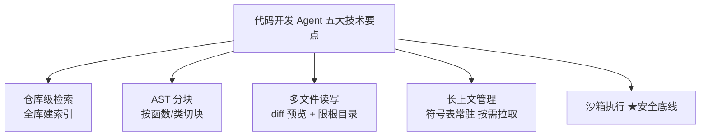
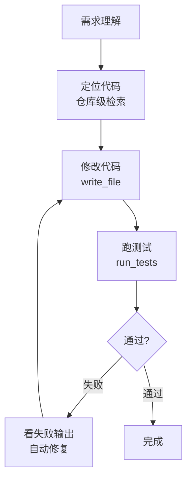

# 阶段六 · 小点 1：代码开发 Agent

> 所属：阶段六 垂直领域 Agent 落地实践
> 定位：这就是 Cursor / Copilot 类工具的底层原理简化版。这一讲把「如何让 Agent 在一个完整代码仓库里定位、理解、修改并验证代码」的技术要点讲透，并给出 Devin 范式的闭环结构与增量改造三步。

## 精简大纲

1. 核心能力：代码生成 / bug 定位修复 / 单测编写 / 项目级代码问答
2. 技术要点：仓库级检索、AST 分块、多文件读写、长上下文管理、沙箱执行
3. Devin 范式：需求 → 定位 → 修改 → 跑测试 → 修复的闭环

## 学习内容详情

> 核心认知：代码 Agent 比通用 Agent 难在「要在结构化代码库里精准定位 + 安全修改真实文件」。技术要点全是围绕这两点服务。

### 1. 技术要点全景



#### 1.1 仓库级检索（Repo-level Retrieval）

- 把整个代码库建索引（**按函数 / 类切块**，保留文件路径与行号元数据），让 Agent 能回答「这个函数在哪定义、谁在调用」。
- 检索命中返回的是「文件路径 + 行号 + 函数签名」，不是整份文件。

```python
# 概念: 一个最小化"仓库符号表"——函数名→(文件, 行号, 签名)
_REPO_INDEX = {
    "login":     ("auth/service.py", 12, "def login(user, pwd) -> Token"),
    "get_user":  ("user/repo.py",    40, "def get_user(uid: int) -> User"),
    "refresh":   ("auth/service.py", 30, "def refresh(token) -> Token"),
}
# 检索: Agent 问"login 定义在哪" → 返回 (path, line, signature)
def locate_symbol(name: str) -> tuple:
    return _REPO_INDEX.get(name, ("未找到", -1, "无"))
```

#### 1.2 AST 分块（比按行数切精准）

- **AST（抽象语法树）**：把代码解析成结构化树，再按「函数 / 类」边界切块。
- 为什么优于按行切？——**不会把一个函数腰斩**。按行数切成两半的函数，检索和补全都坏。
- Python 用标准库 `ast` 即可。

```python
import ast

def ast_chunk(source: str) -> list:
    """
    用 AST 把源码按"函数/类"切成独立块。
    返回 [(type, name, lineno, code_str), ...]，供仓库级检索建索引。
    """
    tree = ast.parse(source)
    chunks = []
    for node in ast.walk(tree):
        if isinstance(node, (ast.FunctionDef, ast.AsyncFunctionDef,
                             ast.ClassDef)):
            code = ast.get_source_segment(source, node)   # 精确切出一整块
            chunks.append((type(node).__name__, node.name,
                           node.lineno, code))
    return chunks

src = "def add(a,b):\n    return a+b\n\nclass User:\n    def __init__(self): pass"
for kind, name, lineno, code in ast_chunk(src):
    print(f"{kind} {name} @L{lineno}")   # 函数和类各自成块, 不会被腰斩
```

#### 1.3 多文件读写（安全要点 ★）

- 工具支持读指定文件片段 + 写回修改（带 diff 预览）。
- **安全要点（三个必守）**：
  1. **防路径穿越：** 写操作必须限定仓库根目录内，拦截 `../`；
  2. **diff 审阅：** 关键改动生成 diff 供人审，而不是悄悄改；
  3. **沙箱执行：** 生成的代码必须在隔离环境跑（对照阶段四安全三档位）。

```python
import os

REPO_ROOT = "/opt/workspace/repo"

def safe_write(rel_path: str, content: str) -> str:
    """带路径穿越防护 + diff 预览的写文件"""
    # ① 防路径穿越: 规范化后必须仍在仓库根目录内(用 commonpath, 避免 startswith 对共享前缀兄弟目录误放行)
    abs_path = os.path.normpath(os.path.join(REPO_ROOT, rel_path))
    if os.path.commonpath([abs_path, REPO_ROOT]) != REPO_ROOT:
        return "拒绝: 路径越出仓库根目录"
    # ② 生成 diff 预览(简化: 直接展示新旧差异, 生产用 difflib)
    old = open(abs_path).read() if os.path.exists(abs_path) else ""
    if old == content:
        return "无变化"
    print(f"--- diff {rel_path}")
    print(f"+++ {(len(content)-len(old)):+d} 字符变更(请人工审阅)")
    with open(abs_path, "w", encoding="utf-8") as f:
        f.write(content)
    return f"已写入 {rel_path}"
```

#### 1.4 长代码上下文管理

- **只装载「检索命中的函数 + 签名清单」**，不整文件塞进上下文。
- **全库符号表**（函数名 / 类名列表）常驻，具体实现按需拉取——避免上下文爆炸。

#### 1.5 沙箱执行（代码 Agent 的安全带 ★）

- **测试运行是代码 Agent 的「手」，沙箱是它的「安全带」**——没有沙箱的代码 Agent 等于直接给大模型 shell 权限。
- 生成的代码必须在隔离环境跑（对照阶段四安全三档位：Docker / E2B）。

### 2. Devin 范式

#### 2.1 理解其闭环结构



- Cognition 的「AI 软件工程师」产品范式：Agent 自主执行 **需求理解 → 定位代码 → 修改 → 跑测试 → 修复失败** 的完整闭环。

#### 2.2 扩展为「代码修改 Agent」的增量三步

1. **加 `write_file` 工具**：写前生成 diff，高危改动走人工审；
2. **加 `run_tests` 工具**：沙箱内跑 pytest，失败输出回传模型自动修复循环；
3. **加 `recursion_limit` 熔断**——**自动修 bug 最容易无限循环**，必须设上限，超过即停下交人工。

```python
MAX_FIX_ROUNDS = 3                       # ③ 熔断: 最多自动修 3 轮

def fix_loop(agent, code, test_fn):
    """Devin 闭环: 修→测→再看失败输出→再修, 带轮数熔断"""
    for i in range(1, MAX_FIX_ROUNDS + 1):
        result, test_out = code, test_fn(code)
        if test_out["ok"]:
            return {"status": "done", "rounds": i}
        print(f"[第{i}轮] 测试失败, 回传错误让模型修: {test_out['err'][:60]}")
        code = agent.fix(code, test_out["err"])   # 报错文本是最好的修正提示
    return {"status": "requires_human", "reason": f"超 {MAX_FIX_ROUNDS} 轮未通过"}
```

## 本节自检

- [ ] 能用 AST 分块 + 检索实现一个项目级代码问答 Agent
- [ ] 能说清代码读写工具的三个安全要点（防穿越 / diff 审 / 沙箱）
- [ ] 能写出带轮数熔断的「修改 → 跑测试 → 修复」闭环