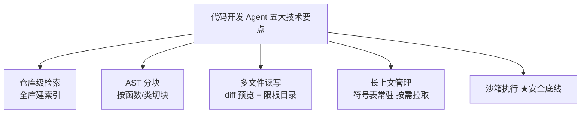
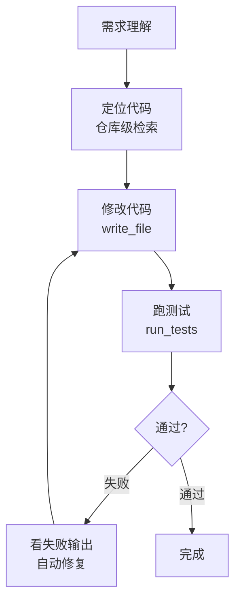

# 阶段六 · 小点 1：代码开发 Agent

> 所属：阶段六 垂直领域 Agent 落地实践
> 定位：这就是 Cursor / Copilot 类工具的底层原理简化版。这一讲把「如何让 Agent 在一个完整代码仓库里定位、理解、修改并验证代码」的技术要点讲透，并给出 Devin 范式的闭环结构与增量改造三步。

## 精简大纲

1. 核心能力：代码生成 / bug 定位修复 / 单测编写 / 项目级代码问答
2. 技术要点：仓库级检索、AST 分块、多文件读写、长上下文管理、沙箱执行
3. Devin 范式：需求 → 定位 → 修改 → 跑测试 → 修复的闭环

## 学习内容详情

> 核心认知：代码 Agent 比通用 Agent 难在「要在结构化代码库里精准定位 + 安全修改真实文件」。技术要点全是围绕这两点服务。

### 1. 技术要点全景



#### 1.1 仓库级检索（Repo-level Retrieval）

- 把整个代码库建索引（**按函数 / 类切块**，保留文件路径与行号元数据），让 Agent 能回答「这个函数在哪定义、谁在调用」。
- 检索命中返回的是「文件路径 + 行号 + 函数签名」，不是整份文件。

```python
# 概念: 一个最小化"仓库符号表"——函数名→(文件, 行号, 签名)
_REPO_INDEX = {
    "login":     ("auth/service.py", 12, "def login(user, pwd) -> Token"),
    "get_user":  ("user/repo.py",    40, "def get_user(uid: int) -> User"),
    "refresh":   ("auth/service.py", 30, "def refresh(token) -> Token"),
}
# 检索: Agent 问"login 定义在哪" → 返回 (path, line, signature)
def locate_symbol(name: str) -> tuple:
    return _REPO_INDEX.get(name, ("未找到", -1, "无"))
```

> 🔬 **深度理解 · 仓库级检索（Repo-level Retrieval）**：
> 1. **本质**：把「在大模型记忆里猜代码在哪」变成「在一个确定性索引里查代码在哪」——用检索的可控性替代 LLM 的胡乱编路径。
> 2. **机制**：代码库先按 AST 边界切成带「路径 + 行号 + 签名」的检索单元建索引，查询时先做召回（先于 LLM 调用）拿到候选块，再把候选块 + 签名清单拼进上下文。可结合调用关系（谁调用谁）做成「代码调用图」检索，比纯文本/向量更贴近代码语义。
> 3. **为什么重要**：真实仓库远超上下文窗口，不检索就是「全塞不下、相似的重复写、函数路径瞎编」。它解决「精准可达」问题；但只负责召回，改得对不对还要靠符号表 + 跑测试兜底。
> 4. **易错点**：把整个文件当检索单元导致上下文照样爆炸；只按字面或向量相似度找，忽略「哪个函数被谁调用」这种调用图信息；检索命中后不保留行号/签名，下一跳多文件编辑就断了线索。

#### 1.2 AST 分块（比按行数切精准）

- **AST（抽象语法树）**：把代码解析成结构化树，再按「函数 / 类」边界切块。
- 为什么优于按行切？——**不会把一个函数腰斩**。按行数切成两半的函数，检索和补全都坏。
- Python 用标准库 `ast` 即可。

```python
import ast

def ast_chunk(source: str) -> list:
    """
    用 AST 把源码按"函数/类"切成独立块。
    返回 [(type, name, lineno, code_str), ...]，供仓库级检索建索引。
    """
    tree = ast.parse(source)
    chunks = []
    for node in ast.walk(tree):
        if isinstance(node, (ast.FunctionDef, ast.AsyncFunctionDef,
                             ast.ClassDef)):
            code = ast.get_source_segment(source, node)   # 精确切出一整块
            chunks.append((type(node).__name__, node.name,
                           node.lineno, code))
    return chunks

src = "def add(a,b):\n    return a+b\n\nclass User:\n    def __init__(self): pass"
for kind, name, lineno, code in ast_chunk(src):
    print(f"{kind} {name} @L{lineno}")   # 函数和类各自成块, 不会被腰斩
```

> ⏳ **短期可不深究**：AST 里 `ast.walk` 怎么遍历、`lineno` 怎么定位这些底层细节，第一遍只要能理解「按函数/类边界切块，不会把函数腰斩」这个关键差异即可；真到写分块器时再对着标准库 `ast` 文档查，不用硬背。

#### 1.3 多文件读写（安全要点 ★）

- 工具支持读指定文件片段 + 写回修改（带 diff 预览）。
- **安全要点（三个必守）**：
  1. **防路径穿越：** 写操作必须限定仓库根目录内，拦截 `../`；
  2. **diff 审阅：** 关键改动生成 diff 供人审，而不是悄悄改；
  3. **沙箱执行：** 生成的代码必须在隔离环境跑（对照阶段四安全三档位）。

```python
import os

REPO_ROOT = "/opt/workspace/repo"

def safe_write(rel_path: str, content: str) -> str:
    """带路径穿越防护 + diff 预览的写文件"""
    # ① 防路径穿越: 规范化后必须仍在仓库根目录内(用 commonpath, 避免 startswith 对共享前缀兄弟目录误放行)
    abs_path = os.path.normpath(os.path.join(REPO_ROOT, rel_path))
    if os.path.commonpath([abs_path, REPO_ROOT]) != REPO_ROOT:
        return "拒绝: 路径越出仓库根目录"
    # ② 生成 diff 预览(简化: 直接展示新旧差异, 生产用 difflib)
    old = open(abs_path).read() if os.path.exists(abs_path) else ""
    if old == content:
        return "无变化"
    print(f"--- diff {rel_path}")
    print(f"+++ {(len(content)-len(old)):+d} 字符变更(请人工审阅)")
    with open(abs_path, "w", encoding="utf-8") as f:
        f.write(content)
    return f"已写入 {rel_path}"
```

#### 1.4 长代码上下文管理

- **只装载「检索命中的函数 + 签名清单」**，不整文件塞进上下文。
- **全库符号表**（函数名 / 类名列表）常驻，具体实现按需拉取——避免上下文爆炸。

> ⏳ **短期可不深究**：符号表怎么常驻、按需拉取的具体实现（是缓存、LSP「语言服务器协议」还是定期重建增量索引）第一遍没必要深挖——你要掌握的是「只带命中片段进上下文、别整文件塞」这个思路，落地方案选型时再研究。

#### 1.5 沙箱执行（代码 Agent 的安全带 ★）

- **测试运行是代码 Agent 的「手」，沙箱是它的「安全带」**——没有沙箱的代码 Agent 等于直接给大模型 shell 权限。
- 生成的代码必须在隔离环境跑（对照阶段四安全三档位：Docker / E2B）。

> 🔬 **深度理解 · 沙箱执行**：
> 1. **本质**：把「让模型生成的代码跑起来」这一能力与宿主机权限彻底隔离——沙箱是兜住「大模型会执行任意代码」这一最大放大风险的安全带，不是可选项。
> 2. **机制**：把代码放进轻量容器（Docker）或远端执行环境（E2B），只授予运行所需的最小资源（CPU/内存/可选网络），叠加资源上限、超时、网络与文件系统隔离、只读挂载，跑完即销毁；模型只能拿到 stdout/stderr，拿不到宿主机的文件与凭据。配合「路径穿越防护 + diff 审阅 + 只读账号」形成纵深防御。
> 3. **为什么重要**：代码 Agent 本质上就是「把执行权交给 LLM」；没有沙箱等于直接给大模型 shell 权限，一次 prompt 注入诱导就能删库、读密钥、横向渗透。它解决「被诱导后无法作恶」，但边界是——它不保证「生成的代码是对的」，所以仍需跑测试 + 人工审 diff。
> 4. **易错点**：以为「在 Docker 里跑就安全」，却忘了设内存/CPU/超时上限、把宿主机目录挂进容器（等于没隔离）、或在沙箱内注入真实密钥；还有人把「只读」和「沙箱」混为一谈——只读只是不给写权限，沙箱是在隔离的进程环境里运行。

### 2. Devin 范式

#### 2.1 理解其闭环结构



- Cognition 的「AI 软件工程师」产品范式：Agent 自主执行 **需求理解 → 定位代码 → 修改 → 跑测试 → 修复失败** 的完整闭环。

#### 2.2 扩展为「代码修改 Agent」的增量三步

1. **加 `write_file` 工具**：写前生成 diff，高危改动走人工审；
2. **加 `run_tests` 工具**：沙箱内跑 pytest，失败输出回传模型自动修复循环；
3. **加 `recursion_limit` 熔断**——**自动修 bug 最容易无限循环**，必须设上限，超过即停下交人工。

```python
MAX_FIX_ROUNDS = 3                       # ③ 熔断: 最多自动修 3 轮

def fix_loop(agent, code, test_fn):
    """Devin 闭环: 修→测→再看失败输出→再修, 带轮数熔断"""
    for i in range(1, MAX_FIX_ROUNDS + 1):
        result, test_out = code, test_fn(code)
        if test_out["ok"]:
            return {"status": "done", "rounds": i}
        print(f"[第{i}轮] 测试失败, 回传错误让模型修: {test_out['err'][:60]}")
        code = agent.fix(code, test_out["err"])   # 报错文本是最好的修正提示
    return {"status": "requires_human", "reason": f"超 {MAX_FIX_ROUNDS} 轮未通过"}
```

## 本节自检

- [ ] 能用 AST 分块 + 检索实现一个项目级代码问答 Agent
- [ ] 能说清代码读写工具的三个安全要点（防穿越 / diff 审 / 沙箱）
- [ ] 能写出带轮数熔断的「修改 → 跑测试 → 修复」闭环

## 本节常见面试题（深度解析）

> 针对本节核心知识的面试高频点，配合"本质+机制"式理解，能让你答得既有深度又有广度。

### 面试题 1：代码开发 Agent 为什么比通用 Agent「难」，难在哪？
- **面试官想考察**：是否真的理解代码 Agent 与普通聊天 Agent 的本质差异，而不是只会背「多了几个工具」。
- **专业作答（含深度）**：
  1. 代码 Agent 面对的是**结构化、会出错、会互相调用的真实代码库**，且=动的是「真实文件」，所以核心是「精准定位 + 安全修改 + 验证闭环」三个能力。
  2. 定位难：仓库远超上下文窗口，需要仓库级检索 / AST 分块，把「发现相关代码」从模型的记忆和猜测变成确定性索引召回。
  3. 安全难：修改 / 执行真实产生了副作用，必须解决路径穿越、diff 审阅、沙箱执行三条底线；通用 Agent 不写文件就不暴露这个风险面。
  4. 验证难：要形成「修改 → 跑测试 → 按失败输出再改」的闭环，而自动修复最容易死循环，所以必须配轮数熔断。
- **加分亮点 / 深度追问**：被追问「如果没有沙箱会怎样」时，应点出这是「把执行权交给 LLM」的危险，一次 prompt 注入就可能删库/读凭据，属于安全放大风险，不是性能问题。

### 面试题 2：为什么代码分块用 AST 而不是按固定行数切？
- **面试官想考察**：对工程手段背后的取舍是否有判断力，而不是只会用库。
- **专业作答（含深度）**：
  1. 检索和补全的「单位」应当是**语义完整的功能单元**（一个函数 / 类），而非任意行区间。
  2. 按行切可能把函数腰斩——被切断的函数无论补全还是作为上下文都给模型残破信息，检索召回也不能用。
  3. AST 以函数 / 类边界切块，天然保证「一块 = 一个完整逻辑单元」，还能带上签名、行号等元数据，与仓库级检索配合。
  4. 代价是解析器依赖、复杂度；所以更精细的还有结合调用图（哪些函数互相调用），但核心原则一致：保住逻辑完整性。
- **加分亮点 / 深度追问**：被问「AST 分块有什么局限」可补充：跨文件调用关系 AST 单文件切不出来，需要符号表 / 调用图配合。

### 面试题 3：Devin 范式闭环为什么必须加「轮数熔断」？
- **面试官想考察**：是否懂得工程上「自主性要有边界」，以及循环退出的控制点。
- **专业作答（含深度）**：
  1. 闭环是「需求 → 定位 → 修改 → 跑测试 → 失败再改」的循环，模型在拿不到正确结果时可能无限自改，消耗 token 与时间且不收敛。
  2. 熔断 = 设置最大修复轮数（如 3 轮），超限即停下交人工，把「不可控的循环」变成「有上限的有限次尝试」。
  3. 这与「漏报 vs 误报」类似：多给几轮能修复但风险是失控，少给几轮=安全但可能过早放弃；按场景权衡。
  4. 熔断本身要有明确退出条件（通过 / 超轮 / 报错），退出时给足上下文（最近失败信息）供人工接续。
- **加分亮点 / 深度追问**：可补充「报错文本是最强的修复提示」，以及熔断与超时、重试成本、预算控制共同的本质——给自主循环设可终止的边界。