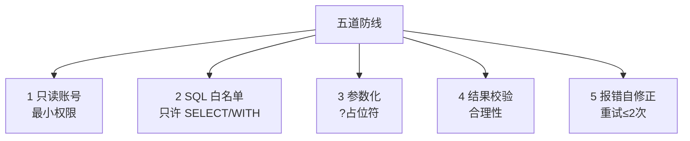

# 阶段六 · 小点 2：数据分析 Agent

> 所属：阶段六 垂直领域 Agent 落地实践
> 定位：这是 Level4 实战项目的核心骨架。这一讲把「自然语言 → SQL → 图表」的数据分析 Agent 讲透：Text-to-SQL 的第一杠杆（元数据描述）、五道防线、以及语义层与可视化扩展。

## 精简大纲

1. 核心能力：自然语言转 SQL、自动查询、图表生成、报告输出
2. Text-to-SQL：数据库元数据描述是第一杠杆
3. 五道防线：只读账号 / SQL 白名单 / 参数化 / 结果校验 / 报错自修正
4. 语义层与扩展（图表工具）

## 学习内容详情

> 核心认知：Text-to-SQL 的难点不是「SQL 语法」，而是让模型知道「有哪些表、什么字段、什么含义」。把这个喂准了，准确率蹭蹭涨。

### 1. Text-to-SQL 核心

#### 1.1 一张图看懂整条链路

```mermaid
graph LR
    A[用户问<br/>"上季度北京销售额"] --> B[生成 SQL<br/>需要元数据描述]
    B --> C[五道防线<br/>校验/参数化]
    C --> D[执行查询]
    D --> E[结果校验]
    E --> F[图表/报告]
```

- 把「上季度北京区销售额多少」翻译成 SELECT。核心不是 SQL 语法，而是**让模型知道有哪些表 / 什么字段 / 什么含义**。
- **数据库元数据描述（Schema Prompt）**：把表结构（表名 / 字段 / 类型 / 注释）+ 示例行 + 业务口径（「amount 单位是万元」）写进 prompt。元数据质量直接决定 SQL 准确率——**Text-to-SQL 的第一杠杆**。

> 🔬 **深度理解 · Text-to-SQL**：
> 1. **本质**：不是「把自然语言翻译成 SQL 语法」，而是**让模型在不知道表结构的前提下凭空生成正确查询**——所以瓶颈是「模型到底知不知道有哪些表、字段、口径」，而非会不会写 `SELECT`。
> 2. **机制**：关键是把数据库的 Schema + 示例行 + 业务口径（如「销售额=SUM(amount) WHERE paid」）塞进 prompt 当作「数据库的说明书」；模型读这份说明书后才做「NL → SQL」映射。通常配 few-shot 示例，并在约束里只放行 SELECT/WITH、要求参数化。
> 3. **为什么重要**：元数据质量几乎直接决定生成 SQL 的准确率——字段别名不清、口径不明，模型就在「猜」。它解决「对齐数据库语义」，但边界在：复杂多表 JOIN、模糊业务口径仍需语义层与校验兜底。
> 4. **易错点**：把「给全表结构」当万能的，却不给字段含义、例值、口径单位，模型照样错；或者把「示范几条 INSERT/数据」误当范文；以及忽略 prompt 注入——恶意用户可能让模型生成危险 SQL，纯靠 prompt 约束永远不够，必须叠加只读账号等硬防线。

#### 1.2 一份能提准确率的 Schema Prompt

```python
SCHEMA_PROMPT = """数据库结构与业务口径如下，生成 SQL 时必须遵循：

表 orders:
  - id        INT       订单ID
  - amount    DECIMAL   金额【单位: 万元】
  - region    TEXT      区域(北京/上海/广州)
  - status    TEXT      状态(paid/refunded/pending)
  - created_at TIMESTAMP 下单时间

示例行:
  | id | amount | region | status | created_at        |
  | 1  | 320.5  | 北京   | paid   | 2026-06-01 10:00  |

业务口径:
  - "销售额" = SUM(amount) WHERE status='paid'
  - "上季度" = 按 created_at 取该季度

【约束】只允许 SELECT / WITH 开头的查询。用户值一律参数化。
"""
```

### 2. 五道防线（依次执行）



1. **只读账号（最小权限）：** 数据库账号只授 SELECT。就算模型被注入诱导生成 DELETE，数据库层面也执行不了——**权限兜底优先于一切 prompt 防护**。
2. **SQL 白名单校验：** 只允许 SELECT / WITH 开头，禁 DML / DDL。
3. **参数化执行：** 用户输入一律走 `?` 占位符，绝不字符串拼接（防注入）。

> ⏳ **短期可不深究**：参数化占位符在不同数据库驱动里的写法（`?` / `%s` / `:name`）以及「白名单前缀校验如何防注释`--`绕过、防多语句分号注入」这类底层细节，第一遍知道「占位符传参即安全、字符串拼接即危险」就够；真接生产再对着具体驱动文档查。

4. **结果校验：** 执行后校验结果合理性（行数 / 空结果 / 耗时异常时让模型自查而非硬答）。
5. **报错自修正：** 把数据库报错文本（syntax error at...）回传模型，让它改了再试（**限重试 2 次**）——报错文本是最好的修正提示。

```python
import re
ALLOWED_PREFIX = ("SELECT", "WITH")

def defend_and_run(gen_sql: str, params: tuple, db) -> str:
    """五道防线 2,3,4: 白名单 + 参数化 + 结果校验"""
    sql = gen_sql.strip()
    # ② SQL 白名单: 只许 SELECT/WITH 开头
    if not sql.upper().startswith(ALLOWED_PREFIX):
        return "拒绝: 仅允许只读查询(SELECT/WITH)"
    # ③ 参数化: 真实生产用占位符 + cursor.execute(sql, params) 传参, 绝不拼接用户输入;
    #    本 mini 版为演示简化, WHERE 值直接内联在 SQL 文本里, 切生产必须真正参数化
    try:
        result = db.execute(sql, params)          # 参数化执行
        # ④ 结果校验: 空结果或行数异常时提示, 而不是硬答
        if result is None or len(result) == 0:
            return "查询为空, 请核实条件后再答, 勿编造"
        return result
    except Exception as e:
        return f"查询出错: {str(e)[:100]}"         # ⑤ 报错回传, 供模型自修正
```

> 第一道防线（只读账号）在数据库配置层做，代码层只需做 2~5。**别只写代码防线，忘了账号权限那层更硬的兜底。**

### 3. 语义层（Semantic Layer）

- **业务口径的中间层**：「营收」=`SUM(amount) WHERE status='paid'`。
- 把口径固化在语义层，模型只翻译「问题 → 语义层概念」，避免每个用户问出三种不同的「营收」。

```python
# 语义层: 把业务概念固化为可复用口径, 模型不必每次自行推断
SEMANTIC_LAYER = {
    "营收":     "SELECT SUM(amount) FROM orders WHERE status='paid'",
    "退款率":   "SELECT ... COUNT(...) WHERE status='refunded' / COUNT(*)",
    "活跃客户": "SELECT COUNT(DISTINCT id) FROM orders WHERE created_at >= ...",
}

def semantic_plan(question: str) -> str:
    """把用户问题映射到语义层概念(有命中直接复用口径, 不再让模型猜)"""
    if "营收" in question:
        return SEMANTIC_LAYER["营收"]            # 口径唯一, 不会问出三种"营收"
    return None                                  # 语义层没有的, 才交模型自由生成
```

> 🔬 **深度理解 · 语义层（Semantic Layer）**：
> 1. **本质**：把「业务概念」与「底层 SQL/指标实现」做一次解耦——用户不懂表结构，业务不会变来变去，但表和字段会改；语义层把「营收=什么」固化，避免同一个口径被不同人问出不同结果。
> 2. **机制**：语义层是一张「业务概念 → 规范口径」的映射表（营收 → `SUM(amount) WHERE paid`），Agent 先尝试把用户问题映射到语义层；命中即复用统一 SQL，未命中才让模型自由生成。生产常见实现是独立「指标仓库/ Metrics Store」，并支持权限、缓存。
> 3. **为什么重要**：它把「正确性」从「每次都要让模型猜」变成「定义一次、处处复用」，是数据分析一致性的保证；前端做图表 / 仪表盘也会复用同一套口径，避免「BI 报表一个数、Agent 回答另一个数」。
> 4. **易错点**：以为语义层是「写死的几个 SQL」——它更该是一等公民（可版本化、可审计、有权限）；把「和 question 做字面匹配」当全部，没做语义匹配/模糊映射；以及口径一旦改了，历史图表和答案也没同步更新。

### 4. 可视化扩展

- 加 `plot_chart` 工具（接收数据 JSON + 图表类型，生成 bar / line / pie 图）。

```python
def plot_chart(data_json: list, chart_type: str = "bar") -> str:
    """图表工具: 接收数据 + 图表类型, 返回图表描述。
    生产用 ECharts/Plotly 前端渲染; 这里返回结构示意。"""
    allowed = {"bar", "line", "pie"}
    if chart_type not in allowed:
        return f"不支持的图表类型: {chart_type}, 可选 {allowed}"
    return (f"已生成 {chart_type} 图, 数据点: "
            f"{len(data_json)} 条, {list(data_json[0].keys()) if data_json else '空'}")
```

- **工作流**：Agent 先 `run_sql` 拿到数据 → 自己组织 `data_json` → 调 `plot_chart` 出图。

> ⏳ **短期可不深究**：`plot_chart` 具体怎么渲染（ECharts / Plotly 选型、图表类型与数据维度的自动匹配规则）属于锦上添花的工具细节，第一遍知道「加一个出图工具、数据 JSON → 图」这条链路即可，真正做数据可视化产品时再细研究。

## 本节自检

- [ ] 能搭出带五道防线的 Text-to-SQL Agent 骨架
- [ ] 能编写一份提升 SQL 准确率的元数据描述 prompt
- [ ] 能说清只读账号为什么是「最硬」的防线
- [ ] 能实现一个简单的语义层固化业务口径

## 本节常见面试题（深度解析）

> 针对本节核心知识的面试高频点，配合"本质+机制"式理解，能让你答得既有深度又有广度。

### 面试题 1：为什么说 Text-to-SQL 的难点不是 SQL 语法，而是「第一杠杆」在于元数据？
- **面试官想考察**：是否理解 Text-to-SQL 真实瓶颈在「模型对齐数据库语义」，而非模型会不会写 SQL。
- **专业作答（含深度）**：
  1. 生成一段 `SELECT` 对 LLM 来说不困难，困难的是**在不知道表结构、字段含义、业务口径时凭空猜对**——字段名、口径、别名全是模型不知道的信息，只能靠 prompt 喂进去。
  2. 所以第一杠杆 = Schema Prompt（表名/字段/类型/注释 + 示例行 + 业务口径），元数据质量直接决定生成 SQL 的准确率。
  3. 因此「给全量 DDL 即可」是常见误解——还需要例值、口径单位、字段中文含义这类「说明书级」信息。
  4. 元数据给了准还不够，还要靠语义层固化口径、靠五道防线拦住坏 SQL，形成「喂得准 + 防得住 + 校验得对」的组合。
- **加分亮点 / 深度追问**：可补充「动态挑选相关表」——库很大时把整库 Schema 塞给模型不可行，常按用户问题召回相关表/字段拼成精简 Schema，这也是「只喂相关元数据」的进阶做法。

### 面试题 2：五道防线里为什么「只读账号」被称作最硬的防线？
- **面试官想考察**：是否理解安全要「纵深防御」，且底层权限兜底优于上层 prompt 约束。
- **专业作答（含深度）**：
  1. prompt 约束（比如「只允许 SELECT」）是可被诱导绕过的——注入、越狱、模型理解偏差都可能生成危险 SQL。
  2. 只读账号在「数据库权限层」就堵死了 DML/DDL，即使模型被骗去生成 DELETE 也执行不了，属于**不可能被 prompt 突破的硬约束**。
  3. 正确分工是：① 账号最小权限（根防线）→ ② 白名单校验 → ③ 参数化 → ④ 结果校验 → ⑤ 报错自修正；一层被绕过，下面还有兜底。
  4. 所以「只写代码层校验、忘了配只读账号」是把最硬的一道防线浪费了——代码层防线本质上还是「模型/代码逻辑」层。
- **加分亮点 / 深度追问**：可提「假设只授 SELECT 但业务需要临时写临时表怎么办」，引出「写权限应隔离到独立 schema/实例，并配合权限审批」。

### 面试题 3：语义层解决的核心问题是什么？为什么它能提升数据分析的一致性？
- **面试官想考察**：是否理解「口径统一」在企业数据分析里的痛点和语义层的价值。
- **专业作答（含深度）**：
  1. 同样问「营收」，不同表、不同过滤条件、不同口径会得到不同数字，而用户以为问的是同一个概念——这是数据不一致问题的根源。
  2. 语义层把「业务概念 → 规范 SQL/指标」固化成一份可复用的映射，Agent 命中即复用统一口径，杜绝「每个用户问出三种营收」。
  3. 它与 BI 报表共用同一口径源，避免「Agent 答一个数、仪表盘另一个数」的信任崩塌。
- **加分亮点 / 深度追问**：可补充「语义层还需要权限与版本管理」，以及它和「指标仓库 / Metrics Store」、指标总线的关系，体现对生产级落地广度的理解。