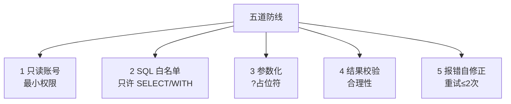

# 阶段六 · 小点 2：数据分析 Agent

> 所属：阶段六 垂直领域 Agent 落地实践
> 定位：这是 Level4 实战项目的核心骨架。这一讲把「自然语言 → SQL → 图表」的数据分析 Agent 讲透：Text-to-SQL 的第一杠杆（元数据描述）、五道防线、以及语义层与可视化扩展。

## 精简大纲

1. 核心能力：自然语言转 SQL、自动查询、图表生成、报告输出
2. Text-to-SQL：数据库元数据描述是第一杠杆
3. 五道防线：只读账号 / SQL 白名单 / 参数化 / 结果校验 / 报错自修正
4. 语义层与扩展（图表工具）

## 学习内容详情

> 核心认知：Text-to-SQL 的难点不是「SQL 语法」，而是让模型知道「有哪些表、什么字段、什么含义」。把这个喂准了，准确率蹭蹭涨。

### 1. Text-to-SQL 核心

#### 1.1 一张图看懂整条链路

```mermaid
graph LR
    A[用户问<br/>"上季度北京销售额"] --> B[生成 SQL<br/>需要元数据描述]
    B --> C[五道防线<br/>校验/参数化]
    C --> D[执行查询]
    D --> E[结果校验]
    E --> F[图表/报告]
```

- 把「上季度北京区销售额多少」翻译成 SELECT。核心不是 SQL 语法，而是**让模型知道有哪些表 / 什么字段 / 什么含义**。
- **数据库元数据描述（Schema Prompt）**：把表结构（表名 / 字段 / 类型 / 注释）+ 示例行 + 业务口径（「amount 单位是万元」）写进 prompt。元数据质量直接决定 SQL 准确率——**Text-to-SQL 的第一杠杆**。

#### 1.2 一份能提准确率的 Schema Prompt

```python
SCHEMA_PROMPT = """数据库结构与业务口径如下，生成 SQL 时必须遵循：

表 orders:
  - id        INT       订单ID
  - amount    DECIMAL   金额【单位: 万元】
  - region    TEXT      区域(北京/上海/广州)
  - status    TEXT      状态(paid/refunded/pending)
  - created_at TIMESTAMP 下单时间

示例行:
  | id | amount | region | status | created_at        |
  | 1  | 320.5  | 北京   | paid   | 2026-06-01 10:00  |

业务口径:
  - "销售额" = SUM(amount) WHERE status='paid'
  - "上季度" = 按 created_at 取该季度

【约束】只允许 SELECT / WITH 开头的查询。用户值一律参数化。
"""
```

### 2. 五道防线（依次执行）



1. **只读账号（最小权限）：** 数据库账号只授 SELECT。就算模型被注入诱导生成 DELETE，数据库层面也执行不了——**权限兜底优先于一切 prompt 防护**。
2. **SQL 白名单校验：** 只允许 SELECT / WITH 开头，禁 DML / DDL。
3. **参数化执行：** 用户输入一律走 `?` 占位符，绝不字符串拼接（防注入）。
4. **结果校验：** 执行后校验结果合理性（行数 / 空结果 / 耗时异常时让模型自查而非硬答）。
5. **报错自修正：** 把数据库报错文本（syntax error at...）回传模型，让它改了再试（**限重试 2 次**）——报错文本是最好的修正提示。

```python
import re
ALLOWED_PREFIX = ("SELECT", "WITH")

def defend_and_run(gen_sql: str, params: tuple, db) -> str:
    """五道防线 2,3,4: 白名单 + 参数化 + 结果校验"""
    sql = gen_sql.strip()
    # ② SQL 白名单: 只许 SELECT/WITH 开头
    if not sql.upper().startswith(ALLOWED_PREFIX):
        return "拒绝: 仅允许只读查询(SELECT/WITH)"
    # ③ 参数化示例: where region = ? 的值走占位符
    #    (真实代码由 cursor.execute(sql, params) 传参, 绝不拼接)
    try:
        result = db.execute(sql, params)          # 参数化执行
        # ④ 结果校验: 空结果或行数异常时提示, 而不是硬答
        if result is None or len(result) == 0:
            return "查询为空, 请核实条件后再答, 勿编造"
        return result
    except Exception as e:
        return f"查询出错: {str(e)[:100]}"         # ⑤ 报错回传, 供模型自修正
```

> 第一道防线（只读账号）在数据库配置层做，代码层只需做 2~5。**别只写代码防线，忘了账号权限那层更硬的兜底。**

### 3. 语义层（Semantic Layer）

- **业务口径的中间层**：「营收」=`SUM(amount) WHERE status='paid'`。
- 把口径固化在语义层，模型只翻译「问题 → 语义层概念」，避免每个用户问出三种不同的「营收」。

```python
# 语义层: 把业务概念固化为可复用口径, 模型不必每次自行推断
SEMANTIC_LAYER = {
    "营收":     "SELECT SUM(amount) FROM orders WHERE status='paid'",
    "退款率":   "SELECT ... COUNT(...) WHERE status='refunded' / COUNT(*)",
    "活跃客户": "SELECT COUNT(DISTINCT id) FROM orders WHERE created_at >= ...",
}

def semantic_plan(question: str) -> str:
    """把用户问题映射到语义层概念(有命中直接复用口径, 不再让模型猜)"""
    if "营收" in question:
        return SEMANTIC_LAYER["营收"]            # 口径唯一, 不会问出三种"营收"
    return None                                  # 语义层没有的, 才交模型自由生成
```

### 4. 可视化扩展

- 加 `plot_chart` 工具（接收数据 JSON + 图表类型，生成 bar / line / pie 图）。

```python
def plot_chart(data_json: list, chart_type: str = "bar") -> str:
    """图表工具: 接收数据 + 图表类型, 返回图表描述。
    生产用 ECharts/Plotly 前端渲染; 这里返回结构示意。"""
    allowed = {"bar", "line", "pie"}
    if chart_type not in allowed:
        return f"不支持的图表类型: {chart_type}, 可选 {allowed}"
    return (f"已生成 {chart_type} 图, 数据点: "
            f"{len(data_json)} 条, {list(data_json[0].keys()) if data_json else '空'}")
```

- **工作流**：Agent 先 `run_sql` 拿到数据 → 自己组织 `data_json` → 调 `plot_chart` 出图。

## 本节自检

- [ ] 能搭出带五道防线的 Text-to-SQL Agent 骨架
- [ ] 能编写一份提升 SQL 准确率的元数据描述 prompt
- [ ] 能说清只读账号为什么是「最硬」的防线
- [ ] 能实现一个简单的语义层固化业务口径