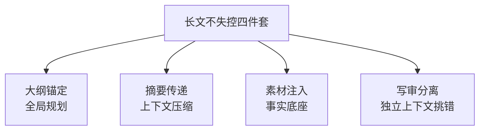

# 阶段六 · 小点 3：内容创作 Agent

> 所属：阶段六 垂直领域 Agent 落地实践
> 定位：与 CrewAI 角色团队的区别——本例聚焦「长文本不失控」的工程手段（LangGraph 大纲驱动写作）。这一讲解决内容创作最痛的痛点：长文越长越容易跑题、越写越散。

## 精简大纲

1. 核心能力：文案策划 / 撰写 / 多轮润色 / 风格定制
2. 长文本不失控的四件套：大纲锚定 / 摘要传递 / 素材注入 / 写审分离
3. 风格定制与多轮润色方法论

## 学习内容详情

> 核心认知：长文写作 Agent 的最大敌人不是「写得不好」，而是「写到后面忘了前面的逻辑」。四件套全部围绕「让模型始终知道自己写到哪、该干什么」服务。

### 1. 长文本不失控的关键设计（核心）



#### 1.1 大纲锚定（全局规划）

- 先生成大纲（**章节 + 每章要点 + 字数配额**），写作节点一次只写一章且始终携带大纲 + 已完成章节的摘要——大纲就是长文任务的「全局规划」（对照阶段二 Plan-and-Execute）。

```python
# 大纲 = 长文的全局规划: 章节 + 要点 + 字数配额
outline = [
    {"title": "引言", "points": "背景/痛点/本文目标", "words": 500},
    {"title": "方案一", "points": "原理/优点/局限",      "words": 800},
    {"title": "方案二", "points": "原理/优点/局限",      "words": 800},
    {"title": "对比与结论", "points": "对比表/建议",      "words": 600},
]

def write_chapter(agent, outline, chapter_idx, prev_summaries: list) -> str:
    """写作节点: 一次只写一章, 始终携带 大纲+已写章节摘要"""
    ch = outline[chapter_idx]
    context = {
        "大纲": outline,                 # 全局锚: 忘不了整篇结构
        "已完成摘要": prev_summaries,    # 只带摘要, 不带全文(省 token + 不跑题)
        "本章": ch,
    }
    return agent.write_section(context)  # 交模型写这一章
```

#### 1.2 章节摘要代替全文传递 ★

- 写完一章立刻压缩成一句摘要，下一章只带摘要——**上下文压缩，长文不失控的核心，token 省且不跑题**。

> 🔬 **深度理解 · 上下文压缩（摘要传递）**：
> 1. **本质**：在「上下文窗口有限 / 越长越容易跑题」之间找平衡——不把全部已写内容带进下一章，而是**只带一个足够维持一致性的紧凑摘要**。
> 2. **机制**：每写完一章由模型把该章压缩成一句（或一小段）摘要，下一章的上下文 = 「全局大纲 + 已完成章节的摘要 + 本章任务」；既有全局锚定，又控制 token 增长，让模型不至于被越拉越长的历史带偏。本质上是把「全文状态」换成「压缩状态」来传递进度。
> 3. **为什么重要**：长文写作的最大敌人是「写到后面忘了前面的逻辑」。它解决「上下文爆炸 + 跑题」两个问题；但边界在——摘要本身会丢失细节，跨章节需要精确一致性时（如引用前文数字）需配合检索回原文，而不是只靠摘要。
> 4. **易错点**：把「摘要」当「可有可无」随手让模型写一句，摘要质量不保证；或干脆带全文导致 token 暴涨；还有摘要里夹带主观判断而丢失事实细节，导致后文与前面数字/结论冲突。

#### 1.3 素材注入在写前

- 写作前先检索外部素材（数据 / 案例 / 竞品文案），把素材作为「事实底座」拼进 prompt 再动笔——**没有素材约束的写作 Agent 是「高级编造机」**（检索增强写作）。

```python
def inject_material(agent, chapter_point: str, repo) -> str:
    """写前注入素材: 把检索到的数据/案例作为事实底座拼进 prompt"""
    materials = repo.retrieve(chapter_point)      # 检索素材(可带 RAG + 溯源)
    if not materials:
        return "[注意] 本章无素材支撑, 只能宏观描述, 禁止编造具体数字"
    return "本章可用素材(仅可引用, 不得改动):\n" + "\n".join(materials)
```

> ⏳ **短期可不深究**：素材注入里「检索哪些源、向量召回怎么算、溯源如何展示」这些检索增强（RAG）的底层细节，第一遍知道「写前把数据/案例拼进 prompt 当事实底座，防止高级编造」即可——RAG 的检索和溯源实现是阶段四的内容，这里先用结论。

#### 1.4 审稿者独立上下文（写审分离）

- 让「审稿 Agent」用**独立上下文**（只看稿子看不到写作过程）挑错，比让写作者自查严格——写审分离。

```python
def review(rev_agent, draft: str) -> list:
    """审稿: 独立上下文只看稿子 → 产出问题列表 + 修改建议"""
    issues = rev_agent.audit(draft)       # 审稿Agent看不到写作过程
    return issues                          # [({章节, 问题, 严重度, 建议})]
```

> 自查的盲区：写作者知道「我本来想写什么」，会不自觉脑补；独立的审稿者只看成文，才能挑出「这里逻辑断了」「这句无依据」。

> 🔬 **深度理解 · 写审分离（独立上下文审稿）**：
> 1. **本质**：把「写」和「审」拆成两个角色，并且**审稿者只能看到成文、看不到写作意图**——用「信息不对称」对抗自查时「自我脑补」的盲区。
> 2. **机制**：写作 Agent 产出草案后，审稿 Agent 用一个**不含写作上下文**的独立 run 只读取稿子，逐段挑「逻辑断裂 / 无依据论断 / 与题目不符」，产出问题清单 + 修改建议；因为看不到「我本想表达什么」，它只能对着字面与外部的判断标准批，反而更严格、更客观。
> 3. **为什么重要**：人（和模型）在知道自己意图时，会不自觉地替成文「圆话」，把意思不清默认成「我懂」。它解决「自审失效」问题；边界在——审稿者若过度严格可能重写风格，因此常与「多轮润色」配合，审不负责改风格，只挑硬伤。
> 4. **易错点**：把写审合并成「同一个对话里让模型审一遍」——只要共享写作上下文就退化成自查；或审稿者拿到的信息太多（看见 prompt、看见素材来源）反而失去独立客观性；以及审出的问题没有结构化（缺章节定位/严重度/建议）而无法被修复环路利用。

### 2. 风格定制（Style Control）

- 用**参考样本定义风格**：给 2~3 篇范文（而非形容词堆砌的「要幽默」），让模型模仿语言密度、句长、口吻。**few-shot 的风格约束力远强于抽象指令。**

```python
STYLE_EXAMPLES = [
    {"sample": "我们坚信简单即高效。", "note": "短句、断言式"},
    {"sample": "当我们在凌晨三点改进算法时，性能仍未达标。", "note": "叙事、具象"},
]

def style_prompt(style_examples, target_hint: str) -> str:
    """用范文定义风格, 而不是'要专业一点的调性'这种空话"""
    blocks = [f"[范文{i}] {e['sample']}  ({e['note']})"
              for i, e in enumerate(style_examples, start=1)]
    return "请模仿以下范文的语言密度/句长/口吻:\n" + "\n".join(blocks) + \
           f"\n目标: {target_hint}，请勿使用范文中的事实内容。"
```

> ⏳ **短期可不深究**：few-shot 范文「选几篇、覆盖哪些语言维度、对面型多样性的收敛」这些选样与调参细节，第一遍知道「用 2~3 篇范文而非抽象形容词定义风格」这个思路即可；具体多少篇效果最好要靠 A/B 试，不背固定值。

### 3. 多轮润色（Iterative Refinement）

- 初稿 → 校对 → 定稿的多轮流水线，**每轮只关注一个维度**——先查事实、再顺逻辑、最后磨语言。

```python
def refine(draft: str, agents: dict) -> str:
    """多轮润色: 一轮一个维度, 三轮专项效果 > 一轮全面优化"""
    # 每轮只关注一个维度, 针对性优化
    draft = agents["fact"].check(draft)     # 第1轮: 查事实(数字/引用是否真实)
    draft = agents["logic"].check(draft)    # 第2轮: 顺逻辑(论证连贯/递进)
    draft = agents["style"].check(draft)    # 第3轮: 磨语言(句长/用词/节奏)
    return draft
```

- **车轮式 vs 三轮专项**：一轮「全面优化」指令大概率顾此失彼；三轮各盯一维「先对、再通、最后美」效果最稳。

## 本节自检

- [ ] 能用 LangGraph 实现大纲驱动 + 摘要传递的分章写作
- [ ] 能说清「素材注入」「写审分离」两个设计的原因
- [ ] 能用范文（few-shot）而不是抽象形容词定义风格
- [ ] 能写出「查事实→顺逻辑→磨语言」的三轮润色流水线

## 本节常见面试题（深度解析）

> 针对本节核心知识的面试高频点，配合"本质+机制"式理解，能让你答得既有深度又有广度。

### 面试题 1：为什么「章节摘要代替全文传递」能控制长文跑题？
- **面试官想考察**：是否理解长文本 Agent 的上下文工程问题，而非简单地「把全文都带上」。
- **专业作答（含深度）**：
  1. 长文写作 Agent 会随着内容累积变得越来越「长上下文 → 注意力稀释 → 越写越偏」，甚至忘了前面论点。
  2. 解决思路是「只传递能维持一致性的最小必要状态」：全局大纲（结构化锚点）+ 已完成章节的紧凑摘要，而非全文。
  3. 摘要承担「进度状态传递」职责，token 增长可控，模型不会被冗长历史带偏；每个写作节点都是「大纲 + 摘要 + 本章」，即 Plan-and-Execute 的分而治之。
- **加分亮点 / 深度追问**：被追问「摘要丢细节怎么办」可补充「跨章需要精确引用时用检索回到原文，而不是只靠摘要」，说明理解摘要与检索引擎的互补。

### 面试题 2：风格定制为什么用「三篇范文」而非「要写得专业一点」这种描述？
- **面试官想考察**：对 LLM 「指令式风格控制 vs 演示式风格控制」效果差异的洞察。
- **专业作答（含深度）**：
  1. 抽象形容词（专业/幽默/高级）主观且没有可操作尺度，模型难以量化「到位」。
  2. few-shot 范文给出可模仿的语言密度、句长、口吻、用词习惯等**具体样例**，模型从样例中归纳风格，约束力远强于抽象指令。
  3. 同时要「约法三章」——只模仿语言风格、不复制范文的事实内容，避免连内容也照抄。
  4. 本质是「以展示代替描述」：给一个参照系，比形容词描述更容易对齐输出。
- **加分亮点 / 深度追问**：可补充「行业风格还可结合术语表 / 禁忌词表」，以及对「风格漂移」的观察——few-shot 也能在一定程度上约束风格一致性。

### 面试题 3：「写审分离」为什么比「让模型自查」更可靠？
- **面试官想考察**：是否理解「审稿独立性 / 信息隔离」对发现问题的价值，而不只是多开一次模型调用。
- **专业作答（含深度）**：
  1. 自查的核心盲区是「作者知道本意，会不自觉脑补」，把意思不清默认成通顺，因而发现不了「这里逻辑断了」。
  2. 写审分离让审稿者只用独立上下文看「成文」，屏蔽写作意图，客观逐段挑硬伤（逻辑断裂、无依据、跑题）。
  3. 审稿输出应结构化（定位 + 问题 + 严重度 + 建议），才能回到修复环节被利用。
  4. 本质是借「信息不对称」对抗「自我圆话」——审稿者越「不知情」越客观。
- **加分亮点 / 深度追问**：被追问成本可从「独立 run 多一次调用但显著提升质量」权衡，并可延伸「它与红队/对抗审校、RAG 溯源的一致性校验」同属质量兜底手段。