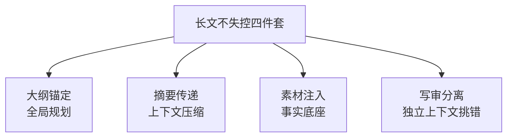

# 阶段六 · 小点 3：内容创作 Agent

> 所属：阶段六 垂直领域 Agent 落地实践
> 定位：与 CrewAI 角色团队的区别——本例聚焦「长文本不失控」的工程手段（LangGraph 大纲驱动写作）。这一讲解决内容创作最痛的痛点：长文越长越容易跑题、越写越散。

## 精简大纲

1. 核心能力：文案策划 / 撰写 / 多轮润色 / 风格定制
2. 长文本不失控的四件套：大纲锚定 / 摘要传递 / 素材注入 / 写审分离
3. 风格定制与多轮润色方法论

## 学习内容详情

> 核心认知：长文写作 Agent 的最大敌人不是「写得不好」，而是「写到后面忘了前面的逻辑」。四件套全部围绕「让模型始终知道自己写到哪、该干什么」服务。

### 1. 长文本不失控的关键设计（核心）



#### 1.1 大纲锚定（全局规划）

- 先生成大纲（**章节 + 每章要点 + 字数配额**），写作节点一次只写一章且始终携带大纲 + 已完成章节的摘要——大纲就是长文任务的「全局规划」（对照阶段二 Plan-and-Execute）。

```python
# 大纲 = 长文的全局规划: 章节 + 要点 + 字数配额
outline = [
    {"title": "引言", "points": "背景/痛点/本文目标", "words": 500},
    {"title": "方案一", "points": "原理/优点/局限",      "words": 800},
    {"title": "方案二", "points": "原理/优点/局限",      "words": 800},
    {"title": "对比与结论", "points": "对比表/建议",      "words": 600},
]

def write_chapter(agent, outline, chapter_idx, prev_summaries: list) -> str:
    """写作节点: 一次只写一章, 始终携带 大纲+已写章节摘要"""
    ch = outline[chapter_idx]
    context = {
        "大纲": outline,                 # 全局锚: 忘不了整篇结构
        "已完成摘要": prev_summaries,    # 只带摘要, 不带全文(省 token + 不跑题)
        "本章": ch,
    }
    return agent.write_section(context)  # 交模型写这一章
```

#### 1.2 章节摘要代替全文传递 ★

- 写完一章立刻压缩成一句摘要，下一章只带摘要——**上下文压缩，长文不失控的核心，token 省且不跑题**。

#### 1.3 素材注入在写前

- 写作前先检索外部素材（数据 / 案例 / 竞品文案），把素材作为「事实底座」拼进 prompt 再动笔——**没有素材约束的写作 Agent 是「高级编造机」**（检索增强写作）。

```python
def inject_material(agent, chapter_point: str, repo) -> str:
    """写前注入素材: 把检索到的数据/案例作为事实底座拼进 prompt"""
    materials = repo.retrieve(chapter_point)      # 检索素材(可带 RAG + 溯源)
    if not materials:
        return "[注意] 本章无素材支撑, 只能宏观描述, 禁止编造具体数字"
    return "本章可用素材(仅可引用, 不得改动):\n" + "\n".join(materials)
```

#### 1.4 审稿者独立上下文（写审分离）

- 让「审稿 Agent」用**独立上下文**（只看稿子看不到写作过程）挑错，比让写作者自查严格——写审分离。

```python
def review(rev_agent, draft: str) -> list:
    """审稿: 独立上下文只看稿子 → 产出问题列表 + 修改建议"""
    issues = rev_agent.audit(draft)       # 审稿Agent看不到写作过程
    return issues                          # [({章节, 问题, 严重度, 建议})]
```

> 自查的盲区：写作者知道「我本来想写什么」，会不自觉脑补；独立的审稿者只看成文，才能挑出「这里逻辑断了」「这句无依据」。

### 2. 风格定制（Style Control）

- 用**参考样本定义风格**：给 2~3 篇范文（而非形容词堆砌的「要幽默」），让模型模仿语言密度、句长、口吻。**few-shot 的风格约束力远强于抽象指令。**

```python
STYLE_EXAMPLES = [
    {"sample": "我们坚信简单即高效。", "note": "短句、断言式"},
    {"sample": "当我们在凌晨三点改进算法时，性能仍未达标。", "note": "叙事、具象"},
]

def style_prompt(style_examples, target_hint: str) -> str:
    """用范文定义风格, 而不是'要专业一点的调性'这种空话"""
    blocks = [f"[范文{i}] {e['sample']}  ({e['note']})"
              for i, e in enumerate(style_examples, start=1)]
    return "请模仿以下范文的语言密度/句长/口吻:\n" + "\n".join(blocks) + \
           f"\n目标: {target_hint}，请勿使用范文中的事实内容。"
```

### 3. 多轮润色（Iterative Refinement）

- 初稿 → 校对 → 定稿的多轮流水线，**每轮只关注一个维度**——先查事实、再顺逻辑、最后磨语言。

```python
def refine(draft: str, agents: dict) -> str:
    """多轮润色: 一轮一个维度, 三轮专项效果 > 一轮全面优化"""
    # 每轮只关注一个维度, 针对性优化
    draft = agents["fact"].check(draft)     # 第1轮: 查事实(数字/引用是否真实)
    draft = agents["logic"].check(draft)    # 第2轮: 顺逻辑(论证连贯/递进)
    draft = agents["style"].check(draft)    # 第3轮: 磨语言(句长/用词/节奏)
    return draft
```

- **车轮式 vs 三轮专项**：一轮「全面优化」指令大概率顾此失彼；三轮各盯一维「先对、再通、最后美」效果最稳。

## 本节自检

- [ ] 能用 LangGraph 实现大纲驱动 + 摘要传递的分章写作
- [ ] 能说清「素材注入」「写审分离」两个设计的原因
- [ ] 能用范文（few-shot）而不是抽象形容词定义风格
- [ ] 能写出「查事实→顺逻辑→磨语言」的三轮润色流水线