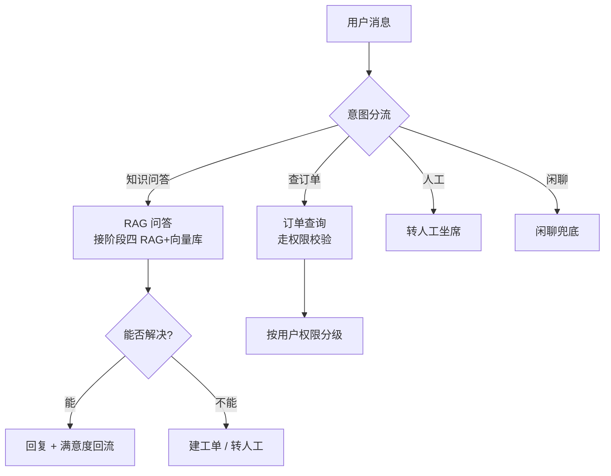
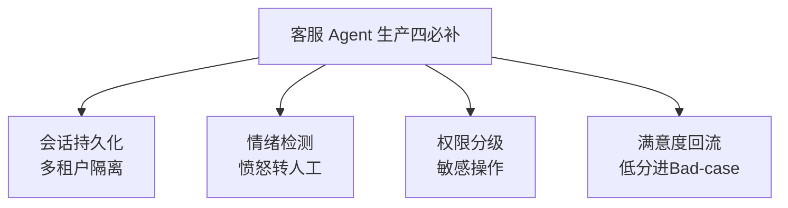

# 阶段六 · 小点 4：智能客服 / 运维 Agent

> 所属：阶段六 垂直领域 Agent 落地实践
> 定位：综合运用前文所有组件——RAG 工具、权限、状态机。是 Level5 项目的核心骨架。这一讲把「分流 → RAG 问答 → 转人工 / 建工单」的客服骨架讲清，并补上生产必须的四项能力。

## 精简大纲

1. 客服 Agent 骨架：分流 → 问答（RAG）→ 转人工 / 建工单
2. 意图分流与工单对接
3. 生产补全清单：持久化 / 情绪检测 / 权限 / 评测闭环 / PII 脱敏

## 学习内容详情

> 核心认知：客服 Agent 不是「一个 RAG 问答」就够，而是一台**会分流、会兜底、可审计的状态机**。问答解决不了的问题，必须优雅地转给人或工单。

### 1. 客服 Agent 骨架

#### 1.1 一张图看懂整条链路



- **意图分流节点**：四类意图（知识问答 / 查订单 / 人工 / 闲聊）走不同链路。
- **知识问答**：RAG 工具（生产接阶段四 RAG + 向量库）。
- **工单工具**：对接工单系统 API，创建 / 流转工单。
- **兜底意识**：问答不能解决就转人工/建工单，绝不让用户无限等。

#### 1.2 意图分流 + 工单对接骨架

```python
def intent_router(text: str) -> str:
    """意图分流: 返回 'kb' | 'order' | 'human' | 'chitchat'"""
    if any(k in text for k in ("订单", "物流", "退款")):
        return "order"
    if any(k in text for k in ("人工", "转人工", "投诉")):
        return "human"
    if any(k in text for k in ("怎么", "什么是", "流程", "规定")) and len(text) > 3:
        return "kb"
    return "chitchat"


def create_ticket(user_id: str, reason: str) -> str:
    """工单工具: 对接工单系统 API 创建工单。生产走真实 API + 幂等键。"""
    return f"已建工单 #T{hash(user_id + reason) % 10_000:04d}(原因: {reason[:20]})"


def handle(msg: str, user_id: str, kb, perm) -> str:
    intent = intent_router(msg)
    if intent == "kb":
        answer = kb.search(msg)                 # RAG 问答(可带溯源)
        if "未收录" in answer or "无来源" in answer:
            return create_ticket(user_id, f"知识问答未覆盖: {msg}")   # 兜底转工单
        return answer
    if intent == "order":
        if perm(user_id) < 2:
            return "该操作需更高权限, 已为您转人工核实"
        return "订单查询结果: 订单号 xxx, 状态: 已发货"
    if intent == "human":
        return "正在为您转接人工坐席, 请稍候…"
    return "您好, 我是智能助手, 请问有什么可以帮您?"
```

#### 1.3 意图分流的演进：关键词分流 → LLM 意图分类

上面的 `intent_router` 是**冷启动方案**：零成本、零延迟、可解释。但关键词枚举永远追不上用户的长尾表达——「我买的咋还不发货」既不含「订单」也不含「物流」，会被误分到闲聊。标准演进路径分两步：

- **关键词只适合冷启动**：刚上线没流量、不想为每条消息多花一次 LLM 调用时，先用关键词顶着；流量上来后可保留为「快速通道」（命中即短路，省一次分类调用）。
- **长尾意图靠 LLM 分类**：把意图定义成**枚举**交给 LLM 判断——few-shot 给例子 + 约束 JSON 输出 + 结果过枚举白名单校验，**未命中 / 解析失败一律兜底转人工**（宁可转人，不可错路由）。

```python
import json

INTENT_ENUM = {"kb", "order", "human", "chitchat"}          # 意图枚举(白名单)

INTENT_PROMPT = """你是客服意图分类器。只输出 JSON, 不输出其他内容。
可选 intent: kb(知识问答) / order(订单物流) / human(转人工) / chitchat(闲聊)

示例:
- "退款流程是什么"      → {{"intent": "kb"}}
- "我的快递到哪了"      → {{"intent": "order"}}
- "我要投诉, 转人工"    → {{"intent": "human"}}
- "你好"               → {{"intent": "chitchat"}}

用户消息: {msg}"""

def llm_intent_classify(msg: str, llm) -> str:
    """LLM 意图分类: few-shot + JSON 输出 + 枚举校验; 未命中兜底转人工"""
    try:
        raw = llm.chat(INTENT_PROMPT.format(msg=msg))       # ① 要求 JSON 输出
        intent = json.loads(raw)["intent"]                   # ② 解析
        return intent if intent in INTENT_ENUM else "human"   # ③ 枚举白名单校验
    except Exception:
        return "human"                                       # ④ 解析失败 → 转人工兜底
```

> 兜底方向永远是「转人工」而不是「猜一个」——错路由比慢半拍严重得多。

> 🔬 **深度理解 · 意图识别（意图分流）**：
> 1. **本质**：把「用户这句话想干什么」离散化成少数几个可路由的意图（kb / order / human / chitchat），是客服 Agent 的第一步「路由决策」——后续哪个工具、哪条链路全由它决定。
> 2. **机制**：冷启动用关键词/规则（零成本、可解释、零延迟，但覆盖不了长尾）；流量上来后换 LLM 意图分类——把意图定义成**封闭枚举**，few-shot 给例子 + 约束 JSON 输出 + 结果再过「枚举白名单」校验，解析失败一律兜底转人工。核心是「宁可转人，不可错路由」。
> 3. **为什么重要**：意图错了后面全错——把「查订单」当「闲聊」为空转，把「投诉」当「知识问答」激化矛盾。它解决「对话的第一分叉」，边界在：即使分类对了，能不能答好还要靠 RAG、权限、转人兜底的后续链路。
> 4. **易错点**：把意图分类做成「自由文本」让模型随便输出，缺少封闭枚举 + 白名单；只用关键词而对长尾表达误分；以及把「分类失败」也硬猜一个意图——正确做法是兜底转人工而不是错路由。

### 2. 生产补全清单（从「能跑」到「能上生产」）



1. **会话持久化——多租户隔离：** Checkpointer + `thread_id = 租户 ID + 会话 ID`，租户间数据隔离。

```python
# 多租户隔离: thread_id 由 租户ID + 会话ID 拼成
def build_thread_id(tenant_id: str, session_id: str) -> str:
    """thread_id 唯一且含租户标识 → Checkpointer 按此隔离, 租户间互不可见"""
    return f"{tenant_id}:{session_id}"   # 例: acme:chat_20260904_a1
```

2. **情绪检测节点：** prompt 分类「用户情绪是否愤怒 / 焦虑」→ 命中直接转人工。

```python
def emotion_check(text: str) -> str:
    """情绪检测: 命中愤怒/焦虑关键词直接建议转人工。生产由 LLM 分类。"""
    hot = ("投诉", "气死", "太慢了", "垃圾", "立刻", "必须")
    if any(h in text for h in hot):
        return "angry"      # 愤怒 → 转人工, 别用机器人硬碰硬
    return "normal"
```

> ⏳ **短期可不深究**：情绪检测里「用什么关键词热词、还是用 LLM 分类器判情绪」这在生产上通常走专门的情绪识别服务；第一遍知道「命中愤怒/焦虑 → 转人工」这个节点设计即可，具体模型/阈值选型属于算法工程细节，不做硬编码研究。

3. **权限控制：** 查订单等敏感操作按用户权限分级（对照阶段五安全）。

4. **满意度回流：** 会话结束打分接口，低分自动入 Bad-case 队列（对照阶段五评测闭环）——线上问题别等用户吼，让低分会话自己走进评测队列。

```python
def satisfaction_feedback(session_id: str, score: int, badcases) -> None:
    """满意度回流: 低分自动进 Bad-case 队列(带回会话ID可追溯)"""
    if score < 3:
        badcases.enqueue(session_id=session_id, source="低分")
        print(f"[Bad-case] 会话 {session_id} 低分({score}) 已入队, 供每周评测归类")
```

5. **对话日志 PII 脱敏（合规必选）：** 客服对话天然携带姓名 / 手机号 / 身份证 / 银行卡 / 订单号——**落日志前、送模型前必须先过统一脱敏层**，不能让原文裸奔进日志文件和第三方模型 API。

```python
import re

# 掩码规则(顺序执行): 身份证留首4尾4 / 银行卡留首6尾4 / 手机号 138****1234 / 姓名中间掩码
ID_RE    = re.compile(r"(?<!\d)\d{17}[\dXx](?!\d)")              # 身份证 18 位(末位可X)
BANK_RE  = re.compile(r"(?<!\d)\d{16,19}(?!\d)")                 # 银行卡 16-19 位
PHONE_RE = re.compile(r"(?<!\d)1[3-9]\d{9}(?!\d)")              # 手机号 11 位
NAME_RE  = re.compile(r"([\u4e00-\u9fa5]{2,4})(先生|女士|经理)")   # 姓名+称谓

def _mask(s: str, keep_head: int, keep_tail: int) -> str:
    """保留首尾、中间打星(等长掩码): 13812341234 → 138****1234"""
    return s[:keep_head] + "*" * (len(s) - keep_head - keep_tail) + s[-keep_tail:]

def mask_name(name: str) -> str:
    """中文姓名中间掩码: 两字留首(张伟→张*), 三字及以上留首尾(欧阳锋→欧*锋)"""
    return name[0] + "*" * (len(name) - 1) if len(name) <= 2 else \
        name[0] + "*" * (len(name) - 2) + name[-1]

def mask_pii(text: str) -> str:
    """入口层统一脱敏: 落日志前 / 送模型前都调它; 原文只留加密存储"""
    text = ID_RE.sub(lambda m: _mask(m.group(), 4, 4), text)
    text = BANK_RE.sub(lambda m: _mask(m.group(), 6, 4), text)
    text = PHONE_RE.sub(lambda m: _mask(m.group(), 3, 4), text)
    text = NAME_RE.sub(lambda m: mask_name(m.group(1)) + m.group(2), text)
    return text

print(mask_pii("张伟先生手机 13812341234, 身份证 110101199001011234, 卡 6222020200112233445"))
# 张*先生手机 138****1234, 身份证 1101**********1234, 卡 622202*********3445
```

> ⚠️ **PIPL / GDPR 下「入日志即合规风险」**：明文 PII 只要落进日志文件（哪怕从未外发）就已触发合规义务与泄露连带责任。正确姿势是**在入口层统一脱敏**（日志与模型请求共用同一层），确实需要原文的场景（如工单系统回填完整手机号）走**加密存储 + 授权角色解密**，而不是在日志里留明文「备查」。

> 🔬 **深度理解 · PII 脱敏**：
> 1. **本质**：把「可识别到具体个人的信息」在离开边界前就变成不可轻易还原——PII（姓名/手机号/身份证/银行卡/地址等）一旦出现在日志或第三方 API 请求里，就已触发合规义务与泄露连带责任，脱敏是为了让「数据泄露事件」不升级成「个人隐私泄露事件」。
> 2. **机制**：在**入口层**（日志落盘前、发模型前）统一经过掩码层：按规则（正则）把身份证留首尾、手机号留 3+4、银行卡留 6+4、姓名中间打星；同时明确掩码 ≠ 加密：掩码用于展示/日志，原文如需使用走**加密存储 + 授权角色解密**，而非在日志里留明文「备查」。脱敏要在日志通道与模型通道共享同一层，避免一处漏网。
> 3. **为什么重要**：客服对话天然携带大量 PII，落日志和送第三方模型都是高风险出口。它解决「隐私合规 + 泄密最小化」，边界在——脱敏不删除数据来源、不替代权限管控，且企业级还需分级（有些字段要 descoping/替换），并配合访问审计。
> 4. **易错点**：只在模型输出侧脱敏、漏了日志侧；用「startswith 式截断」留下可反推的片段；把脱敏当防腐、原文仍在日志「备查」；以及正则依赖具体格式，遇到非标准格式（如 0512 开头的手机号、脱敏后仍需解析）就漏——所以生产常配合去识别化模型 + 分级策略。

> ⏳ **短期可不深究**：上面这串身份证 / 银行卡 / 手机号**正则的具体写法**（`\d{18}`、`1[3-9]\d{9}` 等掩码细节）第一遍不需要背——它属于易过时、且不同国家/格式差异大的算法细节；你真正要带走的是「统一脱敏层 + 掩码 vs 加密的边界」这个设计原则，具体正则在落地时对着法规和库抄即可。

### 3. 设计要点小结

- **骨架** = 意图分流 → RAG 问答 → 转人工 / 工单；**兜底优先级高于答对**——答不出时宁可转人，别硬答出错。
- **生产四必补**：持久化（多租户）、情绪转人、权限分级、评测回流。缺一就是「实验室 Demo」而非生产客服。

## 本节自检

- [ ] 能搭出「分流 → RAG 问答 → 转人工 / 工单」的客服 Agent 骨架
- [ ] 能说清「关键词分流 → LLM 意图分类」的演进路径与未命中转人工兜底
- [ ] 能说清多租户隔离（thread_id）与情绪转人工的落地点
- [ ] 能实现满意度低分自动进 Bad-case 队列
- [ ] 能实现对话日志的 PII 脱敏（手机号 / 身份证 / 银行卡 / 姓名掩码）

## 本节常见面试题（深度解析）

> 针对本节核心知识的面试高频点，配合"本质+机制"式理解，能让你答得既有深度又有广度。

### 面试题 1：客服 Agent 的关键意图为什么用「封闭枚举」做 LLM 分类，而不是自由文本？
- **面试官想考察**：对意图识别工程化（可控性 / 兜底）的把握，而不是只会「让 LLM 判断一下」。
- **专业作答（含深度）**：
  1. 意图分流是对话的第一分叉，输出必须**可路由、可枚举**——若让模型自由输出，落不了路由、难以对接下游链路。
  2. 封闭枚举 = 预定义意图集合（kb/order/human/chitchat），few-shot 给例子、约束 JSON 输出、结果再过一个**枚举白名单**，解析失败一律兜底转人工。
  3. 「宁可转人，不可错路由」是可解释、可审计的前提——错误分类（把投诉当闲聊）比慢半拍更糟。
  4. 与冷启动关键词的取舍：关键词零延迟零成本、适合低流量，LLM 分类覆盖长尾、适合上量后。
- **加分亮点 / 深度追问**：可补充「存疑阈值」——当两个意图概率接近或低于阈值时，主动进置信兜底转人工，而不是硬分，体现对错分类风险的理解。

### 面试题 2：为什么 PII 要脱敏在「入口层」，而不是模型输出后再处理？
- **面试官想考察**：是否理解隐私合规的风险出口在哪，以及「统一脱敏层」的必要性。
- **专业作答（含深度）**：
  1. 客服对话天然携带姓名/手机号/身份证/银行卡，而出口有多个：日志文件、第三方模型 API、工单回填等——模型输出侧处理只堵了一个出口。
  2. 明文 PII 一旦落日志就已触发合规义务与泄露连带风险（PIPL/GDPR），所以脱敏必须在数据进入任何外部边界之前，即**入口层统一脱敏**，供日志与模型通道共用。
  3. 掩码 ≠ 加密：掩码面向展示/日志满足合规，确实需要原文的场景应走加密存储 + 授权角色解密，而非日志留明文“备查”。
  4. 这样能保证「无论哪个出口，都不裸奔 PII」，且一处实现、处处复用，避免遗漏。
- **加分亮点 / 深度追问**：可延伸「脱敏只是隐私工程第一层，还需权限分级、访问审计、最小化收集」体现纵深合规，并提「不同地区格式/法规差异要求规则可配置」。

### 面试题 3：客服 Agent 为什么强调「兜底优先级高于答对」？
- **面试官想考察**：是否理解客服场景「值效优先、风险兜底」的产品观，而非一味追求正确率。
- **专业作答（含深度）**：
  1. 客服的核心风险是「答错且用户无法接续」——错误的自信回答（硬答一个数、错误引导）比慢半拍更伤害体验与信任。
  2. 所以设计上「回答不了 → 转人工 / 建工单」是硬兜底：RAG 答不出、权限不足、意图分类失败都往人/工单走，绝不让用户无限等或收到编造。
  3. 配套机制：满意度低分回流入 Bad-case、可审计的状态机、情绪检测转人——共同守住「用户体验不被兜不住的问题击穿」。
  4. 它把「能答的问题答对」之外的不可控场景，都交给人工这一更强的兜底。
- **加分亮点 / 深度追问**：被追问「转人工太多是不是失败」可答「用转人工率/满意度/停留时长联合衡量」，并说明「宁可多转一则无安全事故」的取舍与成本边界。