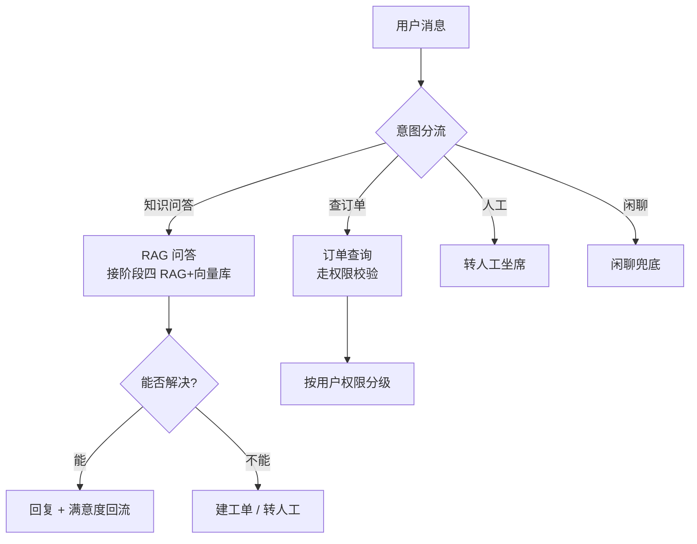
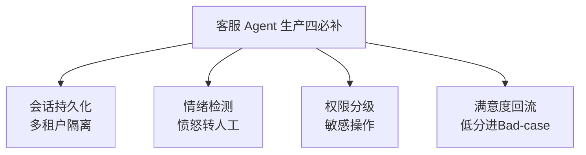

# 阶段六 · 小点 4：智能客服 / 运维 Agent

> 所属：阶段六 垂直领域 Agent 落地实践
> 定位：综合运用前文所有组件——RAG 工具、权限、状态机。是 Level5 项目的核心骨架。这一讲把「分流 → RAG 问答 → 转人工 / 建工单」的客服骨架讲清，并补上生产必须的四项能力。

## 精简大纲

1. 客服 Agent 骨架：分流 → 问答（RAG）→ 转人工 / 建工单
2. 意图分流与工单对接
3. 生产补全清单：持久化 / 情绪检测 / 权限 / 评测闭环

## 学习内容详情

> 核心认知：客服 Agent 不是「一个 RAG 问答」就够，而是一台**会分流、会兜底、可审计的状态机**。问答解决不了的问题，必须优雅地转给人或工单。

### 1. 客服 Agent 骨架

#### 1.1 一张图看懂整条链路



- **意图分流节点**：四类意图（知识问答 / 查订单 / 人工 / 闲聊）走不同链路。
- **知识问答**：RAG 工具（生产接阶段四 RAG + 向量库）。
- **工单工具**：对接工单系统 API，创建 / 流转工单。
- **兜底意识**：问答不能解决就转人工/建工单，绝不让用户无限等。

#### 1.2 意图分流 + 工单对接骨架

```python
def intent_router(text: str) -> str:
    """意图分流: 返回 'kb' | 'order' | 'human' | 'chitchat'"""
    if any(k in text for k in ("订单", "物流", "退款")):
        return "order"
    if any(k in text for k in ("人工", "转人工", "投诉")):
        return "human"
    if any(k in text for k in ("怎么", "什么是", "流程", "规定")) and len(text) > 3:
        return "kb"
    return "chitchat"


def create_ticket(user_id: str, reason: str) -> str:
    """工单工具: 对接工单系统 API 创建工单。生产走真实 API + 幂等键。"""
    return f"已建工单 #T{hash(user_id + reason) % 10_000:04d}(原因: {reason[:20]})"


def handle(msg: str, user_id: str, kb, perm) -> str:
    intent = intent_router(msg)
    if intent == "kb":
        answer = kb.search(msg)                 # RAG 问答(可带溯源)
        if "未收录" in answer or "无来源" in answer:
            return create_ticket(user_id, f"知识问答未覆盖: {msg}")   # 兜底转工单
        return answer
    if intent == "order":
        if perm(user_id) < 2:
            return "该操作需更高权限, 已为您转人工核实"
        return "订单查询结果: 订单号 xxx, 状态: 已发货"
    if intent == "human":
        return "正在为您转接人工坐席, 请稍候…"
    return "您好, 我是智能助手, 请问有什么可以帮您?"
```

### 2. 生产补全清单（从「能跑」到「能上生产」）



1. **会话持久化——多租户隔离：** Checkpointer + `thread_id = 租户 ID + 会话 ID`，租户间数据隔离。

```python
# 多租户隔离: thread_id 由 租户ID + 会话ID 拼成
def build_thread_id(tenant_id: str, session_id: str) -> str:
    """thread_id 唯一且含租户标识 → Checkpointer 按此隔离, 租户间互不可见"""
    return f"{tenant_id}:{session_id}"   # 例: acme:chat_20260904_a1
```

2. **情绪检测节点：** prompt 分类「用户情绪是否愤怒 / 焦虑」→ 命中直接转人工。

```python
def emotion_check(text: str) -> str:
    """情绪检测: 命中愤怒/焦虑关键词直接建议转人工。生产由 LLM 分类。"""
    hot = ("投诉", "气死", "太慢了", "垃圾", "立刻", "必须")
    if any(h in text for h in hot):
        return "angry"      # 愤怒 → 转人工, 别用机器人硬碰硬
    return "normal"
```

3. **权限控制：** 查订单等敏感操作按用户权限分级（对照阶段五安全）。

4. **满意度回流：** 会话结束打分接口，低分自动入 Bad-case 队列（对照阶段五评测闭环）——线上问题别等用户吼，让低分会话自己走进评测队列。

```python
def satisfaction_feedback(session_id: str, score: int, badcases) -> None:
    """满意度回流: 低分自动进 Bad-case 队列(带回会话ID可追溯)"""
    if score < 3:
        badcases.enqueue(session_id=session_id, source="低分")
        print(f"[Bad-case] 会话 {session_id} 低分({score}) 已入队, 供每周评测归类")
```

### 3. 设计要点小结

- **骨架** = 意图分流 → RAG 问答 → 转人工 / 工单；**兜底优先级高于答对**——答不出时宁可转人，别硬答出错。
- **生产四必补**：持久化（多租户）、情绪转人、权限分级、评测回流。缺一就是「实验室 Demo」而非生产客服。

## 本节自检

- [ ] 能搭出「分流 → RAG 问答 → 转人工 / 工单」的客服 Agent 骨架
- [ ] 能说清多租户隔离（thread_id）与情绪转人工的落地点
- [ ] 能实现满意度低分自动进 Bad-case 队列