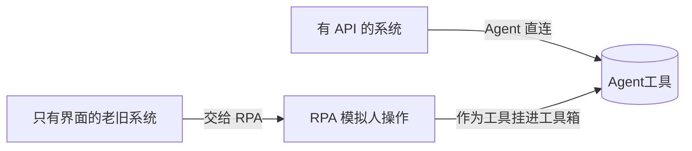
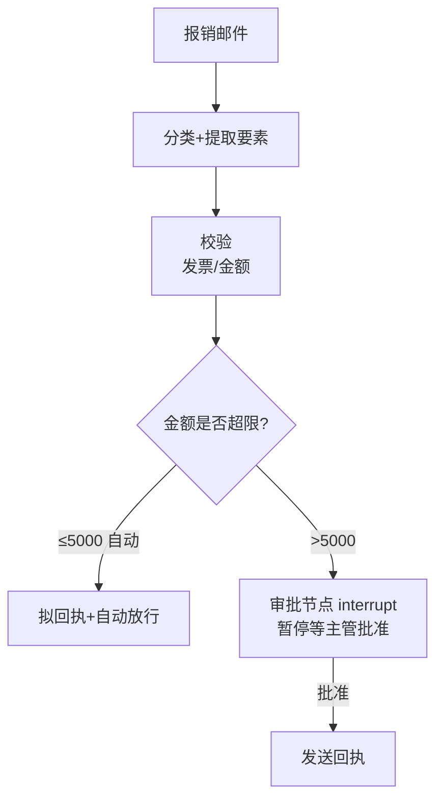

# 阶段六 · 小点 5：办公自动化 Agent（Agent + RPA）

> 所属：阶段六 垂直领域 Agent 落地实践
> 定位：场景是「自动处理报销邮件」——分类 → 提取要素 → 校验 → 拟回执 → 审批 → 发送。这一讲把 RPA 与 Agent 的分工、流程编排、审批闸门、幂等防重发一次讲透（这正是飞书 / 企业微信办公自动化类 Agent 的核心套路）。

## 精简大纲

1. 核心能力：邮件处理、表格处理、会议纪要、流程审批触发
2. RPA 与 Agent 的分工
3. 流程编排：串行 + 审批 + 分支
4. 审批触发与幂等重发
5. 会议纪要管道

## 学习内容详情

> 核心认知：办公自动化 = **Agent 负责「动脑」（理解 / 决策 / 拟稿）**，**RPA 负责「动手」（点按钮 / 填表单）**，两者分工协作，审批闸门 + 幂等防重发是两条安全底线。

### 1. RPA 与 Agent 的分工



- **RPA（机器人流程自动化）：** 模拟人操作软件（点按钮、填表单、复制粘贴），用于**没有 API 的老旧系统**。
- **分工：** 有 API 的系统 Agent 直连；只有界面的系统交给 RPA——**RPA 作为工具挂进 Agent 工具箱**。

### 2. 流程编排（Workflow Orchestration）

- 办公流程常是「**串行 + 审批**」结构（收到邮件 → 提取信息 → 填表 → 提交审批 → 通知）。
- Agent 编排即把它翻译成图：步骤节点 + 审批节点（interrupt）+ 分支（金额超限走上级）。



```python
def orchestrate(email_text: str, approval_api) -> str:
    """编排: 串行步骤 + 审批分支"""
    info = extract(email_text)                    # ① 提取要素
    validate(info)                                # ② 校验(发票/金额)
    if info["amount"] <= 5000:
        return send(email_text, "自动放行")        # 小额自动
    return approval_api.request(info)             # ③ 审批中断: 大额→暂停等审批
```

### 3. 审批触发（高危动作闸门）

- Agent 完成准备动作（填好表单 / 拟好邮件）后**暂停**，等审批人确认再执行「提交 / 发送」——高危外发动作的标配闸门（对照 LangGraph interrupt）。
- 小额自动放行、大额走人工：如报销金额 ≤ 5000 自动回执，超限则暂停等主管审批。

```python
def send_after_approval(draft, amount, approve) -> str:
    """审批闸门: Agent 只做"准备动作", 高危外发须等审批"""
    if amount > APPROVAL_LIMIT:
        # 假设这里将流程中断挂起, 等审批人确认后才真正发送
        ticket_id = approve.queue(draft_signature(draft))   # 提交待审
        return f"已暂停(金额{amount}超限), 待审批 #{ticket_id}"
    return actually_send(draft)                  # 小额自动发送
```

### 4. 幂等重发问题（办公场景高频坑）

- **坑：** 超时重试时邮件发两遍、审批提两次——外部调用的不幂等 bug。
- **解法：** 外发类工具带**唯一键**（邮件 Message-ID、审批单号），发送前先查是否已存在（生产用 Redis SETNX + TTL）。

```python
def idempotent_send(recipient, subject, body, seen: set) -> str:
    """幂等外发: 用唯一键 Message-ID 判重, 防止重试导致重复发送/重复审批"""
    msg_id = f"{recipient}:{subject}"            # 唯一键(生产用邮件 Message-ID)
    if msg_id in seen:                            # 已发过 → 直接返回不再发
        return f"[幂等] 该邮件已发送过, 跳过(msg_id={msg_id})"
    # 生产: seen 换成 Redis SETNX + TTL(原子占位, 防并发双发)
    actually_send(recipient, subject, body)
    seen.add(msg_id)
    return f"已发送 {recipient}"

# 超时重试: 第二次调用因 msg_id 命中已选缓存, 不会发两遍
```

生产级版本用 **Redis `SET key value NX EX ttl`** 一条原子命令占位（进程内 `set` 换成 Redis 后，多 worker 并发 / 多实例部署也只发一次）：

```python
async def idempotent_send_prod(r, biz_no: str, do_send, ttl: int = 3600) -> str:
    """生产级幂等外发: SETNX 占位成功才执行; 执行失败 DEL 回滚锁"""
    key = f"idem:send:{biz_no}"                   # 幂等键 = 业务单号(邮件 Message-ID/审批单号)
    ok = await r.set(key, "1", nx=True, ex=ttl)   # SET key value NX EX ttl, 原子占位
    if not ok:                                     # 占位失败 = 已有实例在处理/处理过
        return f"[幂等] {biz_no} 已处理过, 跳过"
    try:
        return await do_send()                     # 占位成功才真正外发
    except Exception:
        await r.delete(key)                       # 执行失败 → 回滚锁, 允许下次重试
        raise
```

> ⚠️ **两个细节决定这把锁靠不靠谱**：① **TTL 必须大于最大执行时长**——外发动作要 30s 而锁只给 10s，锁先过期、重试进来时占位又能成功，照样双发；② **幂等键用业务单号**（邮件 Message-ID、审批单号），**不要用请求体哈希**——哈希对「同一单号、内容微调」的重复请求会漏拦，对「不同单号、内容碰巧相同」的正常请求会误拦。

### 5. 会议纪要管道


- 音频 → 转写（ASR）→ 发言人分离 → 摘要提炼 → 格式化（**决议 / 待办 / 风险三段式**）→ 推送。
- **分工**：Agent 负责「摘要提炼 + 格式化 + 待办入任务系统」，**转写交给专用 ASR 服务**（术业有专攻，别让 Agent 硬转）。

```python
def minutes_pipeline(audio_path, asr, agent, task_system) -> str:
    transcript = asr.transcribe(audio_path)      # 转写交给专用 ASR
    summary = agent.summarize(transcript)        # 摘要提炼交给 Agent
    formatted = agent.format_triplet(summary)    # 决议/待办/风险三段式
    for item in formatted["todos"]:               # 待办入任务系统
        task_system.create(item)
    return formatted
```

## 本节自检

- [ ] 能实现一个带审批中断 + 幂等防重发的邮件处理流程
- [ ] 能说清 RPA 与 Agent 的分工边界（有 API 直连，无 API 交 RPA）
- [ ] 能画出「串行 + 审批 + 分支」的编排图
- [ ] 能说清幂等重发的唯一键方案