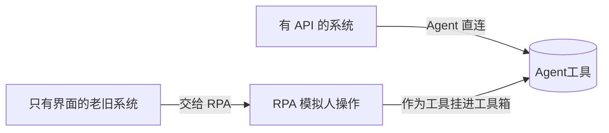
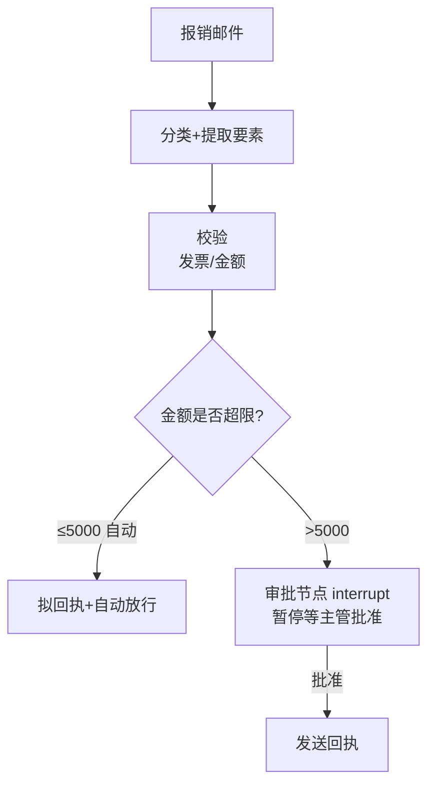

# 阶段六 · 小点 5：办公自动化 Agent（Agent + RPA）

> 所属：阶段六 垂直领域 Agent 落地实践
> 定位：场景是「自动处理报销邮件」——分类 → 提取要素 → 校验 → 拟回执 → 审批 → 发送。这一讲把 RPA 与 Agent 的分工、流程编排、审批闸门、幂等防重发一次讲透（这正是飞书 / 企业微信办公自动化类 Agent 的核心套路）。

## 精简大纲

1. 核心能力：邮件处理、表格处理、会议纪要、流程审批触发
2. RPA 与 Agent 的分工
3. 流程编排：串行 + 审批 + 分支
4. 审批触发与幂等重发
5. 会议纪要管道

## 学习内容详情

> 核心认知：办公自动化 = **Agent 负责「动脑」（理解 / 决策 / 拟稿）**，**RPA 负责「动手」（点按钮 / 填表单）**，两者分工协作，审批闸门 + 幂等防重发是两条安全底线。

### 1. RPA 与 Agent 的分工



- **RPA（机器人流程自动化）：** 模拟人操作软件（点按钮、填表单、复制粘贴），用于**没有 API 的老旧系统**。
- **分工：** 有 API 的系统 Agent 直连；只有界面的系统交给 RPA——**RPA 作为工具挂进 Agent 工具箱**。

> ⏳ **短期可不深究**：RPA 具体怎么「模拟人操作」（根据 UI 元素定位/XPath/OCR/屏幕坐标点击、脚本录制）这些底层实现，第一遍只需要记住「RPA 解决没 API 的老系统，用模拟点击/填表代替写代码」即可——真正的 RPA 平台选型与流程编写是另一个专业域。

### 2. 流程编排（Workflow Orchestration）

- 办公流程常是「**串行 + 审批**」结构（收到邮件 → 提取信息 → 填表 → 提交审批 → 通知）。
- Agent 编排即把它翻译成图：步骤节点 + 审批节点（interrupt）+ 分支（金额超限走上级）。



```python
def orchestrate(email_text: str, approval_api) -> str:
    """编排: 串行步骤 + 审批分支"""
    info = extract(email_text)                    # ① 提取要素
    validate(info)                                # ② 校验(发票/金额)
    if info["amount"] <= 5000:
        return send(email_text, "自动放行")        # 小额自动
    return approval_api.request(info)             # ③ 审批中断: 大额→暂停等审批
```

> 🔬 **深度理解 · 工作流编排（Workflow Orchestration）**：
> 1. **本质**：把「办公流程」从一个隐性的、要靠人一步步做的过程，显式转成一张**可执行、可暂停、可分支的图**——Agent 在这里扮演「调度者」而非「一次算完的聊天」。
> 2. **机制**：事件（如收邮件）触发后按图走节点：提取要素 → 校验 → 判断分支（金额是否超限）→ 需要人决策处插入 `interrupt` 审批节点（流程在此暂停，等外部批准信号再继续）→ 批准后发外发动作。编排引擎负责状态、恢复、超时；本质是「有状态工作流」而非「一次性函数调用」。
> 3. **为什么重要**：办公动作往往「高价值 + 不可逆 + 需人批」（发钱、发邮件、建工单），把流程变成可暂停/可审计的图，才能在人机之间安全交接。它解决「过程可控、状态可恢复、节点可审」，边界在——编排不替代业务校验，也不承担审批决策权。
> 4. **易错点**：把编排做成「一段顺序代码」、停了没法恢复或重放；审批节点被实现成「假停」（其实已把外发做了）；分支条件里硬编码业务规则没留可配置；以及忽略了失败重试的幂等——编排恢复时最容易重发/重提。

### 3. 审批触发（高危动作闸门）

- Agent 完成准备动作（填好表单 / 拟好邮件）后**暂停**，等审批人确认再执行「提交 / 发送」——高危外发动作的标配闸门（对照 LangGraph interrupt）。
- 小额自动放行、大额走人工：如报销金额 ≤ 5000 自动回执，超限则暂停等主管审批。

```python
def send_after_approval(draft, amount, approve) -> str:
    """审批闸门: Agent 只做"准备动作", 高危外发须等审批"""
    if amount > APPROVAL_LIMIT:
        # 假设这里将流程中断挂起, 等审批人确认后才真正发送
        ticket_id = approve.queue(draft_signature(draft))   # 提交待审
        return f"已暂停(金额{amount}超限), 待审批 #{ticket_id}"
    return actually_send(draft)                  # 小额自动发送
```

### 4. 幂等重发问题（办公场景高频坑）

- **坑：** 超时重试时邮件发两遍、审批提两次——外部调用的不幂等 bug。
- **解法：** 外发类工具带**唯一键**（邮件 Message-ID、审批单号），发送前先查是否已存在（生产用 Redis SETNX + TTL）。

```python
def idempotent_send(recipient, subject, body, seen: set) -> str:
    """幂等外发: 用唯一键 Message-ID 判重, 防止重试导致重复发送/重复审批"""
    msg_id = f"{recipient}:{subject}"            # 唯一键(生产用邮件 Message-ID)
    if msg_id in seen:                            # 已发过 → 直接返回不再发
        return f"[幂等] 该邮件已发送过, 跳过(msg_id={msg_id})"
    # 生产: seen 换成 Redis SETNX + TTL(原子占位, 防并发双发)
    actually_send(recipient, subject, body)
    seen.add(msg_id)
    return f"已发送 {recipient}"

# 超时重试: 第二次调用因 msg_id 命中已选缓存, 不会发两遍
```

生产级版本用 **Redis `SET key value NX EX ttl`** 一条原子命令占位（进程内 `set` 换成 Redis 后，多 worker 并发 / 多实例部署也只发一次）：

```python
async def idempotent_send_prod(r, biz_no: str, do_send, ttl: int = 3600) -> str:
    """生产级幂等外发: SETNX 占位成功才执行; 执行失败 DEL 回滚锁"""
    key = f"idem:send:{biz_no}"                   # 幂等键 = 业务单号(邮件 Message-ID/审批单号)
    ok = await r.set(key, "1", nx=True, ex=ttl)   # SET key value NX EX ttl, 原子占位
    if not ok:                                     # 占位失败 = 已有实例在处理/处理过
        return f"[幂等] {biz_no} 已处理过, 跳过"
    try:
        return await do_send()                     # 占位成功才真正外发
    except Exception:
        await r.delete(key)                       # 执行失败 → 回滚锁, 允许下次重试
        raise
```

> ⚠️ **两个细节决定这把锁靠不靠谱**：① **TTL 必须大于最大执行时长**——外发动作要 30s 而锁只给 10s，锁先过期、重试进来时占位又能成功，照样双发；② **幂等键用业务单号**（邮件 Message-ID、审批单号），**不要用请求体哈希**——哈希对「同一单号、内容微调」的重复请求会漏拦，对「不同单号、内容碰巧相同」的正常请求会误拦。

> 🔬 **深度理解 · 幂等（Idempotency）**：
> 1. **本质**：让「同一个业务操作被执行多次」等价于「只执行一次」——它防的不是模型笨，而是**网络重试 / 流程恢复**这类外部不确定性带来的副作用重复（外发两遍、审批提两次）。
> 2. **机制**：关键动作携带唯一键（业务单号：邮件 Message-ID、审批单号），执行前先「占位」判重：生产用 Redis `SET key value NX EX ttl` 一条原子命令，占位成功才是真正执行，占位失败说明已处理过直接跳过；执行异常再 `DEL` 回滚锁允许重试。核心是「先原子登记、后执行、失败回滚、可重入」。
> 3. **为什么重要**：超时重试、多实例并发、工作流恢复是分布式与外发场景的常态，不幂等就必然重复副作用，且往往不可逆（邮件、付款）。它解决「一次且仅一次」的一致性副作用，边界在——它需要稳定的唯一键。
> 4. **易错点**：TTL 设太小导致锁先过期仍双发；把「执行完再占位」导致并发窗口双跑；幂等键用请求体哈希——内容微调会漏拦同单号、碰巧相同会误拦不同单号；忽略卖点：锁的「原子性」必须靠 `NX`（不存在才写）而不是「先查后写」两步。

### 5. 会议纪要管道


- 音频 → 转写（ASR）→ 发言人分离 → 摘要提炼 → 格式化（**决议 / 待办 / 风险三段式**）→ 推送。
- **分工**：Agent 负责「摘要提炼 + 格式化 + 待办入任务系统」，**转写交给专用 ASR 服务**（术业有专攻，别让 Agent 硬转）。

```python
def minutes_pipeline(audio_path, asr, agent, task_system) -> str:
    transcript = asr.transcribe(audio_path)      # 转写交给专用 ASR
    summary = agent.summarize(transcript)        # 摘要提炼交给 Agent
    formatted = agent.format_triplet(summary)    # 决议/待办/风险三段式
    for item in formatted["todos"]:               # 待办入任务系统
        task_system.create(item)
    return formatted
```

> ⏳ **短期可不深究**：会议纪要里 ASR 的声学模型、发言人分离（说话人聚类 / 声纹）这些底层实现细节第一遍不用深究——记住分工原则「转写交给专用 ASR，Agent 只做摘要提炼与格式化」即可，ASR 是独立且术业有专攻的技术栈。

## 本节自检

- [ ] 能实现一个带审批中断 + 幂等防重发的邮件处理流程
- [ ] 能说清 RPA 与 Agent 的分工边界（有 API 直连，无 API 交 RPA）
- [ ] 能画出「串行 + 审批 + 分支」的编排图
- [ ] 能说清幂等重发的唯一键方案

## 本节常见面试题（深度解析）

> 针对本节核心知识的面试高频点，配合"本质+机制"式理解，能让你答得既有深度又有广度。

### 面试题 1：Agent 和 RPA 的分工边界是什么？为什么办公自动化要两者结合？
- **面试官想考察**：是否理解「动脑 vs 动手」的分工，以及如何面对没有 API 的老系统。
- **专业作答（含深度）**：
  1. Agent 负责「动脑」：理解邮件语义、做判断、拟稿、编排流程；RPA 负责「动手」：模拟点击 / 填表，处理没有 API 的老系统。
  2. 有 API 的系统 Agent 直连最稳（结构化、可审计）；只有桌面的系统 RPA 兜底，作为工具挂进 Agent 工具箱。
  3. 两者结合 = 用 Agent 的泛化理解能力 + RPA 的确定性操作，覆盖「语义输入 → 老旧系统落地」的完整链路。
  4. 取舍：RPA 脆弱（UI 变就崩、难测试），所以只用于无 API 场景，且要尽量收敛其使用面。
- **加分亮点 / 深度追问**：可补充「能上 API 就优先 API，RPA 是最后一招」的设计原则，并提 RPA 的稳定性风险需要与运维配合监控。

### 面试题 2：为什么办公自动化必须引入「审批中断」而不是让 Agent 直接发？
- **面试官想考察**：对「高危不可逆动作需要人机闸门」的理解，以及对有状态工作流的认知。
- **专业作答（含深度）**：
  1. 发钱、发邮件、建工单这类动作**高价值且不可逆**，一旦 Agent 误判后果严重，不能只凭模型「自以为对」就外发。
  2. 审批中断 = 流程执行到高危节点暂停，把「准备动作」（填好表单 / 拟好邮件）与「真正提交」分离，等审批人确认才继续——典型低成本小额定则自动放行、超限走人批。
  3. 实现上对应有状态工作流的 `interrupt` 节点：流程挂起、记录状态、批准信号到达后恢复，而非一次性函数调用。
  4. 本质是「让不可逆的机器动作永远过一遍人的闸门」，把误报成本控制在最小（最多占用审批人力）。
- **加分亮点 / 深度追问**：可补充「审批要支持审批人维度配置 + 超时告警 + 撤销」，以及「审批节点也要防重放」（批准动作本身幂等）。

### 面试题 3：「幂等防重发」解决什么问题？为什么唯一键用业务单号而不是请求体哈希？
- **面试官想考察**：是否理解分布式/重试场景下的副作用重复，以及唯一键设计的正确取舍。
- **专业作答（含深度）**：
  1. 解决的问题：超时重试、多实例并发、工作流恢复会让同一个动作被重复执行——外发两遍、审批提两次，且往往不可逆，必须让「执行多次 = 执行一次」。
  2. 机制上「先原子占位（Redis SETNX+TTL）→ 成功才执行 → 失败回滚锁」，占位和产物都以**业务单号**为唯一键。
  3. 为什么不用请求体哈希：哈希面向「内容」而非「业务身份」——同一单号内容微调的重复请求会漏拦（Hash 不同又允许占位），不同单号内容碰巧相同的正常请求会被误拦（Hash 相同）。
  4. 正确归点是「同一业务单号」去重，TTL 还要大于最大执行时长，否则锁先过期仍双发。
- **加分亮点 / 深度追问**：可补充「幂等不只靠锁，还结合 DB 唯一约束 / 幂等表」做最终一致性兜底，并说明「锁是过程防护、唯一约束是终态兜底」的双保险思路。